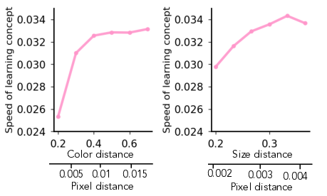

# Emergence of Hidden Capabilities: Exploring Learning Dynamics in Concept Space

## TLDR

- This paper introduces a framework called "concept space" to analyze how generative models learn and manipulate abstract concepts.
- The authors find that the speed of concept learning is controlled by "concept signal" - how sensitive the data is to changes in a concept.
- They observe sudden transitions in learning dynamics corresponding to the emergence of "hidden capabilities" - where models can manipulate concepts internally before exhibiting this ability through standard prompting.
- The work provides insights into how generative models acquire compositional abilities and suggests ways to better evaluate and elicit model capabilities.

## Introduction

As an AI researcher, I've been fascinated by the impressive capabilities of modern generative models like DALL-E, Stable Diffusion, and GPT-3. These models seem to have an uncanny ability to understand and manipulate abstract concepts in ways that go far beyond their training data. But how exactly do they acquire these abilities? What determines which concepts they learn, and in what order? And why do they sometimes fail in puzzling ways?

A new paper titled "Emergence of Hidden Capabilities: Exploring Learning Dynamics in Concept Space" by Core Francisco Park, Maya Okawa, Andrew Lee, Ekdeep Singh Lubana, and Hidenori Tanaka tackles these questions head-on. The authors propose a novel framework for analyzing how generative models learn concepts over the course of training. Their findings shed light on some of the mysteries of concept learning in AI and suggest new ways to evaluate and elicit model capabilities.

In this blog post, I'll dive deep into the key ideas and results from this paper. We'll explore:

- The concept space framework for analyzing learning dynamics
- How "concept signal" governs the speed and order of concept learning  
- The phenomenon of "hidden capabilities" that emerge during training
- Implications for evaluating and prompting generative models

Let's get started!

## The Concept Space Framework

The core contribution of this paper is introducing the idea of "concept space" as a way to visualize and analyze how generative models learn abstract concepts. But what exactly is concept space?

Imagine we have a generative model that can produce images of objects with different shapes, sizes, and colors. We can think of each of these attributes - shape, size, color - as an axis in a multi-dimensional space. A particular object, like a large blue circle, would be represented as a point in this space.

More formally, the authors define concept space as follows:

> **Definition 1 (Concept Space):** Consider an invertible data-generating process $\mathcal{G}: \mathcal{Z} \to \mathcal{X}$ that samples vectors ${z} \sim P(\mathcal{Z})$ from a vector space $\mathcal{Z} \subset \mathbb{R}^{d}$ and maps them to the observation space $\mathcal{X} \in \mathbb{R}^{n}$. We assume the sampling prior is factorizable, i.e., $P({z} \in \mathcal{Z}) = \Pi_{i=1}^{d} P({z_i})$, and individual dimensions of $\mathcal{Z}$ correspond to semantically meaningful *concepts*. Then, a concept space $\mathcal{S}$ is defined as the multidimensional space composed of all possible concept vectors $z$, i.e.,  $\mathcal{S} \coloneqq \{z \mid z \sim P(\mathcal{Z})\}$

In simpler terms, concept space is an abstract coordinate system where each axis represents an independent concept underlying the data. Points in this space correspond to particular combinations of concept values.

The key idea is that we can visualize a model's learning process as a trajectory through this concept space. As the model trains, it moves from producing random noise to accurately generating images with the right combinations of concepts.

This framework allows us to ask precise questions about concept learning:

- How quickly does the model learn to accurately represent different concepts?
- In what order are concepts learned?
- How does the model's trajectory change as it encounters new concept combinations?

To answer these questions, the authors introduce another key idea: concept signal.

## Concept Signal and Learning Dynamics

Not all concepts are created equal when it comes to learning. Some concepts might be more salient or important in the training data, making them easier for the model to pick up on. The authors capture this idea with the notion of "concept signal":

> **Definition 3 (Concept Signal):** The concept signal $\sigma_i$ for a concept $z_i$ measures the sensitivity of the data-generating process to change in the value of a concept variable, i.e., $\sigma_i \coloneqq \left| \nicefrac{\partial \mathcal{G}(z)}{\partial z_i} \right|$.

In other words, concept signal measures how much the generated data changes when you tweak a particular concept. A high concept signal means small changes to that concept lead to big changes in the output.

The authors hypothesize that concepts with higher signal will be learned faster. To test this, they create synthetic datasets where they can precisely control the concept signal for different attributes.

Their experiments confirm that concept signal indeed governs the speed of learning:

We can see that as the concept signal increases (moving right on the x-axis), the number of gradient steps needed to learn the concept decreases (y-axis goes down).

But the story gets even more interesting when we look at the full learning trajectories in concept space:

These plots show the model's accuracy on different concepts over the course of training. The fascinating thing is that we see distinct phases in the learning process:

1. Initially, the model gravitates towards the training distribution, exhibiting what the authors call "concept memorization".
2. There's then a sudden turn in the trajectory, corresponding to the model learning to disentangle concepts.
3. Finally, the model refines its ability to generate the desired concept combinations accurately.

This brings us to one of the paper's most intriguing findings: the emergence of hidden capabilities.

## Hidden Capabilities and Sudden Transitions

The authors make a surprising discovery: at the point where the learning trajectory suddenly changes direction, the model has already learned to manipulate concepts internally. However, this ability isn't immediately apparent when you try to prompt the model in standard ways.

To demonstrate this, they use three different methods to try to elicit the desired outputs from the model:

1. Naive prompting (standard input)
2. Linear latent intervention (manipulating internal representations)
3. Overprompting (exaggerating input prompts)

The results are striking. While naive prompting (a) fails to produce the desired outputs until much later in training, both linear latent intervention (b) and overprompting (c) can elicit the correct outputs much earlier - right around the point where we see the sudden turn in the learning trajectory.

This leads to a key hypothesis:

> **Hypothesis 1 (Emergence of Hidden Capabilities):** *Generative models possess hidden capabilities that are learned suddenly and consistently during training, but naive input prompting may not elicit these capabilities, hence hiding how "competent" the model actually is.*

In other words, there's a gap between when a model acquires the internal ability to manipulate concepts and when that ability becomes easily accessible via standard prompting.

This finding has important implications for how we evaluate and interact with generative models. It suggests that models may be more capable than they appear, and that we need more sophisticated methods to fully elicit their abilities.

## Underspecification and Concept Learning

The paper also explores what happens when the input prompts don't fully specify all concepts - a common situation in real-world applications. They find that underspecification can significantly impact learning dynamics and generalization.

When prompts are partially masked (simulating underspecification), the model's ability to generalize to new concept combinations is impaired. However, the authors show that even in these cases, the model still acquires hidden capabilities that can be elicited through more sophisticated prompting methods.

This highlights the importance of carefully considering how concepts are specified in both training data and input prompts when working with generative models.

## Implications and Future Directions

The findings in this paper have several important implications:

1. **Evaluation of generative models:** We need to be cautious about concluding that a model lacks certain capabilities based solely on naive prompting. More sophisticated probing techniques may be necessary to uncover hidden abilities.

2. **Training strategies:** Understanding the role of concept signal could inform better data curation and augmentation strategies to accelerate learning of desired concepts.

3. **Prompting techniques:** The success of overprompting and latent interventions suggests that we might be able to develop more effective ways to interact with generative models by leveraging their internal representations.

4. **Interpretability:** The concept space framework provides a new lens for understanding and visualizing the learning process in deep neural networks.

There are also several exciting directions for future research:

- Extending the concept space analysis to more complex, real-world datasets and models
- Developing automated methods to discover and manipulate concepts in latent space
- Investigating how the emergence of hidden capabilities relates to other phenomena like grokking or phase transitions in learning
- Exploring the connections between concept learning dynamics and issues of robustness, generalization, and safety in AI systems

## Conclusion

The paper "Emergence of Hidden Capabilities" provides a fascinating new perspective on how generative models learn to understand and manipulate abstract concepts. By introducing the concept space framework and uncovering the phenomenon of hidden capabilities, the authors have given us valuable new tools for analyzing and improving AI systems.

As we continue to push the boundaries of what's possible with generative AI, insights like these will be crucial for building models that are more capable, interpretable, and aligned with human intentions. The journey to truly understanding how machines learn concepts is far from over, but this work represents an important step forward.

What do you think about these findings? How might the idea of hidden capabilities change how we approach AI development and evaluation? I'd love to hear your thoughts in the comments!

## References

[1] Kawar, B., Zada, S., Lang, O., Tov, O., Chang, H., Dekel, T., Mosseri, I., & Irani, M. (2022). Imagic: Text-based real image editing with diffusion models. arXiv preprint arXiv:2210.09276.

[2] Brooks, T., Peebles, B., Holmes, C., DePue, W., Guo, Y., Jing, L., Schnurr, D., Taylor, J., Luhman, T., Luhman, E., Ng, C., Wang, R., & Ramesh, A. (2024). Video generation models as world simulators. OpenAI Research. [https://openai.com/research/video-generation-models-as-world-simulators](https://openai.com/research/video-generation-models-as-world-simulators)

[3] Kondratyuk, D., Yu, L., Gu, X., Lezama, J., Huang, J., Hornung, R., Adam, H., Akbari, H., Alon, Y., Birodkar, V., et al. (2023). Videopoet: A large language model for zero-shot video generation. arXiv preprint arXiv:2312.14125.

[4] Ho, J., Chan, W., Saharia, C., Whang, J., Gao, R., Gritsenko, A., Kingma, D.P., Poole, B., Norouzi, M., Fleet, D.J., et al. (2022). Imagen video: High definition video generation with diffusion models. arXiv preprint arXiv:2210.02303.

[5] Saharia, C., Ho, J., Chan, W., Salimans, T., Fleet, D.J., & Norouzi, M. (2022). Image super-resolution via iterative refinement. IEEE Transactions on Pattern Analysis and Machine Intelligence.

[6] Poole, B., Jain, A., Barron, J.T., & Mildenhall, B. (2022). Dreamfusion: Text-to-3d using 2d diffusion. arXiv preprint arXiv:2209.14988.

[7] Gao, R., Holynski, A., Henzler, P., Brussee, A., Martin-Brualla, R., Srinivasan, P., Barron, J.T., & Poole, B. (2024). Cat3d: Create anything in 3d with multi-view diffusion models. arXiv preprint arXiv:2405.10314.

[8] Chen, Z., Geng, D., & Owens, A. (2024). Images that sound: Composing images and sounds on a single canvas. arXiv preprint arXiv:2405.12221.

[9] Du, Y., Yang, M., Dai, B., Dai, H., Nachum, O., Tenenbaum, J.B., Schuurmans, D., & Abbeel, P. (2023). Learning universal policies via text-guided video generation. arXiv e-prints, arXiv--2302.

[10] Du, Y., Yang, M., Florence, P., Xia, F., Wahid, A., Ichter, B., Sermanet, P., Yu, T., Abbeel, P., Tenenbaum, J.B., et al. (2023). Video language planning. arXiv preprint arXiv:2310.10625.

[11] Bruce, J., Dennis, M., Edwards, A., Parker-Holder, J., Shi, Y., Hughes, E., Lai, M., Mavalankar, A., Steigerwald, R., Apps, C., et al. (2024). Genie: Generative interactive environments. arXiv preprint arXiv:2402.15391.

[12] Khanna, S., Liu, P., Zhou, L., Meng, C., Rombach, R., Burke, M., Lobell, D., & Ermon, S. (2023). Diffusionsat: A generative foundation model for satellite imagery. arXiv preprint arXiv:2312.03606.

[13] Zhuang, Y. (New York Times). (2024). Imran Khan's 'Victory Speech' From Jail Shows A.I.'s Peril and Promise. [https://www.nytimes.com/2024/02/11/world/asia/imran-khan-artificial-intelligence-pakistan.html](https://www.nytimes.com/2024/02/11/world/asia/imran-khan-artificial-intelligence-pakistan.html)

[14] Sullivan, M. (FastCompany). (2024). AI deepfakes get very real as 2024 election season begins. [https://www.fastcompany.com/91020077/ai-deepfakes-taylor-swift-joe-biden-2024-election](https://www.fastcompany.com/91020077/ai-deepfakes-taylor-swift-joe-biden-2024-election)

[15] Bubeck, S., Chandrasekaran, V., Eldan, R., Gehrke, J., Horvitz, E., Kamar, E., Lee, P., Lee, Y.T., Li, Y., Lundberg, S., et al. (2023). Sparks of artificial general intelligence: Early experiments with gpt-4. arXiv preprint arXiv:2303.12712.

[16] Gemini Team. (2024). Gemini 1.5: Unlocking multimodal understanding across millions of tokens of context. Google DeepMind. [https://storage.googleapis.com/deepmind-media/gemini/gemini_v1_5_report.png](https://storage.googleapis.com/deepmind-media/gemini/gemini_v1_5_report.png)

[17] OpenAI. (2023). GPT-4 System Card. OpenAI. [https://cdn.openai.com/papers/gpt-4-system-card.png](https://cdn.openai.com/papers/gpt-4-system-card.png)

[18] Claude team. (2024). Introducing the next generation of Claude. Anthropic AI. [https://www.anthropic.com/news/claude-3-family](https://www.anthropic.com/news/claude-3-family)

[19] Generative Media Team (Google Deepmind). (2024). Generating audio for video. [https://deepmind.google/discover/blog/generating-audio-for-video/](https://deepmind.google/discover/blog/generating-audio-for-video/)

[20] Liu, S., Li, Y., Li, Z., Gitter, A., Zhu, Y., Lu, J., Xu, Z., Nie, W., Ramanathan, A., Xiao, C., et al. (2023). A text-guided protein design framework. arXiv preprint arXiv:2302.04611.

[21] MIT News. (2024). Speeding up drug discovery with diffusion generative models. [https://news.mit.edu/2023/speeding-drug-discovery-with-diffusion-generative-models-diffdock-0331](https://news.mit.edu/2023/speeding-drug-discovery-with-diffusion-generative-models-diffdock-0331)

[22] Bengio, Y., Courville, A., & Vincent, P. (2013). Representation learning: A review and new perspectives. IEEE transactions on pattern analysis and machine intelligence, 35(8), 1798-1828.

[23] Locatello, F., Bauer, S., Lucic, M., Raetsch, G., Gelly, S., Schölkopf, B., & Bachem, O. (2019). Challenging common assumptions in the unsupervised learning of disentangled representations. In Proc. int. conf. on machine learning (ICML).

[24] Kaur, J.N., Kiciman, E., & Sharma, A. (2022). Modeling the data-generating process is necessary for out-of-distribution generalization. arXiv preprint. arXiv:2206.07837.

[25] Jiang, L., Hwang, J.D., Bhagavatula, C., Le Bras, R., Liang, J., Dodge, J., Sakaguchi, K., Forbes, M., Borchardt, J., Gabriel, S., et al. (2021). Can machines learn morality? the delphi experiment. arXiv e-prints, arXiv--2110.

[26] Schölkopf, B., Locatello, F., Bauer, S., Ke, N.R., Kalchbrenner, N., Goyal, A., & Bengio, Y. (2021). Towards causal representation learning. arXiv preprint. arXiv:2102.11107.

[27] Peters, J., Janzing, D., & Schölkopf, B. (2017). Elements of causal inference: foundations and learning algorithms. The MIT Press.

[28] Kaddour, J., Lynch, A., Liu, Q., Kusner, M.J., & Silva, R. (2022). Causal machine learning: A survey and open problems. arXiv preprint arXiv:2206.15475.

[29] Ramesh, A., Dhariwal, P., Nichol, A., Chu, C., & Chen, M. (2022). Hierarchical text-conditional image generation with clip latents. arXiv preprint arXiv:2204.06125.

[30] Okawa, M., Lubana, E.S., Dick, R.P., & Tanaka, H. (2024). Compositional abilities emerge multiplicatively: Exploring diffusion models on a synthetic task.

[31] Yu, H., Luo, H., Wang, F., & Zhao, F. (2024). Uncovering the text embedding in text-to-image diffusion models. arXiv preprint arXiv:2404.01154.

[32] Kong, L., Chen, G., Huang, B., Xing, E.P., Chi, Y., & Zhang, K. (2024). Learning discrete concepts in latent hierarchical models. arXiv preprint arXiv:2406.00519.

[33] Wu, Q., Liu, Y., Zhao, H., Kale, A., Bui, T., Yu, T., Lin, Z., Zhang, Y., & Chang, S. (2023). Uncovering the disentanglement capability in text-to-image diffusion models. In Proceedings of the IEEE/CVF Conference on Computer Vision and Pattern Recognition (pp. 1900-1910).

[34] Gandikota, R., Materzynska, J., Zhou, T., Torralba, A., & Bau, D. (2023). Concept sliders: Lora adaptors for precise control in diffusion models. arXiv preprint arXiv:2311.12092.

[35] Liu, N., Du, Y., Li, S., Tenenbaum, J.B., & Torralba, A. (2023). Unsupervised compositional concepts discovery with text-to-image generative models. In Proceedings of the IEEE/CVF International Conference on Computer Vision (pp. 2085-2095).

[36] Besserve, M., Mehrjou, A., Sun, R., & Schölkopf, B. (2018). Counterfactuals uncover the modular structure of deep generative models. arXiv preprint. arXiv:1812.03253.

[37] Wang, Z., Gui, L., Negrea, J., & Veitch, V. (2024). Concept algebra for (score-based) text-controlled generative models. Advances in Neural Information Processing Systems, 36.

[38] Udandarao, V., Prabhu, A., Ghosh, A., Sharma, Y., Torr, P.H., Bibi, A., Albanie, S., & Bethge, M. (2024). No "zero-shot" without exponential data: Pretraining concept frequency determines multimodal model performance. arXiv preprint arXiv:2404.04125.

[39] Conwell, C., & Ullman, T. (2022). Testing relational understanding in text-guided image generation. arXiv preprint arXiv:2208.00005.

[40] Conwell, C., & Ullman, T. (2023). A comprehensive benchmark of human-like relational reasoning for text-to-image foundation models. In ICLR 2023 Workshop on Mathematical and Empirical Understanding of Foundation Models.

[41] Leivada, E., Murphy, E., & Marcus, G. (2022). Dall-e 2 fails to reliably capture common syntactic processes. arXiv preprint arXiv:2210.12889.

[42] Gokhale, T., Palangi, H., Nushi, B., Vineet, V., Horvitz, E., Kamar, E., Baral, C., & Yang, Y. (2022). Benchmarking spatial relationships in text-to-image generation. arXiv preprint arXiv:2212.10015.

[43] Singh, G., Deng, F., & Ahn, S. (2021). Illiterate dall-e learns to compose. arXiv preprint arXiv:2110.11405.

[44] Rassin, R., Ravfogel, S., & Goldberg, Y. (2022). Dalle-2 is seeing double: flaws in word-to-concept mapping in text2image models. arXiv preprint arXiv:2210.10606.

[45] Yu, J., Xu, Y., Koh, J.Y., Luong, T., Baid, G., Wang, Z., Vasudevan, V., Ku, A., Yang, Y., Ayan, B.K., et al. (2022). Scaling autoregressive models for content-rich text-to-image generation. arXiv preprint arXiv:2206.10789.

[46] Li, H., Zou, Y., Wang, Y., Majumder, O., Xie, Y., Manmatha, R., Swaminathan, A., Tu, Z., Ermon, S., & Soatto, S. (2024). On the scalability of diffusion-based text-to-image generation. arXiv preprint arXiv:2404.02883.

[47] Millière, R., & Buckner, C. (2024). A philosophical introduction to language models -- part i: Continuity with classic debates.

[48] Millière, R., & Buckner, C. (2024). A philosophical introduction to language models-part ii: The way forward. arXiv preprint arXiv:2405.03207.

[49] Kojima, T., Gu, S., Reid, M., Matsuo, Y., & Iwasawa, Y. (2022). Large language models are zero-shot reasoners. In Advances in Neural Information Processing Systems (Vol. 35).

[50] Wei, J., Wang, X., Schuurmans, D., Bosma, M., Chi, E., Le, Q., & Zhou, D. (2022). Chain of thought prompting elicits reasoning in large language models. arXiv preprint arXiv:2201.11903.

[51] Hubinger, E., Denison, C., Mu, J., Lambert, M., Tong, M., MacDiarmid, M., Lanham, T., Ziegler, D.M., Maxwell, T., Cheng, N., et al. (2024). Sleeper agents: Training deceptive llms that persist through safety training. arXiv preprint arXiv:2401.05566.

[52] Kwon, M., Jeong, J., & Uh, Y. (2023). Diffusion models already have a semantic latent space. In The Eleventh International Conference on Learning Representations. [https://openreview.net/forum?id=pd1P2eUBVfq](https://openreview.net/forum?id=pd1P2eUBVfq)

[53] Bubeck, S. (2023). Sparks of artificial general intelligence: Early experiments with GPT-4 (Talk). [https://www.youtube.com/watch?v=qbIk7-JPB2c](https://www.youtube.com/watch?v=qbIk7-JPB2c)

[54] Kim, H., & Mnih, A. (2018). Disentangling by factorising. In International Conference on Machine Learning (pp. 2649-2658). PMLR.

[55] Van Steenkiste, S., Locatello, F., Schmidhuber, J., & Bachem, O. (2019). Are disentangled representations helpful for abstract visual reasoning? Adv. in Neural Information Processing Systems (NeurIPS).

[56] Hyvarinen, A., & Morioka, H. (2017). Nonlinear ICA of temporally dependent stationary sources. In Proc. Int. Conf. on Artificial Intelligence and Statistics (AISTATS).

[57] Hyvarinen, A., & Morioka, H. (2016). Unsupervised feature extraction by time-contrastive learning and nonlinear ica. Adv. in Neural Information Processing Systems (NeurIPS).

[58] Hyvarinen, A., Sasaki, H., & Turner, R. (2019). Nonlinear ICA using auxiliary variables and generalized contrastive learning. In The 22nd Int. Conf. on Artificial Intelligence and Statistics (AISTATS).

[59] Von Kügelgen, J., Sharma, Y., Gresele, L., Brendel, W., Schölkopf, B., Besserve, M., & Locatello, F. (2021). Self-supervised learning with data augmentations provably isolates content from style. Adv. in Neural Information Processing Systems (NeurIPS).

[60] Gresele, L., Von Kügelgen, J., Stimper, V., Schölkopf, B., & Besserve, M. (2021). Independent mechanism analysis, a new concept? Adv. in Neural Information Processing Systems (NeurIPS).

[61] Ren, Y., Lavoie, S., Galkin, M., Sutherland, D.J., & Courville, A. (2023). Improving compositional generalization using iterated learning and simplicial embeddings. [https://arxiv.org/abs/2310.18777](https://arxiv.org/abs/2310.18777)

[62] Carey, S. (2000). The origin of concepts. Journal of Cognition and Development, 1(1), 37-41.

[63] Carey, S. (1991). Knowledge acquisition: Enrichment or conceptual change. The epigenesis of mind: Essays on biology and cognition, 257-291.

[64] Carey, S. (1992). The origin and evolution of everyday concepts. Cognitive models of science, 15, 89-128.

[65] Carey, S., & Spelke, E. (1994). Domain-specific knowledge and conceptual change. Mapping the mind: Domain specificity in cognition and culture, 169, 200.

[66] Carey, S. (2004). Bootstrapping & the origin of concepts. Daedalus, 133(1), 59-68.

[67] Carey, S. (2009). Where our number concepts come from. The Journal of philosophy, 106(4), 220.

[68] Marks, S., & Tegmark, M. (2023). The geometry of truth: Emergent linear structure in large language model representations of true/false datasets. arXiv preprint arXiv:2310.06824.

[69] Marks, S., Rager, C., Michaud, E.J., Belinkov, Y., Bau, D., & Mueller, A. (2024). Sparse feature circuits: Discovering and editing interpretable causal graphs in language models. arXiv preprint arXiv:2403.19647.

[70] Gurnee, W., Nanda, N., Pauly, M., Harvey, K., Troitskii, D., & Bert