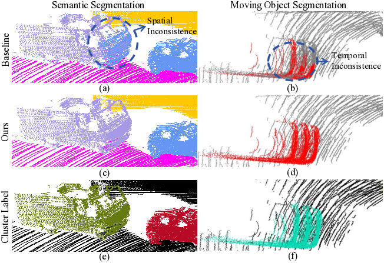

# 4D-CS: Exploiting Cluster Prior for 4D Spatio-Temporal LiDAR Semantic Segmentation

*Figure 1: Overview of the proposed 4D-CS framework*

## TLDR

- 4D-CS is a novel dual-branch network for LiDAR semantic segmentation that leverages explicit clustering information to improve spatio-temporal consistency
- Key components include Multi-View Temporal Fusion (MTF), Temporal Cluster Enhancement (TCE), and Adaptive Prediction Fusion (APF) modules
- Achieves state-of-the-art performance on multi-scan semantic and moving object segmentation tasks on SemanticKITTI and nuScenes datasets
- Significantly improves segmentation consistency for large foreground objects and moving object detection

## Introduction

LiDAR-based semantic segmentation is a crucial task for autonomous driving and robotics applications. While recent approaches have made significant strides by leveraging multi-scan information, they often struggle with maintaining consistent segmentation results across space and time. This is particularly evident when points belonging to the same object are incorrectly classified into different categories.

In this blog post, we'll dive deep into the 4D-CS method proposed by Zhong et al. [1], which introduces a novel approach to address these challenges. By incorporating explicit clustering information and designing specialized modules for temporal fusion and adaptive prediction, 4D-CS achieves state-of-the-art performance on popular benchmarks while significantly improving segmentation consistency.

## The Challenge of Spatio-Temporal Consistency

Before we delve into the details of 4D-CS, let's first understand why achieving consistent segmentation results across space and time is so challenging:

1. **Occlusions and Sparse Data**: LiDAR scans often suffer from occlusions and sparse point distributions, especially for distant objects. This can lead to incomplete or fragmented representations of objects across frames.

2. **Motion and Viewpoint Changes**: As the sensor or objects move, the appearance and point distribution of objects can change significantly between frames.

3. **Local Feature Limitations**: Many existing methods rely heavily on local point features, which may not capture the full context of large objects or their temporal relationships.

4. **Lack of Instance-Level Understanding**: Point-wise classification approaches often struggle to maintain consistent predictions for all points belonging to the same object instance.

To illustrate these challenges, consider the following comparison between a baseline method (WaffleIron [2]) and the proposed 4D-CS approach:

*Figure 2: Comparison of (a,b) baseline method and (c,d) 4D-CS for semantic and moving object segmentation. (e,f) show clustering results of foreground objects.*

As we can see, the baseline method struggles with consistent segmentation of large vehicles and accurate motion state prediction. The 4D-CS method, on the other hand, leverages clustering information to achieve more coherent results.

## The 4D-CS Framework

Now that we understand the motivation behind 4D-CS, let's break down its key components and innovations:

### 1. Dual-Branch Architecture

The core of 4D-CS is its dual-branch structure, consisting of a point-based branch and a cluster-based branch. This design allows the network to process both fine-grained point features and higher-level instance information simultaneously.

*Figure 3: Detailed architecture of 4D-CS*

### 2. Point-Based Branch

The point-based branch is responsible for extracting and enhancing point-wise features using temporal information. It consists of two main components:

a) **Feature Extraction**: The network uses a backbone (WaffleIron [2]) to extract initial point features $F_t \in \mathbb{R}^{N_p \times D}$, where $N_p$ is the number of downsampled points and $D$ is the feature dimension.

b) **Multi-View Temporal Fusion (MTF)**: This novel module fuses current and historical features across multiple 2D projections to enhance the spatial and temporal context of each point.

*Figure 4: Multi-View Temporal Fusion (MTF) module*

The MTF module operates as follows:

1. Historical features $H_{t-1}$ are transformed to the current frame's coordinate system using the ego-motion transformation matrix $T^t_{t-1}$.
2. The transformed features $H'_{t-1}$ and current features $F_t$ are sequentially fused on the $x$-$y$, $x$-$z$, and $y$-$z$ planes using 2D fusion blocks.
3. In each 2D fusion block:
   - Point features are projected onto 2D grids
   - Features within each grid cell are averaged
   - A 1x1 convolution is applied to fuse historical and current features
   - Fused features are back-projected to 3D points

The result is an enhanced feature set $H_t \in \mathbb{R}^{N_p \times D}$ that incorporates temporal information while preserving spatial structure.

### 3. Cluster-Based Branch

The cluster-based branch aims to integrate instance-level information into the segmentation process. It consists of several key steps:

a) **Cluster Label Generation**: This process involves:
   1. Transferring historical semantic predictions to the current frame using voxel-based voting
   2. Applying DBSCAN clustering to foreground points across multiple frames
   3. Filtering clusters to retain only those containing foreground points

b) **Instance Feature Aggregation**: Point features within each cluster are averaged to create initial cluster features $U_t = \{u_i \in \mathbb{R}^D\}^{N_c}_{i=1}$, where $N_c$ is the number of clusters.

c) **Temporal Cluster Enhancement (TCE)**: This module enriches cluster features by incorporating information from neighboring clusters across multiple frames. The process can be summarized as:

1. Project historical cluster centers to the current frame
2. Use K-Nearest Neighbors to find adjacent clusters
3. Apply Grouped Vector Attention [3] to aggregate features from neighboring clusters:

$$
w_{ij} = \omega(k_j - q_i + \delta_{bias}(g'_j - g_i))
$$

$$
u^{attn}_{i} = \sum^{\mathcal{N}(g_{i})}_{c'_{j}} \sum^{h}_{l=1} \sum^{D/h}_{m=1} \text{Softmax}(W_{i})_{jl} v^{lD/h+m}_{j}
$$

Where $\omega$ is a learnable grouped weight encoding function, $\delta_{bias}$ is a positional encoding, and $W_i$ is the collection of attention weights for neighboring clusters.

The enhanced cluster features $U'_t = \{u^{attn}_i\}^{N_c}_{i=1}$ are then distributed back to the corresponding foreground points, resulting in a point-wise cluster feature $H^c_t \in \mathbb{R}^{N_p \times D}$.

### 4. Point-Cluster Fusion

The final stage of 4D-CS is the Adaptive Prediction Fusion (APF) module, which combines predictions from both branches to produce the final segmentation results.

*Figure 5: Adaptive Prediction Fusion (APF) module*

The APF module operates as follows:

1. Separate prediction heads are applied to $H_t$ and $H^c_t$ to obtain semantic logits $(P_{sem}, P^c_{sem})$ and motion logits $(P_{mov}, P^c_{mov})$.
2. Confidence scores $S_{sem}$ and $S_{mov}$ are computed using MLPs on the concatenated features:

$$
S = \text{Sigmoid}(\text{MLP}(\text{Concat}(H_t, H^c_t)))
$$

3. The final predictions are obtained by adaptively fusing the logits from both branches:

$$
P^{final}_{sem} = (1 - S_{sem}) \cdot P_{sem} + S_{sem} \cdot P^c_{sem}
$$

$$
P^{final}_{mov} = (1 - S_{mov}) \cdot P_{mov} + S_{mov} \cdot P^c_{mov}
$$

This adaptive fusion allows the network to leverage the strengths of both point-based and cluster-based predictions, resulting in more consistent and accurate segmentation results.

## Experimental Results

The authors conducted extensive experiments to evaluate the performance of 4D-CS on two popular datasets: SemanticKITTI and nuScenes. Let's look at some of the key results:

### SemanticKITTI Multi-Scan Semantic Segmentation

On the SemanticKITTI test set, 4D-CS achieved state-of-the-art performance with a mean IoU of 63.7%. Notably, it showed significant improvements for large foreground objects compared to the baseline:

- Trucks: +22.5% IoU
- Other vehicles: +17.0% IoU
- Moving trucks: +26.2% IoU
- Moving other vehicles: +14.7% IoU

These results demonstrate the effectiveness of the cluster-based approach in capturing the complete spatial structure of large objects.

### nuScenes Multi-Scan Semantic Segmentation

On the nuScenes validation set, 4D-CS again achieved the highest mIoU of 67.3%, outperforming previous methods across most categories, especially for large foreground objects like trucks and buses.

### SemanticKITTI Moving Object Segmentation

For the task of moving object segmentation, 4D-CS significantly outperformed existing methods:

- Validation set (Sequence 08): 80.9% IoU for moving objects
- Test set (Sequences 11-21): 83.5% IoU for moving objects

This represents a 6.8% improvement over the previous state-of-the-art method, MF-MOS [4], on the test set.

### Qualitative Results

The qualitative results further illustrate the advantages of 4D-CS:

*Figure 6: Visualization of semantic segmentation results on SemanticKITTI validation set*

*Figure 7: Visualization of moving object segmentation on SemanticKITTI validation set*

As we can see, 4D-CS produces more consistent and accurate segmentation results for large objects and moving vehicles compared to the baseline method.

## Ablation Studies

The authors conducted thorough ablation studies to analyze the contribution of each component in 4D-CS. Some key findings include:

1. The Adaptive Prediction Fusion (APF) module alone improved mIoU by 0.7% and IoU of moving objects by 2.5%.
2. The Multi-View Temporal Fusion (MTF) module increased both mIoU and IoU of moving objects by 0.4%.
3. The Temporal Cluster Enhancement (TCE) module with historical cluster features improved mIoU by 0.3% and IoU of moving objects by 0.9%.

These results highlight the importance of each component in achieving the overall performance gains of 4D-CS.

## Conclusion and Future Directions

The 4D-CS method introduces a novel approach to LiDAR semantic segmentation by leveraging explicit clustering information and designing specialized modules for temporal fusion and adaptive prediction. By addressing the challenges of spatio-temporal consistency, it achieves state-of-the-art performance on popular benchmarks while significantly improving segmentation for large foreground objects and moving object detection.

Some potential directions for future research based on this work include:

1. Exploring more advanced clustering techniques that can better handle complex urban scenes
2. Investigating the integration of 4D-CS with other sensor modalities, such as cameras or radar
3. Extending the temporal modeling to longer sequences for improved long-term consistency
4. Adapting the cluster-based approach to other 3D perception tasks, such as object detection or tracking

As autonomous driving and robotics applications continue to advance, methods like 4D-CS that can provide accurate and consistent semantic understanding of the environment will play a crucial role in enabling safe and reliable operation.

## References

[1] J. Zhong, Z. Li, Y. Cui, Z. Fang, "4D-CS: Exploiting Cluster Prior for 4D Spatio-Temporal LiDAR Semantic Segmentation," arXiv preprint, 2024.

[2] G. Puy, A. Boulch, and R. Marlet, "Using a waffle iron for automotive point cloud semantic segmentation," in Proceedings of the IEEE/CVF International Conference on Computer Vision, pp. 3379-3389, 2023.

[3] X. Wu, Y. Lao, L. Jiang, X. Liu, and H. Zhao, "Point transformer v2: Grouped vector attention and partition-based pooling," Advances in Neural Information Processing Systems, vol. 35, pp. 33330-33342, 2022.

[4] J. Cheng, K. Zeng, Z. Huang, X. Tang, J. Wu, C. Zhang, X. Chen, and R. Fan, "MF-MOS: A motion-focused model for moving object segmentation," arXiv preprint arXiv:2401.17023, 2024.

[5] J. Behley, M. Garbade, A. Milioto, J. Quenzel, S. Behnke, C. Stachniss, and J. Gall, "SemanticKITTI: A dataset for semantic scene understanding of LiDAR sequences," in Proceedings of the IEEE/CVF International Conference on Computer Vision, pp. 9297-9307, 2019.

[6] H. Caesar, V. Bankiti, A. H. Lang, S. Vora, V. E. Liong, Q. Xu, A. Krishnan, Y. Pan, G. Baldan, and O. Beijbom, "nuScenes: A multimodal dataset for autonomous driving," in Proceedings of the IEEE/CVF Conference on Computer Vision and Pattern Recognition, pp. 11621-11631, 2020.

