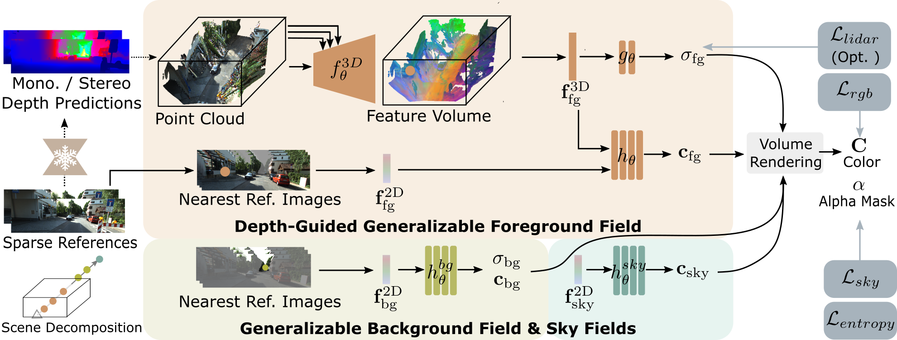

# Efficient Depth-Guided Urban View Synthesis: A Generalizable Approach for Sparse Street Scenes

*Figure 1: Overview of the EDUS method for efficient depth-guided urban view synthesis*

## TLDR

- EDUS (Efficient Depth-Guided Urban View Synthesis) is a new method for fast, generalizable novel view synthesis in urban scenes from sparse inputs
- Leverages noisy geometric priors and 3D-to-3D refinement to achieve robust performance across various sparsity levels
- Decomposes scenes into foreground, background and sky for efficient representation
- Outperforms existing methods on sparse view synthesis, especially at high sparsity levels
- Enables fast feed-forward inference and efficient per-scene fine-tuning

## Introduction

Novel view synthesis (NVS) for street scenes is a crucial task in autonomous driving and robotics. While Neural Radiance Fields (NeRF) have shown impressive results, they struggle with sparse inputs typical in autonomous driving scenarios. As vehicles move at high speeds, much of the content is captured from just a few viewpoints, leading to insufficient overlap between consecutive views. This sparse data, combined with the small parallax angles from forward motion, significantly hinders the performance of existing methods.

In this blog post, we'll dive deep into EDUS (Efficient Depth-Guided Urban View Synthesis), a new approach that tackles these challenges head-on. EDUS leverages noisy geometric priors to enable generalizable urban view synthesis from sparse inputs, achieving state-of-the-art performance while allowing for fast inference and efficient fine-tuning.

## The Challenge of Sparse Urban View Synthesis

Before we get into the details of EDUS, let's consider why sparse urban view synthesis is such a difficult problem:

1. **Limited overlap**: With only a few input images, there's often insufficient overlap between views to reliably reconstruct 3D geometry.
2. **Small parallax**: Forward-moving cameras result in small parallax angles, further increasing reconstruction uncertainty.
3. **Complex scenes**: Urban environments contain diverse objects at various scales and distances.
4. **Unbounded scenes**: Street views extend to the horizon, requiring methods that can handle both near and far objects.

Existing approaches to this problem broadly fall into two categories:

1. **Geometric regularization methods**: These exploit external priors or regularization terms but require per-scene optimization, which can take hours.
2. **Generalizable NeRF methods**: These pre-train on large datasets to gain domain knowledge but often struggle with sparse inputs and varying camera configurations.

EDUS aims to combine the best of both worlds: the robustness of geometric priors with the efficiency of generalizable models.

## The EDUS Approach

At its core, EDUS takes a novel approach to generalizable NeRF by lifting reference images to 3D space using approximate geometric priors. This 3D representation is then processed by a feed-forward network applied directly in 3D space. Let's break down the key components of EDUS:

### 1. Scene Decomposition

EDUS decomposes the scene into three components:

1. **Foreground**: Regions within a limited distance
2. **Background**: Distant objects and structures
3. **Sky**: The infinite sky region

This decomposition allows EDUS to leverage geometric priors for nearby objects while efficiently representing the full unbounded scene.

### 2. Depth-Guided Generalizable Foreground Fields

The heart of EDUS is its depth-guided generalizable foreground field. Here's how it works:

#### Depth Estimation

Given $N$ input images $\{I_i\}_{i=0}^N$, EDUS uses off-the-shelf depth estimators to predict metric depth maps $\{D_i\}_{i=0}^N$. This can be a stereo depth model for stereo pairs or a monocular depth estimator for single images.

#### Point Cloud Accumulation

The depth maps are unprojected into 3D space and accumulated to form a scene point cloud $\mathcal{P} \in \mathbb{R}^{N_p \times 3}$. For each pixel with homogeneous coordinate $\mathbf{u}$, its world coordinate $\mathbf{x}$ is computed as:

$$\mathbf{x} = (d\mathbf{R}_i\mathbf{K}^{-1}\mathbf{u} + \mathbf{t}_i)$$

where $d$ is the estimated depth, and $(\mathbf{R}_i, \mathbf{t}_i)$ is derived from the camera-to-world transformation $\mathbf{T}_i$.

#### 3D Feature Extraction

The point cloud is discretized into a volume $\mathbf{P} \in \mathbb{R}^{H \times W \times D \times 3}$, which is then mapped to a feature volume $\mathbf{F} \in \mathbb{R}^{H \times W \times D \times F}$ using a 3D Spatially-Adaptive Normalization convolutional neural network (SPADE CNN):

$$\mathbf{F} = f_\theta^{3D}(\mathbf{P})$$

This SPADE CNN architecture helps preserve appearance information encoded in the point cloud through multi-resolution modulation.

#### Image-based 2D Feature Retrieval

To capture high-frequency appearance details, EDUS also retrieves 2D features from nearby input views. For each sample point $\mathbf{x}$, colors are retrieved from the $K$ nearest reference frames and concatenated to form a 2D feature vector $\mathbf{f}_{fg}^{2D} \in \mathbb{R}^{3K}$.

#### Color and Density Prediction

For a 3D point in the foreground volume, EDUS predicts its density $\sigma_{fg}$ and color $\mathbf{c}_{fg}$ using both the volumetric feature $\mathbf{f}_{fg}^{3D}$ and the 2D feature $\mathbf{f}_{fg}^{2D}$:

$$
\begin{align*}
\sigma_{fg} &= g_\theta(\mathbf{f}_{fg}^{3D}) \\
\mathbf{c}_{fg} &= h_\theta(\mathbf{f}_{fg}^{3D}, \mathbf{f}_{fg}^{2D}, \gamma(\mathbf{x}), \mathbf{d})
\end{align*}
$$

where $\gamma(\cdot)$ is positional encoding, and $\mathbf{d}$ is the viewing direction.

### 3. Generalizable Background and Sky Fields

For the background and sky, EDUS takes a simpler approach:

#### Background Modeling

Objects outside the foreground volume are considered background. EDUS uses an MLP $h_\theta^{bg}$ to predict background density $\sigma_{bg}$ and color $\mathbf{c}_{bg}$ based on 2D image-based features:

$$\sigma_{bg}, \mathbf{c}_{bg} = h_\theta^{bg}(\mathbf{f}_{bg}^{2D}, \gamma(\mathbf{x}), \mathbf{d})$$

#### Sky Modeling

The sky is represented as a view-dependent environment map, with color predicted using a single-layer MLP:

$$\mathbf{c}_{sky} = h_\theta^{sky}(\mathbf{f}_{sky}^{2D}, \mathbf{d})$$

### 4. Scene Composition

To render a pixel, EDUS casts a ray $\mathbf{r} = \mathbf{r}_o + t\mathbf{d}$ and samples points along it. The final color is composed by accumulating foreground and background contributions and adding the sky color:

$$\mathbf{C} = \mathbf{C}^{(fg + bg)} + (1 - \alpha^{(fg + bg)})\mathbf{c}_{sky}$$

where $\mathbf{C}^{(fg + bg)}$ and $\alpha^{(fg + bg)}$ are the accumulated color and alpha mask for foreground and background points.

## Training and Fine-tuning

EDUS is trained using multiple loss functions:

1. **Photometric loss**: L2 loss between rendered and ground truth colors
2. **Sky loss**: Binary cross-entropy loss to separate sky from solid structures
3. **LiDAR loss** (optional): Encourages correct geometry in training scenes
4. **Entropy regularization loss**: Penalizes semi-transparent rendering of distant landscapes

The training loss is:

$$\mathcal{L}_{training} = \mathcal{L}_{rgb} + \lambda_1\mathcal{L}_{lidar} + \lambda_2\mathcal{L}_{sky} + \lambda_3\mathcal{L}_{entropy}$$

For fine-tuning on new scenes, the LiDAR loss is omitted:

$$\mathcal{L}_{fine-tuning} = \mathcal{L}_{rgb} + \lambda_2\mathcal{L}_{sky} + \lambda_3\mathcal{L}_{entropy}$$

## Implementation Details

Some key implementation details of EDUS include:

- **Input Volume Masking**: Random masking of small regions in the input volume to improve completion capability
- **Hierarchical Sampling**: Following NeuS [1], EDUS uses hierarchical sampling for efficient rendering
- **Appearance Embedding**: Per-frame appearance embeddings to account for illumination variations

## Experimental Results

EDUS was evaluated on the KITTI-360 [2] and Waymo [3] datasets, considering various sparsity levels (50%, 80%, and 90% drop rates). The method was compared against both generalizable NeRF approaches and test-time optimization methods.

### Comparison with Generalizable NeRFs

*Figure 2: Qualitative comparison with generalizable baselines*

EDUS outperforms existing generalizable methods, especially at higher sparsity levels. For example, at 80% drop rate on KITTI-360, EDUS achieves a PSNR of 19.63 dB compared to 18.69 dB for MuRF [4] and 15.96 dB for IBRNet [5]. EDUS also shows strong generalization to the unseen Waymo dataset.

### Comparison with Test-Time Optimization NeRFs

*Figure 3: Qualitative comparison with test-time optimization baselines*

EDUS achieves state-of-the-art performance at high sparsity levels, outperforming methods like MixNeRF [6], SparseNeRF [7], and DS-NeRF [8]. Notably, EDUS converges much faster during fine-tuning, taking only 5 minutes compared to 30-50 minutes for other methods.

## Ablation Studies

Ablation studies highlight the importance of various components in EDUS:

1. The modulated SPADE CNN outperforms a traditional 3D U-Net
2. Both 3D and 2D features are crucial for high-quality rendering
3. Scene decomposition improves results compared to representing the entire scene as foreground
4. LiDAR supervision during training leads to slight improvements in detail

## Conclusion and Future Work

EDUS represents a significant step forward in generalizable and efficient urban view synthesis. By integrating geometric priors into a generalizable model, it achieves robust performance across various density levels and datasets. The method enables fast feed-forward inference and efficient fine-tuning, outperforming existing sparse view methods.

Future work could focus on handling dynamic objects in street views, which poses challenges to generalizable approaches. Additionally, exploring ways to further improve the accuracy of geometric priors or incorporate other types of prior knowledge could lead to even better results.

## Key Takeaways

1. EDUS leverages noisy geometric priors to enable robust generalizable NeRF for urban scenes
2. Scene decomposition into foreground, background, and sky allows efficient representation of unbounded scenes
3. The combination of 3D feature extraction and 2D image-based rendering captures both geometry and high-frequency details
4. EDUS outperforms existing methods, especially in highly sparse settings
5. Fast convergence during fine-tuning makes EDUS practical for real-world applications

As autonomous driving and robotics continue to advance, efficient and accurate 3D scene understanding from sparse inputs will become increasingly important. EDUS provides a promising foundation for tackling these challenges, paving the way for more robust and generalizable 3D vision systems.

## References

[1] Wang, P., Liu, L., Liu, Y., Theobalt, C., Komura, T., Wang, W.: Neus: Learning neural implicit surfaces by volume rendering for multi-view reconstruction. arXiv preprint arXiv:2106.10689 (2021)

[2] Liao, Y., Xie, J., Geiger, A.: Kitti-360: A novel dataset and benchmarks for urban scene understanding in 2d and 3d. IEEE Transactions on Pattern Analysis and Machine Intelligence 45(3), 3292--3310 (2022)

[3] Sun, P., Kretzschmar, H., Dotiwalla, X., Chouard, A., Patnaik, V., Tsui, P., Guo, J., Zhou, Y., Chai, Y., Caine, B., et al.: Scalability in perception for autonomous driving: Waymo open dataset. In: Proceedings of the IEEE/CVF conference on computer vision and pattern recognition. pp. 2446--2454 (2020)

[4] Xu, H., Chen, A., Chen, Y., Sakaridis, C., Zhang, Y., Pollefeys, M., Geiger, A., Yu, F.: Murf: Multi-baseline radiance fields. arXiv preprint arXiv:2312.04565 (2023)

[5] Wang, Q., Wang, Z., Genova, K., Srinivasan, P.P., Zhou, H., Barron, J.T., Martin-Brualla, R., Snavely, N., Funkhouser, T.: Ibrnet: Learning multi-view image-based rendering. In: Proceedings of the IEEE/CVF Conference on Computer Vision and Pattern Recognition. pp. 4690--4699 (2021)

[6] Seo, S., Han, D., Chang, Y., Kwak, N.: Mixnerf: Modeling a ray with mixture density for novel view synthesis from sparse inputs. In: Proceedings of the IEEE/CVF Conference on Computer Vision and Pattern Recognition. pp. 20659--20668 (2023)

[7] Wang, G., Chen, Z., Loy, C.C., Liu, Z.: Sparsenerf: Distilling depth ranking for few-shot novel view synthesis. arXiv preprint arXiv:2303.16196 (2023)

[8] Deng, K., Liu, A., Zhu, J.Y., Ramanan, D.: Depth-supervised nerf: Fewer views and faster training for free. In: Proceedings of the IEEE/CVF Conference on Computer Vision and Pattern Recognition. pp. 12882--12891 (2022)

