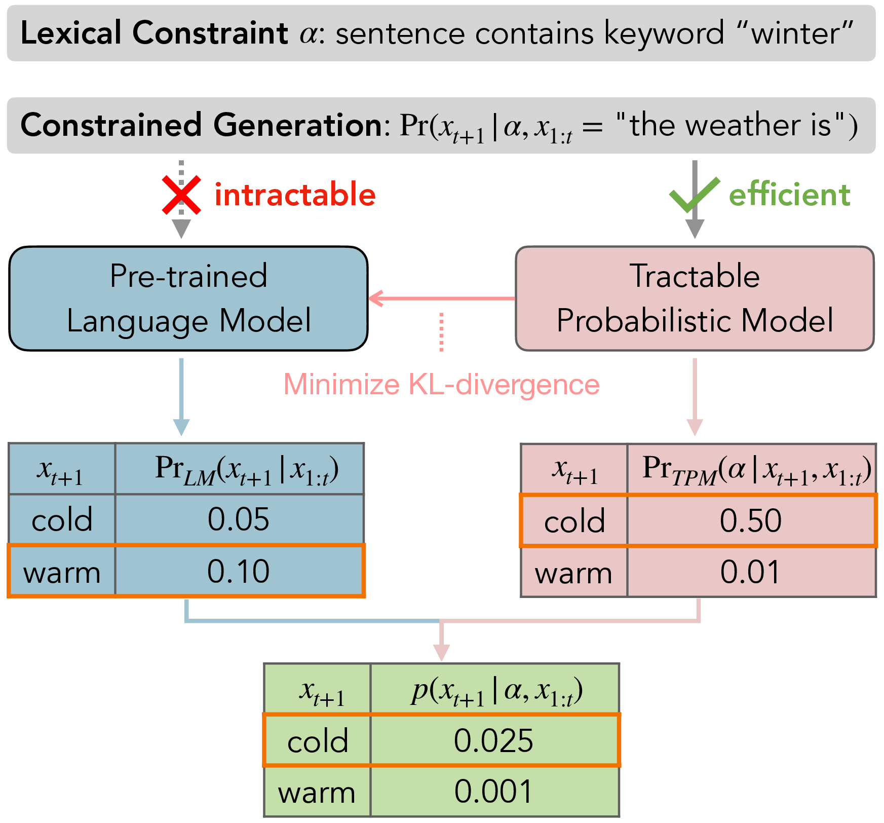
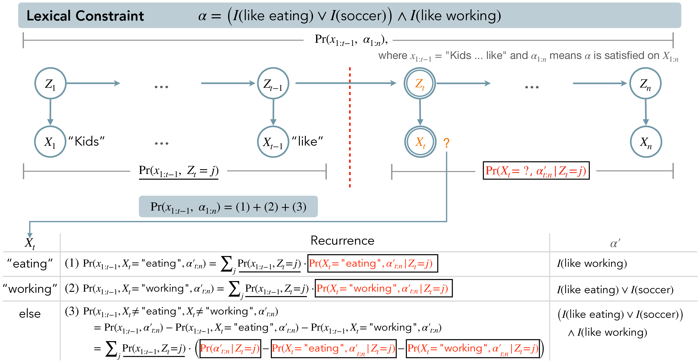

# Tractable Control for Autoregressive Language Generation

*Figure 1: Overview of the GeLaTo approach for constrained language generation*

## TLDR

- GeLaTo uses tractable probabilistic models (TPMs) to impose lexical constraints on autoregressive language models
- Hidden Markov Models are used as an example TPM to efficiently compute conditional probabilities
- Achieves state-of-the-art performance on constrained text generation benchmarks while guaranteeing 100% constraint satisfaction
- Opens up new avenues for controlling large language models and motivates development of more expressive TPMs

## Introduction

Large pre-trained language models have achieved remarkable success in various text generation tasks. However, controlling these models to generate text satisfying specific constraints remains a major challenge. The core difficulty lies in the autoregressive nature of language models - they model the next token distribution given a prefix, but computing the conditional distribution over full sequences given constraints is often intractable.

In this blog post, I'll dive into a novel approach called GeLaTo (Generating Language with Tractable Constraints) that uses tractable probabilistic models (TPMs) to impose lexical constraints on autoregressive language generation. We'll explore how this method achieves state-of-the-art performance on challenging constrained text generation benchmarks while guaranteeing 100% constraint satisfaction.

## The GeLaTo Framework

The key idea behind GeLaTo is to leverage tractable probabilistic models (TPMs) that allow efficient computation of conditional probabilities given lexical constraints. This is combined with the powerful generative capabilities of large language models.

The framework consists of two main steps:

1. **Distillation**: Train a TPM on samples from the pre-trained language model to approximate its distribution
2. **Probabilistic Reasoning**: Use the TPM to compute conditional probabilities and guide the autoregressive generation process

Let's break this down in more detail.

### Distillation Step

Given a pre-trained autoregressive language model $\Pr_{\text{LM}}$, we train a TPM $\Pr_{\text{TPM}}$ to approximate its distribution. This is done via maximum likelihood estimation on samples drawn from $\Pr_{\text{LM}}$:

$$\max \mathbb{E}_{x_{1:n} \sim {\Pr}_{\text{LM}}} \log{\Pr}_{\text{TPM}}(x_{1:n})$$

This is equivalent to minimizing the KL divergence between $\Pr_{\text{TPM}}$ and $\Pr_{\text{LM}}$:

$$D_{\text{KL}}({\Pr}_{\text{LM}}\parallel{\Pr}_{\text{TPM}}) = \mathbb{E}_{x_{1:n}\sim {\Pr}_{\text{LM}}} \log{\Pr}_{\text{LM}}(x_{1:n}) - \mathbb{E}_{x_{1:n} \sim {\Pr}_{\text{LM}}} \log{\Pr}_{\text{TPM}}(x_{1:n})$$

### Probabilistic Reasoning Step

At generation time, we use the trained TPM to compute conditional probabilities efficiently and guide the autoregressive generation process.

The authors consider two settings:

1. **Unsupervised**: The base language model is not finetuned on task-specific data
2. **Supervised**: The language model is finetuned in a sequence-to-sequence manner on task data

For the unsupervised setting, they generate from:

$$p(x_{t+1} \given x_{1:t}, \alpha) \propto {\Pr}_{\text{TPM}}(\alpha \given x_{1:t+1}) \cdot {\Pr}_{\text{LM}}(x_{t+1} \given x_{1:t})$$

For the supervised setting:

$$p(x_{t+1} \given x_{1:t}, \alpha) \propto {\Pr}_{\text{TPM}}(x_{t+1} \given x_{1:t}, \alpha)^{w} \cdot {\Pr}_{\text{LM}}(x_{t+1}\given x_{1:t})^{1-w}$$

where $w \in (0,1)$ is a hyperparameter.

The key advantage of this approach is that the TPM training is independent of the specific lexical constraints. We can use the same trained TPM to enforce different types of constraints at inference time without retraining.

## Hidden Markov Models as TPMs

To demonstrate the effectiveness of GeLaTo, the authors use Hidden Markov Models (HMMs) as an example TPM. HMMs are a classic probabilistic model that can be efficiently trained and queried.

An HMM represents a joint distribution over observed variables $X_{1:n}$ and latent variables $Z_{1:n}$:

$$\Pr(x_{1:n}, z_{1:n}) = \Pr(x_{1} \given z_{1})\Pr(z_{1}) {\prod}_{2 \leq t \leq n} \Pr(x_{t} \given z_{t}) \Pr(z_{t} \given z_{t-1})$$

The parameters are the initial probability $\Pr(z_1)$, emission matrix $\Pr(x_t \given z_t)$, and transition matrix $\Pr(z_{t+1} \given z_t)$.

### Efficient Probabilistic Reasoning with HMMs

A key contribution of the paper is an efficient dynamic programming algorithm to compute conditional probabilities $\Pr(x_{1:t}, \alpha_{1:n})$ for HMMs, where $\alpha_{1:n}$ represents lexical constraints in conjunctive normal form (CNF):

$$(I(w_{1,1}) \lor \dots \lor I(w_{1, d_1})) \land \dots \land (I(w_{m,1}) \lor \dots \lor I(w_{m,d_m}))$$

Here, each $w_{i,j}$ is a string of tokens (keystring) and $I(w_{ij})$ indicates whether $w_{ij}$ appears in the generated text.

The algorithm uses a recurrence relation to break down the computation into subproblems. For non-empty prefixes $x_{l:r}$:

$$\begin{align*}
&\Pr(x_{l:r}, \alpha_{l:n} \given z_l) \\
&= \sum_{z_{r+1}} \Pr(x_{l:r},z_{r+1} \given z_l) \bigg(\Pr(\alpha_{r+1:n} \given z_{r+1}) \\
&\quad + \sum_{s \in S(x_{l:r}, \alpha)} \Pr(s_{r+1:r+|s|}, (\alpha \setminus x_{l:r}\oplus s)_{r+1:n} \given z_{r+1}) \\
&\quad - \sum_{s \in S(x_{l:r}, \alpha)} \Pr(s_{r+1:r+|s|}, \alpha_{r+1:n} \given z_{r+1})\bigg)
\end{align*}$$

For empty prefixes:

$$\Pr(\alpha_{l:n} \given z_{l}) = \sum_{x_l \in \text{vocabulary}} \Pr(x_l, \alpha_{l:n} \given z_{l})$$

This algorithm allows efficient computation of the conditional probabilities needed to guide the generation process.

## Experimental Results

The authors evaluate GeLaTo on several challenging constrained text generation benchmarks:

1. CommonGen
2. Yelp!Review
3. News

Let's focus on the results for CommonGen, which is a benchmark for generating sentences using given concepts (keywords).

### CommonGen Results

*Figure 2: Example illustrating the dynamic programming algorithm for CommonGen*

The authors compare GeLaTo against several strong baselines:

- InsNet
- NeuroLogic Decoding
- A*esque Decoding
- NADO

They evaluate performance on both generation quality (using metrics like BLEU, ROUGE, CIDEr, and SPICE) and constraint satisfaction (coverage and success rate).

Here are the key results:

1. **Unsupervised Setting**: 
   - GeLaTo achieves a BLEU-4 score of 30.3 on the dev set, outperforming all baselines
   - 100% constraint satisfaction (coverage and success rate)

2. **Supervised Setting**:
   - GeLaTo achieves a BLEU-4 score of 34.0 on the dev set, significantly higher than baselines
   - Again, 100% constraint satisfaction

3. **Human Evaluation**:
   - GeLaTo performs best in all metrics (concepts, plausibility, quality, and overall rating) compared to prior state-of-the-art methods

These results demonstrate that GeLaTo not only achieves superior generation quality but also guarantees perfect constraint satisfaction.

## Analysis and Ablation Studies

The authors conduct several analyses to provide deeper insights into GeLaTo:

1. **Generation Quality vs. Approximation Performance**: They show a clear positive correlation between the log-likelihood of the HMM (how well it approximates the base LM) and the BLEU score of generated text.

2. **Robustness of Hyperparameter $w$**: For the supervised setting, GeLaTo achieves state-of-the-art BLEU scores for a wide range of $w$ values (0.1 to 0.8), demonstrating robustness.

3. **Effect of Beam Size**: Performance improves monotonically as beam size increases for both unsupervised and supervised settings.

4. **Run-time Comparison**: GeLaTo is faster than some baselines (e.g., NeuroLogic A*esque in the unsupervised setting) and comparable in speed to others.

## Key Takeaways and Future Directions

GeLaTo represents a significant advance in constrained text generation:

1. It achieves state-of-the-art performance on challenging benchmarks while guaranteeing 100% constraint satisfaction.
2. The approach is flexible - the same trained TPM can be used to enforce different types of constraints without retraining.
3. It opens up new avenues for controlling large language models using tractable probabilistic models.

Future directions suggested by this work include:

1. Developing more expressive tractable probabilistic models to better approximate language model distributions.
2. Exploring other types of constraints beyond lexical constraints (e.g., syntactic or semantic constraints).
3. Investigating the scalability of this approach to even larger language models and more complex constraints.

## Conclusion

GeLaTo demonstrates the potential of combining tractable probabilistic models with large language models for controlled text generation. By leveraging the efficient inference capabilities of TPMs, it achieves both high-quality generation and perfect constraint satisfaction.

This work not only provides a practical solution for constrained text generation but also motivates further research into more powerful tractable probabilistic models and their applications in natural language processing.

As language models continue to grow in size and capability, approaches like GeLaTo that allow for fine-grained control will become increasingly important. It's exciting to consider how these ideas might evolve and impact the future of natural language generation.

## References

[1] Lin, B. Y., Zhou, W., Shen, M., Zhou, P., Bhagavatula, C., Choi, Y., and Ren, X. CommonGen: A constrained text generation challenge for generative commonsense reasoning. In Findings of the Association for Computational Linguistics: EMNLP, 2020.

[2] Cho, W. S., Zhang, P., Zhang, Y., Li, X., Galley, M., Brockett, C., Wang, M., and Gao, J. Towards coherent and cohesive long-form text generation. In Proceedings of the First Workshop on Narrative Understanding, 2019.

[3] Zhang, Y., Wang, G., Li, C., Gan, Z., Brockett, C., and Dolan, B. POINTER: Constrained progressive text generation via insertion-based generative pre-training. In Proceedings of the 2020 Conference on Empirical Methods in Natural Language Processing (EMNLP), 2020.

[4] Lu, X., West, P., Zellers, R., Le Bras, R., Bhagavatula, C., and Choi, Y. Neurologic decoding:(un) supervised neural text generation with predicate logic constraints. In Proceedings of the 2021 Conference of the North American Chapter of the Association for Computational Linguistics: Human Language Technologies (NAACL), 2021.

[5] Lu, X., Welleck, S., West, P., Jiang, L., Kasai, J., Khashabi, D., Le Bras, R., Qin, L., Yu, Y., Zellers, R., Smith, N. A., and Choi, Y. NeuroLogic A*esque decoding: Constrained text generation with lookahead heuristics. In Proceedings of the 2022 Conference of the North American Chapter of the Association for Computational Linguistics: Human Language Technologies (NAACL), 2022.

[6] Meng, T., Lu, S., Peng, N., and Chang, K.-W. Controllable text generation with neurally-decomposed oracle. In Advances in Neural Information Processing Systems 35 (NeurIPS), 2022.

[7] Lu, S., Meng, T., and Peng, N. Insnet: An efficient, flexible, and performant insertion-based text generation model. In Advances in Neural Information Processing Systems 35 (NeurIPS), 2022.

[8] Radford, A., Wu, J., Child, R., Luan, D., Amodei, D., Sutskever, I., et al. Language models are unsupervised multitask learners. OpenAI blog, 2019.

[9] Brown, T., Mann, B., Ryder, N., Subbiah, M., Kaplan, J. D., Dhariwal, P., Neelakantan, A., Shyam, P., Sastry, G., Askell, A., et al. Language models are few-shot learners. Advances in Neural Information Processing Systems 33 (NeurIPS), 2020.

[10] Choi, Y., Vergari, A., and Van den Broeck, G. Probabilistic circuits: A unifying framework for tractable probabilistic models. 2020.

[11] Rabiner, L. and Juang, B. An introduction to hidden markov models. IEEE ASSP Magazine, 1986.

[12] Liu, A., Zhang, H., and Van den Broeck, G. Scaling up probabilistic circuits by latent variable distillation. In Proceedings of the International Conference on Learning Representations (ICLR), 2023.

