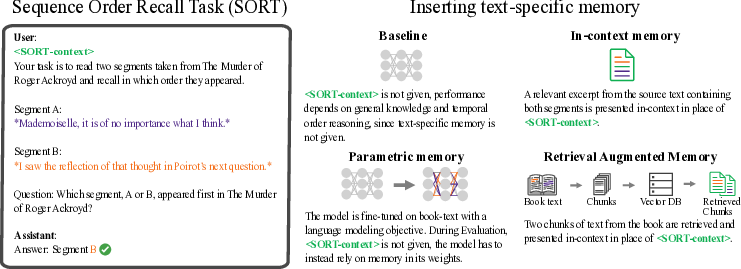

---
title: "Assessing Episodic Memory in LLMs with Sequence Order Recall Tasks"
date: 2020-09-15T11:30:03+00:00
# weight: 1
# aliases: ["/first"]
tags: ['Episodic Memory', 'Large Language Models', 'Sequence Order Recall Task', 'SORT', 'Book-SORT', 'In-context Memory', 'Fine-tuning', 'Retrieval-Augmented Generation', 'AI Evaluation']
author: "Me"
# author: ["Me", "You"] # multiple authors
showToc: true
TocOpen: true
draft: false
hidemeta: false
comments: false
description: ""
canonicalURL: "https://canonical.url/to/page"
disableHLJS: true # to disable highlightjs
disableShare: false
disableHLJS: false
hideSummary: false
searchHidden: false
ShowReadingTime: true
ShowBreadCrumbs: true
ShowPostNavLinks: true
ShowWordCount: true
ShowRssButtonInSectionTermList: true
UseHugoToc: true
cover:
    image: "<image path/url>" # image path/url
    alt: "<alt text>" # alt text
    caption: "<text>" # display caption under cover
    relative: false # when using page bundles set this to true
    hidden: true # only hide on current single page
editPost:
    URL: "https://github.com/<path_to_repo>/content"
    Text: "Suggest Changes" # edit text
    appendFilePath: true # to append file path to Edit link
---

# Assessing Episodic Memory in LLMs with Sequence Order Recall Tasks

*Figure 1: Overview of the Sequence Order Recall Task (SORT) to evaluate how models can access memory of temporal order.*

## TLDR

- Introduces SORT (Sequence Order Recall Task) to evaluate episodic memory in large language models (LLMs)
- Creates Book-SORT dataset with 36k segment pairs from 9 public domain books
- Evaluates in-context memory, fine-tuning, and retrieval-augmented generation (RAG) approaches
- Finds LLMs perform well with in-context memory but struggle with longer contexts and parametric memory
- Highlights the need for improved episodic memory capabilities in LLMs

## Introduction

As large language models (LLMs) continue to advance, it's crucial to develop comprehensive evaluation methods that assess various aspects of their capabilities. While current benchmarks focus primarily on semantic knowledge and factual recall, they often overlook a critical component of human-like intelligence: episodic memory.

In this blog post, we'll dive into a recent paper that introduces a novel approach to evaluating episodic memory in LLMs. The authors propose the Sequence Order Recall Task (SORT) and demonstrate its effectiveness through a series of experiments on various models and memory insertion techniques.

## What is Episodic Memory?

Before we delve into the details of SORT, let's briefly discuss what episodic memory is and why it's important. Episodic memory is a type of long-term memory that allows us to recall specific events or experiences, including their temporal and spatial context. This ability is crucial for many cognitive tasks and everyday functions, such as:

- Reconstructing past events
- Predicting future outcomes
- Relating information across multiple events separated by time

Current LLM benchmarks primarily focus on semantic memory (factual knowledge) but don't adequately assess episodic memory capabilities. This gap motivated the researchers to develop SORT as a way to evaluate this important aspect of memory in artificial intelligence systems.

## The Sequence Order Recall Task (SORT)

SORT is designed to test a model's ability to recall the correct order of sequential data, such as segments of text. The task is adapted from recency judgment tasks used in cognitive psychology to assess episodic memory in humans and animals.

### Formal Description of SORT

Let's break down the mathematical formulation of SORT:

1. Given sequential data $\mathbf{X} \in \mathbb{R}^{T \times F}$, where:
   - $T$ is the number of time-steps (e.g., tokens in a text)
   - $F$ is the number of features (e.g., vocabulary size)

2. Define start indices $\mathbf{t_j}$ and $\mathbf{t_k}$ for pairs of segments of length $\mathbf{L} \in \mathbb{N}^+$ in $\mathbf{X}$, such that:
   - $\mathbf{t_j < t_k}$
   - $\mathbf{t_j + L \leq t_k}$

3. Extract non-overlapping segments:
   $\mathbf{\widetilde{X}_i = X[t_i : t_i + L-1, :]}$

4. Randomize the order of segments $\mathbf{\widetilde{X}_j}$ and $\mathbf{\widetilde{X}_k}$, yielding $\mathbf{[\widetilde{X}_A \; \widetilde{X}_B]}$

5. The model $\mathbf{\mathcal{M}_\theta}$ must infer whether $\mathbf{t_A < t_B}$

The general form of the SORT input is:

$$I_{SORT} = [P_{context} \; P_{task} \; P_{label_A} \; \mathbf{\widetilde{X}_A}\;  P_{label_B} \; \mathbf{\widetilde{X}_B} \; P_{question} P_{answer}]$$

Where:
- $\mathbf{P_{context}}$: Relevant context or empty string
- $\mathbf{P_{task}}$: Task instructions
- $\mathbf{P_{label_A}}$ and $\mathbf{P_{label_B}}$: Labels for segments
- $\mathbf{P_{question}}$: Repeats the SORT objective
- $\mathbf{P_{answer}}$: Beginning of the answer string

## The Book-SORT Dataset

To evaluate SORT, the researchers created the Book-SORT dataset, which consists of:

- 36k pairs of text segments
- Extracted from 9 books recently added to the public domain
- Variations in segment length (20 and 50 words)
- Distances between segments up to 16k words

The dataset was carefully designed to minimize the possibility of LLMs being pre-trained on these texts, allowing for a fair evaluation of their episodic memory capabilities.

## Evaluation Methods

The researchers evaluated three main approaches to inserting text-specific memory into models:

1. In-context presentation
2. Fine-tuning with a language modeling objective
3. Retrieval-augmented generation (RAG)

### In-context Presentation

For in-context memory evaluation, relevant excerpts from the books were included in the prompt along with the SORT task. The researchers varied the length of these excerpts to test the models' ability to handle different context lengths.

### Fine-tuning

To assess parametric memory, the researchers fine-tuned models on the book texts using a language modeling objective. They split the books into chunks of 5000 words and included additional instruction-following examples to prevent catastrophic forgetting.

### Retrieval-Augmented Generation (RAG)

The RAG approach used a separate retriever model to fetch relevant passages from a database of text embeddings. These retrieved passages were then included in the prompt for the LLM to use in solving the SORT task.

## Key Findings

1. In-context memory performance:
   - Models generally performed well, with accuracies up to 95%
   - Performance increased with greater distance between segments
   - Accuracy decreased with increasing excerpt length

2. Parametric memory via fine-tuning:
   - Full parameter fine-tuning did not significantly improve SORT performance
   - This suggests current forms of parametric memory do not support episodic memory functions

3. Retrieval-augmented memory:
   - RAG-based memory led to worse performance than in-context memory
   - Performance improved when relevant passages were retrieved and presented in the correct order

4. Human performance:
   - Humans achieved an average accuracy of 64% for 50-word segments and 56% for 20-word segments
   - Performance was higher for pairs of segments with greater distance in the book

## Implications and Future Directions

The results of this study have several important implications for the development of LLMs:

1. Current LLMs excel at in-context memory but struggle with longer contexts and parametric memory for episodic tasks.
2. There's a need for improved methods to induce episodic memories in LLMs without relying on complete in-context presentation.
3. The development of memory-augmented models may lead to improvements in continual learning, long-context tasks, and source attribution.

Future work in this area could include:

- Extending SORT to other types of inputs, such as audio and video
- Evaluating episodic memory in multimodal models
- Developing new architectures that better support episodic memory functions

## Conclusion

The introduction of SORT and the Book-SORT dataset provides a valuable new tool for assessing episodic memory in LLMs. By highlighting the current limitations of LLMs in this area, this research paves the way for future improvements in AI systems that can better mimic human-like memory capabilities.

As we continue to push the boundaries of AI, it's crucial to develop evaluation methods that cover all aspects of intelligence, including episodic memory. The work presented in this paper is an important step towards creating more comprehensive and human-like AI systems.

## References

1. Christie, A. (1927). The Murder of Roger Ackroyd. Cosimo Classics.
2. Davachi, L., & DuBrow, S. (2015). How the hippocampus preserves order: the role of prediction and context. Trends in cognitive sciences, 19(2), 92-99.
3. Eichenbaum, H. (2013). Memory on time. Trends in cognitive sciences, 17(2), 81-88.
4. Howard, M. W., & Kahana, M. J. (2002). A distributed representation of temporal context. Journal of Mathematical Psychology, 46(3), 269-299.
5. Kwon, W., Li, Z., Zhuang, S., Sheng, Y., Zheng, L., Yu, C. H., ... & Stoica, I. (2023). Efficient memory management for large language model serving with pagedattention.
6. Lewis, M., Liu, Y., Goyal, N., Ghazvininejad, M., Mohamed, A., Levy, O., ... & Zettlemoyer, L. (2020). BART: Denoising sequence-to-sequence pre-training for natural language generation, translation, and comprehension. In Proceedings of the 58th Annual Meeting of the Association for Computational Linguistics (pp. 7871-7880).
7. Polyn, S. M., Norman, K. A., & Kahana, M. J. (2009). A context maintenance and retrieval model of organizational processes in free recall. Psychological Review, 116(1), 129-156.
8. Whittington, J. C., Warren, J., & Behrens, T. E. (2022). Relating transformers to models and neural representations of the hippocampal formation. In International Conference on Learning Representations.

## Twitter Thread

1/5 New paper alert! 📢 "Assessing Episodic Memory in LLMs with Sequence Order Recall Tasks" introduces SORT, a novel method to evaluate episodic memory in large language models. #AI #MachineLearning

2/5 The researchers created Book-SORT, a dataset with 36k segment pairs from 9 public domain books, to test LLMs' ability to recall the correct order of text segments. #NLP #DataScience

3/5 Key findings:
- LLMs perform well with in-context memory
- Performance decreases with longer contexts
- Fine-tuning doesn't significantly improve episodic memory
- RAG-based memory underperforms compared to in-context memory

4/5 This work highlights the need for improved episodic memory capabilities in LLMs and paves the way for developing more human-like AI systems. #AIResearch #CognitiveScience

5/5 Check out the full paper and code:
Paper: [Insert arXiv link when available]
Code: https://github.com/bridge-ai-neuro/SORT
Dataset: https://huggingface.co/datasets/memari/booksort

