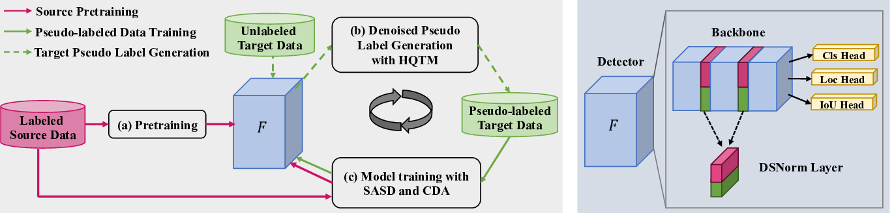
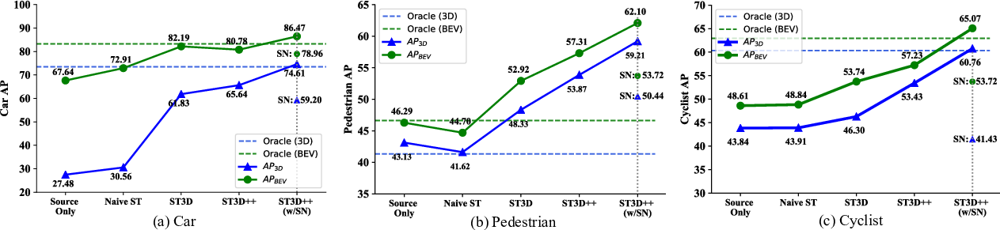

# ST3D++: Denoised Self-training for Unsupervised Domain Adaptation on 3D Object Detection

## TL;DR

- ST3D++ is a self-training framework for unsupervised domain adaptation in 3D object detection
- Key components: Random object scaling, hybrid quality-aware triplet memory, source-assisted self-denoised training, curriculum data augmentation
- Significantly outperforms previous methods on multiple adaptation tasks across 4 datasets
- Achieves state-of-the-art performance, even surpassing fully supervised results in some cases

## Introduction

3D object detection from point cloud data is a critical task for applications like autonomous driving and robotics. However, detectors trained on one domain (e.g. data from a particular sensor or location) often perform poorly when applied to a new target domain due to domain shifts. Collecting and annotating 3D data for every new domain is extremely time-consuming and expensive.

This is where unsupervised domain adaptation (UDA) comes in - the goal is to adapt a detector trained on labeled source domain data to work well on an unlabeled target domain. While UDA has been extensively studied for 2D vision tasks, it remains challenging for 3D object detection due to the unique properties of point cloud data.

In this blog post, I'll dive into ST3D++, a state-of-the-art self-training framework for UDA on 3D object detection proposed by Yang et al. ST3D++ builds on their previous work ST3D, introducing several key innovations to generate high-quality pseudo-labels and effectively train on noisy target domain data.

## Background: Self-Training for UDA

Self-training is a simple yet effective approach for UDA that has shown great success on 2D vision tasks. The basic idea is:

1. Train an initial model on labeled source data
2. Use that model to generate pseudo-labels on unlabeled target data  
3. Train the model on both source data and pseudo-labeled target data
4. Repeat steps 2-3 iteratively

While conceptually straightforward, naively applying self-training to 3D object detection faces some key challenges:

- Pseudo-label noise: The initial source-trained model produces many inaccurate pseudo-labels on the target domain
- Localization errors: 3D bounding box regression is more challenging than 2D, leading to imprecise object localization
- Overfitting to noise: The model can easily overfit to errors in the pseudo-labels
- Domain gaps: Large differences in object sizes, point cloud density etc. between domains

ST3D++ introduces several innovative components to address these challenges throughout the self-training pipeline. Let's dive into the details!

## ST3D++ Framework

The ST3D++ framework consists of three main stages:

1. Source domain pre-training with random object scaling
2. Denoised pseudo-label generation with hybrid quality-aware triplet memory  
3. Target domain training with source-assisted self-denoised learning and curriculum data augmentation

Let's examine each of these components in detail.

### Source Domain Pre-training with Random Object Scaling

The first step is to train an initial 3D object detector on the labeled source domain data. A key innovation in ST3D++ is the introduction of random object scaling (ROS) during pre-training.

The motivation is that object sizes often vary significantly between domains. For example, cars in the Waymo dataset are on average 0.9m longer than those in KITTI. This size mismatch can lead to poor generalization.

ROS works by randomly scaling the 3D bounding boxes and associated points for each object during training:

1. For a 3D box with size $(l, w, h)$, center $(c_x, c_y, c_z)$, and heading $\theta$:
2. Generate random scale factors $(r_l, r_w, r_h)$
3. For each point $(p_x, p_y, p_z)$ inside the box:
   
   a. Transform to object-centric coordinates:
   $$(p_l, p_w, p_h) = (p_x - c_x, p_y - c_y, p_z - c_z) \cdot R$$
   where $R$ is the rotation matrix for $\theta$
   
   b. Scale the point: $(r_l p_l, r_w p_w, r_h p_h)$
   
   c. Transform back:
   $$p_{aug} = (r_l p_l, r_w p_w, r_h p_h) \cdot R^T + (c_x, c_y, c_z)$$

4. The box size becomes $(r_l l, r_w w, r_h h)$

This simple augmentation helps the model learn to detect objects of varying sizes, reducing the domain gap and improving initial pseudo-label quality on the target domain.

### Denoised Pseudo-label Generation 

A core component of ST3D++ is the hybrid quality-aware triplet memory (HQTM) for generating high-quality, consistent pseudo-labels on the target domain. It consists of three key elements:

1. Hybrid quality-aware criterion
2. Triplet box partition
3. Memory ensemble and voting

#### Hybrid Quality-aware Criterion

Previous work often used classification confidence to assess pseudo-label quality. However, this doesn't account for localization accuracy, which is critical for 3D detection.

ST3D++ introduces a hybrid criterion that combines classification confidence and IoU prediction:

$$o = \phi p + (1-\phi) u$$

where $o$ is the final score, $p$ is classification confidence, $u$ is predicted IoU, and $\phi$ is a weighting factor.

The IoU prediction comes from an additional lightweight head added to the detector, trained with binary cross-entropy loss:

$$\mathcal{L}_{iou} = -\hat{u}\log u - (1 - \hat{u})\log (1-u)$$

where $u$ is the predicted IoU and $\hat{u}$ is the true IoU.

This hybrid criterion provides a more comprehensive assessment of pseudo-label quality.

#### Triplet Box Partition

To avoid assigning labels to ambiguous examples, ST3D++ uses a triplet partition scheme:

- Positive: $o \geq T_{pos}$ 
- Ignored: $T_{neg} \leq o < T_{pos}$
- Negative: $o < T_{neg}$

Only positive boxes are used as pseudo-labels, while ignored boxes are not used for training. This helps filter out noisy predictions.

#### Memory Ensemble and Voting

To improve pseudo-label consistency across iterations, ST3D++ maintains a memory bank of historical pseudo-labels. For each new set of predictions:

1. Match new boxes to memory boxes using IoU
2. For matched pairs, keep the box with higher quality score
3. For unmatched boxes, use a voting mechanism:
   - Increment an "unmatched counter" for memory boxes
   - New boxes start with counter = 0
   - If counter ≥ threshold, discard the box
   - Otherwise, keep in memory as ignored or positive

This ensemble approach produces more stable and consistent pseudo-labels over time.

### Target Domain Training

With high-quality pseudo-labels generated, ST3D++ introduces two key techniques for effective training on the target domain:

#### Source-assisted Self-denoised Training

While pseudo-labels help adapt to the target domain, they still contain noise. ST3D++ leverages the clean source domain labels to help denoise training:

1. Train on both source data and pseudo-labeled target data
2. Use separate batch normalization for source and target to avoid distribution shift

The loss function is:

$$\mathcal{L} = \lambda \mathcal{L}^s_{det} + \mathcal{L}^t_{det}$$

where $\mathcal{L}_{det}$ is the standard 3D detection loss (classification, regression, direction) and $\lambda$ balances source and target.

This approach helps correct gradient directions from noisy pseudo-labels and maintains good performance on diverse patterns.

#### Curriculum Data Augmentation

To prevent overfitting to easy examples, ST3D++ introduces curriculum data augmentation (CDA). The idea is to progressively increase augmentation intensity over training:

For each augmentation $D_i$, the intensity at stage $s$ is:

$$\delta_s^i = \delta_0^i \rho^{s-1}$$

where $\delta_0^i$ is initial intensity and $\rho > 1$ is an enlarging ratio.

This creates increasingly difficult examples as training progresses, improving the model's capability to handle challenging cases.

## Experimental Results

ST3D++ was evaluated on four popular 3D detection datasets: KITTI, Waymo, nuScenes, and Lyft. The authors tested various cross-dataset adaptation scenarios, focusing on the car, pedestrian, and cyclist categories.

Some key results:

- Significantly outperforms previous methods like SN and ST3D across all adaptation tasks
- Closes a large portion of the gap between source-only and fully supervised performance
- In some cases (e.g. Waymo → KITTI), even surpasses the fully supervised oracle results

The ablation studies demonstrate the effectiveness of each component:

- Random object scaling improves initial cross-domain performance
- Hybrid quality-aware triplet memory produces better pseudo-labels
- Source-assisted training and curriculum data augmentation both provide significant gains

## Key Takeaways and Future Directions

ST3D++ represents a major step forward for unsupervised domain adaptation in 3D object detection. Some key innovations and insights:

1. Addressing pseudo-label noise is critical for effective self-training
2. Combining classification and localization quality metrics improves pseudo-label selection
3. Leveraging both source and target domain data during adaptation is beneficial
4. Curriculum learning strategies can help overcome overfitting to noisy labels

Some potential directions for future work:

- Extending to more diverse 3D sensing modalities (e.g. radar, stereo cameras)
- Incorporating temporal information from sequential point clouds
- Exploring ways to further reduce the need for source domain data
- Adapting the approach to indoor 3D scene understanding tasks

## Conclusion

3D perception is a rapidly evolving field with immense practical importance for autonomous systems. ST3D++ demonstrates the power of carefully designed self-training approaches to adapt 3D detectors across domains without requiring expensive annotation efforts.

As researchers continue to push the boundaries of 3D perception, I'm excited to see how techniques like ST3D++ will enable more robust and generalizable systems that can operate in diverse real-world environments.

What are your thoughts on unsupervised domain adaptation for 3D perception? Let me know in the comments!

## References

[1] Yang, J., Shi, S., Wang, Z., Li, H., & Qi, X. (2021). ST3D++: Denoised Self-training for Unsupervised Domain Adaptation on 3D Object Detection. arXiv preprint.

[2] Geiger, A., Lenz, P., & Urtasun, R. (2012). Are we ready for autonomous driving? The KITTI vision benchmark suite. In Conference on Computer Vision and Pattern Recognition (CVPR).

[3] Sun, P., Kretzschmar, H., Dotiwalla, X., Chouard, A., Patnaik, V., Tsui, P., ... & Anguelov, D. (2020). Scalability in perception for autonomous driving: Waymo open dataset. In Proceedings of the IEEE/CVF Conference on Computer Vision and Pattern Recognition (pp. 2446-2454).

[4] Caesar, H., Bankiti, V., Lang, A. H., Vora, S., Liong, V. E., Xu, Q., ... & Beijbom, O. (2020). nuScenes: A multimodal dataset for autonomous driving. In Proceedings of the IEEE/CVF Conference on Computer Vision and Pattern Recognition (pp. 11621-11631).

[5] Lyft Level 5 AV Dataset 2019. https://level5.lyft.com/dataset/

[6] Wang, Y., Chen, X., You, Y., Li, L. E., Hariharan, B., Campbell, M., ... & Chao, W. L. (2020). Train in Germany, test in the USA: Making 3D object detectors generalize. In Proceedings of the IEEE/CVF Conference on Computer Vision and Pattern Recognition (pp. 11713-11723).

[7] Yan, Y., Mao, Y., & Li, B. (2018). Second: Sparsely embedded convolutional detection. Sensors, 18(10), 3337.

[8] Shi, S., Wang, X., & Li, H. (2019). PointRCNN: 3D object proposal generation and detection from point cloud. In Proceedings of the IEEE/CVF Conference on Computer Vision and Pattern Recognition (pp. 770-779).

[9] Shi, S., Guo, C., Jiang, L., Wang, Z., Shi, J., Wang, X., & Li, H. (2020). PV-RCNN: Point-voxel feature set abstraction for 3D object detection. In Proceedings of the IEEE/CVF Conference on Computer Vision and Pattern Recognition (pp. 10529-10538).

