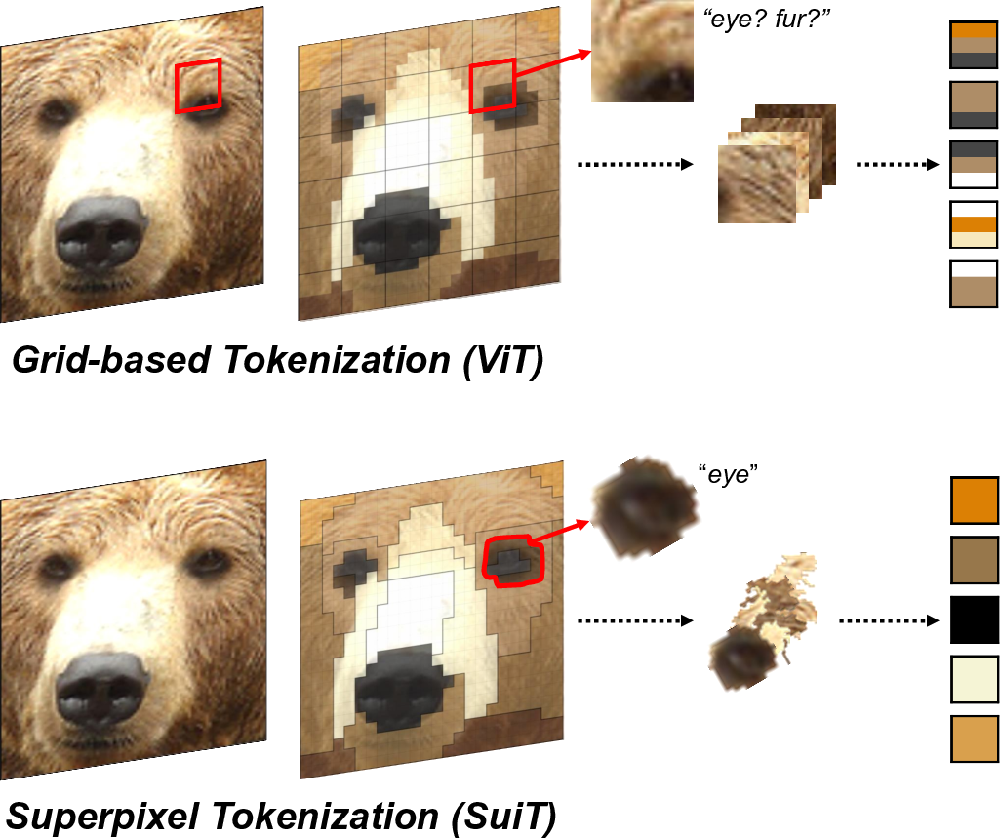
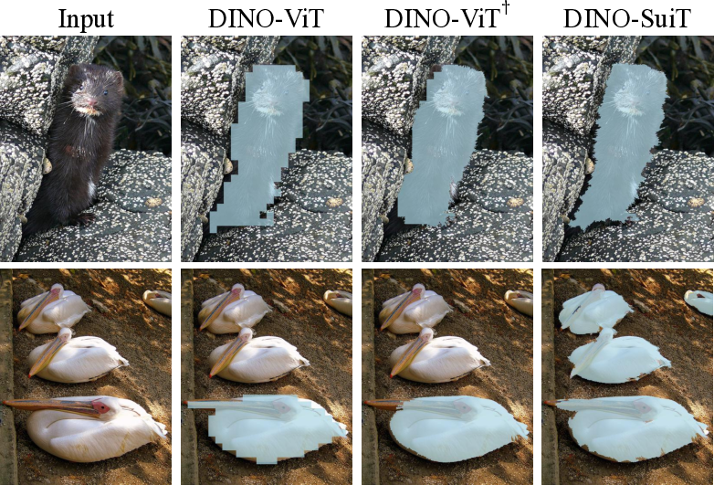
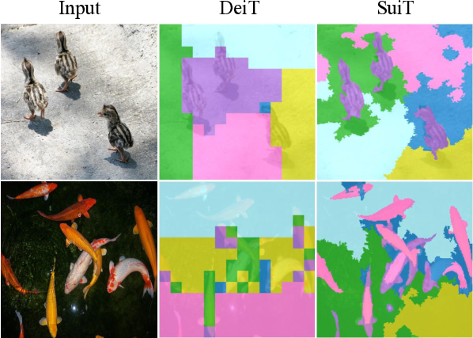
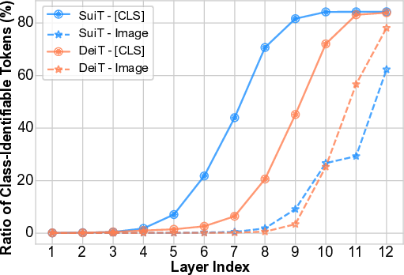

# Superpixel Tokenization for Vision Transformers: Preserving Semantic Integrity in Visual Tokens

*Figure 1: A high-level overview of tokenization. (Top) The conventional grid-like tokenization in ViT and (Bottom) our proposed superpixel tokenization.*

## TL;DR

- This paper introduces a novel superpixel-based tokenization method for Vision Transformers (ViTs) that preserves semantic integrity in visual tokens.
- The proposed method, called SuiT, overcomes challenges of incorporating irregularly shaped superpixels through a two-stage pipeline: pre-aggregate feature extraction and superpixel-aware feature aggregation.
- SuiT demonstrates improved performance across various tasks including ImageNet classification, transfer learning, self-supervised learning, and zero-shot segmentation.
- The approach shows enhanced robustness and out-of-distribution generalization compared to conventional ViT tokenization.

## Introduction

Vision Transformers (ViTs) have revolutionized the field of computer vision, achieving remarkable success across a wide range of tasks. However, the tokenization process in ViTs, which typically uses uniformly partitioned square image patches, can result in tokens that contain multiple semantic concepts. This is in contrast to tokenization in Natural Language Processing (NLP), where tokens inherently represent distinct semantic units.

In this work, we propose a novel approach to ViT tokenization that leverages superpixels to generate tokens that encapsulate single visual concepts. Superpixels are clusters of connected pixels that share similar properties such as color, texture, or position. By using superpixels as the basis for tokenization, we aim to create tokens that better preserve semantic integrity.

However, incorporating superpixels into ViT tokenization presents several challenges due to their irregular shapes, sizes, and locations. To address these issues, we introduce a tokenization pipeline consisting of two main components: pre-aggregate feature extraction and superpixel-aware feature aggregation.

## Superpixel Tokenization: Challenges and Solutions

### The Challenge of Superpixel Integration

Conventional ViTs generate tokens from fixed-size square patches at predefined locations through simple flattening and linear projection. This approach is incompatible with superpixels, which consist of varying numbers of pixels and have dynamic locations depending on the image content.

To illustrate this, let's consider the mathematical formulation of traditional ViT tokenization:

Given an input image $\mathbf{x} \in \mathbb{R}^{H \times W \times C}$, it is divided into $N = \frac{H \times W}{P^2}$ non-overlapping patches of size $P \times P$. Each patch $\mathbf{x}^{(i)} \in \mathbb{R}^{P \times P \times C}$ is flattened into a vector $\mathbf{x}_p^{(i)} \in \mathbb{R}^{P^2C}$ and linearly projected using an embedding matrix $\mathbf{E} \in \mathbb{R}^{P^2C \times D}$. The final input token is formed as:

$$\mathbf{z}^{(i)} = \mathbf{x}_p^{(i)} \mathbf{E} +\mathbf{E}^{(i)}_{pos} \in \mathbb{R}^D$$

where $\mathbf{E}^{(i)}_{pos} \in \mathbb{R}^D$ is the positional embedding.

This approach doesn't work for superpixels because:

1. Superpixels have varying sizes and shapes, making simple flattening impossible.
2. The locations of superpixels are not fixed, rendering standard positional embeddings ineffective.

### Our Solution: A Two-Stage Tokenization Pipeline

To overcome these challenges, we propose a novel tokenization pipeline consisting of two main stages:

1. **Pre-aggregate Feature Extraction**
2. **Superpixel-aware Feature Aggregation**

Let's dive into each of these stages in detail.

#### Pre-aggregate Feature Extraction

This stage prepares features for the subsequent superpixel-aware aggregation. It consists of three main steps:

1. **Local Feature Extraction**: We use a convolutional block similar to the initial block in ResNet, but with GELU activation instead of ReLU. This extracts local features $\mathbf{F}_{local}\in\mathbb{R}^{H \times W \times d_{local}}$ from the input image.

2. **Positional Features**: We introduce a novel positional encoding scheme using sinusoidal functions with learnable frequencies. For each spatial coordinate $(h,w)$, the $q$-th dimension of the positional feature $\mathbf{F}_{pos} \in \mathbb{R}^{H\times W \times d_{pos}}$ is computed as:

   $$\mathbf{F}^{(h,w)}_{pos}[2q] = \sin(f_y[q] \cdot h + f_x[q] \cdot w)$$
   $$\mathbf{F}^{(h,w)}_{pos}[2q+1] = \cos(f_y[q] \cdot h + f_x[q] \cdot w)$$

   where $f_x[q]$ and $f_y[q]$ are learnable frequencies for the horizontal and vertical axes, respectively.

3. **Projection**: The local and positional features are concatenated and passed through a linear projection layer $\mathcal{P}$:

   $$\mathbf{F} = \mathcal{P}(\langle\mathbf{F}_{local}, \mathbf{F}_{pos}\rangle)$$

   resulting in pre-aggregate features $\mathbf{F}\in \mathbb{R}^{H\times W \times \frac{D}{2}}$.

#### Superpixel-aware Feature Aggregation

This stage aggregates the pre-aggregate features within each superpixel to form the final tokens. The process involves:

1. **Superpixel Clustering**: We use a superpixel algorithm (FastSLIC in our implementation) to generate a superpixel index map $\mathcal{I}$ for the input image.

2. **Pooling Operations**: We perform both average and max pooling within each superpixel cluster:

   $$\mathbf{z}^{(k)}_{\text{avg}} = \frac{1}{|\mathcal{C}_k|} \sum_{\mathbf{x}^{(h,w)} \in \mathcal{C}_k} \mathbf{F}^{(h,w)}$$
   $$\mathbf{z}^{(k)}_{\text{max}} = \max_{\mathbf{x}^{(h,w)} \in \mathcal{C}_k} \mathbf{F}^{(h,w)}$$

   where $\mathcal{C}_k$ is the $k$-th superpixel cluster.

3. **Token Formation**: The final token for each superpixel is formed by concatenating the average and max pooled features:

   $$\mathbf{z}^{(k)} = \langle \mathbf{z}^{(k)}_{\text{avg}}, \mathbf{z}^{(k)}_{\text{max}}\rangle$$

This approach effectively handles the irregular nature of superpixels while preserving both general and salient features within each superpixel.

## Experimental Results

We conducted extensive experiments to validate the effectiveness of our Superpixel-Tokenized Vision Transformer (SuiT) across various tasks and scenarios. Here are some key findings:

### ImageNet-1K Classification

We compared SuiT against the DeiT baseline on ImageNet-1K classification. Table 1 summarizes the results:

| Size  | Model | # Params. | GMACs | # tokens | Top-1 Accuracy |
|-------|-------|-----------|-------|----------|----------------|
| Tiny  | DeiT  | 5.7M      | 1.26  | 196      | 72.2           |
|       | SuiT  | 5.5M      | 1.26  | 171      | 75.3           |
|       | SuiT  | 5.5M      | 1.44  | 196      | 75.7           |
| Small | DeiT  | 22.1M     | 4.61  | 196      | 79.8           |
|       | SuiT  | 21.7M     | 4.60  | 172      | 80.5           |
|       | SuiT  | 21.7M     | 5.20  | 196      | 80.9           |
| Base  | DeiT  | 86.8M     | 17.6  | 196      | 81.8           |
|       | SuiT  | 86.0M     | 17.6  | 173      | 82.0           |
|       | SuiT  | 86.0M     | 19.7  | 196      | 82.1           |

SuiT consistently outperforms DeiT across all model sizes, with significant improvements especially for smaller models. For example, SuiT-Tiny achieves a 3.5 percentage point improvement over DeiT-Tiny with comparable computational cost.

### Transfer Learning

We evaluated the transfer learning capabilities of SuiT on various downstream tasks, including iNaturalist, Flowers102, and StanfordCars datasets. Table 2 shows the results:

| Size  | Model    | iNat18 | iNat19 | Cars  | Flowers |
|-------|----------|--------|--------|-------|---------|
| Small | DeiT     | 70.7   | 76.6   | 92.1  | 96.5    |
|       | SuiT     | 71.4   | 77.9   | 92.1  | 96.8    |
| Base  | DeiT     | 73.2   | 77.7   | 92.1  | 96.8    |
|       | SuiT     | 74.0   | 78.4   | 92.1  | 96.9    |
|       | DINO-ViT | 72.6   | 78.6   | 93.0  | 97.1    |
|       | DINO-SuiT| 72.8   | 79.4   | 93.8  | 97.2    |

SuiT consistently outperforms DeiT across different tasks and model sizes, demonstrating its superior transfer learning capabilities.

### Self-supervised Learning

We also explored the applicability of SuiT in self-supervised learning scenarios using the DINO framework. The results in Table 2 (DINO-SuiT row) show that our approach is compatible with and can enhance self-supervised learning methods.

### Zero-shot Salient Object Segmentation

To further demonstrate the semantic preserving nature of our tokenization method, we evaluated SuiT on zero-shot salient object segmentation using the TokenCut algorithm. Figure 2 shows some qualitative results:

*Figure 2: Qualitative results of zero-shot salient object segmentation. DINO-SuiT successfully detects salient objects both in single- and multi-object scenarios without any post-processing.*

SuiT consistently outperforms the baseline ViT in detecting and segmenting salient objects, especially in multi-object scenarios, without requiring additional post-processing.

## Analysis and Insights

### Semantic Integrity of Superpixel Tokens

To verify that our superpixel tokens indeed preserve semantic information better than grid-based tokens, we performed K-means clustering on the token embeddings. Figure 3 illustrates the results:

*Figure 3: Comparison of K-means clustering results for patch tokens from DeiT and superpixel tokens from SuiT, both supervisedly trained on ImageNet-1K, with K=6. Superpixel tokens in SuiT tend to cluster by semantic meaning, while ViT patch tokens mostly cluster by positional information.*

The analysis shows that SuiT's superpixel tokens are grouped based on semantic similarity rather than spatial proximity, unlike DeiT's patch tokens which lack consistency within clusters.

### Class Identifiability Analysis

We examined how class-specific information is encoded across different layers of the network for both SuiT and DeiT. Figure 4 presents the results:

*Figure 4: Class-identifiability analysis results of DeiT and SuiT. We show the proportion of class-identifiable [CLS] tokens and image tokens for SuiT and DeiT across all layers.*

Key observations:
1. SuiT's classification token shows higher class identifiability in earlier layers compared to DeiT, suggesting that superpixel tokenization aids in aggregating class-specific encoding earlier in the network.
2. In deeper layers, SuiT's patch tokens maintain a lower proportion of class-identifiable features compared to DeiT, indicating a different strategy for aggregating class-specific features.

### Enhanced Robustness

We evaluated the robustness and out-of-distribution (OOD) generalization of SuiT using ImageNet-A and ImageNet-O datasets. Table 3 summarizes the results:

| Size  | Model | ImageNet-A (Acc.) | ImageNet-O (AUPR) |
|-------|-------|-------------------|-------------------|
| Tiny  | DeiT  | 7.0               | 17.4              |
|       | SuiT  | 11.1              | 19.8              |
| Small | DeiT  | 19.2              | 20.9              |
|       | SuiT  | 22.5              | 23.3              |
| Base  | DeiT  | 27.9              | 24.6              |
|       | SuiT  | 29.5              | 26.7              |

SuiT consistently outperforms DeiT on both datasets across all model sizes, indicating improved robustness and OOD generalization.

## Conclusion and Future Directions

In this work, we introduced SuiT, a novel superpixel-based tokenization method for Vision Transformers that preserves semantic integrity in visual tokens. Our approach overcomes the challenges of incorporating irregularly shaped superpixels through a two-stage pipeline consisting of pre-aggregate feature extraction and superpixel-aware feature aggregation.

Key contributions and findings:

1. SuiT demonstrates consistent improvements over conventional ViT tokenization across various tasks, including ImageNet classification, transfer learning, and self-supervised learning.
2. The proposed method shows enhanced robustness and out-of-distribution generalization, as evidenced by experiments on ImageNet-A and ImageNet-O datasets.
3. Analysis of token embeddings and class identifiability reveals that SuiT's superpixel tokens better preserve semantic information and lead to different strategies for aggregating class-specific features compared to grid-based tokens.

Future research directions could include:

1. Exploring dynamic superpixel generation methods that adapt to the specific requirements of different vision tasks.
2. Investigating the integration of superpixel tokenization with other advanced ViT architectures and attention mechanisms.
3. Extending the application of superpixel tokenization to multi-modal tasks that combine vision with other modalities such as text or audio.

By demonstrating the effectiveness of semantically preserving tokens in Vision Transformers, this work opens up new avenues for improving the performance and interpretability of vision models across a wide range of applications.

## References

1. Dosovitskiy, A., Beyer, L., Kolesnikov, A., Weissenborn, D., Zhai, X., Unterthiner, T., ... & Houlsby, N. (2020). An image is worth 16x16 words: Transformers for image recognition at scale. arXiv preprint arXiv:2010.11929. [ViT]

2. Touvron, H., Cord, M., Douze, M., Massa, F., Sablayrolles, A., & Jégou, H. (2021). Training data-efficient image transformers & distillation through attention. In International Conference on Machine Learning (pp. 10347-10357). PMLR. [DeiT]

3. Caron, M., Touvron, H., Misra, I., Jégou, H., Mairal, J., Bojanowski, P., & Joulin, A. (2021). Emerging properties in self-supervised vision transformers. In Proceedings of the IEEE/CVF International Conference on Computer Vision (pp. 9650-9660). [DINO]

4. Wang, W., Xie, E., Li, X., Fan, D. P., Song, K., Liang, D., ... & Shao, L. (2021). Pyramid vision transformer: A versatile backbone for dense prediction without convolutions. In Proceedings of the IEEE/CVF International Conference on Computer Vision (pp. 568-578). [PVT]

5. Achanta, R., Shaji, A., Smith, K., Lucchi, A., Fua, P., & Süsstrunk, S. (2012). SLIC superpixels compared to state-of-the-art superpixel methods. IEEE transactions on pattern analysis and machine intelligence, 34(11), 2274-2282. [SLIC]

6. Hendrycks, D., & Dietterich, T. (2019). Benchmarking neural network robustness to common corruptions and perturbations. arXiv preprint arXiv:1903.12261. [ImageNet-C]

7. Hendrycks, D., Zhao, K., Basart, S., Steinhardt, J., & Song, D. (2021). Natural adversarial examples. In Proceedings of the IEEE/CVF Conference on Computer Vision and Pattern Recognition (pp. 15262-15271). [ImageNet-A]

8. Wang, J., Alcorn, M. A., Sun, Y., & Zhu, Y. (2021). Tokencut: Segmenting objects in images and videos with self-supervised transformer and normalized cut. arXiv preprint arXiv:2109.12636. [TokenCut]

The source code for this project is available at: [https://github.com/jangsoohyuk/SuiT](https://github.com/jangsoohyuk/SuiT)

