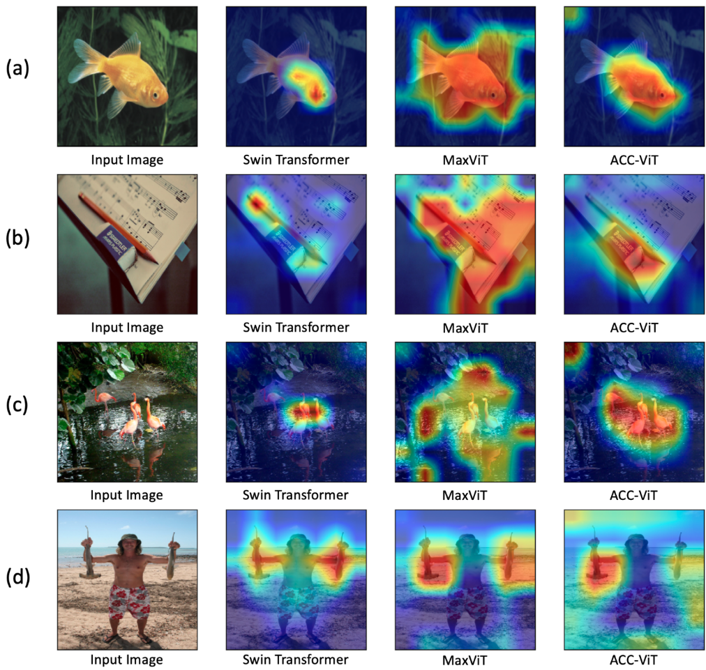

# Fusion of Regional and Sparse Attention in Vision Transformers: Introducing ACC-ViT

*Figure 1: Overview of the ACC-ViT model architecture and its components*

## TLDR

- ACC-ViT introduces a novel "Atrous Attention" mechanism that fuses regional and sparse attention in vision transformers
- Inspired by atrous convolution, it captures both local and global context while preserving hierarchical structure
- Achieves 84% accuracy on ImageNet-1K with fewer parameters than state-of-the-art models like MaxViT
- Demonstrates strong transfer learning capabilities on medical imaging tasks

## Introduction

Vision transformers have revolutionized computer vision tasks, but striking the right balance between local and global context remains challenging. In this blog post, we'll dive into a fascinating new approach called ACC-ViT that aims to solve this problem by fusing regional and sparse attention mechanisms. 

The paper "Fusion of regional and sparse attention in Vision Transformers" by Nabil Ibtehaz, Ning Yan, Masood Mortazavi, and Daisuke Kihara introduces ACC-ViT, a novel vision transformer architecture that draws inspiration from atrous convolution to create a more effective attention mechanism. Let's explore how this approach works and why it's an important development in the field.

## Background: The Evolution of Attention in Vision Transformers

To understand the significance of ACC-ViT, we need to first look at how attention mechanisms in vision transformers have evolved:

1. **Original ViT**: Used global attention, which was computationally expensive and lacked inductive bias for local patterns.

2. **Windowed Attention**: Introduced by Swin Transformer [1], this approach computes attention within local windows, improving efficiency and capturing local context.

3. **Regional Attention**: Further refined windowed attention by considering windows of different sizes at different scales [2,3,4].

4. **Sparse Attention**: Computes a simplified global attention among pixels spread across a sparse grid [5,6,7].

Each of these approaches has its strengths and weaknesses. Regional attention maintains hierarchical information but limits global context, while sparse attention captures global context but sacrifices nested interactions across hierarchies.

## The ACC-ViT Approach: Atrous Attention

The key innovation in ACC-ViT is the introduction of "Atrous Attention," which combines the benefits of both regional and sparse attention. Let's break down how it works:

### 1. Inspiration from Atrous Convolution

Atrous (or dilated) convolution has been widely used in traditional computer vision tasks, particularly in semantic segmentation [8]. It allows for an expanded receptive field without increasing the number of parameters. ACC-ViT adapts this concept to the attention mechanism in transformers.

### 2. How Atrous Attention Works

For an input feature map $x \in \mathbb{R}^{c,h,w}$, where $c$, $h$, and $w$ refer to the number of channels, height, and width respectively, Atrous Attention computes windows at different levels of dilation:

$$x_{atr-k}[c,i,j] = x[c,i+2^k-1,j+2^k-1]$$

Here, $k$ represents the dilation rate, which is chosen as powers of 2 for efficient GPU computation using einops operations [9].

### 3. Multi-level Attention Computation

Atrous Attention applies windowed multi-head self-attention with relative positional embedding [10] on each of the windows computed at different levels of dilation ($x_{atr-k}$) along with the undilated input ($x$).

### 4. Adaptive Fusion of Different Branches

To effectively combine the information from different dilation levels, ACC-ViT uses a lightweight adaptive gating operation:

$$y_{fused} = \sum_{i=1}^{k} g_i \odot y_i$$

Where $g_i$ are gating weight factors computed using a single linear layer coupled with a softmax operation, and $y_i$ are the output branches from different dilation levels.

### 5. Shared MLP Layer

Unlike conventional transformer layers, ACC-ViT applies a shared MLP layer on the fused attention map. This reduces computational complexity and makes learning easier for the model.

## ACC-ViT Architecture

The ACC-ViT architecture (Figure 1) combines the Atrous Attention mechanism with other innovative components:

1. **Convolution Stem**: Downsamples the input image to make self-attention computation feasible.

2. **ACC-ViT Blocks**: Four blocks that stack Atrous Convolution and Attention layers. The number of dilation levels decreases as the image size is reduced through the blocks (3, 2, 1, and 0 levels of Atrous Attention, respectively).

3. **Classification Top**: Uses global average pooling and fully connected layers for final classification.

4. **Atrous Inverted Residual Convolution**: Replaces the standard inverted residual convolution with parallel atrous depthwise separable convolutions at dilation rates of 1, 2, and 3.

## Experimental Results

### ImageNet-1K Classification

ACC-ViT demonstrates impressive performance on the ImageNet-1K dataset:

*Figure 2: ACC-ViT performs competitively against state-of-the-art models on ImageNet-1K*

Key findings:
- ACC-ViT-T achieves ~84% accuracy with fewer than 28.5 million parameters
- Outperforms MaxViT by 0.42% while using 8.4% fewer parameters
- Consistently better performance across different model sizes (tiny, small, base)

### Transfer Learning on Medical Imaging Tasks

To evaluate the transferability of ACC-ViT's learned representations, the authors conducted experiments on three medical imaging datasets:

1. HAM10000: Skin lesion classification (10,015 images, 7 classes)
2. EyePACS: Diabetic retinopathy detection (5,000 images, 5 grades)
3. BUSI: Breast ultrasound classification (1,578 images, 3 classes)

Results show that ACC-ViT outperforms other models (Swin, ConvNeXt, MaxViT) in most metrics, particularly on larger datasets. Some key observations:

- ACC-ViT achieves the highest precision scores consistently across datasets
- For the challenging "mild" class in EyePACS, ACC-ViT's recall is twice that of the second-best method
- On the BUSI dataset, ACC-ViT achieves the highest recall for the critical "malignant" class

These results demonstrate ACC-ViT's strong transfer learning capabilities, especially for medical imaging tasks where precise classification is crucial.

## Model Interpretation

To understand what ACC-ViT learns, the authors applied Grad-CAM [11] visualization:

*Figure 3: Model Interpretation using Grad-CAM*

The visualizations reveal that:
- ACC-ViT focuses on relevant portions of the image more effectively than other models
- It can distinguish between multiple objects in a scene (e.g., focusing only on the hammerhead shark in Figure 3d)
- ACC-ViT captures both local details and global context, aligning with the design goals of Atrous Attention

## Implementation Details

The authors provide some key implementation details that contribute to ACC-ViT's efficiency:

1. **Efficient Dilated Window Generation**: Using einops operations for fast GPU computation of dilated windows.

2. **Adaptive Gating**: A lightweight mechanism to merge features from different dilation levels.

3. **Shared MLP Layer**: Reduces computational complexity while maintaining performance.

4. **Atrous Inverted Residual Convolution**: Parallel atrous convolutions with dilation rates of 1, 2, and 3 for efficient feature extraction.

## Conclusion and Future Directions

ACC-ViT represents a significant step forward in vision transformer design by effectively combining the strengths of regional and sparse attention mechanisms. The Atrous Attention approach allows the model to capture both local and global context while maintaining hierarchical structure, resulting in improved performance across various vision tasks.

Some potential areas for future research based on this work include:

1. Exploring dynamic dilation rates that adapt to different input resolutions or tasks
2. Investigating the applicability of Atrous Attention to other domains, such as natural language processing or multimodal learning
3. Further optimizing the adaptive gating mechanism for even more efficient feature fusion
4. Scaling up ACC-ViT to larger model sizes and evaluating its performance on more diverse datasets and tasks

As vision transformers continue to evolve, approaches like ACC-ViT that balance local and global information processing will likely play a crucial role in pushing the boundaries of computer vision capabilities.

## References

[1] Liu, Z., Lin, Y., Cao, Y., Hu, H., Wei, Y., Zhang, Z., Lin, S., & Guo, B. (2021). Swin Transformer: Hierarchical Vision Transformer using Shifted Windows. arXiv preprint arXiv:2103.14030.

[2] Chu, X., Tian, Z., Wang, Y., Zhang, B., Ren, H., Wei, X., Xia, H., & Shen, C. (2021). Twins: Revisiting the Design of Spatial Attention in Vision Transformers. arXiv preprint arXiv:2104.13840.

[3] Chen, C., Pang, J., Wang, Z., Xiong, Y., Li, X., & Sun, J. (2021). RegionViT: Regional-to-Local Attention for Vision Transformers. arXiv preprint arXiv:2106.02689.

[4] Yang, J., Li, C., Zhang, P., Dai, X., Xiao, B., Yuan, L., & Gao, J. (2021). Focal Self-attention for Local-Global Interactions in Vision Transformers. arXiv preprint arXiv:2107.00641.

[5] Tu, Z., Talebi, H., Zhang, H., Yang, F., Milanfar, P., Bovik, A., & Li, Y. (2022). MaxViT: Multi-Axis Vision Transformer. arXiv preprint arXiv:2204.01697.

[6] Wang, W., Xie, E., Li, X., Fan, D., Song, K., Liang, D., Lu, T., Luo, P., & Shao, L. (2021). CrossFormer: A Versatile Vision Transformer Based on Cross-scale Attention. arXiv preprint arXiv:2108.00154.

[7] Wang, W., Xie, E., Li, X., Fan, D., Song, K., Liang, D., Lu, T., Luo, P., & Shao, L. (2023). CrossFormer++: Towards a Unified Foundation Model for Image and Point Cloud. arXiv preprint arXiv:2303.06371.

[8] Chen, L. C., Papandreou, G., Kokkinos, I., Murphy, K., & Yuille, A. L. (2016). DeepLab: Semantic Image Segmentation with Deep Convolutional Nets, Atrous Convolution, and Fully Connected CRFs. arXiv preprint arXiv:1606.00915.

[9] Rogozhnikov, A. (2022). Einops: Clear and Reliable Tensor Manipulations with Einstein-like Notation. arXiv preprint arXiv:2011.14808.

[10] Shaw, P., Uszkoreit, J., & Vaswani, A. (2018). Self-Attention with Relative Position Representations. arXiv preprint arXiv:1803.02155.

[11] Selvaraju, R. R., Cogswell, M., Das, A., Vedantam, R., Parikh, D., & Batra, D. (2016). Grad-CAM: Visual Explanations from Deep Networks via Gradient-based Localization. arXiv preprint arXiv:1610.02391.

