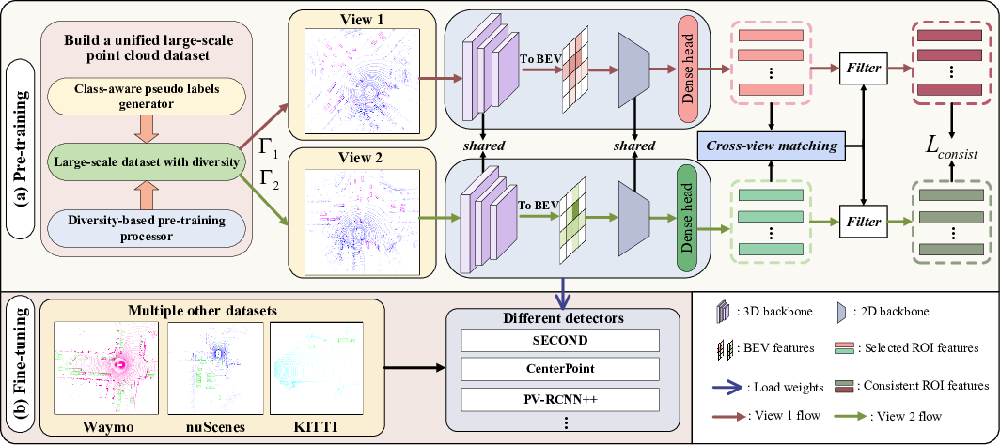
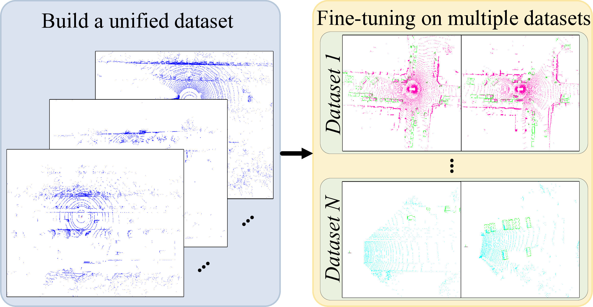

# AD-PT: Autonomous Driving Pre-Training with Large-scale Point Cloud Dataset

*Figure 1: Overview of the proposed AD-PT framework*

## TL;DR
- AD-PT is a novel pre-training paradigm for autonomous driving perception that uses a large-scale, diverse point cloud dataset to learn generalizable representations
- It employs a semi-supervised approach with class-aware pseudo-labeling and data augmentation to create a unified pre-training dataset
- The method introduces an unknown-aware instance learning technique to handle taxonomy differences between pre-training and downstream datasets
- AD-PT achieves significant performance gains on multiple autonomous driving benchmarks like Waymo, nuScenes, and KITTI using a single pre-trained checkpoint

## Introduction

Autonomous driving has seen remarkable progress in recent years, with LiDAR-based 3D object detection playing a crucial role in scene perception. However, current models often struggle to generalize across different domains, such as varying sensor settings or unseen environments. To address this challenge, researchers have begun exploring self-supervised pre-training methods for point cloud data.

In this blog post, we'll dive deep into a groundbreaking approach called AD-PT (Autonomous Driving Pre-Training), introduced by Yuan et al. in their paper "AD-PT: Autonomous Driving Pre-Training with Large-scale Point Cloud Dataset". This method aims to create a truly generalizable pre-trained model that can be applied to various downstream tasks and datasets in the autonomous driving domain.

## The AD-PT Paradigm

### Limitations of Current Approaches

Before we delve into AD-PT, let's consider the limitations of existing self-supervised pre-training (SS-PT) methods:

1. SS-PT typically learns from a single set of unlabeled data to generate representations for the same dataset.
2. Performance is often limited to scenarios where test and pre-training data come from the same distribution.
3. Generalization to different datasets or tasks is challenging.

### The AD-PT Vision

AD-PT takes a fundamentally different approach:

1. It aims to learn unified representations from a large and diverse dataset.
2. The learned features are designed to transfer easily to various downstream tasks.
3. Performance can be continuously improved as the pre-training dataset grows.

*Figure 2: Comparison between previous pre-training paradigms and AD-PT*

## Key Challenges and Solutions

The authors identify two main challenges in achieving effective AD-PT:

1. Building a unified AD dataset with diverse data distribution
2. Learning generalizable representations from such a diverse dataset

Let's explore how they tackle each of these challenges.

### Challenge 1: Building a Unified, Diverse Dataset

To create a large-scale, diverse point cloud dataset, the authors use the ONCE dataset as a starting point. Here's how they approach the data preparation:

#### Class-aware Pseudo Labeling

The ONCE dataset contains a small amount of labeled data (~0.5%) and a large amount of unlabeled data. To leverage this effectively, the authors develop a class-wise pseudo labeling strategy:

1. Use multiple models to annotate different semantic classes
2. Apply semi-supervised methods (e.g., MeanTeacher) to improve accuracy on the ONCE validation set

The pseudo-labeling process involves:

a) Class-aware Pseudo Labeling: Different models are used for different classes based on their strengths (e.g., CenterPoint for pedestrians, PV-RCNN++ for vehicles and cyclists).

b) Semi-supervised Data Labeling: MeanTeacher is employed to further enhance the accuracy of pseudo labels.

c) Pseudo Labeling Threshold: High confidence thresholds are set to avoid false positives (e.g., 0.8 for vehicles, 0.7 for pedestrians and cyclists).

#### Diversity-based Pre-training Processor

To increase data diversity, the authors introduce two key strategies:

1. Point-to-Beam Playback Re-sampling
2. Object Re-scaling

##### Point-to-Beam Playback Re-sampling

This technique aims to create beam-diverse data by using the range image as an intermediate variable. The process involves:

1. Converting point cloud to range image:

   $$r = \sqrt{x^2 + y^2 + z^2}, \quad \theta = \arctan(x/y), \quad \phi = \arcsin(z/r)$$

2. Interpolating or sampling over rows of the range image
3. Converting back to point cloud:

   $$x = r\cos(\phi)\cos(\theta), \quad y = r\cos(\phi)\sin(\theta), \quad z = r\sin(\phi)$$

This approach generates scenes with different point densities, improving scene-level diversity.

##### Object Re-scaling

To address inconsistent object size distributions across datasets, the authors propose an object re-scaling mechanism:

1. Transform points to local coordinate system
2. Apply scaling factor to point coordinates and bounding box size
3. Transform scaled points back to ego-car coordinate system

This technique produces a dataset with more diversified object size distributions, enhancing instance-level point diversity.

### Challenge 2: Learning Unified Representations

The authors identify two main issues when learning representations from the diverse pre-training dataset:

1. Taxonomy differences between pre-training and downstream datasets
2. Tendency of the backbone model to fit the semantic distribution of the pre-training dataset

To address these challenges, they propose:

#### Unknown-aware Instance Learning

This technique aims to activate potential foreground regions that may be important for downstream tasks but are not labeled in the pre-training dataset. The process involves:

1. Using a two-branch head as a committee to discover effective foreground instances
2. Selecting high-scoring region proposals as potential unknown instances
3. Matching corresponding features from different input views
4. Updating matched unknown instances as foreground instances

The unknown-aware instance learning head is formulated as follows:

$$(\hat{\mathbf{F}}^{\Gamma_1}, \hat{\mathbf{F}}^{\Gamma_2}) = \{(\tilde{f}_i^{\Gamma_1}, \tilde{f}_j^{\Gamma_2}) | \sqrt{(c_{i,x}^{\Gamma_1} - c_{j,x}^{\Gamma_2})^2 + (c_{i,y}^{\Gamma_1} - c_{j,y}^{\Gamma_2})^2 + (c_{i,z}^{\Gamma_1} - c_{j,z}^{\Gamma_2})^2} < \tau\}$$

Where $\Gamma_1$ and $\Gamma_2$ represent different augmented views, $\tilde{f}$ are selected features, $(c_x, c_y, c_z)$ are box center coordinates, and $\tau$ is a distance threshold.

#### Consistency Loss

To ensure consistency between corresponding features from different views, a consistency loss is introduced:

$$\mathcal{L}_{consist} = \frac{1}{BK} \sum_{i=1}^B \sum_{j=1}^K (\hat{f}_j^{\Gamma_1} - \hat{f}_j^{\Gamma_2})^2$$

Where $B$ is the batch size and $K$ is the number of corresponding activation features.

The overall loss function combines classification loss, regression loss, and consistency loss:

$$\mathcal{L}_{total} = \mathcal{L}_{cls} + \mathcal{L}_{reg} + \mathcal{L}_{consist}$$

## Implementation Details

The AD-PT framework consists of several key components:

1. Voxel feature extractor
2. 3D backbone with sparse convolution
3. 2D backbone
4. Unknown-aware instance learning head

The input point clouds undergo different data augmentation methods ($\Gamma_1$ and $\Gamma_2$) to create multiple views. The model then processes these views through the various components to generate the final output.

## Experimental Results

The authors conducted extensive experiments to validate the effectiveness of AD-PT across multiple datasets and baseline detectors. Let's look at some key results:

### Waymo Open Dataset

AD-PT consistently outperformed both self-supervised pre-training methods and semi-supervised learning approaches across different detectors (SECOND, CenterPoint, and PV-RCNN++). For example, using PV-RCNN++ as the baseline:

- AD-PT achieved 71.55% / 69.23% L2 AP / APH (Overall)
- This represents a 1.58% / 1.65% improvement over the next best method

### nuScenes Dataset

Despite the significant domain gap, AD-PT showed impressive performance gains on nuScenes:

- Using CenterPoint as the baseline, AD-PT achieved 57.17% mAP and 65.48% NDS
- This surpassed previous state-of-the-art methods like GCC-3D and BEV-MAE

### KITTI Dataset

AD-PT demonstrated strong performance on the smaller KITTI dataset:

- Using PV-RCNN as the baseline, AD-PT achieved 73.01% mAP (Moderate)
- This outperformed other pre-training methods across all difficulty levels

### Ablation Studies

The authors conducted various ablation studies to validate different components of AD-PT:

1. Data Preparation: Both beam re-sampling and object re-scaling contributed to performance improvements
2. Pseudo-labeling Performance: Higher accuracy pseudo labels led to better downstream performance
3. Unknown-aware Instance Learning: The UIL head and consistency loss further boosted perception accuracy

## Conclusion and Future Directions

AD-PT represents a significant step forward in creating generalizable pre-trained models for autonomous driving perception. By leveraging a large-scale, diverse point cloud dataset and introducing novel techniques like unknown-aware instance learning, AD-PT achieves impressive performance gains across multiple benchmarks and baseline detectors.

Some potential areas for future research include:

1. Extending AD-PT to more real-world scenarios and challenging environments
2. Exploring ways to incorporate data from different types of sensors to further improve generalization
3. Investigating the potential of AD-PT for other autonomous driving tasks beyond 3D object detection

As the field of autonomous driving continues to evolve, approaches like AD-PT that focus on generalizability and scalability will play a crucial role in developing robust perception systems capable of handling the diverse and complex scenarios encountered in real-world driving conditions.

## References

1. Yuan, J., Zhang, B., Yan, X., Chen, T., Shi, B., Li, Y., & Qiao, Y. (2023). AD-PT: Autonomous Driving Pre-Training with Large-scale Point Cloud Dataset. [arXiv preprint]

2. Mao, J., Niu, M., Jiang, C., Liang, H., Chen, J., Liang, X., ... & Luo, P. (2021). One Million Scenes for Autonomous Driving: ONCE Dataset. [arXiv preprint arXiv:2106.11037](https://arxiv.org/abs/2106.11037)

3. Sun, P., Kretzschmar, H., Dotiwalla, X., Chouard, A., Patnaik, V., Tsui, P., ... & Anguelov, D. (2020). Scalability in Perception for Autonomous Driving: Waymo Open Dataset. [CVPR 2020](https://openaccess.thecvf.com/content_CVPR_2020/html/Sun_Scalability_in_Perception_for_Autonomous_Driving_Waymo_Open_Dataset_CVPR_2020_paper.html)

4. Caesar, H., Bankiti, V., Lang, A. H., Vora, S., Liong, V. E., Xu, Q., ... & Beijbom, O. (2020). nuScenes: A multimodal dataset for autonomous driving. [CVPR 2020](https://openaccess.thecvf.com/content_CVPR_2020/html/Caesar_nuScenes_A_Multimodal_Dataset_for_Autonomous_Driving_CVPR_2020_paper.html)

5. Geiger, A., Lenz, P., & Urtasun, R. (2012). Are we ready for autonomous driving? The KITTI vision benchmark suite. [CVPR 2012](https://ieeexplore.ieee.org/document/6248074)

6. Shi, S., Jiang, L., Deng, J., Wang, Z., Guo, C., Shi, J., ... & Li, H. (2023). PV-RCNN++: Point-Voxel Feature Set Abstraction With Local Vector Representation for 3D Object Detection. [International Journal of Computer Vision](https://link.springer.com/article/10.1007/s11263-022-01725-2)

7. Yin, T., Zhou, X., & Krahenbuhl, P. (2021). Center-based 3D Object Detection and Tracking. [CVPR 2021](https://openaccess.thecvf.com/content/CVPR2021/html/Yin_Center-Based_3D_Object_Detection_and_Tracking_CVPR_2021_paper.html)

8. Yan, Y., Mao, Y., & Li, B. (2018). SECOND: Sparsely Embedded Convolutional Detection. [Sensors](https://www.mdpi.com/1424-8220/18/10/3337)

For more information and code, visit the [project page](https://jiakangyuan.github.io/AD-PT.github.io/).

