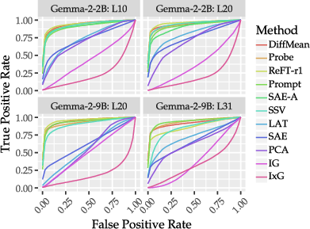
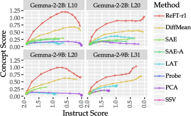

# AxBench: Steering LLMs? Even Simple Baselines Outperform Sparse Autoencoders

## TLDR

- AxBench is a new benchmark for evaluating language model (LM) control methods at scale using synthetic data.
- The benchmark evaluates methods along two axes: concept detection and model steering.
- Surprisingly, simple baselines like prompting and finetuning outperform more complex representation-based steering methods, including sparse autoencoders (SAEs).
- A novel method called Rank-1 Representation Finetuning (ReFT-r1) is introduced, which is competitive with prompting and finetuning while providing interpretability advantages.
- The authors release SAE-scale feature dictionaries for ReFT-r1 and DiffMean, introducing the concept of supervised dictionary learning (SDL).

## Introduction

As language models (LMs) continue to grow in size and capability, the need for fine-grained control over their outputs becomes increasingly important for safety and reliability. While prompting and finetuning are widely used techniques, interpretability researchers have proposed various representation-based methods for steering LMs. These include sparse autoencoders (SAEs), linear artificial tomography, supervised steering vectors, linear probes, and representation finetuning.

However, until now, there has been no comprehensive benchmark for comparing these different approaches. Enter AxBench, a large-scale benchmark for steering and concept detection, introduced by researchers from Stanford University and the Pr(AI)²R Group. In this blog post, we'll dive deep into the AxBench benchmark, its methodology, and the surprising results it uncovered.

## The AxBench Benchmark

AxBench is designed to evaluate LM control methods along two primary axes:

1. **Concept Detection** 🔍: How well can a method identify the presence of specific concepts in model representations?
2. **Model Steering** 🚀: How effectively can a method guide the model's outputs to incorporate desired concepts?

The benchmark uses synthetic data generated from natural language descriptions of concepts. This approach allows for the creation of large-scale datasets that can be used to evaluate both supervised and unsupervised methods.

### Dataset Generation

The process of generating datasets for AxBench is quite ingenious. Here's a breakdown of the steps:

1. **Concept Selection**: The researchers use concept lists from SAEs trained on Gemma models (GemmaScope).
2. **Genre Labeling**: Each concept is assigned a genre (text, code, or math) by prompting an LLM.
3. **Instruction Sampling**: Seed instructions are randomly selected from a pool of instructions matching the concept's genre.
4. **Positive Examples**: The LLM generates responses incorporating the concept for each instruction.
5. **Negative Examples**: Responses are sampled from the target LM without any concept-specific instructions.
6. **Hard Negative Examples**: Contrasting concepts are generated to create challenging evaluation cases.

This process results in two main datasets:

- **Concept500**: 500 concepts with training and evaluation data
- **Concept16K**: A larger dataset with 16K concepts (used for training SAE-scale dictionaries)

### Evaluation Methodology

For concept detection, AxBench uses ROC AUC scores to evaluate how well each method can distinguish between positive and negative examples. For model steering, an LLM judge rates the generated outputs on three criteria:

1. Concept score: How well is the concept incorporated?
2. Instruct score: How relevant is the response to the instruction?
3. Fluency score: How natural and coherent is the text?

These scores are combined using a harmonic mean to produce an overall steering score.

## Methods Evaluated

AxBench evaluates a wide range of methods, including:

1. **Difference-in-means (DiffMean)**: Uses the difference between averaged representations from two classes as a steering vector.

2. **Principal Component Analysis (PCA)**: Uses the first principal component of the positive set of hidden representations.

3. **Linear Artificial Tomography (LAT)**: Searches for a single latent direction that can separate positive examples.

4. **Linear Probe**: Learns to classify tokens as concept-relevant using a linear projection.

5. **Supervised Steering Vector (SSV)**: Directly learns an intervention that maximizes the language-modeling probability of positive responses.

6. **Rank-1 Representation Finetuning (ReFT-r1)**: A novel method introduced in this paper that jointly learns concept detection and steering.

7. **Sparse Autoencoders (SAE)**: Self-supervised method for learning interpretable features.

8. **Gradient-based baselines**: Input × Gradients (I×G) and Integrated Gradients (IG).

9. **Prompting**: Uses an LLM to generate a prompt with few-shot demonstrations.

10. **Finetuning baselines**: Full-parameter supervised finetuning (SFT), Low-rank adaptation (LoRA), and Low-rank representation finetuning (LoReFT).

Let's take a closer look at some of the key methods:

### Difference-in-means (DiffMean)

DiffMean computes a steering vector by taking the difference between the mean representations of positive and negative examples:

$$ \mathbf{w}_{\text{DiffMean}} = \frac{1}{|\mathbf{c}^+|}\sum_{c^+_i \in \mathbf{c}^+}{c^+_i} - \frac{1}{|\mathbf{c}^-|}\sum_{c^-_i \in \mathbf{c}^-}{c^-_i} $$

Where $\mathbf{c}^+$ and $\mathbf{c}^-$ are the concatenated representations of positive and negative examples, respectively.

### Rank-1 Representation Finetuning (ReFT-r1)

ReFT-r1 is a novel method introduced in this paper that combines the training objectives of linear probing and supervised steering. It computes latents for concept detection as:

$$ \Psi_{\text{Detect}}^{\text{ReFT-r1}}(h_i) = \text{ReLU}(h_i \cdot \mathbf{w}_{\text{ReFT-r1}}) $$

And performs a representation-level intervention during training:

$$ \Phi^{\text{ReFT-r1}}(h_i) = h + \frac{1}{|\mathbf{h}|}\sum_{h_i \in \mathbf{h}}{\text{TopK}(\Psi_{\text{Detect}}^{\text{ReFT-r1}}(h_i))} $$

The training objective combines language modeling loss with L1 regularization:

$$ \min_{\mathbf{w}_{\text{ReFT-r1}}}\left\{
-\sum_{t=1}^n{\log P_{\text{LM}}^{\Phi^{\text{ReFT-r1}}}(y_t \mid y_{<t}, \mathbf{x})}
+ \lambda\sum_{\mathclap{a_i \notin \text{TopK}\left(\Psi(\mathbf{h})\right)}}{\lVert a_i \rVert_1}
\right\} $$

### Sparse Autoencoders (SAE)

SAEs learn two dictionary matrices, $\{\mathbf{W}_{\text{enc}}, \mathbf{W}_{\text{dec}}\} \in \mathbb{R}^{d\times z}$, where $z$ is the number of latents. For concept detection, SAEs use:

$$ \Psi_{\text{Detect}}^{\text{SAE}}(h_i) = \sigma\left(h_i \cdot \mathbf{w}_{\text{enc}} + b_{\text{enc}} \right) $$

Where $\sigma$ is an activation function (JumpReLU in this case) and $b_{\text{enc}}$ is a learned bias.

## Results and Analysis

The results of the AxBench evaluation are quite surprising and challenge some common assumptions in the field of LM interpretability. Let's break down the key findings:

### Concept Detection

For concept detection, the top performers were:

1. DiffMean
2. Linear Probe
3. ReFT-r1

Surprisingly, these simple supervised methods significantly outperformed SAEs, which are much more computationally expensive to train. The prompting baseline also performed well, while gradient-based methods (IG and I×G) performed poorly.

### Model Steering

For model steering, the results were even more surprising:

1. Prompting outperformed all other methods, especially on the larger 9B model.
2. Finetuning methods (LoReFT, LoRA, SFT) were competitive with prompting.
3. ReFT-r1 was the only representation-based method competitive with prompting and finetuning.
4. SAEs performed poorly, being outperformed by several simpler methods.

These results challenge the notion that representation-based steering methods are a viable alternative to prompting and finetuning for model control.

## Key Takeaways and Implications

1. **Simple baselines are surprisingly effective**: The strong performance of methods like DiffMean and linear probes suggests that complex, computationally expensive methods like SAEs may not always be necessary for effective model control.

2. **Prompting remains powerful**: Despite the focus on representation-based methods, traditional prompting still outperforms other approaches, especially on larger models.

3. **ReFT-r1 shows promise**: The novel ReFT-r1 method demonstrates that representation-based steering can be competitive with prompting and finetuning while offering interpretability advantages.

4. **SAEs underperform**: The poor performance of SAEs in both concept detection and steering raises questions about their effectiveness as a general-purpose tool for model interpretability and control.

5. **Supervised Dictionary Learning (SDL) as an alternative**: The authors introduce SDL as a potential alternative to SAEs, offering similar scalability with better performance at a lower cost.

## Future Directions

The AxBench benchmark opens up several exciting avenues for future research:

1. **Improving representation-based steering**: While ReFT-r1 shows promise, there's still room for improvement in making these methods competitive with prompting and finetuning across all scenarios.

2. **Investigating SAE limitations**: Further research is needed to understand why SAEs underperform and whether there are ways to improve their effectiveness.

3. **Exploring SDL methods**: The concept of Supervised Dictionary Learning introduced in this paper merits further investigation as a potential alternative to SAEs.

4. **Expanding the benchmark**: As new feature-labeling techniques and steering approaches emerge, AxBench can be extended to include new evaluation tasks.

5. **Bridging the gap between steering and finetuning**: Research into methods that combine the interpretability advantages of steering with the performance of finetuning could yield powerful new approaches to model control.

## Conclusion

The AxBench benchmark provides a much-needed comprehensive evaluation of LM control methods. Its results challenge some prevailing assumptions in the field and highlight the continued effectiveness of simple baselines and traditional prompting approaches. While representation-based steering methods show promise, particularly with the introduction of ReFT-r1, there's still significant work to be done to make them truly competitive with prompting and finetuning across all scenarios.

As language models continue to grow in size and capability, the need for effective, interpretable, and efficient control methods will only increase. AxBench provides a valuable tool for researchers and practitioners to evaluate and compare different approaches, paving the way for more robust and reliable AI systems.

## References

1. Wu, Z., Arora, A., Geiger, A., Wang, Z., Huang, J., Jurafsky, D., Manning, C. D., & Potts, C. (2024). AxBench: Steering LLMs? Even Simple Baselines Outperform Sparse Autoencoders. [arXiv:2404.03592](https://arxiv.org/abs/2404.03592)

2. Lieberum, T., Rajamanoharan, S., Conmy, A., Smith, L., Sonnerat, N., Varma, V., Kramar, J., Dragan, A., Shah, R., & Nanda, N. (2024). Gemma Scope: Open Sparse Autoencoders Everywhere All at Once on Gemma 2. [ACL Anthology](https://aclanthology.org/2024.blackboxnlp-1.19)

3. Templeton, A., Conerly, T., Marcus, J., Lindsey, J., Bricken, T., Chen, B., Pearce, A., Citro, C., Ameisen, E., Jones, A., Cunningham, H., Turner, N. L., McDougall, C., MacDiarmid, M., Freeman, C. D., Sumers, T. R., Rees, E., Batson, J., Jermyn, A., Carter, S., Olah, C., & Henighan, T. (2024). Scaling Monosemanticity: Extracting Interpretable Features from Claude 3 Sonnet. [Transformer Circuits Thread](https://transformer-circuits.pub/2024/scaling-monosemanticity/index.html)

4. Wu, Z., Arora, A., Wang, Z., Geiger, A., Jurafsky, D., Manning, C. D., & Potts, C. (2024). ReFT: Representation Finetuning for Language Models. [arXiv:2404.03592](https://arxiv.org/abs/2404.03592)

5. Marks, S., & Tegmark, M. (2024). The Geometry of Truth: Emergent Linear Structure in Large Language Model Representations of True/False Datasets. [arXiv:2310.06824](https://arxiv.org/abs/2310.06824)

For the full list of references and to explore the AxBench codebase, visit the [GitHub repository](https://github.com/stanfordnlp/axbench).

