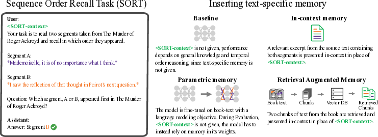
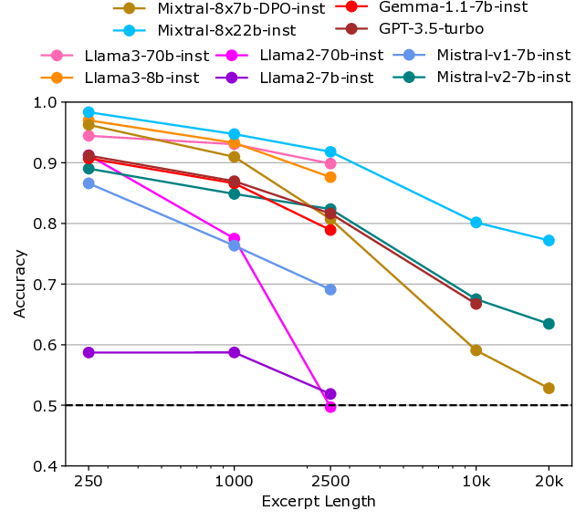
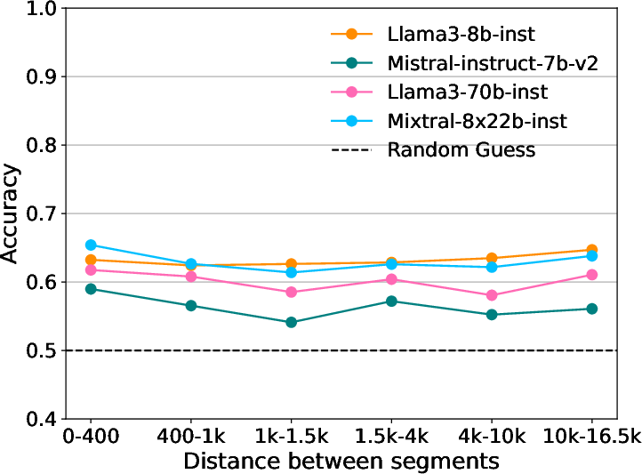
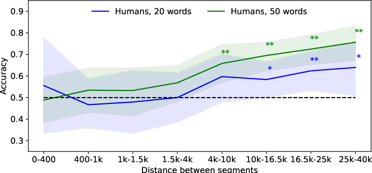

---
title: "Assessing Episodic Memory in Large Language Models with Sequence Order Recall Tasks"
date: 2020-09-15T11:30:03+00:00
# weight: 1
# aliases: ["/first"]
tags: ['episodic memory', 'large language models', 'sequence order recall', 'SORT', 'Book-SORT', 'in-context memory', 'retrieval-augmented generation', 'fine-tuning']
author: "Me"
# author: ["Me", "You"] # multiple authors
showToc: true
TocOpen: true
draft: false
hidemeta: false
comments: false
description: ""
canonicalURL: "https://canonical.url/to/page"
disableHLJS: true # to disable highlightjs
disableShare: false
disableHLJS: false
hideSummary: false
searchHidden: false
ShowReadingTime: true
ShowBreadCrumbs: true
ShowPostNavLinks: true
ShowWordCount: true
ShowRssButtonInSectionTermList: true
UseHugoToc: true
cover:
    image: "<image path/url>" # image path/url
    alt: "<alt text>" # alt text
    caption: "<text>" # display caption under cover
    relative: false # when using page bundles set this to true
    hidden: true # only hide on current single page
editPost:
    URL: "https://github.com/<path_to_repo>/content"
    Text: "Suggest Changes" # edit text
    appendFilePath: true # to append file path to Edit link
---

# Assessing Episodic Memory in Large Language Models with Sequence Order Recall Tasks

*Figure 1: Overview of the Sequence Order Recall Task (SORT) to evaluate how models can access memory of temporal order.*

## TLDR

- This paper introduces SORT (Sequence Order Recall Task), a new benchmark for evaluating episodic memory capabilities in large language models (LLMs)
- SORT tests a model's ability to recall the correct order of text segments from a longer document
- The authors create Book-SORT, a dataset of 36k segment pairs from 9 public domain books
- Human experiments show people can perform SORT based on long-term memory of reading a book
- LLMs perform well on SORT with in-context access to relevant text, but struggle when relying on parametric memory or retrieval-augmented generation
- The results suggest current LLMs lack human-like episodic memory capabilities

## Introduction

As large language models (LLMs) continue to advance, there's growing interest in understanding their memory capabilities. While existing benchmarks focus on evaluating semantic memory and factual knowledge, they don't adequately assess episodic memory - the ability to remember the temporal context and order of experiences. This type of memory is crucial for many cognitive tasks in humans and animals.

In this blog post, we'll dive into a new paper that introduces SORT (Sequence Order Recall Task), a novel benchmark designed to evaluate episodic memory-like capabilities in LLMs. We'll explore the motivation behind SORT, how it works, and what the results reveal about the current state of memory in language models.

## What is SORT?

SORT is inspired by recency judgment tasks used in cognitive psychology to study episodic memory. The core idea is simple but powerful:

1. Present a model with two segments of text from a longer document
2. Ask the model to determine which segment appeared first in the original document

This task requires the model to have some representation of the temporal order and context of the text, mimicking aspects of episodic memory in humans.

Formally, we can define SORT as follows:

Let $\mathbf{X} \in \mathbb{R}^{T \times F}$ be sequential data, where $\mathbf{T}$ is the number of time-steps (e.g., tokens in a text) and $\mathbf{F}$ is the number of features (e.g., vocabulary size). We define start indices $\mathbf{t_{j}}$ and $\mathbf{t_{k}}$ for pairs of segments of length $\mathbf{L} \in \mathbb{N}^+$ in $\mathbf{X}$, such that both $\mathbf{t_j < t_{k}}$ and $\mathbf{t_j+L \leq t_{k}}$. We extract non-overlapping segments from the original sequence $\mathbf{X}$ as $\mathbf{\widetilde{X}_i = X[t_i : t_i + L-1, :]}$.

The order of segments $\mathbf{\widetilde{X}_j}$ and $\mathbf{\widetilde{X}_{k}}$ is randomized, yielding $\mathbf{[\widetilde{X}_A \; \widetilde{X}_B]}$, which is then given as part of a model's input. The task for a model $\mathbf{\mathcal{M}_\theta}$ is to infer whether $\mathbf{t_A < t_B}$, i.e., in SORT, the task of a model is to predict which of two non-overlapping subsequences $\mathbf{\widetilde{X}_A}$ and $\mathbf{\widetilde{X}_B}$ has the lower starting index in $\mathbf{X}$.

## The Book-SORT Dataset

To evaluate SORT, the authors created a dataset called Book-SORT. This dataset consists of 36k pairs of text segments extracted from 9 books that recently entered the public domain. The choice of books as the source material was deliberate:

1. Books provide long, coherent texts that exceed the context windows of most transformer LLMs
2. They enhance memorability for human readers, facilitating human evaluation experiments
3. Using recently public domain books minimizes the risk of contamination in LLM training data

The Book-SORT dataset varies several factors that can affect performance:

1. $L_E$: Length of the text excerpt presented in context (250, 1000, 2500, 10000, 20000 words)
2. $L_S$: Length of the segments from the text (20, 50 words)
3. $D_S$: Distance between the segments in the original text (4 distance bins)

This careful design allows for a nuanced evaluation of how different factors impact performance on SORT.

## Evaluating LLMs on SORT

The authors evaluate several methods for giving LLMs access to the book text:

1. In-context presentation: Providing relevant excerpts from the books in the prompt
2. Fine-tuning: Training the model on the book text with a language modeling objective
3. Retrieval-augmented generation (RAG): Using a separate retrieval model to find relevant passages

For each method, they assess how well the model can perform SORT. The evaluation uses a combination of open-source models (e.g., Llama, Mistral) and closed models (GPT-3.5, GPT-4).

### In-context Memory Results

When given in-context access to relevant excerpts, most models perform well on SORT, achieving accuracies between 77% and 95%. Interestingly, smaller models like Llama3-8b outperform larger models in some cases.

Key findings:

- Performance increases with greater distance between segments
- Performance decreases with increasing excerpt length
- Longer segments (50 words) are handled slightly more effectively than shorter ones (20 words)

*Figure 2: SORT accuracy by excerpt length for different models.*

### Parametric Memory via Fine-tuning

Surprisingly, fine-tuning models on the book text with a language modeling objective did not improve SORT performance. This suggests that current forms of parametric memory in LLMs do not effectively support episodic memory-like capabilities.

### Retrieval-Augmented Generation (RAG)

RAG-based memory led to worse performance than in-context memory, with accuracies between 55% and 67%. This difference likely stems from the fact that standard RAG doesn't necessarily preserve the order of retrieved passages.

*Figure 3: SORT performance based on RAG memory across different segment distances.*

## Human Performance on SORT

To provide a reference point, the authors conducted a human evaluation with 155 participants who had recently finished reading "The Murder of Roger Ackroyd" by Agatha Christie. This experiment assessed long-term memory, as the average time between reading and testing was 7.5 days.

Key findings:

- Humans achieved an average accuracy of 64% for 50-word segments and 56% for 20-word segments
- Performance was higher for pairs of segments with greater distance in the book
- Peak accuracy reached 76% for distances greater than 25,000 words and 50-word segments

*Figure 4: Human long-term memory performance on SORT for different segment lengths and distances between segments.*

## Discussion and Implications

The results of this study have several important implications:

1. **In-context memory is not equivalent to episodic memory**: While in-context memory in LLMs can support sequence order recall, it degrades with increasing context length. This differs from human episodic memory, which can generalize to arbitrarily long sequences.

2. **Current parametric memory doesn't support episodic functions**: The failure of fine-tuning to improve SORT performance suggests that different learning methods or architectures may be needed for functioning parametric forms of episodic memory.

3. **RAG has room for improvement**: The weak performance of vanilla RAG on SORT highlights the need for more sophisticated retrieval methods that preserve temporal context.

4. **Potential for improved LLMs**: Enhancing episodic memory capabilities in LLMs could lead to better continual learning, performance on long-context tasks, and source attribution.

## Future Directions

The introduction of SORT opens up several exciting avenues for future research:

1. Developing new architectures or training methods to support episodic memory in LLMs
2. Extending SORT to other modalities like audio and video
3. Exploring the relationship between episodic memory and other cognitive capabilities in AI systems
4. Investigating how to better preserve and utilize temporal context in retrieval-augmented models

## Conclusion

The SORT benchmark provides a valuable new tool for assessing episodic memory-like capabilities in large language models. By revealing the limitations of current approaches, it paves the way for developing more sophisticated memory mechanisms in AI systems. As we continue to push the boundaries of what's possible with language models, tasks like SORT will be crucial in guiding our progress towards more human-like artificial intelligence.

## References

1. Christie, A. (1927). The Murder of Roger Ackroyd. Cosimo Classics.
2. Davachi, L., & DuBrow, S. (2015). How the hippocampus preserves order: the role of prediction and context. Trends in cognitive sciences, 19(2), 92-99.
3. Eichenbaum, H. (2013). Memory on time. Trends in cognitive sciences, 17(2), 81-88.
4. Howard, M. W., & Kahana, M. J. (2002). A distributed representation of temporal context. Journal of Mathematical Psychology, 46(3), 269-299.
5. Polyn, S. M., Norman, K. A., & Kahana, M. J. (2009). A context maintenance and retrieval model of organizational processes in free recall. Psychological Review, 116(1), 129-156.

