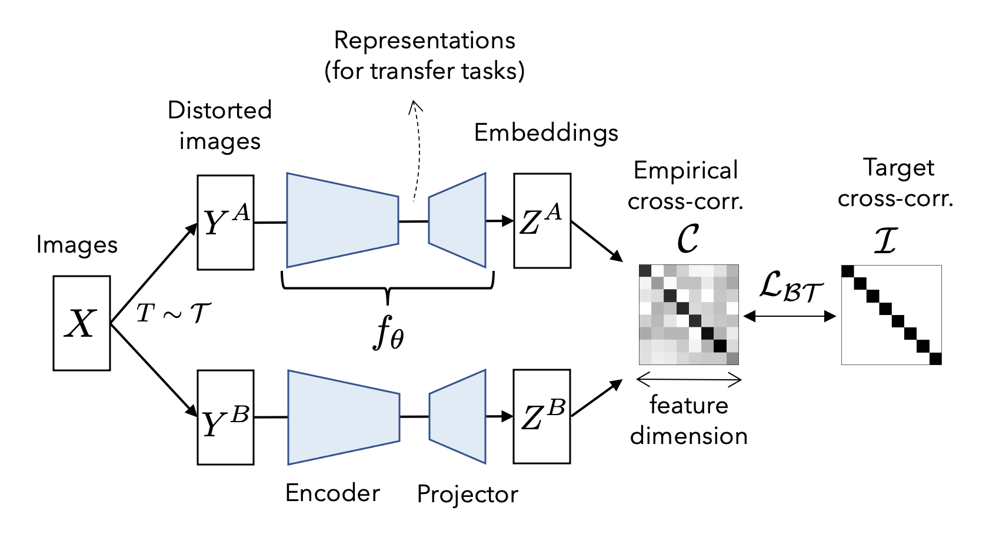

# Barlow Twins: Self-Supervised Learning via Redundancy Reduction

*Figure 1: Overview of the Barlow Twins method. The objective function measures the cross-correlation matrix between the embeddings of two identical networks fed with distorted versions of a batch of samples, and tries to make this matrix close to the identity.*

## TLDR
- Barlow Twins is a new self-supervised learning method that avoids trivial solutions by measuring cross-correlation between twin network outputs
- The objective function encourages the embeddings to be invariant to distortions while reducing redundancy between vector components
- It outperforms previous methods on low-data regime classification and matches state-of-the-art on standard benchmarks
- Key advantages: conceptual simplicity, no need for large batches or asymmetric architectures, benefits from high-dimensional embeddings

## Introduction

Self-supervised learning (SSL) has made remarkable progress in recent years, approaching and sometimes surpassing supervised methods on large-scale computer vision benchmarks. A common approach in SSL is to learn embeddings that are invariant to distortions of the input sample. However, this approach often leads to trivial constant solutions that collapse the embedding space.

In this blog post, we'll dive into a novel SSL method called Barlow Twins, proposed by Jure Zbontar, Li Jing, Ishan Misra, Yann LeCun, and Stéphane Deny in their paper "Barlow Twins: Self-Supervised Learning via Redundancy Reduction". This method takes inspiration from neuroscientist H. Barlow's redundancy-reduction principle and offers a fresh perspective on avoiding trivial solutions in SSL.

## The Barlow Twins Method

### Core Idea

The key insight of Barlow Twins is to measure the cross-correlation matrix between the outputs of two identical networks fed with distorted versions of a sample batch. The objective function then tries to make this matrix as close to the identity matrix as possible. This approach has two main effects:

1. It causes the embedding vectors of distorted versions of a sample to be similar (invariance).
2. It minimizes the redundancy between the components of these vectors (redundancy reduction).

### Mathematical Formulation

Let's break down the Barlow Twins objective function:

$$
\mathcal{L_{BT}} = \underbrace{\sum_i (1-\mathcal{C}_{ii})^2}_\text{invariance term} + \lambda \underbrace{\sum_{i}\sum_{j \neq i} {\mathcal{C}_{ij}}^2}_\text{redundancy reduction term}
$$

Where $\mathcal{C}$ is the cross-correlation matrix computed between the outputs of the two identical networks along the batch dimension:

$$
\mathcal{C}_{ij} = \frac{
\sum_b z^A_{b,i} z^B_{b,j}}
{\sqrt{\sum_b {(z^A_{b,i})}^2} \sqrt{\sum_b {(z^B_{b,j})}^2}}
$$

Here, $b$ indexes batch samples, and $i,j$ index the vector dimensions of the networks' outputs.

The invariance term encourages the diagonal elements of the cross-correlation matrix to be close to 1, making the embedding invariant to the applied distortions. The redundancy reduction term pushes the off-diagonal elements towards 0, decorrelating the different vector components of the embedding.

### Implementation Details

The Barlow Twins method consists of the following key components:

1. **Image Augmentations**: Each input image is transformed twice to produce two distorted views. The augmentation pipeline includes random cropping, resizing, horizontal flipping, color jittering, grayscale conversion, Gaussian blurring, and solarization.

2. **Network Architecture**: The encoder is a ResNet-50 network followed by a projector network with three linear layers, each with 8192 output units. The first two layers of the projector are followed by batch normalization and ReLU activation.

3. **Optimization**: The method uses the LARS optimizer and trains for 1000 epochs with a batch size of 2048. The learning rate starts at 0.2 for weights and 0.0048 for biases and batch normalization parameters, with a warm-up period and cosine decay schedule.

4. **Loss Function**: The trade-off parameter $\lambda$ in the loss function is set to $5 \times 10^{-3}$ after a hyperparameter search.

## Advantages of Barlow Twins

Barlow Twins offers several advantages over existing SSL methods:

1. **Conceptual Simplicity**: The method avoids trivial solutions by construction, without relying on architectural tricks or complex learning dynamics.

2. **No Large Batches Required**: Unlike contrastive methods like SimCLR, Barlow Twins performs well even with small batch sizes (e.g., 256).

3. **No Asymmetry Needed**: The method doesn't require asymmetric twin networks, predictor networks, or special update rules like stop-gradient.

4. **High-Dimensional Embeddings**: Barlow Twins benefits from very high-dimensional output vectors, in contrast to other methods that saturate quickly as dimensionality increases.

## Experimental Results

The authors evaluate Barlow Twins on various benchmarks and transfer learning tasks. Here are some key results:

### ImageNet Linear Evaluation

On the standard linear evaluation protocol for ImageNet, Barlow Twins achieves 73.2% top-1 accuracy, which is competitive with state-of-the-art methods:

| Method | Top-1 Accuracy (%) |
|--------|---------------------|
| SimCLR | 69.3 |
| MoCo v2 | 71.1 |
| SwAV | 75.3 |
| BYOL | 74.3 |
| Barlow Twins | 73.2 |

### Semi-Supervised Learning

In the low-data regime (1% of labeled data), Barlow Twins outperforms other methods:

| Method | Top-1 Accuracy (%) |
|--------|---------------------|
| SimCLR | 48.3 |
| BYOL | 53.2 |
| SwAV | 53.9 |
| Barlow Twins | 55.0 |

### Transfer Learning

Barlow Twins shows competitive performance on various transfer learning tasks, including image classification on Places-205 and VOC07, and object detection on COCO.

## Ablation Studies and Insights

The authors conduct several ablation studies to understand the behavior of Barlow Twins:

1. **Batch Size Robustness**: Unlike SimCLR, Barlow Twins maintains performance even with small batch sizes (e.g., 256).

2. **Projector Network Dimensionality**: The method benefits from very high-dimensional embeddings, with performance continuing to improve beyond 16,000 dimensions.

3. **Loss Function Components**: Both the invariance term and the redundancy reduction term are crucial for good performance.

4. **Symmetry Breaking**: Adding asymmetric components like predictor networks or stop-gradient mechanisms slightly decreases performance, unlike in methods like BYOL or SimSiam.

## Theoretical Connections

The authors draw connections between Barlow Twins and the Information Bottleneck (IB) principle. The IB objective for SSL can be formulated as:

$$
\mathcal{IB_{\theta}} = I(Z_{\theta}, Y) - \beta I(Z_{\theta}, X)
$$

Where $I(.,.)$ denotes mutual information, $Z_{\theta}$ is the learned representation, $Y$ is the distorted input, $X$ is the original input, and $\beta$ is a trade-off parameter.

The authors show that under certain assumptions and approximations, this IB objective can be related to the Barlow Twins loss function. This connection provides a theoretical grounding for the method's effectiveness.

## Conclusion and Future Directions

Barlow Twins presents a novel approach to self-supervised learning that addresses the challenge of trivial solutions through a simple yet effective objective function. By encouraging invariance to distortions while reducing redundancy in the embedding space, the method achieves competitive performance on various benchmarks without the need for large batches or asymmetric architectures.

Future research directions suggested by this work include:

1. Exploring even higher-dimensional embeddings (>16,000) and developing methods to handle the associated memory requirements.
2. Investigating alternative formulations of the redundancy reduction term, such as using the auto-correlation matrix of a single network's embedding.
3. Applying the method to other domains beyond computer vision, such as natural language processing or speech recognition.

Barlow Twins opens up new possibilities in self-supervised learning and provides a fresh perspective on the fundamental principles underlying representation learning. As the field continues to evolve, methods like this that combine simplicity, effectiveness, and theoretical grounding are likely to play a crucial role in advancing our understanding of unsupervised learning.

## References

1. Zbontar, J., Jing, L., Misra, I., LeCun, Y., & Deny, S. (2021). Barlow Twins: Self-Supervised Learning via Redundancy Reduction. arXiv preprint arXiv:2103.03230.

2. Chen, T., Kornblith, S., Norouzi, M., & Hinton, G. (2020). A simple framework for contrastive learning of visual representations. arXiv preprint arXiv:2002.05709.

3. Grill, J. B., Strub, F., Altché, F., Tallec, C., Richemond, P. H., Buchatskaya, E., ... & Valko, M. (2020). Bootstrap your own latent: A new approach to self-supervised learning. arXiv preprint arXiv:2006.07733.

4. Caron, M., Misra, I., Mairal, J., Goyal, P., Bojanowski, P., & Joulin, A. (2020). Unsupervised learning of visual features by contrasting cluster assignments. arXiv preprint arXiv:2006.09882.

5. He, K., Fan, H., Wu, Y., Xie, S., & Girshick, R. (2020). Momentum contrast for unsupervised visual representation learning. In Proceedings of the IEEE/CVF Conference on Computer Vision and Pattern Recognition (pp. 9729-9738).

6. Tishby, N., & Zaslavsky, N. (2015). Deep learning and the information bottleneck principle. In 2015 IEEE Information Theory Workshop (ITW) (pp. 1-5). IEEE.

7. Barlow, H. B. (1961). Possible principles underlying the transformation of sensory messages. Sensory communication, 1(01).

For the full implementation details and code, check out the [Barlow Twins GitHub repository](https://github.com/facebookresearch/barlowtwins).

