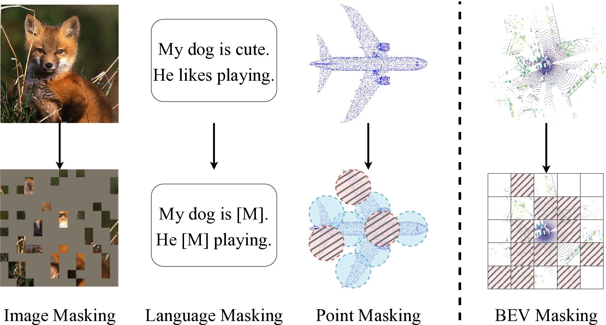
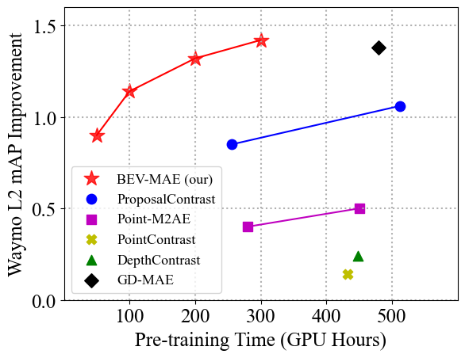
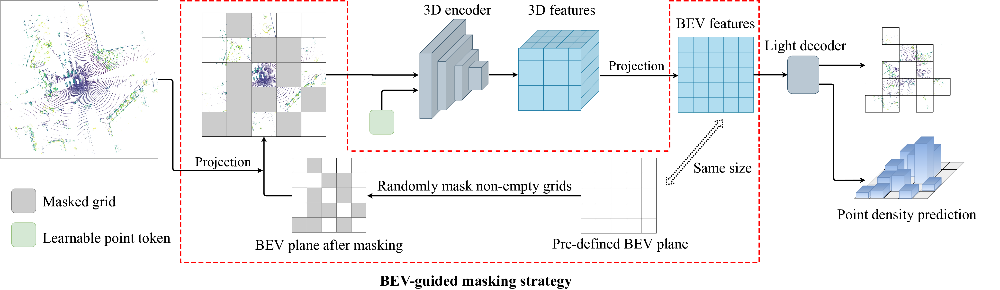

# BEV-MAE: Advancing 3D Object Detection in Autonomous Driving with Self-Supervised Learning

*Figure 1: Illustration of masking strategies in masked modeling. BEV-MAE (right) projects point clouds into a BEV plane and masks points in non-overlapping BEV grids.*

## TL;DR
- BEV-MAE is a self-supervised pre-training framework for LiDAR-based 3D object detection in autonomous driving
- It uses a bird's eye view (BEV) guided masking strategy to learn BEV feature representations efficiently
- A learnable point token maintains consistent receptive field size during pre-training and fine-tuning
- Point density prediction enables learning of location information crucial for object detection
- BEV-MAE outperforms prior self-supervised methods and achieves state-of-the-art results on the nuScenes benchmark

## Introduction

The field of autonomous driving has seen remarkable progress in recent years, with 3D object detection emerging as a critical component for safe and efficient navigation. LiDAR-based 3D object detection methods have shown great promise, but they often rely heavily on large-scale labeled datasets, which can be expensive and time-consuming to create. This is where self-supervised pre-training comes into play, offering a way to leverage vast amounts of unlabeled data and reduce the dependence on extensive annotations.

In this blog post, we'll dive deep into BEV-MAE, a novel self-supervised pre-training framework for LiDAR-based 3D object detection in autonomous driving scenarios. Developed by researchers from Peking University, Chongqing Changan Automobile Co., Ltd, and the University of California, Merced, BEV-MAE introduces several innovative techniques to improve the efficiency and effectiveness of pre-training for 3D object detection.

## The Challenge of Self-Supervised Learning for 3D Object Detection

Before we delve into the specifics of BEV-MAE, it's important to understand the context of self-supervised learning in the domain of 3D object detection for autonomous driving. While masked modeling approaches have shown great success in fields like computer vision and natural language processing, their application to outdoor point cloud data presents unique challenges:

1. Sparsity: Outdoor point clouds are typically much sparser than indoor scenes or dense image data.
2. Scale: Autonomous driving scenarios cover much larger areas than indoor environments.
3. Density variation: The density of points decreases with distance from the LiDAR sensor.
4. Feature representation: Many state-of-the-art 3D object detectors use bird's eye view (BEV) representations, which existing pre-training methods don't directly address.

BEV-MAE tackles these challenges head-on with a set of innovative techniques designed specifically for the autonomous driving context.

## Key Components of BEV-MAE

### 1. BEV-Guided Masking Strategy

The core innovation of BEV-MAE is its BEV-guided masking strategy. Unlike previous approaches that mask random points or voxels, BEV-MAE projects the point cloud onto a BEV plane and masks points in non-overlapping BEV grids. This approach offers two significant advantages:

1. It enforces learning of feature representations in the BEV perspective, aligning with the common practice in 3D object detection.
2. It simplifies the decoder design by matching the resolution of masked grids with BEV features.

The masking process works as follows:

1. Define a grid-shaped BEV plane with size $X \times Y$, matching the resolution of BEV features after encoding.
2. Project each LiDAR point $p_k$ into a corresponding BEV grid $g_{i,j}$ based on its coordinates $(x_{p_k}, y_{p_k})$:

   $$g_{i,j} = \{p_k \mid \lfloor x_{p_k}/d \rfloor = i, \lfloor y_{p_k}/d \rfloor = j\}$$

   where $d$ is the downsample ratio of the 3D encoder.

3. Randomly select a fraction of non-empty BEV grids as masked grids $\{g^m_i\}$, with the remaining grids as visible grids $\{g^v_i\}$.
4. Obtain visible and masked point clouds by merging points in the respective grids:

   $$\{p_k^v\} = \bigcup_i g^v_i, \quad \{p_k^m\} = \bigcup_i g^m_i$$

This masking strategy allows BEV-MAE to achieve impressive pre-training efficiency, as shown in Figure 2:

*Figure 2: Performance improvement vs. Pre-training time trade-off. BEV-MAE achieves superior results with less pre-training time compared to other methods.*

### 2. Learnable Point Token

To address the issue of varying receptive field sizes during pre-training and fine-tuning, BEV-MAE introduces a shared learnable point token. This token replaces the masked points during pre-training, maintaining a consistent receptive field size for the 3D encoder.

The implementation of the learnable point token is straightforward:

1. Use coordinates of full point clouds as input indexes for sparse convolution.
2. Replace the feature of masked point clouds with the shared learnable point token in the first sparse convolution layer.
3. Keep other sparse convolutional layers unchanged.

This approach allows information to pass between unmasked areas without providing additional information, effectively maintaining the challenge of the pre-training task.

### 3. Point Density Prediction

Leveraging the unique properties of outdoor point clouds in autonomous driving scenarios, BEV-MAE introduces point density prediction as an additional pre-training task. This task is motivated by the observation that point clouds become sparser as objects are farther from the LiDAR sensor.

The density prediction task is formulated as follows:

1. For each masked grid $g_i^m$, calculate the density $\hat{\rho_i}$ by dividing the number of points by the occupied volume in 3D space.
2. Use a linear layer to predict the density $\rho_i$.
3. Supervise the task with a Smooth-$\ell_1$ loss:

   $$\mathcal{L}_d^i = \text{Smooth-}\ell_1(\rho_i - \hat{\rho_i})$$

4. Average the loss over all masked grids:

   $$\mathcal{L}_d = \frac{1}{n_m} \sum_{i=1}^{n_m} \mathcal{L}_d^i$$

By incorporating density prediction, BEV-MAE guides the 3D encoder to learn location information, which is crucial for accurate object detection.

## BEV-MAE Architecture and Training

The overall architecture of BEV-MAE is illustrated in Figure 3:

*Figure 3: Overall pipeline of BEV-MAE. The method masks point clouds, replaces masked points with a learnable token, extracts BEV features, and reconstructs masked point clouds while predicting point density.*

The training process of BEV-MAE involves two main tasks:

1. Point Cloud Reconstruction: BEV-MAE predicts a set of 3D points for each masked grid and uses Chamfer Distance as the reconstruction loss:

   $$\mathcal{L}_c^i = \frac{1}{L}\sum_{p_l\in P_i}{\min_{\hat{p_k}\in \hat{P_i}} \lVert p_l-\hat{p_k} \rVert_2^2} + \frac{1}{N}\sum_{\hat{p_k}\in \hat{P_i}}{\min_{p_l\in P_i} \lVert \hat{p_k}-p_l \rVert_2^2}$$

   $$\mathcal{L}_c = \frac{1}{n_m} \sum_{i=1}^{n_m}\mathcal{L}_c^i$$

2. Point Density Prediction: As described earlier, this task predicts the density of points in masked grids.

The combined loss function guides the pre-training process, enabling the 3D encoder to learn rich and transferable feature representations.

## Experimental Results

The authors evaluated BEV-MAE on two popular large-scale autonomous driving datasets: nuScenes and Waymo Open Dataset. Let's look at some of the key findings:

### Waymo Results

On the Waymo dataset, BEV-MAE significantly outperforms both the training-from-scratch baseline and state-of-the-art self-supervised learning methods:

- BEV-MAE achieves 67.02 L2 mAP and 64.55 L2 APH, surpassing the baseline by 1.42 mAP and 1.34 APH.
- It outperforms ProposalContrast by 0.60 mAP and 0.70 APH.
- Notably, BEV-MAE achieves better results with only 20% training data and 7% computation cost compared to ProposalContrast using 100% data for pre-training.

### NuScenes Results

On the nuScenes dataset, BEV-MAE demonstrates its ability to improve state-of-the-art 3D object detectors:

- Applied to TransFusion-L, BEV-MAE achieves 73.6 NDS and 69.6 mAP on the test split.
- This represents an improvement of 1.5 NDS and 1.5 mAP over the TransFusion-L baseline.
- BEV-MAE sets new state-of-the-art results on the nuScenes benchmark.

### Data Efficiency

One of the most impressive aspects of BEV-MAE is its data efficiency. The method shows consistent improvements across different fractions of training data:

- With only 5% labeled data, BEV-MAE surpasses the training-from-scratch baseline by 7.22 mAP and 7.43 APH.
- The performance gains are more significant when less labeled data is available, highlighting BEV-MAE's potential for leveraging large amounts of unlabeled data.

### Transfer Learning

BEV-MAE also demonstrates good cross-dataset transferability:

- Pre-training on a combined dataset (nuScenes + Waymo) and fine-tuning on the target dataset yields the best results.
- This indicates that BEV-MAE can effectively exploit various existing datasets for better pre-training.

## Ablation Studies and Insights

The authors conducted extensive ablation studies to analyze the effectiveness of each component in BEV-MAE. Here are some key insights:

1. Reconstruction Target: Normalized coordinate prediction and density prediction both contribute to improved performance. Combining both tasks yields the best results.

2. Decoder Design: A simple one-layer 3×3 convolution as the decoder achieves the best results with the least training cost, outperforming more complex designs like Transformer blocks or Residual Conv blocks.

3. Masking Strategy: The BEV-guided masking strategy outperforms voxel masking in terms of performance, GPU memory consumption, and training costs.

4. Masking Ratio: BEV-MAE works well within a wide range of masking ratios (50%-80%), with the best results achieved at a 70% masking ratio.

These findings highlight the efficiency and robustness of BEV-MAE's design choices.

## Conclusion and Future Directions

BEV-MAE represents a significant advancement in self-supervised pre-training for LiDAR-based 3D object detection in autonomous driving scenarios. By addressing the unique challenges of outdoor point clouds and aligning the pre-training process with BEV-based detection methods, BEV-MAE achieves state-of-the-art performance while improving data efficiency and pre-training speed.

Some potential future directions for this work include:

1. Exploring multi-modal pre-training: Incorporating camera data alongside LiDAR point clouds could lead to even richer feature representations.
2. Investigating temporal aspects: Extending BEV-MAE to handle sequential point cloud data could improve performance on dynamic object detection and tracking tasks.
3. Scaling to larger datasets: As more unlabeled autonomous driving data becomes available, studying the scaling behavior of BEV-MAE could yield interesting insights.
4. Adapting to other 3D tasks: While focused on object detection, the principles of BEV-MAE could potentially be applied to other tasks like semantic segmentation or motion prediction.

As autonomous driving technology continues to evolve, methods like BEV-MAE that can effectively leverage large amounts of unlabeled data will play a crucial role in improving the safety and reliability of self-driving vehicles. The code for BEV-MAE will be released at [https://github.com/VDIGPKU/BEV-MAE](https://github.com/VDIGPKU/BEV-MAE), enabling further research and development in this exciting field.

## References

1. Caesar, H., et al. (2020). nuScenes: A Multimodal Dataset for Autonomous Driving. In CVPR.
2. Yan, Y., Mao, Y., & Li, B. (2018). SECOND: Sparsely Embedded Convolutional Detection. Sensors.
3. Yin, T., Zhou, X., & Krahenbuhl, P. (2021). Center-based 3d object detection and tracking. In CVPR.
4. He, K., et al. (2022). Masked Autoencoders Are Scalable Vision Learners. In CVPR.
5. Devlin, J., et al. (2019). BERT: Pre-training of Deep Bidirectional Transformers for Language Understanding. In NAACL.
6. Pang, Y., et al. (2022). Masked Autoencoders for Point Cloud Self-supervised Learning. In ECCV.
7. Liang, H., et al. (2021). Exploring Geometry-Aware Contrast and Clustering Harmonization for Self-Supervised 3D Object Detection. In ICCV.
8. Hess, G., et al. (2023). Masked autoencoder for self-supervised pre-training on lidar point clouds. In WACV.
9. Yang, H., et al. (2023). GD-MAE: Generative Decoder for MAE Pre-Training on LiDAR Point Clouds. In CVPR.
10. Tian, X., et al. (2023). GeoMAE: Masked Geometric Target Prediction for Self-Supervised Point Cloud Pre-Training. In CVPR.

