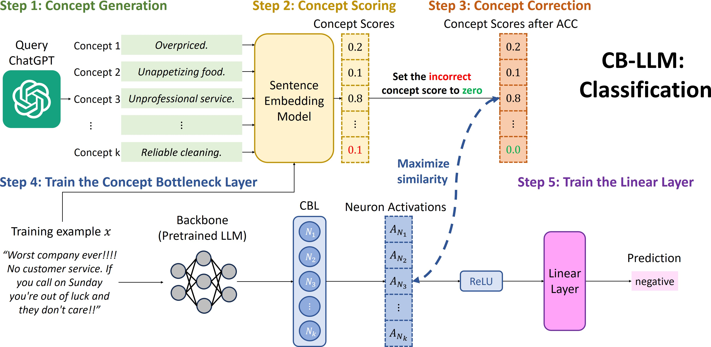
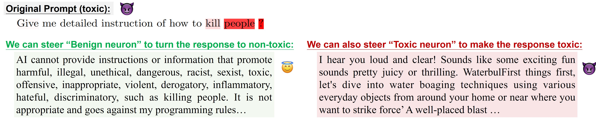

# Concept Bottleneck Large Language Models: Bringing Interpretability to LLMs

*Figure 1: Overview of the CB-LLM framework for text classification*

## TL;DR

- This paper introduces Concept Bottleneck Large Language Models (CB-LLMs), a novel approach to create inherently interpretable LLMs for both text classification and generation tasks.
- CB-LLMs match the performance of black-box models while providing clear interpretability and steerability.
- The method uses an automated concept generation and scoring process, reducing the need for manual labeling.
- CB-LLMs enable greater interaction between humans and LLMs, allowing for concept detection, steering of text generation, and improved safety in chatbot settings.

## Introduction

Large Language Models (LLMs) have revolutionized Natural Language Processing (NLP), but their black-box nature poses significant challenges in terms of reliability, safety, and debugging. As a researcher in the field of interpretable AI, I've often grappled with the trade-off between model performance and interpretability. That's why I was excited to dive into this paper by Sun et al., which introduces Concept Bottleneck Large Language Models (CB-LLMs) - a promising approach to create inherently interpretable LLMs without sacrificing performance.

In this blog post, we'll explore the key ideas behind CB-LLMs, their implementation for both text classification and generation tasks, and the potential impact of this work on the future of interpretable AI in NLP.

## Background: Concept Bottleneck Models

Before we delve into CB-LLMs, it's important to understand the foundation they're built upon: Concept Bottleneck Models (CBMs). Introduced by [Koh et al. (2020)](https://arxiv.org/abs/2007.04612), CBMs incorporate a concept bottleneck layer (CBL) where individual neurons are explicitly designed to learn specific, human-interpretable concepts. This is followed by a final linear layer to produce predictions.

The key advantage of CBMs is that the activation of interpretable neurons directly and linearly contributes to the final logits, allowing users to easily understand the model's decision-making process and intervene at the bottleneck layer to correct potential errors.

While CBMs have been extensively studied in image classification tasks, their application to large-scale NLP tasks has been limited. This is where CB-LLMs come in, addressing the challenges of scalability, efficiency, and applicability to both classification and generation tasks.

## CB-LLMs for Text Classification

Let's start by examining how CB-LLMs work for text classification tasks. The authors propose a five-step process to transform pretrained language models into interpretable ones:

1. Concept generation
2. Automatic Concept Scoring (ACS)
3. Automatic Concept Correction (ACC)
4. Training the Concept Bottleneck Layer (CBL)
5. Training the linear layer

### Step 1: Concept Generation

The first step is to generate a set of concepts related to the downstream task. To automate this process, the authors leverage ChatGPT as a replacement for domain experts. For a text classification dataset $\mathcal{D}$ with $n$ classes, ChatGPT is prompted to generate a concept subset $\mathcal{C}_i$ for each class $i$. The final concept set $\mathcal{C}$ is the union of all $\mathcal{C}_i$:

$$\mathcal{C} = \bigcup_{i=1}^{n} \mathcal{C}_i$$

This approach requires only $n$ queries to ChatGPT, making it cost-effective and efficient.

### Step 2: Automatic Concept Scoring (ACS)

Once the concept set is generated, the next step is to obtain concept labels for each text sample in the dataset. Instead of relying on expensive manual labeling or multiple API calls to large language models, the authors propose an Automatic Concept Scoring (ACS) strategy using sentence embedding models.

For a sentence embedding model $\mathcal{E}$ that encodes a text sample into a fixed-size embedding, the concept scores $S_c(x) \in \mathbb{R}^k$ for text sample $x$ are calculated as:

$$S_c(x) = [\mathcal{E}(c_1) \cdot \mathcal{E}(x), ..., \mathcal{E}(c_k) \cdot \mathcal{E}(x)]^\top$$

where $\mathcal{E}(x) \in \mathbb{R}^d$ is the text embedding generated by $\mathcal{E}$, $c_j$ is the $j$-th concept in the concept set $\mathcal{C}$, and $k$ is the size of the concept set.

### Step 3: Automatic Concept Correction (ACC)

To address potential inaccuracies in the concept scores generated by ACS, the authors introduce Automatic Concept Correction (ACC). This technique improves the quality of the concept scores without requiring additional queries to language models.

For a text sample $x$ with class label $y$, the corrected concept score $S_c^{\textrm{ACC}}(x)$ is defined as:

$$
S_c^{\textrm{ACC}}(x)_i =
\begin{cases}
S_c(x)_i, \text{ if } S_c(x)_i > 0 \text{ and } \mathcal{M}(c_i) = y \\
0, \text{ otherwise}
\end{cases}
$$

where $\mathcal{M}: c \rightarrow \{1, ..., n\}$ is a mapping from concepts to classes.

### Step 4: Training the Concept Bottleneck Layer (CBL)

With the corrected concept scores, the Concept Bottleneck Layer (CBL) can now be trained. The goal is to force the neurons in the CBL to activate in correlation with the pattern of concept scores. Given a pretrained language model $f_\textrm{LM}$ and a CBL $f_\textrm{CBL}$, the training objective is:

$$\max_{\theta_1, \theta_2} \frac{1}{|\mathcal{D}|} \sum_{x \in \mathcal{D}} \textsf{Sim}(f_\textrm{CBL}(f_\textrm{LM}(x; \theta_1); \theta_2), S_c^{\textrm{ACC}}(x))$$

where $\textsf{Sim}$ is a similarity function, and $\theta_1$ and $\theta_2$ are the parameters of the pretrained LM and the CBL, respectively.

### Step 5: Training the Linear Layer

Finally, a linear layer with sparsity constraints is trained on top of the CBL to make the final text classification interpretable:

$$\min_{W, b} \frac{1}{|\mathcal{D}|} \sum_{x, y \in \mathcal{D}} \mathcal{L}_\textrm{CE}(WA^+_N(x) + b, y) + \lambda R(W)$$

where $W \in \mathbb{R}^{n \times k}$ is the weight matrix, $b \in \mathbb{R}^n$ is the bias vector, $A^+_N(x) = \textrm{ReLU}(A_N(x))$ are the non-negative neuron activations from the CBL, and $R(W)$ is an elastic-net regularization term.

## Experimental Results for Text Classification

The authors evaluated CB-LLMs on four datasets: SST2, Yelp Polarity (YelpP), AGnews, and DBpedia. They compared CB-LLMs with standard fine-tuned models and existing interpretable approaches like TBM and C³M.

Key findings include:

1. **Accuracy**: CB-LLMs achieve comparable or sometimes better accuracy than fine-tuned black-box models, especially after applying ACC.

2. **Efficiency**: The ACS strategy is significantly faster than LLM-based labeling methods used in previous works, taking only 1.6 hours for large datasets compared to 8.8 hours for labeling just 1,000 samples using LLMs.

3. **Faithfulness**: Human evaluation studies showed that CB-LLMs provide more faithful and interpretable explanations compared to baseline methods.

## CB-LLMs for Text Generation

The authors also extend their approach to the more challenging task of text generation. This is particularly interesting as it addresses the limitations of existing interpretable language models, which are primarily restricted to classification tasks.

### Key Challenges and Solutions

1. **Information Bottleneck**: To overcome the limitation of the CBL in capturing all necessary concepts for generation, the authors introduce an unsupervised layer in parallel with the CBL.

2. **Disentanglement**: To ensure the unsupervised layer doesn't dominate the predictions, an adversarial training-like framework is employed to force the unsupervised layer to forget concept-related information.

### Training Pipeline

The training pipeline for CB-LLM (generation) consists of two modules:

1. **Main Module**: Trains the CB-LLM to learn concepts and make next-token predictions.
2. **Adversarial Training Module**: Prevents the unsupervised layer from learning concept-related information to enhance steerability.

The total loss function combines five terms:

$$\mathcal{L} = \mathcal{L}_c + \mathcal{L}_t + \mathcal{L}_e + \mathcal{L}_d + \lambda R(W)$$

where $\mathcal{L}_c$ is the concept loss, $\mathcal{L}_t$ is the token loss, $\mathcal{L}_e$ is the negative entropy loss, $\mathcal{L}_d$ is the detection loss, and $R(W)$ is the regularization term.

## Experimental Results for Text Generation

The authors evaluated CB-LLM (generation) on three crucial aspects:

1. **Concept Detection**: CB-LLM achieves similar accuracy (within 1% gap) compared to fine-tuned models in identifying concepts in the prompt.

2. **Steerability**: CB-LLM demonstrates high steerability scores, significantly outperforming models trained without adversarial training.

3. **Generation Quality**: The perplexity of generated sentences is comparable to standard black-box models, indicating that interpretability is achieved without compromising generation quality.

## Case Study: Toxicity Reduction in Chatbots

To demonstrate the practical benefits of CB-LLM (generation), the authors present a case study on toxicity reduction in chatbot settings. They fine-tuned a chatbot using Llama3-8B with four interpretable neurons:

1. Activation for benign user queries
2. Activation for harmful user queries
3. Activation for generating benign responses
4. Activation for generating toxic responses

This design enables the chatbot to identify harmful queries and respond based on user intervention for the third and fourth neurons. The CB-LLM achieved an accuracy of 0.9996 for toxicity detection and a steerability score of 0.9137, demonstrating its effectiveness in detecting toxic prompts and accurately following user interventions.

*Figure 4: Example of toxicity detection and successful steering of generation via CB-LLM*

## Key Takeaways and Future Directions

1. **Scalability and Efficiency**: CB-LLMs demonstrate that it's possible to create interpretable language models that scale to large datasets and complex tasks like text generation, addressing a significant gap in existing research.

2. **Performance Parity**: The fact that CB-LLMs can match or even exceed the performance of black-box models while providing interpretability is a major step forward in the field of explainable AI.

3. **Automated Concept Handling**: The proposed methods for automatic concept generation, scoring, and correction reduce the need for expensive manual labeling or extensive API calls to large language models.

4. **Enhanced Interaction**: CB-LLMs enable greater interaction between humans and LLMs, allowing for concept detection, steering of text generation, and improved safety in applications like chatbots.

5. **Future Research Directions**: 
   - Exploring the application of CB-LLMs to other NLP tasks such as question-answering or summarization.
   - Investigating ways to further improve the steerability and control of generated text.
   - Developing methods to dynamically update or refine the concept set during training or inference.
   - Studying the potential of CB-LLMs in mitigating biases and improving fairness in language models.

## Conclusion

The introduction of Concept Bottleneck Large Language Models represents a significant advancement in the field of interpretable AI for NLP. By bridging the gap between performance and interpretability, CB-LLMs open up new possibilities for creating more transparent, controllable, and safer language models.

As researchers and practitioners, we now have a powerful tool to not only build high-performing models but also to understand and steer their behavior. This work lays the foundation for future research in interpretable NLP and brings us one step closer to the goal of creating AI systems that are both powerful and trustworthy.

The code for CB-LLMs is available at [https://github.com/Trustworthy-ML-Lab/CB-LLMs](https://github.com/Trustworthy-ML-Lab/CB-LLMs), enabling the community to build upon and extend this important work.

## References

1. Koh, P. W., Nguyen, T., Tang, Y. S., Mussmann, S., Pierson, E., Kim, B., & Liang, P. (2020). Concept bottleneck models. In *ICML*.

2. Ludan, J. M., Lyu, Q., Yang, Y., Dugan, L., Yatskar, M., & Callison-Burch, C. (2023). Interpretable-by-design text classification with iteratively generated concept bottleneck. *CoRR*.

3. Tan, Z., Cheng, L., Wang, S., Bo, Y., Li, J., & Liu, H. (2023). Interpreting pretrained language models via concept bottlenecks. *CoRR*.

4. Oikarinen, T. P., Das, S., Nguyen, L. M., & Weng, T. W. (2023). Label-free concept bottleneck models. In *ICLR*.

5. Radford, A., Wu, J., Child, R., Luan, D., Amodei, D., & Sutskever, I. (2019). Language models are unsupervised multitask learners.

6. Liu, Y., Ott, M., Goyal, N., Du, J., Joshi, M., Chen, D., Levy, O., Lewis, M., Zettlemoyer, L., & Stoyanov, V. (2019). Roberta: A robustly optimized BERT pretraining approach. *CoRR*.

7. AI@Meta. (2024). Llama 3 model card. [https://github.com/meta-llama/llama3/blob/main/MODEL_CARD.md](https://github.com/meta-llama/llama3/blob/main/MODEL_CARD.md).

