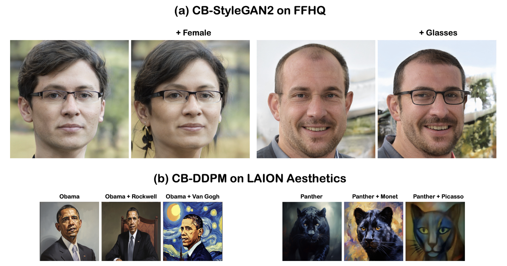
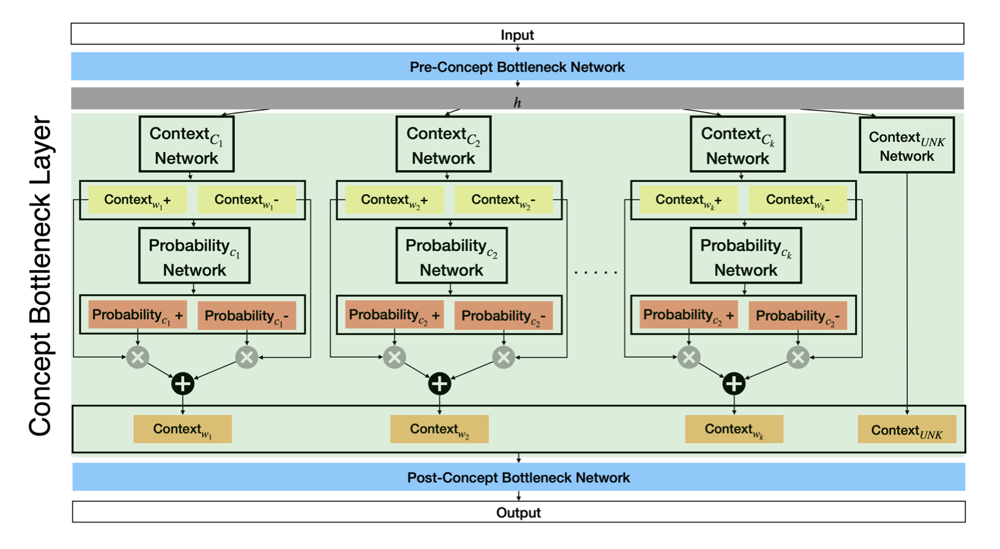
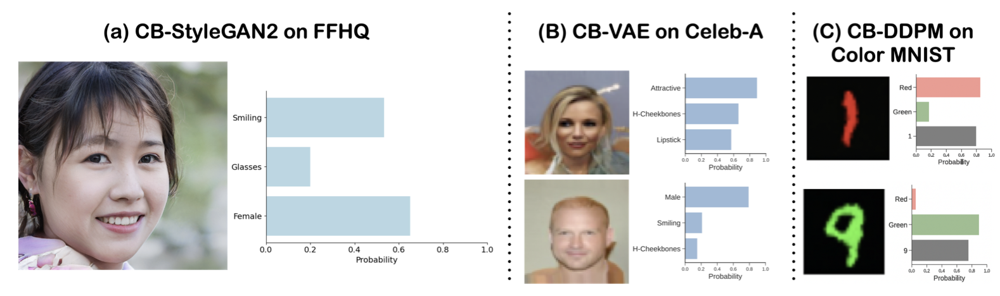

*Figure 1: Concept Bottleneck Generative Models (CBGMs) introduce an interpretable layer into generative AI models, allowing for better understanding and control of the generation process.*

## TLDR (Key Takeaways)

- Concept Bottleneck Generative Models (CBGMs) introduce an interpretable layer into generative AI models, allowing for better understanding and control of the generation process.
- CBGMs can be applied to various types of generative models, including GANs, VAEs, and diffusion models.
- The concept bottleneck layer enables effective steering of generated content, outperforming traditional conditioning methods by up to 10 times in some cases.
- CBGMs provide tools for interpreting and debugging generative models during and after training.
- The approach maintains generation quality while adding interpretability and control.
- CBGMs can scale to high-resolution images and large-scale datasets with hundreds of concepts.

## Introduction

The field of generative AI has seen remarkable progress in recent years, with models capable of producing increasingly realistic images, videos, protein sequences, and even coherent text. However, this advancement comes with a significant challenge: as these models grow more complex, they become increasingly opaque, functioning as "black boxes" that are difficult to interpret or control precisely.

This lack of interpretability poses several problems:

1. It's challenging to debug these models when they produce unexpected or undesired outputs.
2. Fine-grained control over the generation process is limited.
3. It's difficult to ensure that the models are relying on appropriate features or concepts for generation.
4. Ethical concerns arise when we can't fully understand or explain the model's decision-making process.

Enter Concept Bottleneck Generative Models (CBGMs), a novel approach introduced by researchers Aya Abdelsalam Ismail, Julius Adebayo, Héctor Corrada Bravo, Stephen Ra, and Kyunghyun Cho in their paper "Concept Bottleneck Generative Models." This innovative method aims to address these limitations by integrating an interpretable layer—the concept bottleneck layer—into the architecture of generative models.

In this comprehensive blog post, we'll take a deep dive into the workings of CBGMs, exploring their architecture, training process, applications across different types of generative models, and their implications for the future of AI-generated content.

## The Concept Bottleneck Layer: Bridging Interpretability and Generation

The core innovation of CBGMs is the concept bottleneck (CB) layer. This layer serves as an intermediary between the model's internal representations and its outputs, forcing the model to encode information in terms of predefined human-understandable concepts.

### Detailed Architecture of the CB Layer

The CB layer consists of several key components:

1. **Concept Networks**: For each predefined concept (e.g., "smiling" or "hair color" for face generation), there's a dedicated network that maps the model's internal representation to a probability score for that concept.

2. **Unknown Concept Network**: This additional network captures information that isn't covered by the predefined concepts, allowing the model to maintain its generative power while still being interpretable.

3. **Concept Embeddings**: Each concept is represented by two embeddings, one for the active state and one for the inactive state. These embeddings are combined based on the concept probability to form the final representation.

4. **Context Network**: This network maps the input embedding to the concept embeddings.

Let's break down the mathematical formulation of the CB layer:

For each concept $i$:

1. The context network $\phi$ maps the input embedding $h$ to two concept embeddings:
   $w_i^+ = \phi^+(h)$ and $w_i^- = \phi^-(h)$

2. A probability network $\Psi_i$ predicts the probability of the concept being active:
   $\hat{c}_i = \Psi_i([w_i^+, w_i^-]^T) \in [0, 1]$

3. The final context embedding for the concept is a weighted mixture of the two embeddings:
   $w_i = \hat{c}_i w_i^+ + (1 - \hat{c}_i) w_i^-$

The final output of the CB layer is the concatenation of all concept embeddings, including the unknown concept:

$w = [w_1, w_2, ..., w_k, w_{k+1}]$

Where $w_{k+1}$ represents the unknown concept embedding.

*Figure 2: Concept Bottleneck Layer Architecture*

### Integration with Different Generative Models

One of the strengths of the CB layer is its flexibility—it can be integrated into various types of generative models. The authors demonstrate this by adapting the CB layer to three major families of generative models:

1. **Variational Autoencoders (VAEs)**:
   - The CB layer is inserted as the first layer of the decoder.
   - This means that the latent vector produced by the encoder is directly associated with the predefined concepts.

2. **Generative Adversarial Networks (GANs)**:
   - The CB layer's output becomes the input to the generator.
   - The authors use a VAE-GAN hybrid approach, where they first encode the input into a latent vector, then use the CB layer to map this to concept embeddings, which are then used by the generator.

3. **Diffusion Models**:
   - The CB layer is placed after the middle block of the U-Net architecture that is typically used in diffusion models.
   - This allows the concepts to influence the denoising process at a crucial point in the model.

### Training CBGMs

Training CBGMs involves optimizing multiple objectives simultaneously. The authors introduce two additional loss terms on top of the standard task loss for generative models:

1. **Concept Loss ($L_{con}$)**: This ensures that the concept probabilities align with the ground truth concept labels in the training data. It's typically implemented as a binary cross-entropy loss for each concept.

2. **Orthogonality Loss ($L_{orth}$)**: This encourages the unknown concept embedding to be orthogonal to the known concept embeddings, preventing information leakage. It's defined as:

   $L_{orth} = \sum_{j \in B} \frac{\sum_{i=1}^k |\langle w_i, w_{k+1} \rangle|}{\sum_{i=1}^k 1}$

   Where $B$ is the mini-batch size, $\langle \cdot, \cdot \rangle$ is the cosine similarity, and $| \cdot |$ is the absolute value.

The total loss function for training CBGMs is:

$L_{total} = L_{task} + \alpha L_{con} + \beta L_{orth}$

Where:
- $L_{task}$ is the standard task loss for the generative model (e.g., reconstruction loss for VAEs, adversarial loss for GANs, or denoising loss for diffusion models)
- $\alpha$ and $\beta$ are hyperparameters controlling the relative importance of each loss term

The specific $L_{task}$ varies depending on the type of generative model:

- For VAEs: $L_{task,vae} = D_{KL}(q(z_i|x_i) || p(z_i)) - \mathbb{E}[\log p(x_i|z_i^d)]$
- For GANs: $L_{task,gan} = D_{KL}(q(z_i|x_i) || p(z_i)) + \mathbb{E}[\log D(x_i)] + \mathbb{E}[1 - \log D(G(z_i^d))]$
- For Diffusion Models: $L_{task,df} = \sum_{i=1}^T \mathbb{E}[||\mu(x_i^t, t) - \hat{\mu}(x_i^t, x_i^{t=0})||^2]$

The models are trained end-to-end, optimizing all these objectives simultaneously.

## Steering Generative Models with CBGMs

One of the most powerful capabilities of CBGMs is their ability to steer the generative process by intervening on specific concepts. This allows for fine-grained control over the generated output, addressing a long-standing challenge in generative AI.

### How Steering Works

To steer the output of a CBGM, we can intervene on the concept probability vector. This process involves:

1. Generating an initial concept probability vector $\hat{c}$.
2. Modifying specific elements of this vector to create a new vector $\bar{c}$, where the modified elements correspond to the concepts we want to control.
3. Using this modified vector to compute the final context embedding:

   $w_i = \bar{c}_i w_i^+ + (1 - \bar{c}_i) w_i^-$

4. Passing this modified embedding through the rest of the model to generate the output.

This process allows us to "turn on" or "turn off" specific concepts in the generated output, or even control the strength of a concept by setting its probability to intermediate values.

### Experimental Results

The authors conducted extensive experiments to evaluate the steering capabilities of CBGMs compared to traditional conditioning methods. They considered three regimes:

1. **Small balanced concepts regime**: Using a subset of 8-10 balanced concepts from datasets like CelebA and CUB.
2. **Large unbalanced concepts regime**: Using all 40 concepts from CelebA, regardless of their distribution in the dataset.
3. **Scaling to high-resolution images and large concept sets**: Using the FFHQ dataset at 1024x1024 resolution and a subset of LAION with 155 concepts.

Key findings include:

1. CBGMs consistently outperformed baselines in steering accuracy across different datasets and model types. For example, on CelebA with 8 concepts:
   - CB-GAN achieved 25.6% average steering accuracy
   - ACGAN achieved 9.2%
   - CGAN achieved 8.7%

2. The performance gap between CBGMs and baselines widened as the number of concepts increased. On CelebA with 40 concepts:
   - CB-GAN maintained 23.1% average steering accuracy
   - ACGAN dropped to 1.2%
   - CGAN dropped to 2.9%

3. CBGMs could effectively control multiple concepts simultaneously, a challenging task for traditional methods.

4. The steering capability scaled well to high-resolution images and large concept sets, as demonstrated with StyleGAN2 on FFHQ and diffusion models on LAION.

*Figure 3: Samples from different CB models with their top 3 concept probabilities to interpret generated outputs.*

## Interpreting and Debugging Generative Models

Beyond steering, CBGMs offer powerful tools for interpreting and debugging generative models, addressing a long-standing challenge in the field.

### Interpreting Generated Outputs

The concept probability vector produced by the CB layer provides insight into which concepts the model deemed most important for a given output. This allows us to understand why the model generated a particular image or sequence.

For instance, when generating a face image, we can examine the concept probabilities to see which attributes (e.g., "male", "smiling", "blonde hair") had the highest scores, giving us a clear picture of the model's decision-making process.

### Debugging During Training

CBGMs enable real-time debugging during the training process. By monitoring the concept loss on a validation set, we can track how well the model is learning to encode each concept. This allows us to:

1. Identify concepts that the model struggles to learn.
2. Detect potential issues with the training data or model architecture.
3. Make informed decisions about adjusting the training process or model design.

The authors demonstrate this by training models on datasets with intentionally corrupted concept labels. They show that by examining the concept loss trajectories, they could easily distinguish between models trained on correct and corrupted data.

### Post-Training Debugging

After training, we can use the concept probability histograms to diagnose issues with the model. Some techniques include:

1. Examining the distribution of concept probabilities across a large set of generated samples.
2. Comparing the concept probability distributions between the generated samples and the training data.
3. Analyzing the correlation between different concept probabilities to detect unexpected relationships.

The authors show how these techniques can be used to identify models trained on corrupted data, even after training is complete.

## Scaling to Complex Datasets and Architectures

One of the most impressive aspects of CBGMs is their ability to scale to complex, high-dimensional datasets and state-of-the-art architectures. The authors demonstrated this by applying CBGMs to:

1. **StyleGAN2 on FFHQ**: 
   - They integrated a CB layer into the StyleGAN2 architecture.
   - Trained on the Flickr-Faces-HQ (FFHQ) dataset at 1024x1024 resolution.
   - The CB layer was inserted after the mapping network, allowing all layers in the synthesis network to take the concept embedding as input.
   - Results showed high-quality image generation while maintaining fine-grained control over facial attributes.

2. **Diffusion Models on LAION**: 
   - They trained a CB-diffusion model on a curated subset of the LAION dataset.
   - The dataset was annotated with 155 concepts spanning artistic styles, celebrities, and fictional characters.
   - They used a two-stage training strategy:
     a. First training on the curated dataset.
     b. Then fine-tuning on a collection of samples obtained via a specific data processing strategy.
   - This demonstrated the scalability of CBGMs to large-scale, diverse datasets with many concepts.

In both cases, the CB layer did not significantly impact the generation quality, as measured by Fréchet Inception Distance (FID) scores. For example:

- On CelebA 64x64:
  - StyleGAN2: FID 9.0
  - CB-StyleGAN2: FID 9.1
  - Diffusion Model: FID 9.1
  - CB-Diffusion: FID 9.3

This shows that the added interpretability and control come at minimal cost to generation quality.

## Technical Challenges and Solutions

The authors encountered and addressed several technical challenges in developing CBGMs:

1. **Incomplete Concept Sets**: Recognizing that predefined concepts might not capture all relevant information for generation, they introduced the unknown concept embedding. This allows the model to capture information not covered by the predefined concepts.

2. **Concept Leakage**: To prevent known concepts from leaking into the unknown concept embedding, they introduced the orthogonality loss.

3. **Scaling to Many Concepts**: Traditional conditioning methods often struggle as the number of concepts increases. CBGMs maintain performance even with large concept sets, as demonstrated in the LAION experiments.

4. **Continuous and Categorical Concepts**: The authors extended the CB layer to handle both binary and continuous concepts, as well as categorical concepts with more than two classes.

5. **Integration with Different Architectures**: The authors had to carefully consider where to place the CB layer in different model architectures to maximize its effectiveness without disrupting the model's core functioning.

## Ablation Studies and Sensitivity Analysis

The authors conducted several ablation studies to understand the importance of different components of CBGMs:

1. **Effect of Concept Loss**: Removing the concept loss led to a 15% decrease in steering accuracy, highlighting its crucial role.

2. **Importance of Orthogonality Loss**: Removing this loss resulted in a 5.7% decrease in steering accuracy.

3. **Role of Unknown Concept Embedding**: Removing this led to a 9.1% decrease in steering accuracy and a significant degradation in image quality (FID increased to 44.1), underscoring its importance in maintaining generation quality.

4. **Concept Annotation Requirements**: The authors found that CBGMs could achieve good performance even with partial concept annotations, reaching full performance with about 20% of the training data annotated.

These studies provide valuable insights into the relative importance of different components of the CBGM framework and guide future improvements.

## Implications and Future Directions

The introduction of Concept Bottleneck Generative Models represents a significant step towards more interpretable and controllable AI systems. Some potential implications and future directions include:

1. **Ethical AI Development**: CBGMs could help identify and mitigate biases in generative models by making it easier to understand which concepts contribute to outputs. For instance, if a face generation model is found to consistently associate certain concepts with particular ethnicities or genders, this bias can be more easily detected and addressed.

2. **Creative Tools**: The fine-grained control offered by CBGMs could lead to more powerful tools for artists and designers, allowing them to precisely manipulate AI-generated content. Imagine a tool where artists could adjust sliders for different artistic styles or attributes, seeing real-time changes in the generated images.

3. **Scientific Applications**: In fields like drug discovery or materials science, CBGMs could help researchers understand and guide the generative process more effectively. For example, in protein design, scientists could steer the generation process towards proteins with specific properties by manipulating relevant concepts.

4. **Improved Debugging**: The interpretability offered by CBGMs could accelerate the development and refinement of generative models by making it easier to identify and fix issues. This could lead to faster iteration cycles and more robust models.

5. **Hybrid Human-AI Systems**: The ability to intervene on specific concepts could enable more seamless collaboration between humans and AI in creative tasks. A human could provide high-level conceptual guidance, while the AI handles the low-level details of generation.

6. **Educational Tools**: CBGMs could be used to create interactive educational tools that help students understand complex concepts. For instance, a CBGM trained on historical artwork could allow students to explore how different artistic elements contribute to various styles.

7. **Regulatory Compliance**: As AI regulations evolve, the interpretability of CBGMs could help companies demonstrate compliance with transparency requirements, especially in sensitive applications like healthcare or finance.

8. **Cross-modal Applications**: While the current work focuses on image generation, the concept bottleneck approach could potentially be extended to other modalities like text, audio, or even multi-modal generation.

## Limitations and Open Challenges

While CBGMs offer significant advantages, it's important to acknowledge their limitations and the challenges that remain:

1. **Concept Definition**: The performance of CBGMs relies heavily on the choice and definition of concepts. Determining an appropriate set of concepts for a given domain can be challenging and may require domain expertise.

2. **Annotation Requirements**: Although the authors showed that CBGMs can work with partial annotations, obtaining concept-level annotations for large datasets can still be time-consuming and expensive.

3. **Scalability to Very Large Concept Sets**: While CBGMs have been shown to work well with hundreds of concepts, it remains to be seen how they perform with thousands or tens of thousands of concepts.

4. **Computational Overhead**: The addition of the concept bottleneck layer and associated loss terms may increase computational requirements during training and inference.

5. **Handling Abstract Concepts**: Some concepts, particularly in domains like natural language, can be abstract and difficult to define precisely. It's not clear how well CBGMs would handle such concepts.

6. **Potential for Misuse**: The ability to finely control generated content could potentially be misused to create misleading or manipulated media.

7. **Interdependence of Concepts**: In many domains, concepts are not truly independent. Managing the interactions between related concepts remains a challenge.

## Comparison with Other Interpretability Approaches

It's worth considering how CBGMs compare to other approaches for interpretable AI:

1. **Post-hoc Interpretation Methods**: Unlike methods that attempt to explain a model's decisions after the fact, CBGMs build interpretability into the model architecture itself, potentially offering more reliable and fine-grained control.

2. **Disentangled Representations**: While some methods aim to learn disentangled representations without supervision, CBGMs use explicit concept supervision, which can lead to more interpretable and controllable representations.

3. **Concept Activation Vectors (CAVs)**: CBGMs can be seen as an extension of the CAV idea to generative models, with the added benefit of allowing for intervention and control.

4. **Attention Mechanisms**: While attention mechanisms in models like transformers offer some level of interpretability, CBGMs provide a more explicit and human-understandable concept-based interpretation.

## Practical Considerations for Implementing CBGMs

For researchers and practitioners interested in implementing CBGMs, here are some practical considerations:

1. **Concept Selection**: Carefully choose concepts that are relevant to your domain and task. Consider consulting domain experts if necessary.

2. **Data Annotation**: Develop an efficient strategy for annotating your dataset with concept labels. Consider using semi-supervised learning techniques or active learning to reduce the annotation burden.

3. **Architecture Design**: Carefully consider where to place the concept bottleneck layer in your model architecture for maximum effectiveness.

4. **Hyperparameter Tuning**: Pay attention to the relative weights of the concept loss and orthogonality loss (α and β in the total loss function). These may need to be tuned for optimal performance.

5. **Evaluation Metrics**: In addition to standard generative model metrics like FID, consider developing task-specific metrics to evaluate concept accuracy and steering effectiveness.

6. **Interpretability Tools**: Develop visualization tools to help interpret the concept probabilities and their relationship to generated outputs.

## Conclusion

Concept Bottleneck Generative Models represent a significant advance in the field of interpretable and controllable AI. By introducing an explicit concept bottleneck layer, CBGMs offer a way to bridge the gap between the complex internal representations of generative models and human-understandable concepts.

The key innovations of CBGMs include:

1. A flexible architecture that can be adapted to various types of generative models.
2. The ability to steer generation by intervening on specific concepts.
3. Tools for interpreting and debugging generative models during and after training.
4. Scalability to high-resolution images and large concept sets.

While challenges remain, particularly in concept definition and data annotation, the potential applications of CBGMs are vast and exciting. From enhancing creative tools to improving scientific research and enabling more transparent AI systems, CBGMs open up new possibilities for human-AI collaboration and understanding.

As the field of AI continues to advance, approaches like CBGMs that prioritize interpretability and control will likely play a crucial role in developing more reliable, ethical, and user-friendly AI systems. The work on CBGMs lays a foundation for future research into interpretable generative AI, potentially leading to a new generation of AI models that are not only powerful but also transparent and easily controllable.

## References

1. Ismail, A. A., Adebayo, J., Corrada Bravo, H., Ra, S., & Cho, K. (2024). Concept Bottleneck Generative Models. International Conference on Learning Representations (ICLR).

2. Karras, T., Laine, S., Aittala, M., Hellsten, J., Lehtinen, J., & Aila, T. (2020). Analyzing and improving the image quality of stylegan. In Proceedings of the IEEE/CVF Conference on Computer Vision and Pattern Recognition (pp. 8110-8119).

3. Schuhmann, C., Vencu, R., Beaumont, R., Kaczmarczyk, R., Mullis, C., Katta, A., ... & Bethge, M. (2022). LAION-5B: An open large-scale dataset for training next generation image-text models. Advances in Neural Information Processing Systems, 35, 25278-25294.

4. Ho, J., Jain, A., & Abbeel, P. (2020). Denoising diffusion probabilistic models. Advances in Neural Information Processing Systems, 33, 6840-6851.

5. Koh, P. W., Nguyen, T., Tang, Y. S., Mussmann, S., Pierson, E., Kim, B., & Liang, P. (2020). Concept bottleneck models. In International Conference on Machine Learning (pp. 5338-5348). PMLR.

6. Kim, B., Wattenberg, M., Gilmer, J., Cai, C., Wexler, J., Viegas, F., & Sayres, R. (2018). Interpretability beyond feature attribution: Quantitative testing with concept activation vectors (tcav). In International conference on machine learning (pp. 2668-2677). PMLR.

7. Locatello, F., Bauer, S., Lucic, M., Raetsch, G., Gelly, S., Schölkopf, B., & Bachem, O. (2019). Challenging common assumptions in the unsupervised learning of disentangled representations. In International conference on machine learning (pp. 4114-4124). PMLR.

8. Higgins, I., Matthey, L., Pal, A., Burgess, C., Glorot, X., Botvinick, M., ... & Lerchner, A. (2017). beta-VAE: Learning basic visual concepts with a constrained variational framework. In International Conference on Learning Representations.

---