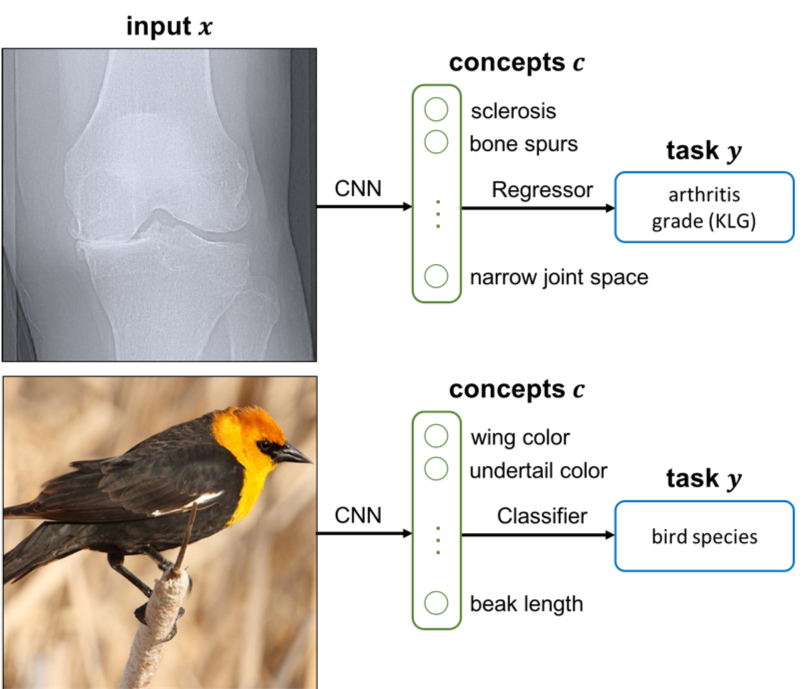
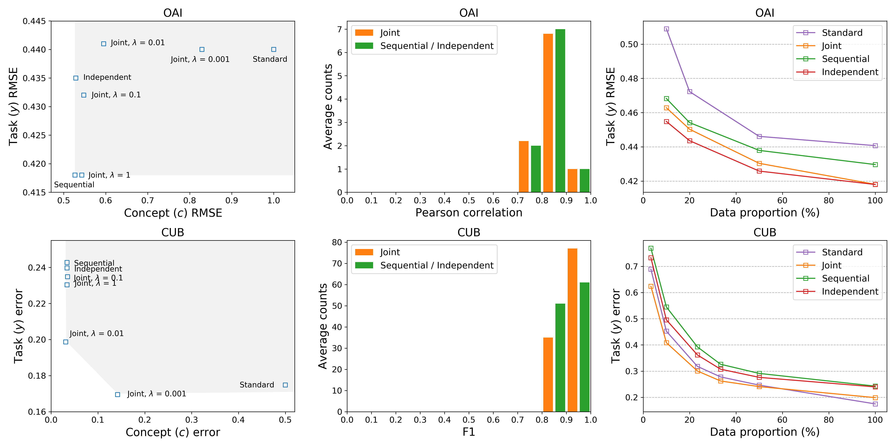

# Concept Bottleneck Models: Bridging Interpretability and Performance in Deep Learning

*Figure 1: Overview of concept bottleneck models for knee x-ray grading and bird identification tasks*

## TLDR

- Concept bottleneck models predict human-specified concepts as an intermediate step before making final predictions
- These models achieve competitive accuracy while enabling interpretation and intervention using high-level concepts
- Test-time interventions on predicted concepts can significantly improve model accuracy
- Concept bottleneck models can be more robust to certain distribution shifts compared to standard end-to-end models

## Introduction

As machine learning models become increasingly complex and are deployed in high-stakes domains like healthcare, there is a growing need for models that are not just accurate, but also interpretable and amenable to human intervention. Standard end-to-end deep learning models, while highly accurate, often operate as black boxes - it's difficult to understand their internal reasoning or intervene in their decision-making process using human-understandable concepts.

In this blog post, we'll dive into an exciting approach called "concept bottleneck models" proposed by Koh et al. in their paper "Concept Bottleneck Models" [1]. These models aim to bridge the gap between interpretability and performance by incorporating human-specified concepts as an intermediate step in the prediction pipeline.

## What are Concept Bottleneck Models?

Concept bottleneck models take a simple yet powerful approach: they first predict a set of human-specified concepts from the input, and then use those predicted concepts to make the final prediction. For example, in a knee osteoarthritis grading task:

1. Input: X-ray image
2. Predict concepts: Joint space narrowing, bone spurs, etc.
3. Use predicted concepts to determine arthritis severity

This approach contrasts with standard end-to-end models that directly map inputs to outputs without an explicit concept prediction step.

Mathematically, we can express a concept bottleneck model as:

$$\hat{y} = f(g(x))$$

where:
- $x$ is the input
- $g(x)$ predicts concepts $\hat{c}$ from the input
- $f(\hat{c})$ predicts the final output $\hat{y}$ using only the predicted concepts

The key idea is that the intermediate layer $\hat{c}$ is trained to align with human-specified concepts, enabling interpretation and intervention at the concept level.

## Why are Concept Bottleneck Models Useful?

Concept bottleneck models offer several key advantages:

1. **Interpretability**: By predicting human-understandable concepts as an intermediate step, these models allow us to reason about their decision-making process using high-level concepts that domain experts are familiar with.

2. **Intervention**: We can intervene on the predicted concepts and observe how changes propagate to the final prediction. This enables counterfactual reasoning like "If the model didn't think there was a bone spur, would it still predict severe arthritis?"

3. **Human-AI Collaboration**: Domain experts can correct model mistakes on concepts at test time, potentially improving overall accuracy beyond what either the human or AI could achieve alone.

4. **Robustness**: In some cases, concept bottleneck models can be more robust to certain types of distribution shifts compared to standard end-to-end models.

## Model Architecture and Training

The authors propose a straightforward method to convert any end-to-end neural network into a concept bottleneck model:

1. Resize one of the layers to match the number of concepts $k$
2. Add an intermediate loss that encourages neurons in that layer to align component-wise with the provided concepts

They explore three main training approaches:

1. **Independent**: Train $g(x)$ and $f(c)$ separately
   $$\hat{g} = \argmin_{g} \sum_{i,j} L_{C_j}(g_j(x^{(i)}); c_j^{(i)})$$
   $$\hat{f} = \argmin_{f} \sum_i L_Y(f(c^{(i)}); y^{(i)})$$

2. **Sequential**: First train $g(x)$, then train $f(\hat{c})$ using predicted concepts
   $$\hat{f} = \argmin_{f} \sum_i L_Y(f(\hat{g}(x^{(i)})); y^{(i)})$$

3. **Joint**: Train both parts together with a weighted loss
   $$\hat{f}, \hat{g} = \argmin_{f,g} \sum_i \bigl[ L_Y(f(g(x^{(i)})); y^{(i)}) + \sum_j \lambda L_{C_j}(g(x^{(i)}); c^{(i)}) \bigr]$$

Where $L_{C_j}$ is the loss for predicting the $j$-th concept, $L_Y$ is the loss for the final prediction, and $\lambda$ controls the trade-off between concept accuracy and task performance in the joint training approach.

## Experimental Setup

The authors evaluate concept bottleneck models on two main tasks:

1. **Knee Osteoarthritis Grading (OAI Dataset)**
   - Input: Knee X-ray images
   - Concepts: 10 clinical features (e.g., joint space narrowing, bone spurs)
   - Target: Kellgren-Lawrence Grade (KLG) for arthritis severity

2. **Bird Species Identification (CUB Dataset)**
   - Input: Bird photographs
   - Concepts: 112 binary attributes (e.g., wing color, beak shape)
   - Target: Bird species (200 classes)

For each task, they compare concept bottleneck models (independent, sequential, and joint) against standard end-to-end models without an explicit concept bottleneck.

## Results and Analysis

### Task Accuracy

One of the most striking findings is that concept bottleneck models achieve competitive or even superior task accuracy compared to standard end-to-end models:

| Model | OAI (RMSE) | CUB (Error Rate) |
|-------|------------|-------------------|
| Independent | 0.435 ± 0.024 | 0.240 ± 0.012 |
| Sequential | 0.418 ± 0.004 | 0.243 ± 0.006 |
| Joint | 0.418 ± 0.004 | 0.199 ± 0.006 |
| Standard | 0.441 ± 0.006 | 0.175 ± 0.008 |

On the OAI dataset, joint and sequential bottleneck models outperform the standard model in terms of RMSE. On CUB, while the standard model has a slight edge, the joint bottleneck model comes very close in performance.

### Concept Accuracy

Crucially, concept bottleneck models also achieve high concept prediction accuracy:

| Model | OAI (RMSE) | CUB (Error Rate) |
|-------|------------|-------------------|
| Independent | 0.529 ± 0.004 | 0.034 ± 0.002 |
| Sequential | 0.527 ± 0.004 | 0.034 ± 0.002 |
| Joint | 0.543 ± 0.014 | 0.031 ± 0.000 |

This high concept accuracy is essential for meaningful interpretation and intervention at the concept level.

### Data Efficiency

An interesting finding is that concept bottleneck models can be more data-efficient than standard models, especially on the OAI dataset:

*Figure 2: Data efficiency curves showing task accuracy vs. training set size*

On OAI, the sequential bottleneck model achieves similar performance to the standard model using only about 25% of the full dataset. This suggests that incorporating prior knowledge in the form of concepts can lead to more sample-efficient learning.

### Test-Time Intervention

One of the most exciting capabilities of concept bottleneck models is test-time intervention. By simulating a scenario where an expert can correct concept predictions, the authors show significant improvements in task accuracy.

On both OAI and CUB datasets, correcting even a small number of concept predictions leads to substantial gains in task accuracy. This demonstrates the potential for effective human-AI collaboration using concept bottleneck models.

### Robustness to Distribution Shifts

To test robustness, the authors created a modified version of the CUB dataset called "TravelingBirds," where the background of bird images is changed between training and test sets. Concept bottleneck models showed improved robustness compared to standard models:

| Model | Error Rate |
|-------|------------|
| Standard | 0.627 ± 0.013 |
| Joint | 0.482 ± 0.018 |
| Sequential | 0.496 ± 0.009 |
| Independent | 0.482 ± 0.008 |

This suggests that by focusing on relevant concepts, these models can be less susceptible to spurious correlations in the training data.

## Discussion and Future Directions

Concept bottleneck models offer a promising approach to building interpretable and interactive machine learning systems without sacrificing performance. Some key takeaways and areas for future work include:

1. **Tradeoffs in Training Approaches**: Different training methods (independent, sequential, joint) offer various tradeoffs between task accuracy, concept accuracy, and intervention effectiveness. Understanding these tradeoffs better could guide model selection for different applications.

2. **Concept Selection**: The choice of concepts is crucial. Future work could explore methods for iteratively refining concept sets or learning concepts from data while maintaining interpretability.

3. **Intervention Strategies**: Developing more sophisticated intervention strategies, possibly adaptive or uncertainty-aware, could further improve the effectiveness of test-time corrections.

4. **Theoretical Analysis**: The authors provide some initial theoretical analysis for a simple linear setting. Extending this to more complex scenarios could offer insights into when and why concept bottleneck models outperform standard approaches.

5. **Applications in High-Stakes Domains**: The potential for human-AI collaboration makes concept bottleneck models particularly promising for high-stakes domains like healthcare. Further real-world studies could validate their effectiveness in practice.

## Conclusion

Concept bottleneck models represent an exciting step towards more interpretable and interactive machine learning systems. By explicitly incorporating human-understandable concepts, these models enable reasoning about complex decisions in terms familiar to domain experts, while still leveraging the power of deep learning to achieve high accuracy.

As we continue to deploy AI systems in critical domains, approaches like concept bottleneck models that bridge the gap between black-box performance and human-level understanding will likely play an increasingly important role. They offer a path to building AI systems that we can not only trust, but also effectively collaborate with and refine based on human expertise.

## References

[1] Koh, P. W., Nguyen, T., Tang, Y. S., Mussmann, S., Pierson, E., Kim, B., & Liang, P. (2020). Concept Bottleneck Models. In International Conference on Machine Learning (ICML).

[2] Pierson, E., Cutler, D., Leskovec, J., Mullainathan, S., & Obermeyer, Z. (2019). Using Machine Learning to Understand Racial and Socioeconomic Differences in Knee Pain. NBER Machine Learning and Healthcare Conference.

[3] Wah, C., Branson, S., Welinder, P., Perona, P., & Belongie, S. (2011). The Caltech-UCSD Birds-200-2011 Dataset. Technical report, California Institute of Technology.

[4] Zhou, B., Lapedriza, A., Khosla, A., Oliva, A., & Torralba, A. (2017). Places: A 10 Million Image Database for Scene Recognition. IEEE Transactions on Pattern Analysis and Machine Intelligence, 40(6), 1452-1464.

