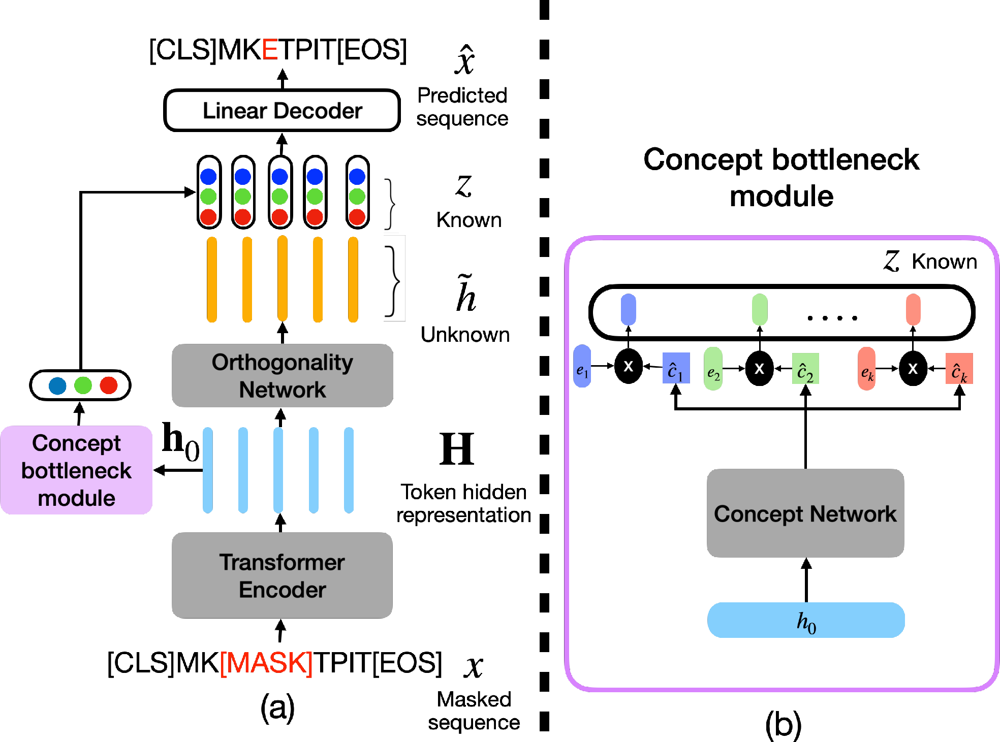
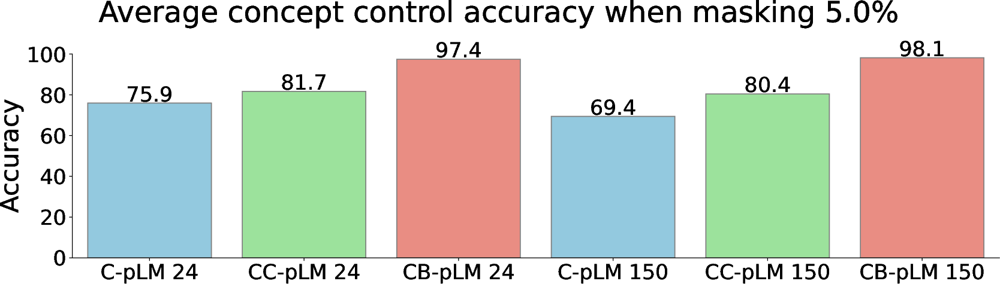
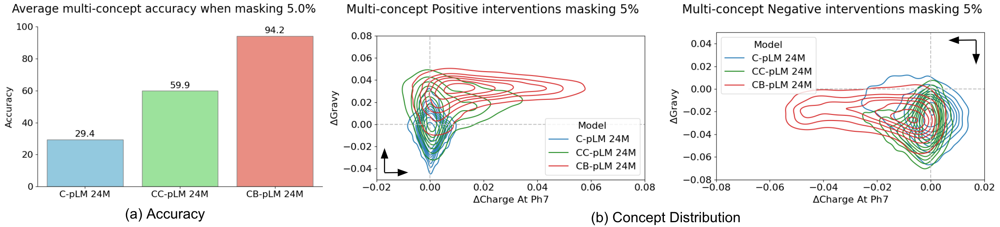
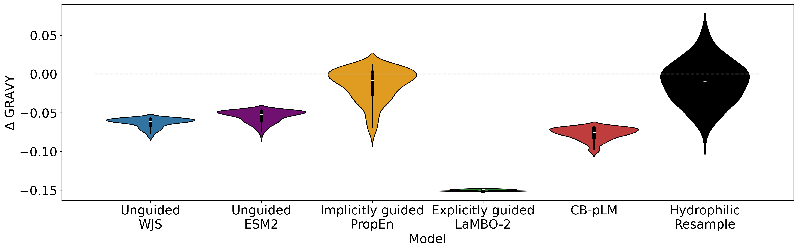
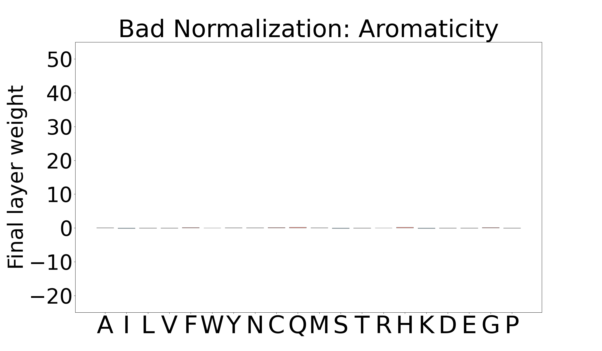

# Concept Bottleneck Language Models for Protein Design

## TLDR

This paper introduces Concept Bottleneck Protein Language Models (CB-pLM), a novel architecture that incorporates human-understandable concepts into protein language models. Key points:

- Enables fine-grained control over generated protein sequences
- Provides interpretability and debuggability by design
- Achieves comparable performance to traditional protein language models
- Scales up to 3 billion parameters while encoding over 700 concepts
- Demonstrates superior control compared to other conditional language models

## Introduction

As a researcher in the field of machine learning and computational biology, I've always been fascinated by the potential of language models in protein design. However, one of the biggest challenges has been the lack of interpretability and control in these models. That's why I was excited to dive into this new paper that introduces Concept Bottleneck Language Models for protein design.

In this blog post, we'll explore how the authors have tackled this challenge by incorporating human-understandable concepts directly into the architecture of protein language models. We'll look at the novel approach they've taken, the impressive results they've achieved, and the implications this could have for the field of protein engineering and drug discovery.

## Background

Before we dive into the details of the paper, let's briefly review some key concepts:

1. **Protein Language Models (pLMs)**: These are machine learning models trained on vast amounts of protein sequence data. They've shown remarkable success in predicting protein structure and function, but often lack interpretability.

2. **Concept Bottleneck Models (CBMs)**: Introduced by [Koh et al. (2020)](https://arxiv.org/abs/2007.04612), these models incorporate a layer of human-understandable concepts between the input and output, improving interpretability.

3. **Masked Language Models**: A type of language model that is trained to predict masked tokens in a sequence, commonly used in natural language processing and adapted for protein sequences.

With this context in mind, let's explore the main contributions of this paper.

## Concept Bottleneck Language Models: A Novel Architecture

The authors introduce Concept Bottleneck Protein Language Models (CB-pLM), which combine the power of protein language models with the interpretability of concept bottleneck models. The key idea is to incorporate a layer of human-understandable concepts into the architecture of a masked language model.

### Architecture Overview

The CB-pLM architecture consists of the following main components:

1. **Transformer Encoder**: This is the standard encoder used in many language models, processing the input protein sequence.

2. **Concept Bottleneck Module (CB-module)**: This novel component maps the encoder's output to concept predictions.

3. **Orthogonality Network**: Produces a token representation devoid of concept information.

4. **Linear Decoder**: Combines the concept and non-concept information to make the final predictions.

Let's look at each of these components in more detail.

### Concept Bottleneck Module

The CB-module is the heart of this new architecture. It takes the hidden representation of the classification token (CLS) from the encoder and maps it to concept predictions. Mathematically, this can be expressed as:

$$ \hat{c} = g(\mathbf{h}_{0}) $$

where $g$ is the function learned by the concept network, $\mathbf{h}_{0}$ is the hidden representation of the CLS token, and $\hat{c}$ is the vector of concept predictions.

Each concept is also associated with a learnable embedding $e$. The final representation of concept $i$ is given by:

$$ z_i = \hat{c_i} \times e_i $$

The output of the CB-module, $z = [z_1, z_2, \dots, z_{k}]$, is referred to as the "known" embedding, as we know exactly which concept each neuron in the embedding corresponds to.

### Orthogonality Network

The orthogonality network aims to produce a token representation that is devoid of any concept information. This "unknown" token embedding $\widetilde{h}$ is designed to be orthogonal to the known concepts. This is achieved through an orthogonality loss, which we'll discuss in the training section.

### Linear Decoder

The final component is a linear decoder that combines the known and unknown embeddings to make the final predictions:

$$ \hat{x}_{\text{M}} = \text{softmax}(W^{\text{dec}} \cdot[z, \widetilde{h}_{\text{M}}]) $$

where ${{x}}_{\text{M}}$ represents a masked token.

The use of a linear layer as the decoder is crucial for interpretability and debugging. It allows us to calculate the contribution of each concept to the final prediction by simply multiplying the concept activation value with its weights.

## Training the CB-pLM

The training of the CB-pLM involves three main loss functions:

1. **Masked Language Modeling Loss** ($\mathcal{L}_{\text{MLM}}$):
   
   $$ \mathcal{L}_{\text{MLM}} = - \mathbb{E}_{x,m} \left[ \frac{1}{m} \sum_{i \in m} \log P(x_i \mid x_{\setminus m}) \right ] $$

   This is the standard loss used in masked language models, where $m$ is the set of positions of the randomly masked tokens.

2. **Concept Loss** ($\mathcal{L}_{\text{Concept}}$):
   
   $$ \mathcal{L}_{\text{Concept}} = \frac{1}{k} \sum_{i=1}^{k} (c_i - \hat{c}_i)^2 $$

   This loss ensures that the model accurately predicts the concept values.

3. **Orthogonality Loss** ($\mathcal{L}_{\text{orth}}$):
   
   $$ \mathcal{L}_{\mathrm{orth}}=\sum_{j\in B} {\frac{\sum_{i=0}^{i=s} \big|\langle z\, , \,\widetilde{h}_{i} \rangle\big|}{\sum_{i=0}^{i=s} 1}} $$

   This loss encourages the known and unknown embeddings to encode different information.

The final loss is a weighted combination of these three:

$$ \mathcal{L}_{\mathrm{total}} = \mathcal{L}_{\text{MLM}} + \alpha \mathcal{L}_{\text{Concept}} + \beta \mathcal{L}_{\text{orth}} $$

where $\alpha$ and $\beta$ are hyperparameters.

## Scaling Up: From 24M to 3B Parameters

One of the impressive aspects of this work is the scale at which the authors have implemented their CB-pLM. They trained models with 24 million, 150 million, 650 million, and 3 billion parameters, all while encoding over 700 human-understandable concepts.

The authors used a combination of techniques to optimize the architecture and training for efficiency:

- Removed biases in attention blocks and intermediate layers
- Increased the effective batch size
- Used gradient accumulation
- Set the masking rate to 25%
- Employed AdamW optimizer, mixed precision training, and gradient clipping for stability

Despite the added complexity of the concept bottleneck layer, the CB-pLM achieves perplexity comparable to traditional masked protein language models. This is a significant result, as it shows that the added interpretability and control do not come at the cost of performance.

## Control and Steering: Fine-grained Protein Design

One of the key advantages of the CB-pLM is its ability to enable fine-grained control over generated protein sequences. The authors demonstrate this through a series of experiments on single and multi-property control.

### Single Concept Interventions

The authors tested the model's ability to control 14 different biophysical concepts that can be calculated from a protein's sequence (e.g., molecular weight, GRAVY, helix fraction). They compared the CB-pLM with other conditional language models:

- Conditional Protein Language Model (C-pLM)
- Conditional Protein Language Model with Classifier (CC-pLM)

The results show that CB-pLM significantly outperforms the other models in terms of control accuracy and effectiveness. For example, CB-pLM achieves near-perfect accuracy in controlling the direction of concept change, outperforming other models by over 15%.

### Multi-Concept Interventions

The authors also demonstrated the model's ability to control multiple properties simultaneously, a challenging task in drug discovery. They focused on controlling the Grand AVerage of Hydropathy (GRAVY) and the electric charge at pH 7.

The results show that CB-pLM achieves a 94% control accuracy, outperforming the second-best conditional model by 34%. This demonstrates the model's ability to navigate the complex trade-offs involved in multi-property optimization.

## Case Study: Redesigning Siltuximab

To demonstrate the practical applicability of their model, the authors applied CB-pLM to the task of redesigning Siltuximab, an FDA-approved monoclonal antibody. The goal was to lower its GRAVY index values, potentially improving its solubility.

They compared CB-pLM with several state-of-the-art protein design models:

- Discrete Walk-Jump Sampling (WJS)
- ESM2
- PropEn
- LaMBO-2
- Hydrophilic Resample

The results show that CB-pLM performs comparably to specialized models like LaMBO-2 in terms of shifting the GRAVY distribution, while maintaining the naturalness of the protein sequence. This is particularly impressive given that CB-pLM is a general-purpose model trained on over 700 concepts, while LaMBO-2 is specifically optimized for GRAVY reduction.

## Interpretability and Debugging

One of the most exciting aspects of the CB-pLM is its built-in interpretability and debuggability. The linear decoder allows for straightforward analysis of the model's decision-making process.

### Interpretability

By examining the weights of the final linear layer, we can understand the impact of specific concepts on the model's output. The authors provide several examples of how the model has learned key biophysical relationships:

- For charge at pH 6 and 7, acidic amino acids (D, E) have negative weights, while basic amino acids (R, K) have positive weights.
- For GRAVY (hydropathy), amino acids A, I, V, F, C, and M have positive weights, consistent with the Kyte-Doolittle scale.
- Aromatic amino acids F, Y, and W have high weights for the aromaticity concept.

These learned relationships align well with our understanding of protein biophysics, demonstrating that the model has indeed captured meaningful concepts.

### Debugging

The interpretable nature of the CB-pLM also allows for easy debugging. The authors demonstrate this by intentionally training a "bad" model with incorrect normalization for the aromaticity concept. By simply inspecting the weights of the linear layer, they could identify that the model had failed to learn this concept properly.

This ability to quickly identify and correct issues in the model's learning is invaluable for developing reliable and trustworthy AI systems for protein design.

## Conclusion and Future Directions

The Concept Bottleneck Protein Language Model represents a significant step forward in the field of protein design and more broadly, in the development of interpretable and controllable language models. By incorporating human-understandable concepts directly into the architecture, the authors have created a model that offers:

1. Fine-grained control over generated protein sequences
2. Built-in interpretability of the model's decision-making process
3. Easy debuggability to identify and correct issues in the model's learning

Moreover, they've demonstrated that these benefits don't come at the cost of performance, with the CB-pLM achieving comparable perplexity to traditional masked language models.

Looking ahead, there are several exciting directions for future research:

1. **Extending to other domains**: While this paper focused on protein design, the CB-LM architecture could potentially be adapted to other domains, such as natural language processing or chemistry.

2. **Incorporating new concepts**: Developing methods to fine-tune CB-LMs with new concepts without retraining from scratch could enhance their flexibility and applicability.

3. **Exploring generalization to unseen concept combinations**: Further investigation into the model's ability to generate sequences with novel combinations of concepts could open up new possibilities in protein engineering.

4. **Scaling to even larger models**: With the success of scaling to 3 billion parameters, it would be interesting to see if even larger models could capture more nuanced concepts and relationships.

5. **Real-world applications**: Applying CB-pLMs to challenging real-world protein design problems in drug discovery and biotechnology could demonstrate their practical impact.

As we continue to push the boundaries of AI in scientific discovery, models like CB-pLM that combine powerful predictive capabilities with interpretability and control will be crucial in building trust and enabling collaboration between AI systems and human experts. The work presented in this paper is an important step towards realizing the full potential of AI in protein engineering and beyond.

