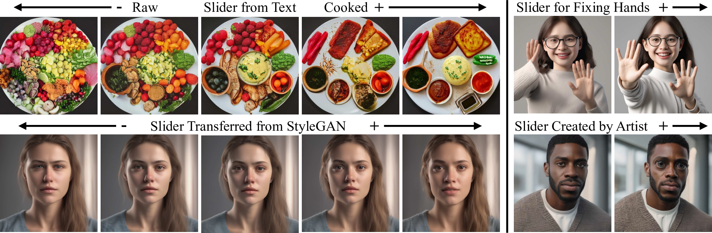
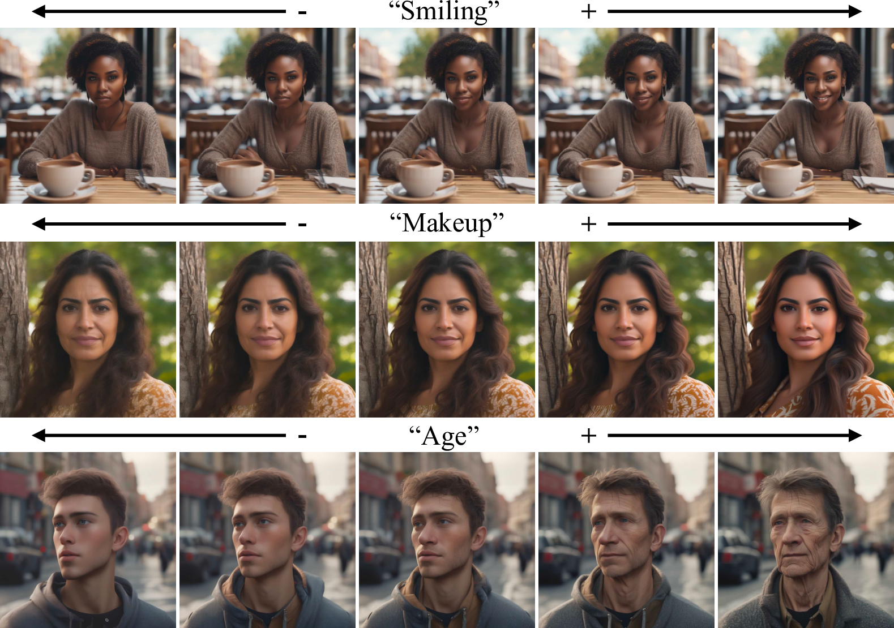

---
title: "Concept Sliders: Precise Control in Diffusion Models Through Low-Rank Adaptation"
date: 2020-09-15T11:30:03+00:00
# weight: 1
# aliases: ["/first"]
tags: ['diffusion models', 'image editing', 'concept control', 'LoRA', 'disentanglement', 'image generation', 'neural networks', 'deep learning', 'computer vision', 'generative AI']
author: "Me"
# author: ["Me", "You"] # multiple authors
showToc: true
TocOpen: true
draft: false
hidemeta: false
comments: false
description: ""
canonicalURL: "https://canonical.url/to/page"
disableHLJS: true # to disable highlightjs
disableShare: false
disableHLJS: false
hideSummary: false
searchHidden: false
ShowReadingTime: true
ShowBreadCrumbs: true
ShowPostNavLinks: true
ShowWordCount: true
ShowRssButtonInSectionTermList: true
UseHugoToc: true
cover:
    image: "<image path/url>" # image path/url
    alt: "<alt text>" # alt text
    caption: "<text>" # display caption under cover
    relative: false # when using page bundles set this to true
    hidden: true # only hide on current single page
editPost:
    URL: "https://github.com/<path_to_repo>/content"
    Text: "Suggest Changes" # edit text
    appendFilePath: true # to append file path to Edit link
---

# Concept Sliders: Precise Control in Diffusion Models Through Low-Rank Adaptation

**Authors:** Rohit Gandikota¹, Joanna Materzyńska², Tingrui Zhou³, Antonio Torralba², David Bau¹  
¹Northeastern University, ²Massachusetts Institute of Technology, ³Independent Researcher

[Project Page](https://sliders.baulab.info/) | [GitHub](https://github.com/rohitgandikota/sliders)

## TLDR
- Introduces Concept Sliders - low-rank parameter directions for precise control over attributes in diffusion models
- Enables continuous, composable editing of both textual and visual concepts with minimal interference
- Works with small sets of text prompts or paired images to learn targeted concept controls
- Demonstrates practical applications like fixing distorted hands and improving image realism
- Achieves better targeted edits with lower interference compared to existing methods

*Given a small set of text prompts or paired image data, Concept Sliders identify low-rank directions in diffusion parameter space for targeted concept control with minimal interference to other attributes. These directions can be derived from pairs of opposing textual concepts or artist-created images, and they are composable for complex multi-attribute control.*

## Introduction

Text-to-image diffusion models have revolutionized image generation, but precise control over specific attributes remains challenging. While you can modify text prompts to influence generation, this often drastically alters the overall image structure. Post-processing techniques exist but typically require separate inference passes for each edit and can introduce unwanted changes.

Enter Concept Sliders - a novel approach that enables precise, continuous control over image attributes through lightweight, plug-and-play adaptors. The key innovation is identifying low-rank parameter directions that correspond to specific concepts while minimizing interference with other attributes.

## How Do Concept Sliders Work?

The core idea is to learn a low-rank modification of the diffusion model that enhances certain attributes while suppressing others. Given a target concept $c_t$ and model $\theta$, we aim to obtain modified parameters $\theta^*$ that adjust the likelihood of attributes $c_+$ and $c_-$ in the generated image $X$:

$$
P_{\theta^*}(X | c_t) \gets P_{\theta}(X | c_t) \left(\frac{ P_{\theta}(c_+ | X)}{ P_{\theta}(c_- | X)}\right)^{\eta}
$$

This translates to modifying the denoising prediction:

$$\epsilon_{\theta^*}(X, c_t, t) \gets \epsilon_{\theta}(X, c_t, t) + \eta(\epsilon_{\theta}(X, c_+, t) - \epsilon_{\theta}(X, c_-, t))$$

To prevent unwanted attribute changes, we incorporate preservation concepts $p \in \mathcal{P}$ (like race names when editing age):

$$
\epsilon_{\theta^*}(X, c_t, t) \gets \epsilon_{\theta}(X, c_t, t) + \eta \sum_{p\in \mathcal{P}} (\epsilon_{\theta}(X, (c_+, p), t) - \epsilon_{\theta}(X, (c_-,p), t))
$$

The modifications are implemented using Low-Rank Adaptation (LoRA), which decomposes weight updates into low-rank matrices:

$\Delta W = BA$

where $B \in \mathbb{R}^{d \times r}$ and $A \in \mathbb{R}^{r \times k}$ with rank $r \ll \min(d,k)$.

## Key Features and Capabilities

### 1. Text-Based Control
Concept Sliders can be trained using pairs of opposing text prompts to enable precise control over attributes like age, weather, or artistic style. The method achieves stronger targeted edits with lower interference compared to baselines like Prompt-to-Prompt.

*Text-based sliders allow precise editing of desired attributes during image generation while maintaining the overall structure.*

### 2. Visual Concept Control
For concepts difficult to describe in text, sliders can be trained using paired before/after images. This enables control over nuanced visual attributes like eyebrow shape or eye size.

### 3. StyleGAN Latent Transfer
The framework can transfer latent directions from StyleGAN's style space into diffusion models, enabling fine-grained control over attributes that would be difficult to describe textually.

### 4. Composition
Multiple sliders can be combined for complex multi-attribute control. The method demonstrates successful composition of over 50 unique sliders without degrading output quality.

*Composing two text-based sliders results in complex control over food images, demonstrating how "cooked" and "fine-dining" attributes can be independently adjusted.*

## Practical Applications

### Fixing Hands
A persistent challenge in diffusion models is generating realistic hands. Concept Sliders can help fix distorted hands with anatomically implausible features. User studies show that the "fix hands" slider reduces hand distortions from 62% to 22% of generated images.

### Image Quality Enhancement
The method can identify parameter directions that improve overall image realism without altering content. A perceptual study showed that 80.39% of users preferred images generated with the "repair" slider.

## Implementation Details

The method is implemented as a plug-and-play module that can be easily integrated with existing diffusion models. Key aspects include:

1. **SDEdit-inspired inference**: Uses the original model for initial denoising steps before applying the slider
2. **Low-rank constraint**: Essential for precise control and minimal interference
3. **Disentanglement objective**: Prevents unwanted attribute changes through preservation concepts

## Results and Evaluation

Quantitative evaluation shows superior performance compared to baselines:

| Method | ΔCLIP | LPIPS | Interference |
|--------|--------|--------|--------------|
| Ours | **3.93** | **0.06** | **0.10** |
| w/o Disentanglement | 3.39 | 0.17 | 0.36 |
| w/o Low Rank | 3.18 | 0.23 | 0.19 |

The results demonstrate that both the disentanglement formulation and low-rank constraint are crucial for achieving precise, targeted edits.

## Limitations

- Some residual interference between edits remains
- The SDEdit inference technique can reduce edit intensity
- Optimal preservation directions need to be carefully selected

## Conclusion

Concept Sliders represent a significant advance in controllable image generation, offering:
- Precise control over both textual and visual concepts
- Minimal interference with unrelated attributes
- Efficient composition of multiple edits
- Practical solutions for common diffusion model issues

The method's versatility and effectiveness make it a valuable tool for both researchers and practitioners working with diffusion models.

## References

1. Dhariwal, P., & Nichol, A. (2021). Diffusion Models Beat GANs on Image Synthesis
2. Rombach, R., et al. (2022). High-Resolution Image Synthesis with Latent Diffusion Models
3. Hu, E., et al. (2021). LoRA: Low-Rank Adaptation of Large Language Models
4. Karras, T., et al. (2019). A Style-Based Generator Architecture for Generative Adversarial Networks
5. Wu, Z., et al. (2021). StyleSpace Analysis: Disentangled Controls for StyleGAN Image Generation

