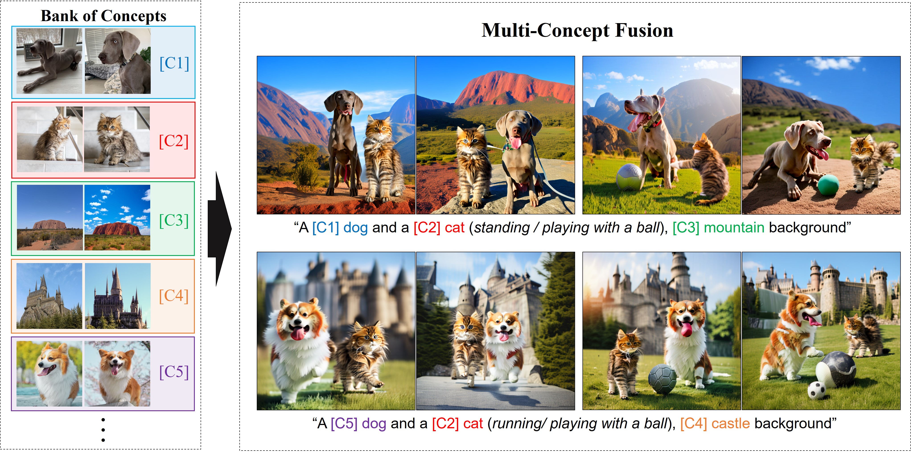
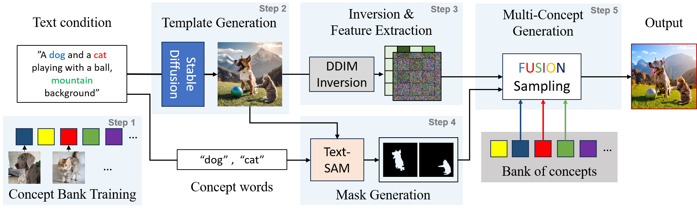
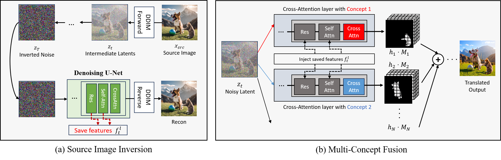
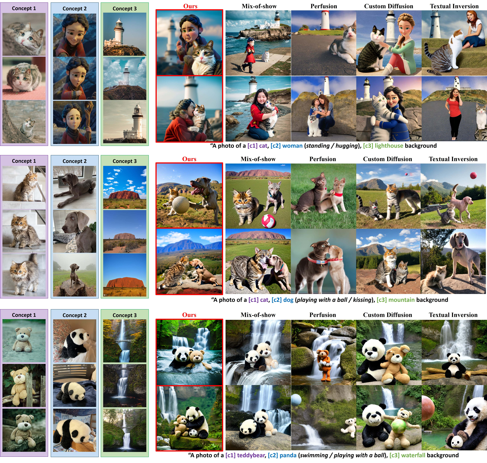

*Figure 1: Concept Weaver's Generation Results. Our method, Concept Weaver, can inject the appearance of arbitrary off-the-shelf concepts (from a Bank of Concepts) to generate realistic images.*

## TLDR

- Concept Weaver is a novel method for composing customized text-to-image diffusion models at inference time.
- It breaks down multi-concept image generation into two steps: creating a template image and personalizing it using a concept fusion strategy.
- The method outperforms existing approaches in generating multiple custom concepts with higher identity fidelity.
- It can handle more than two concepts and closely follow the semantic meaning of input prompts without blending appearances across different subjects.

## Introduction

Text-to-image generation has made remarkable strides in recent years, with models like Stable Diffusion [1] and commercial solutions like Adobe Firefly enabling users to create high-quality images from text prompts. However, generating images that combine multiple personalized concepts remains a significant challenge. While some approaches offer the ability to jointly train models for multiple concepts or merge customized models, they often struggle with semantically related concepts and scaling beyond three or more concepts.

In this blog post, we'll dive deep into Concept Weaver, a groundbreaking method introduced by Kwon et al. [2] that addresses these limitations. We'll explore how Concept Weaver breaks down the multi-concept generation process, its key components, and its impressive results compared to existing approaches.

## The Concept Weaver Method

*Figure: First, we fine-tune a text-to-timage model for each target concept in the bank (Step 1). Then we source a template image (Step 2). Given the template image,  we apply the inversion process with simultaneous feature extraction to save its structural information (Step 3). In Step 4, we extract region masks from the template image with off-the-shelf models \cite{sam}. With extracted features and masks, we generate the multi-concept image in Step 5.*

Concept Weaver takes a novel approach to multi-concept image generation by breaking the process into two main steps:

1. Creating a template image aligned with the semantics of input prompts
2. Personalizing the template using a concept fusion strategy

Let's examine each step in detail:

### Step 1: Concept Bank Training

The first step in the Concept Weaver pipeline is to fine-tune a pretrained text-to-image model for each target concept in the bank. The authors leverage Custom Diffusion [3] for this purpose, as it only fine-tunes the cross-attention layers of the U-Net model $\epsilon_\theta$.

The cross-attention layer is defined as:

$$A(Q,K,V) = \text{Softmax}\left(\frac{QK^T}{\sqrt{d}}\right)V$$

where $Q = W^qf$, $K = W^kp$, and $V = W^vp$. Here, $p \in \mathbb{R}^{s \times d}$ is the text condition, and $f \in \mathbb{R}^{(h \times w) \times c}$ is the self-attention feature.

The authors only fine-tune the 'key' and 'value' weight parameters $W^k$ and $W^v$ of the cross-attention layers. They also use modifier tokens [V*] placed ahead of the concept word (e.g., [V*] dog) to constrain general concepts.

### Step 2: Template Image Generation

Instead of generating a personalized image from scratch, Concept Weaver starts with a template image that aligns with the semantics of the input prompt. This template can be generated using existing text-to-image models or sourced from real images if available.

### Step 3: Inversion and Feature Extraction

*Figure: (a) To extract and save the structural information of template images, we save the intermediate latent of images during the DDIM forward process. With the fully inverted noise, we extract the feature outputs from denoising U-Net during the DDIM reverse process. (b) From the noisy inverted latent, we start the multi-concept fusion generation. We denoise the noisy image with fine-tuned personalized models. After obtaining multiple cross-attention layer features, we fuse the different features from each masked region. In this step, we inject the pre-calculated self-attention and resnet features into the networks.*

Once a template image is obtained, the method applies an inversion process to extract latent representations that will guide the generation process. This step borrows from the image inversion and feature extraction schemes proposed in Plug-and-Play diffusion (PNP) [4].

The process involves:

1. Generating a noisy latent space $z_T$ from the source image $x_{src}$ using the DDIM [5] forward process:

   $$z_{t+1} = \sqrt{\frac{\alpha_{t+1}}{\alpha_t}}z_t + \left(\sqrt{\frac{1-\alpha_{t+1}}{\alpha_{t+1}}} - \sqrt{\frac{1-\alpha_t}{\alpha_t}}\right)\epsilon_\theta(z_t, t, p_{src})$$

2. Reconstructing the source image using the reverse DDIM process:

   $$z_{t-1} = \sqrt{\frac{\alpha_{t-1}}{\alpha_t}}z_t + \left(\sqrt{\frac{1-\alpha_{t-1}}{\alpha_{t-1}}} - \sqrt{\frac{1-\alpha_t}{\alpha_t}}\right)\epsilon_\theta(z_t, t, p_{src})$$

3. Extracting features from the U-Net's $l$-th layer ${f}_t^l$ at each timestep $t$ during the reverse reconstruction process.

### Step 4: Mask Generation

To ensure concept-wise editing and prevent mixing of concepts, Concept Weaver uses masked guidance. The method leverages the Segment Anything Model (SAM) [6] to obtain semantic mask regions for each concept. For $N$ different concepts, concept-wise masks $M_1, M_2, \ldots, M_N$ are extracted, and the unmasked region is set as the background mask $M_{bg} = (M_1 \cup M_2 \cup \ldots \cup M_N)^c$.

### Step 5: Multi-Concept Fusion

The final step in the Concept Weaver pipeline is the multi-concept fusion process. This novel sampling process combines multiple single-concept personalized models in a unified sampling approach. The key components of this process include:

1. **Concept-aware text conditioning**: Different text conditions are constructed for each concept to prevent concept leakage and mixing.

2. **Feature space mixing**: The method mixes different concepts in the feature space of cross-attention layers:

   $$h_{fuse} = \sum_{i=1}^N h_i M_i + h_{bg} M_{bg}$$

3. **Concept-free suppression**: To remove concept-free features during the sampling process, the method extrapolates the concept-free features:

   $$h_{fuse} = (1+\lambda)[\sum_{i=1}^N h_iM_i + h_{bg}M_{bg}] - \lambda h_{base}$$

4. **Fused score estimation**: The final fused score estimation is calculated as:

   $$\epsilon_{fuse} = \epsilon_\theta(z_t, t; h_{fuse}; f_t)$$

5. **Classifier-free guidance**: The method leverages classifier-free guidance [7] with a negative prompt strategy:

   $$\epsilon = \omega \cdot \epsilon_{fuse} + (1-\omega) \cdot \epsilon_{\theta_{base}}(z_t, t, p_{neg}; f_t)$$

## Implementation Details

The authors provide detailed implementation information for each step of the Concept Weaver pipeline:

- **Concept Bank Training**: Uses Custom Diffusion [3] with Stable Diffusion V2.1 as the starting point. Each concept is fine-tuned for 500 steps with a learning rate of 1e-5.
- **Template Image Generation**: Uses Stable Diffusion XL with 50 sampling steps and a resolution of 1024x1024.
- **Mask Generation**: Leverages the langSAM pipeline.
- **Inversion and Multi-Concept Fusion**: Follows the official source code of Plug-and-Play diffusion features [4].

The entire process (from step 1 to 5) takes about 60 seconds with a single RTX3090 GPU.

## Results and Comparisons

The authors conducted extensive experiments to evaluate Concept Weaver's performance compared to existing approaches. Let's look at some key findings:

### Qualitative Evaluation

*Figure 2: Qualitative Evaluation of Multi-Concept Generation. Concept Weaver outperforms baseline approaches in preserving concept appearances and following prompt instructions.*

As shown in Figure 2, Concept Weaver consistently outperforms baseline methods in generating multi-concept images:

- It successfully preserves the appearance of target concepts while baselines often fail.
- It can handle close interactions between concepts without mixing appearances.
- It generates images that closely follow the prompt instructions, including specific actions and backgrounds.

### Quantitative Evaluation

The authors used CLIP scores [3] to evaluate text-alignment (Text-sim) and image-alignment (Image-sim). Concept Weaver outperformed all baseline approaches in both metrics:

| Method | Text-sim ↑ | Image-sim ↑ |
|--------|------------|-------------|
| Textual Inversion | 0.3423 | 0.7256 |
| Custom Diffusion | 0.3595 | 0.7875 |
| Perfusion | 0.3182 | 0.7563 |
| Mix-of-show | 0.3634 | 0.7984 |
| **Concept Weaver (ours)** | **0.3804** | **0.8124** |

### Human Preference Study

A user study with 20 participants further validated Concept Weaver's superiority:

| Method | Text match ↑ | Concept match ↑ | Realism ↑ |
|--------|--------------|------------------|-----------|
| Mix-of-show | 3.44 | 3.39 | 3.78 |
| **Concept Weaver (Ours)** | **4.70** | **4.64** | **4.43** |

These results demonstrate that Concept Weaver generates perceptually better outputs across all evaluated dimensions.

## Applications and Extensions

### Customizing Real Images

One of the exciting aspects of Concept Weaver is its ability to edit real images by injecting the appearance of target concepts. This opens up possibilities for creative image editing and personalization.

### Extension to LoRA Fine-tuning

The authors show that Concept Weaver can be easily adapted to use Low-Rank adaptation (LoRA) [8] for more efficient fine-tuning. This flexibility demonstrates the robustness of the approach across different architectures.

## Conclusion and Future Directions

Concept Weaver represents a significant advancement in multi-concept image generation. By breaking down the process into template creation and concept fusion, it achieves superior results in generating high-fidelity images with multiple custom concepts. The method's ability to handle more than two concepts and closely follow semantic prompts opens up new possibilities for creative image generation and editing.

Future research directions could include:

1. Exploring ways to further improve the handling of extremely complex or unrealistic text conditions.
2. Investigating the integration of Concept Weaver with other state-of-the-art text-to-image models.
3. Developing safeguards and ethical guidelines for the use of personalized concepts to prevent misuse.

As text-to-image generation continues to evolve, methods like Concept Weaver pave the way for more flexible, personalized, and creative image synthesis tools. The ability to seamlessly combine multiple concepts while maintaining high fidelity and semantic alignment is a crucial step towards more intuitive and powerful image generation systems.

## References

[1] Rombach, R., Blattmann, A., Lorenz, D., Esser, P., & Ommer, B. (2022). High-resolution image synthesis with latent diffusion models. In Proceedings of the IEEE/CVF Conference on Computer Vision and Pattern Recognition (pp. 10684-10695).

[2] Kwon, G., Jenni, S., Li, D., Lee, J. Y., Ye, J. C., & Heilbron, F. C. (2024). Concept Weaver: Enabling Multi-Concept Fusion in Text-to-Image Models. In Proceedings of the IEEE/CVF Conference on Computer Vision and Pattern Recognition.

[3] Kumari, N., Zhang, R., Du, E., Hua, B. S., Yeung, Y. L., Popa, T., & Mitra, N. J. (2022). Customizing Diffusion Models for Image Generation with Multiple Text Prompts. arXiv preprint arXiv:2212.04488.

[4] Hertz, A., Mokady, R., Tenenbaum, J., Aberman, K., Pritch, Y., & Cohen-Or, D. (2022). Prompt-to-prompt image editing with cross attention control. arXiv preprint arXiv:2208.01626.

[5] Song, J., Meng, C., & Ermon, S. (2020). Denoising diffusion implicit models. arXiv preprint arXiv:2010.02502.

[6] Kirillov, A., Mintun, E., Ravi, N., Mao, H., Rolland, C., Gustafson, L., ... & Girshick, R. (2023). Segment anything. arXiv preprint arXiv:2304.02643.

[7] Ho, J., & Salimans, T. (2022). Classifier-free diffusion guidance. arXiv preprint arXiv:2207.12598.

[8] Hu, E. J., Shen, Y., Wallis, P., Allen-Zhu, Z., Li, Y., Wang, S., ... & Chen, W. (2021). LoRA: Low-rank adaptation of large language models. arXiv preprint arXiv:2106.09685.

---