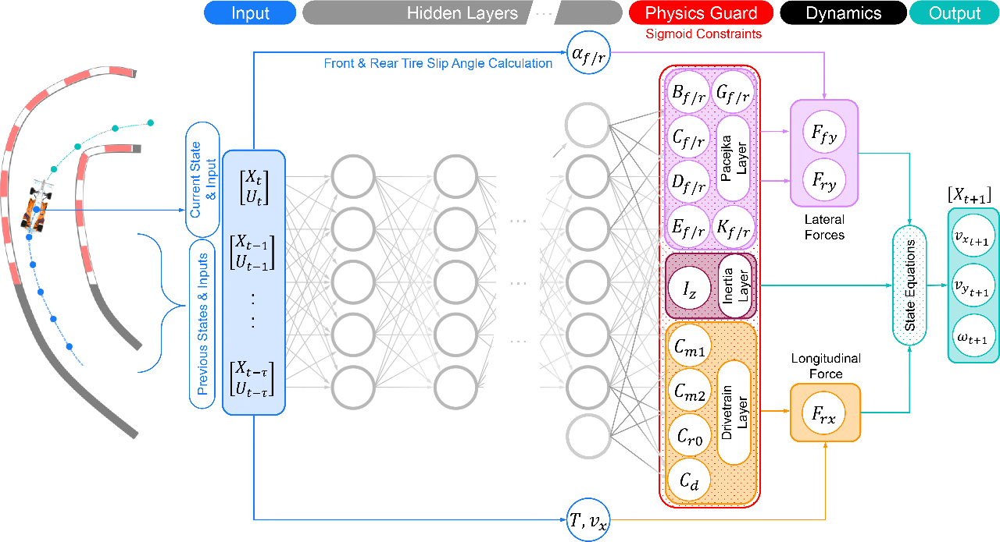
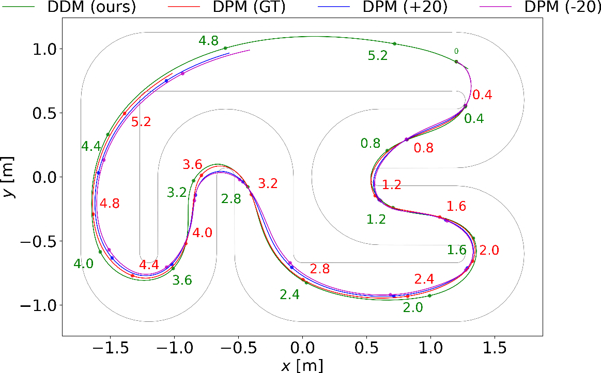

---
title: "Deep Dynamics: Physics-Informed Neural Networks for Vehicle Modeling in Autonomous Racing"
date: 2024-11-05T11:09:20.397158
# weight: 1
# aliases: ["/first"]
tags: ['autonomous racing', 'vehicle dynamics', 'physics-informed neural networks', 'deep learning', 'model predictive control']
author: "Me"
# author: ["Me", "You"] # multiple authors
showToc: true
TocOpen: true
draft: false
hidemeta: false
comments: false
description: ""
canonicalURL: "https://canonical.url/to/page"
disableHLJS: true # to disable highlightjs
disableShare: false
disableHLJS: false
hideSummary: false
searchHidden: false
ShowReadingTime: true
ShowBreadCrumbs: true
ShowPostNavLinks: true
ShowWordCount: true
ShowRssButtonInSectionTermList: true
UseHugoToc: true
cover:
    image: "<image path/url>" # image path/url
    alt: "<alt text>" # alt text
    caption: "<text>" # display caption under cover
    relative: false # when using page bundles set this to true
    hidden: true # only hide on current single page
editPost:
    URL: "https://github.com/<path_to_repo>/content"
    Text: "Suggest Changes" # edit text
    appendFilePath: true # to append file path to Edit link
---

# Deep Dynamics: Physics-Informed Neural Networks for Vehicle Modeling in Autonomous Racing

Autonomous racing presents unique challenges for vehicle dynamics modeling compared to regular autonomous driving. At extreme speeds over 280 km/h, even small modeling errors can have severe consequences. Existing physics-based models require elaborate testing and tuning, while purely data-driven approaches struggle to generalize and ensure physical constraints.

In this paper, researchers from the University of Virginia introduce Deep Dynamics - a novel physics-informed neural network (PINN) approach for modeling the dynamics of autonomous racecars. By combining physics coefficient estimation with dynamical equations, Deep Dynamics aims to accurately predict vehicle states at high speeds while ensuring predictions remain physically plausible.

## TLDR

- Deep Dynamics is a PINN that estimates Pacejka tire coefficients, drivetrain coefficients, and moment of inertia to model complex racecar dynamics
- It uses a Physics Guard layer to constrain coefficient estimates within physically meaningful ranges
- Outperforms existing methods in both open-loop and closed-loop testing on simulated and real autonomous racecar data
- Enables real-time model predictive control for autonomous racing applications

## Background and Motivation

Autonomous racing serves as an excellent testbed for pushing the limits of autonomous vehicle technology. Competitions like the Indy Autonomous Challenge feature full-size driverless racecars competing at speeds over 280 km/h. 

Precise modeling of vehicle dynamics is critical for autonomous racing. This involves using differential equations to capture motion, tire dynamics, aerodynamics, suspension, steering and drivetrain physics. However, obtaining accurate coefficient values for these models is extremely challenging:

- Determining tire coefficients requires extensive testing with specialized equipment
- Calculating a racecar's moment of inertia necessitates vehicle disassembly and precise component measurements
- Coefficients need frequent recalculation to account for varying setups, track conditions and tire wear

While deep neural networks can capture complex nonlinear dynamics, they have high computational demands and can generate physically implausible outputs. This has sparked interest in physics-informed neural networks (PINNs) that combine data-driven learning with physical constraints.

## The Deep Dynamics Model

The authors introduce Deep Dynamics - a PINN designed specifically for modeling vehicle dynamics in autonomous racing. It aims to estimate the unknown coefficients of a single-track vehicle dynamics model, including:

- Pacejka tire model coefficients 
- Drivetrain coefficients
- Vehicle moment of inertia

The key innovation is a Physics Guard layer that ensures estimated coefficients remain within physically meaningful ranges.

### Single-Track Vehicle Model

The paper uses a dynamic single-track (bicycle) model to represent the racecar, with the following state variables:

- $x, y$: Horizontal and vertical position
- $\theta$: Inertial heading  
- $v_x, v_y$: Longitudinal and lateral velocity
- $\omega$: Yaw rate
- $T$: Throttle
- $\delta$: Steering angle

The state equations are given by:

$$
\begin{aligned}
x_{t+1} &= x_t + (v_{x_t}\cos\theta_t - v_{y_t}\sin\theta_t)T_s \\
y_{t+1} &= y_t + (v_{x_t}\sin\theta_t + v_{y_t}\cos\theta_t)T_s \\
\theta_{t+1} &= \theta_t + (\omega_t)T_s \\
v_{x_{t+1}} &= v_{x_t} + \frac{1}{m}(F_{rx}-F_{fy}\sin\delta_t + mv_{y_t}\omega_t)T_s \\
v_{y_{t+1}} &= v_{y_t} + \frac{1}{m}(F_{ry}+F_{fy}\cos\delta_t - mv_{x_t}\omega_t)T_s \\
\omega_{t+1} &= \omega_t + \frac{1}{I_z}(F_{fy}l_f\cos\delta_t - F_{ry}l_r)T_s
\end{aligned}
$$

Where $T_s$ is the sampling time, $m$ is the vehicle mass, $I_z$ is the moment of inertia, and $l_f, l_r$ are the distances from center of gravity to front and rear axles.

The lateral tire forces $F_{fy}$ and $F_{ry}$ are modeled using the Pacejka Magic Formula:

$$
\begin{aligned}
F_{fy} &= K_f + D_f\sin(C_f\arctan(B_f\alpha_f - E_f(B_f\alpha_f - \arctan(B_f\alpha_f)))) \\
F_{ry} &= K_r + D_r\sin(C_r\arctan(B_r\alpha_r - E_r(B_r\alpha_r - \arctan(B_r\alpha_r))))
\end{aligned}
$$

Where $\alpha_f$ and $\alpha_r$ are the front and rear slip angles:

$$
\begin{aligned}
\alpha_f &= \delta - \arctan{\frac{\omega l_f + v_y} {v_x}} + G_f \\
\alpha_r &= \arctan{\frac{\omega l_r - v_y}{v_x}} + G_r
\end{aligned}
$$

The longitudinal force $F_{rx}$ is given by a drivetrain model:

$$
F_{rx} = (C_{m1} - C_{m2}v_x)T - C_{r0} - C_d{v_x}^2
$$

### Deep Dynamics Architecture

The Deep Dynamics model takes as input a history of vehicle states and control inputs:

$$
[[X_{t-\tau}, U_{t-\tau}],...,[X_t,U_t]]
$$

Where $X_t = [v_{x_t}, v_{y_t}, \omega_t, T_t, \delta_t]$ and $U_t = [\Delta T_t, \Delta\delta_t]$.

This input is fed through hidden layers of a deep neural network. The key innovation is the Physics Guard layer, which applies a sigmoid activation and scaling to ensure the estimated coefficients $\hat{\Phi}_u$ remain within physically meaningful bounds $[\underline{\Phi}_u, \overline{\Phi}_u]$:

$$
\hat{\Phi}_u = \sigma(z) \cdot (\overline{\Phi}_u - \underline{\Phi}_u) + \underline{\Phi}_u
$$

Where $z$ is the output of the last hidden layer and $\sigma$ is the sigmoid function.

The estimated coefficients are then used with the single-track model equations to predict the next vehicle state $\hat{X}_{t+1}$. The model is trained to minimize the mean squared error between predicted and actual states:

$$
\mathcal{L}({\hat{X}}) = \frac{1}{3}\sum_{i=1}^3(X^{(i)}_{t+1} - \hat{X}^{(i)}_{t+1})^2
$$

For the velocity states $v_x, v_y, \omega$.

## Experimental Results

The authors evaluated Deep Dynamics against the Deep Pacejka Model (DPM) baseline on both simulated and real-world autonomous racecar data.

### Datasets

- Simulation data: Collected from a 1:43 scale racecar simulator with known ground truth coefficients
- Real-world data: Compiled from a full-scale Indy autonomous racecar competing in the Indy Autonomous Challenge

### Open-Loop Performance

Deep Dynamics significantly outperformed DPM variants in open-loop prediction accuracy:

- On simulation data: 4+ orders of magnitude improvement in RMSE for longitudinal velocity, 2+ orders for lateral velocity and yaw rate
- On real data: 8%+ improvement for longitudinal velocity, 56%+ for lateral velocity, 53%+ for yaw rate

The estimated coefficients from Deep Dynamics also aligned much more closely with ground truth values compared to DPM.

### Closed-Loop Performance 

In closed-loop testing with model predictive control:

- Deep Dynamics achieved the fastest lap time of 5.38s
- Highest average speed of over 2 m/s 
- Zero track boundary violations

Compared to DPM variants which had slower lap times and multiple violations.

## Key Advantages

The Deep Dynamics model offers several advantages over existing approaches:

1. Physics-informed learning: Combines data-driven estimation with physical constraints for better generalization

2. Coefficient estimation: Learns time-varying Pacejka tire, drivetrain and inertia coefficients end-to-end

3. Physics Guard: Ensures estimated coefficients remain physically plausible

4. Real-time capable: 700 Hz inference enables use in model predictive control

5. Generalizes well: Outperforms baselines on both simulated and real racecar data

## Limitations and Future Work

Some limitations and areas for future work include:

- Testing on more diverse racing scenarios and conditions
- Investigating performance with time-varying ground truth coefficients
- Deploying on a full-scale autonomous Indy racecar for real-world validation
- Exploring other physics-informed architectures like graph neural networks

## Conclusion

Deep Dynamics represents a promising approach for vehicle dynamics modeling in the challenging domain of autonomous racing. By combining the strengths of deep learning and physics-based modeling, it enables accurate state prediction and control at extreme speeds.

The Physics Guard layer is a key innovation that could be applied to other domains requiring physically constrained neural network outputs. As autonomous racing continues to push the limits of vehicle control, physics-informed models like Deep Dynamics will likely play an increasingly important role.

## References

[1] Betz, J. et al. Autonomous vehicles on the edge: A survey on autonomous vehicle racing. IEEE Open Journal of Intelligent Transportation Systems, 3:458–488, 2022.

[2] Wischnewski, A. et al. Indy autonomous challenge -- autonomous race cars at the handling limits, 2022.

[3] O'Kelly, M. et al. F1/10: An open-source autonomous cyber-physical platform. arXiv preprint arXiv:1901.08567, 2019.

[4] Kabzan, J., Hewing, L., Liniger, A., and Zeilinger, M.N. Learning-based model predictive control for autonomous racing. IEEE Robotics and Automation Letters, 4(4):3363–3370, 2019.

[5] Pacejka, H.B. and Bakker, E. The magic formula tyre model. Vehicle System Dynamics, 21(sup001):1–18, 1992.

[6] Langer, W.J. and Potts, G.R. Development of a flat surface tire testing machine. SAE Transactions, 89:1111–1117, 1980.

[7] Weiss, T. and Behl, M. Deepracing: A framework for autonomous racing. In 2020 Design, automation & test in Europe conference & exhibition (DATE), pages 1163–1168. IEEE, 2020.

[8] Kim, T., Lee, H., and Lee, W. Physics embedded neural network vehicle model and applications in risk-aware autonomous driving using latent features, 2022.

[9] Althoff, M., Koschi, M., and Manzinger, S. Commonroad: Composable benchmarks for motion planning on roads. In 2017 IEEE Intelligent Vehicles Symposium (IV), pages 719–726, 2017.

[10] Kang, C.M., Lee, S.H., and Chung, C.C. Comparative evaluation of dynamic and kinematic vehicle models. In 53rd IEEE Conference on Decision and Control, pages 648–653, 2014.

