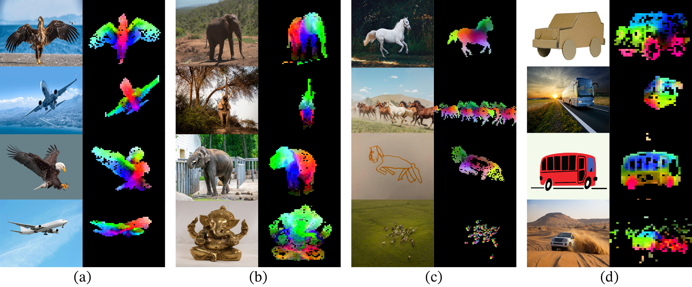
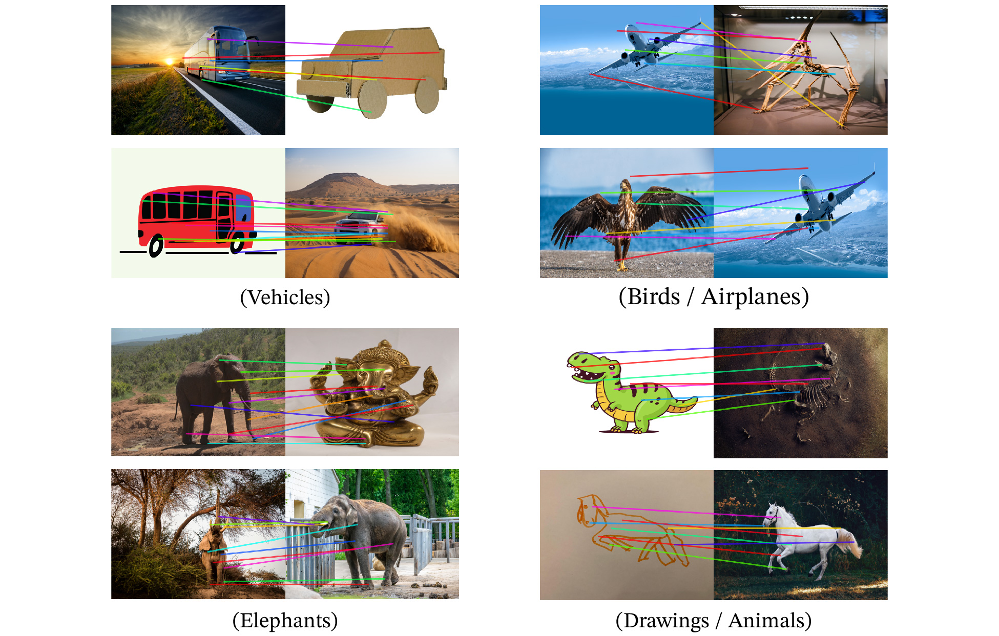

# DINOv2: Learning Robust Visual Features without Supervision

*Figure 1: Visualization of the first PCA components learned by DINOv2. Each component is matched to a different color channel. Same parts are matched between related images despite changes of pose, style or even objects.*

## TLDR

- DINOv2 is a new family of self-supervised vision models that learn high-quality visual features without any supervision or text guidance
- The models outperform previous self-supervised approaches and match or exceed weakly-supervised models on many benchmarks
- Key innovations include a curated dataset, improved training recipe, and efficient implementation for large-scale training
- DINOv2 features work well out-of-the-box for various tasks including classification, segmentation, and depth estimation
- The approach demonstrates that self-supervised learning can produce general-purpose visual features competitive with supervised alternatives

## Introduction

The field of computer vision has long sought to develop general-purpose visual features that can work across a wide range of tasks and image distributions without fine-tuning. Recent breakthroughs in natural language processing, where large language models pretrained on raw text have demonstrated impressive zero-shot capabilities, have inspired similar efforts in computer vision.

In this work, we present DINOv2 - a new family of self-supervised vision models that take a significant step towards this goal of general-purpose visual features. Unlike previous approaches that rely on text supervision or uncurated data, DINOv2 is trained purely through self-supervision on a carefully curated dataset. The resulting models produce high-quality visual features that match or exceed the performance of weakly-supervised alternatives across a variety of benchmarks, all without any fine-tuning.

## Key Innovations

There are several key components that enable the strong performance of DINOv2:

1. **Curated dataset**: We develop an automatic pipeline to build a diverse, curated dataset of 142M images called LaViDa. This provides higher quality training data compared to uncurated web-scraped datasets.

2. **Improved training recipe**: We combine and optimize various self-supervised learning techniques, including components from DINO, iBOT, and SwAV.

3. **Efficient implementation**: Technical improvements allow us to train larger models more efficiently, enabling scaling to billion-parameter models.

4. **Model distillation**: For smaller architectures, we distill knowledge from our largest model rather than training from scratch.

Let's dive deeper into each of these components.

## Curated Dataset: LaViDa

A key insight of this work is that the quality of the pretraining data significantly impacts the resulting features. Previous self-supervised approaches often used uncurated datasets scraped from the web, leading to noisy training data.

We develop an automatic pipeline to construct LaViDa (Large Vision Dataset), a curated dataset of 142M images. The pipeline involves:

1. **Data sources**: We start with a collection of curated datasets covering various domains (e.g. ImageNet, Google Landmarks) and a large uncurated dataset of 1.2B web images.

2. **Deduplication**: We remove near-duplicate images using a copy detection pipeline.

3. **Self-supervised retrieval**: We use cosine similarity between self-supervised image embeddings to retrieve images from the uncurated source that are similar to those in the curated datasets.

4. **Clustering**: For smaller datasets, we cluster the uncurated data and sample images from clusters matching the curated data.

This results in a diverse dataset covering many visual domains while maintaining high data quality. Ablation studies show that models trained on LaViDa outperform those trained on ImageNet-22k or uncurated data across most benchmarks.

## Improved Training Recipe

DINOv2 builds on previous self-supervised learning approaches, particularly DINO and iBOT, with several key improvements:

1. **Combined loss function**: We use a combination of image-level and patch-level contrastive losses:

   $$\mathcal{L}_{DINO} = - \sum p_t \log p_s$$
   $$\mathcal{L}_{iBOT} = - \sum_i p_{ti} \log p_{si}$$

   Where $p_t$ and $p_s$ are softmax outputs from teacher and student networks respectively.

2. **Sinkhorn-Knopp centering**: We replace the teacher softmax-centering step with Sinkhorn-Knopp normalization from SwAV.

3. **KoLeo regularizer**: We add a regularization term to encourage uniform spanning of features within a batch:

   $$\mathcal{L}_{\mathrm{koleo}} = - \frac{1}{n} \sum_{i=1}^n \log( d_{n, i})$$

   Where $d_{n,i}$ is the minimum distance between feature $i$ and any other feature in the batch.

4. **Resolution adaptation**: We increase image resolution to 518x518 for a short period at the end of pretraining to improve performance on pixel-level tasks.

5. **Untying head weights**: We use separate projection heads for the DINO and iBOT losses, which improves performance at scale.

Ablation studies show that each of these components contributes to the overall performance of DINOv2.

## Efficient Implementation

To enable training of large models on large datasets, we implement several optimizations:

1. **Fast and memory-efficient attention**: We use a custom implementation of FlashAttention to improve memory usage and speed for self-attention layers.

2. **Sequence packing**: We concatenate token sequences of different lengths into a single long sequence with a block-diagonal attention mask, improving compute efficiency.

3. **Efficient stochastic depth**: We implement an improved version of stochastic depth that skips computation of dropped residuals rather than just masking the result.

4. **Fully-Sharded Data Parallel (FSDP)**: We use PyTorch's FSDP implementation to shard model replicas across GPUs, reducing memory footprint and communication costs.

These optimizations allow us to train models with up to 1.1B parameters (ViT-g/14) efficiently.

## Model Distillation

For smaller architectures (ViT-S/14, ViT-B/14, ViT-L/14), we use knowledge distillation from our largest ViT-g/14 model instead of training from scratch. Our distillation approach uses the same training loop as the self-supervised pretraining, with a few modifications:

- We use the large model as a frozen teacher
- We keep a spare EMA of the student as the final model
- We remove masking and stochastic depth
- We apply the iBOT loss on two global crops

Ablation studies show that distilled models consistently outperform those trained from scratch across various benchmarks.

## Results

We evaluate DINOv2 on a wide range of computer vision tasks, including image classification, instance retrieval, semantic segmentation, and depth estimation. Here are some key findings:

### Image Classification

On ImageNet-1k linear evaluation, DINOv2 significantly outperforms previous self-supervised methods:

| Method   | Arch      | Top-1 Accuracy |
|----------|-----------|----------------|
| iBOT     | ViT-L/16  | 82.3%          |
| DINOv2   | ViT-g/14  | 86.5%          |

DINOv2 even matches or exceeds the performance of weakly-supervised models like OpenCLIP:

| Method   | Arch      | Top-1 Accuracy |
|----------|-----------|----------------|
| OpenCLIP | ViT-G/14  | 86.2%          |
| DINOv2   | ViT-g/14  | 86.5%          |

### Instance Retrieval

DINOv2 shows impressive performance on instance-level recognition tasks:

| Method   | Oxford-Hard mAP |
|----------|-----------------|
| OpenCLIP | 19.7%           |
| iBOT     | 12.7%           |
| DINOv2   | 54.0%           |

### Semantic Segmentation

Using just a linear classifier on frozen features, DINOv2 achieves strong performance on semantic segmentation:

| Method   | ADE20k mIoU |
|----------|-------------|
| OpenCLIP | 46.0%       |
| iBOT     | 47.5%       |
| DINOv2   | 53.1%       |

### Depth Estimation

DINOv2 also excels at monocular depth estimation:

| Method   | NYUd RMSE |
|----------|-----------|
| OpenCLIP | 0.414     |
| iBOT     | 0.358     |
| DINOv2   | 0.279     |

These results demonstrate that DINOv2 produces high-quality visual features that transfer well across a variety of tasks, often matching or exceeding the performance of weakly-supervised alternatives.

## Qualitative Analysis

Beyond the quantitative results, DINOv2 exhibits several interesting qualitative properties:

1. **PCA visualization**: As shown in Figure 1, the first PCA components of DINOv2 features correspond to semantically meaningful parts of objects, even across changes in pose, style, or object instance.

2. **Foreground-background separation**: Thresholding the first PCA component effectively separates foreground objects from the background.

3. **Cross-domain matching**: DINOv2 features can match semantically similar parts across different domains (e.g. airplane wings to bird wings) and styles (e.g. photographs to drawings).

4. **Out-of-distribution generalization**: Linear classifiers trained on DINOv2 features generalize well to out-of-distribution examples, producing reasonable depth maps and segmentation masks for paintings or unusual objects.

These properties suggest that DINOv2 learns rich, semantically meaningful visual representations that generalize well across domains.

*Figure 2: Matching across images using DINOv2 features. The model can match semantically similar parts across different objects, poses, and styles.*

## Conclusion and Future Directions

DINOv2 represents a significant step towards general-purpose visual features learned without supervision. By combining a carefully curated dataset, improved self-supervised learning techniques, and efficient large-scale training, we've produced models that match or exceed the performance of weakly-supervised alternatives across a wide range of tasks.

Some key takeaways and future directions:

1. **Self-supervised learning is competitive**: This work demonstrates that self-supervised approaches can produce features competitive with weakly-supervised ones, without relying on text supervision.

2. **Data quality matters**: The use of a curated dataset was crucial for achieving strong performance, highlighting the importance of data quality in self-supervised learning.

3. **Scaling helps**: Larger models consistently performed better, suggesting that further scaling could lead to even stronger features.

4. **Emergent properties**: DINOv2 exhibits interesting emergent properties like cross-domain matching and out-of-distribution generalization. Further exploration of these properties could lead to new applications.

5. **Multimodal integration**: While DINOv2 focuses on visual features, integrating these with language models could lead to powerful multimodal systems.

The success of DINOv2 opens up exciting possibilities for computer vision systems that can work across a wide range of tasks and domains without task-specific fine-tuning. As we continue to scale and improve self-supervised learning techniques, we may be approaching a new paradigm of general-purpose visual understanding.

## References

[1] Caron, M., Touvron, H., Misra, I., Jégou, H., Mairal, J., Bojanowski, P., & Joulin, A. (2021). Emerging properties in self-supervised vision transformers. In ICCV.

[2] Zhou, J., Wei, C., Wang, H., Shen, W., Xie, C., Yuille, A., & Kong, T. (2022). ibot: Image bert pre-training with online tokenizer. In ICLR.

[3] Caron, M., Misra, I., Mairal, J., Goyal, P., Bojanowski, P., & Joulin, A. (2020). Unsupervised learning of visual features by contrasting cluster assignments. In NeurIPS.

[4] Radford, A., Kim, J. W., Hallacy, C., Ramesh, A., Goh, G., Agarwal, S., ... & Sutskever, I. (2021). Learning transferable visual models from natural language supervision. In ICML.

[5] Goyal, P., Caron, M., Lefaudeux, B., Xu, M., Wang, P., Pai, V., ... & Bojanowski, P. (2021). Self-supervised pretraining of visual features in the wild. arXiv preprint arXiv:2103.01988.

[6] Dao, T., Fu, D. Y., Ermon, S., Rudra, A., & Ré, C. (2022). FlashAttention: Fast and memory-efficient exact attention with IO-awareness. In NeurIPS.

[7] Sablayrolles, A., Douze, M., Schmid, C., & Jégou, H. (2019). Spreading vectors for similarity search. In ICLR.

[8] He, K., Chen, X., Xie, S., Li, Y., Dollár, P., & Girshick, R. (2022). Masked autoencoders are scalable vision learners. In CVPR.

