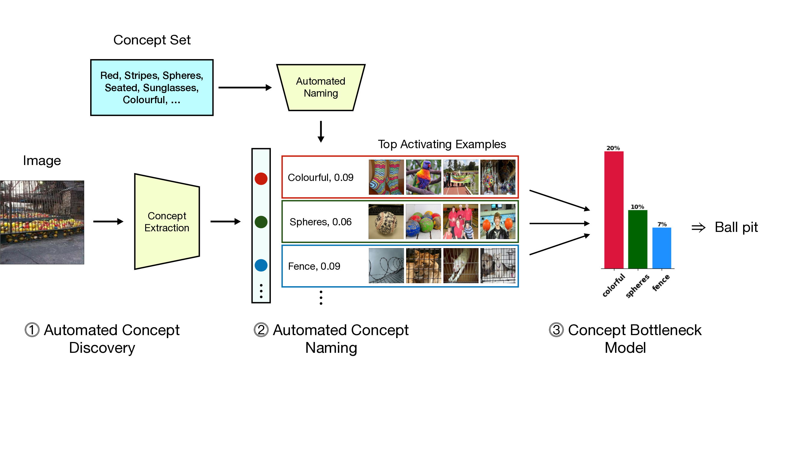
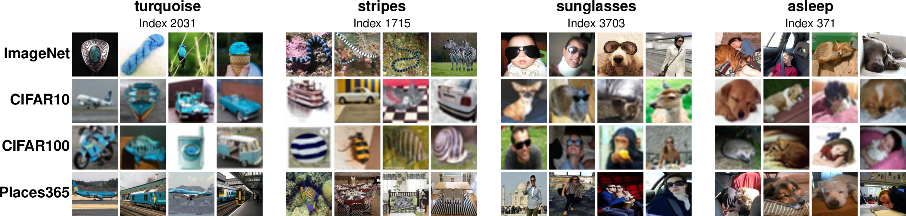
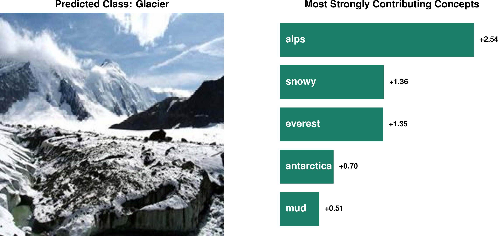

*Figure 1: Overview of the Discover-then-Name CBM approach. (1) A sparse autoencoder extracts disentangled concepts from CLIP feature extractors. (2) Extracted concepts are automatically named by matching dictionary vectors with the closest text embedding in CLIP space. (3) The named concept extractor layer is used as a concept bottleneck to create interpretable models for classification on different datasets.*

## TLDR

- Proposes Discover-then-Name CBM (DN-CBM), a novel approach for creating interpretable Concept Bottleneck Models (CBMs)
- Uses sparse autoencoders to discover concepts from CLIP features in a task-agnostic manner
- Automatically names discovered concepts using CLIP text embeddings
- Achieves competitive performance and interpretability across multiple datasets
- Enables efficient, task-agnostic concept discovery without relying on external language models

## Introduction

In the realm of deep learning, the "black-box" nature of neural networks has long been a concern, especially for critical applications. While post-hoc attribution methods have been popular, they often fail to provide faithful explanations of model decisions. Enter Concept Bottleneck Models (CBMs), a class of inherently interpretable models that express predictions as linear combinations of human-understandable concepts.

However, traditional CBMs face challenges:

1. They typically require pre-selecting concepts based on the downstream task.
2. There's no guarantee that specified concepts are detectable by the model.

In this blog post, we'll dive into a novel approach called Discover-then-Name CBM (DN-CBM), proposed by Sukrut Rao, Sweta Mahajan, Moritz Böhle, and Bernt Schiele from the Max Planck Institute for Informatics. This method flips the script on traditional CBMs by first discovering concepts learned by the model and then naming them for use in classification tasks.

## The DN-CBM Approach

The DN-CBM method consists of three main steps:

1. Concept Discovery
2. Concept Naming
3. CBM Construction

Let's break down each step in detail.

### Step 1: Concept Discovery

The first step involves using a sparse autoencoder (SAE) to extract disentangled concepts from CLIP feature extractors. The SAE is defined as follows:

$$
\text{SAE}(\vec a) = (g \circ \phi \circ f) (\vec a) = \vec W_D^T\;\phi\left(\vec W_E^T \vec a\right)
$$

Where:
- $f(\cdot)$ is a linear encoder with weights $\vec W_{E}\in\mathbb R^{d\times h}$
- $\phi$ is a ReLU non-linearity
- $g(\cdot)$ is a linear decoder with weights $\vec W_D\in\mathbb R^{h\times d}$

The SAE is trained using an $L_2$ reconstruction loss and an $L_1$ sparsity regularization:

$$
\mathcal L_\text{SAE}(\vec a) = \lVert\text{SAE}(\vec a) - \vec a\rVert^2_2 + \lambda_1 \lVert \phi(f(\vec a))\rVert_1
$$

Where $\lambda_1$ is a hyperparameter controlling the sparsity constraint.

The key idea here is to represent CLIP features in a high-dimensional, sparsely activating space. This approach has been shown to yield more interpretable representations in language models, and the authors extend it to vision.

### Step 2: Concept Naming

Once the SAE is trained, the next step is to automatically name the individual feature dimensions in the hidden representation. This is done using a large vocabulary of English words, $\mathcal{V} = \{v_1, v_2, \dots\}$, which are embedded via the CLIP text encoder $\mathcal T$ to obtain word embeddings $\mathcal E = \{\vec e_1, \vec e_2, \dots\}$.

To name each SAE neuron $c$, the method leverages the dictionary vector $\vec p_c$, which corresponds to a column of the decoder weight matrix:

$$
\vec p_c = [\vec W_D]_c \in \mathbb R^{d}
$$

The name $s_c$ for neuron $c$ is assigned based on the closest text embedding in $\mathcal E$:

$$
s_c = \arg\min_{v \in \mathcal{V}} \;\left[\cos\left(\vec p_c,\mathcal{T}(v)\right) \right]
$$

This naming strategy is equivalent to using the SAE to reconstruct a CLIP feature when only the concept to be named is present.

### Step 3: CBM Construction

With the concepts discovered and named, the final step is to construct the Concept Bottleneck Model. For a given labeled dataset $\mathcal D_\text{probe}$, a linear transformation $h(\cdot)$ is trained on the SAE's sparse concept activations, yielding the CBM $t(\cdot)$:

$$
t(\vec x_i) = (\underbrace{h}_\text{Probe} \circ \;\underbrace{\phi \circ f}_\text{SAE}  \; \circ \underbrace{\mathcal I}_\text{CLIP}) (\vec x_i)
$$

The probe is trained using cross-entropy loss with an additional sparsity constraint on the probe weights:

$$
\mathcal L_\text{probe}(\vec x_i) = \text{CE}\left(t(\vec x_i), y_i\right)+ \lambda_2 \lVert\omega\rVert_1
$$

Where $\lambda_2$ is a hyperparameter, $y_i$ is the ground truth label, and $\omega$ denotes the parameters of the linear probe.

## Evaluation and Results

The authors conducted a comprehensive evaluation of DN-CBM across multiple datasets and CLIP architectures. Let's look at some key findings:

### Concept Discovery and Naming

*Figure 2: Examples of named concepts (blocks) and top images activating them from four datasets (rows). The images activating the concept are highly consistent with the concept name across datasets, demonstrating the robustness of the approach.*

The authors found that the discovered concepts were semantically meaningful and consistent across different datasets. Figure 2 shows examples of concepts like "colorful," "spheres," and "fence" being activated by relevant images from various datasets.

To quantitatively evaluate concept consistency and naming accuracy, the authors conducted a user study. They found that concepts discovered by DN-CBM were significantly more semantically consistent than CLIP features, and the consistency increased with alignment to the assigned name.

### Classification Performance

DN-CBM was evaluated on four datasets: ImageNet, Places365, CIFAR-10, and CIFAR-100. The results, shown in Table 1, demonstrate that DN-CBM performs competitively and often outperforms prior work, despite using a common set of concepts across datasets.

| Model | ImageNet | Places365 | CIFAR-10 | CIFAR-100 |
|-------|----------|-----------|----------|-----------|
| Linear Probe | 73.3 | 53.4 | 88.7 | 70.3 |
| Zero Shot | 59.6 | 38.7 | 75.6 | 41.6 |
| LF-CBM | 67.5 | 49.0 | 86.4 | 65.1 |
| LaBo | 68.9 | - | 87.9 | 69.1 |
| CDM | 72.2 | 52.7 | 86.5 | 67.6 |
| DCLIP | 59.6 | 37.9 | - | - |
| DN-CBM (Ours) | 72.9 | 53.5 | 87.6 | 67.5 |

*Table 1: Classification accuracy (%) on CLIP ResNet-50 for various models and datasets.*

### Interpretability

DN-CBM provides both local (image-level) and global (class-level) explanations. Figure 3 shows examples of local explanations, where the model's decision is explained by the top contributing concepts.

*Figure 3: Explaining decisions using DN-CBM. The top concepts contributing to the decision are shown for images from the Places dataset.*

The authors found that DN-CBM classifies based on a diverse set of concepts present in the image, including objects, similar features, higher-level concepts, and things associated with the class, thus aiding interpretability.

### Effectiveness of Interventions

To assess the effectiveness of concept interventions, the authors evaluated DN-CBM on the Waterbirds-100 dataset. They found that intervening to keep only bird-related concepts significantly improved overall and worst-group accuracies, while removing such concepts led to a large drop in accuracies.

## Key Takeaways and Future Directions

1. DN-CBM provides a novel approach to creating interpretable models by first discovering concepts and then naming them, rather than pre-selecting concepts based on the task.

2. The method is task-agnostic and efficient, as it doesn't require querying external language models for task-relevant concepts.

3. DN-CBM achieves competitive performance across multiple datasets while providing interpretable explanations.

4. The approach opens up possibilities for creating more general-purpose CBMs by training on larger datasets and with higher-dimensional concept spaces.

Future research directions could include:

- Exploring the use of larger vocabularies for concept naming to improve granularity and accuracy.
- Investigating ways to mitigate spurious correlations learned by CLIP that may persist in the discovered concepts.
- Scaling up the approach to create "foundational" sparse autoencoders trained on much larger datasets for even more general-purpose CBMs.

In conclusion, DN-CBM represents a significant step forward in the development of interpretable deep learning models. By leveraging sparse autoencoders and CLIP's vision-language alignment, it provides a promising framework for creating models that are both performant and explainable.

## References

1. Radford, A., Kim, J.W., Hallacy, C., Ramesh, A., Goh, G., Agarwal, S., Sastry, G., Askell, A., Mishkin, P., Clark, J., et al.: Learning Transferable Visual Models from Natural Language Supervision. In: ICML. pp. 8748--8763 (2021)

2. Koh, P.W., Nguyen, T., Tang, Y.S., Mussmann, S., Pierson, E., Kim, B., Liang, P.: Concept Bottleneck Models. In: ICML. pp. 5338--5348 (2020)

3. Bricken, T., Templeton, A., Batson, J., Chen, B., Jermyn, A., Conerly, T., Turner, N., Anil, C., Denison, C., Askell, A., Lasenby, R., Wu, Y., Kravec, S., Schiefer, N., Maxwell, T., Joseph, N., Hatfield-Dodds, Z., Tamkin, A., Nguyen, K., McLean, B., Burke, J.E., Hume, T., Carter, S., Henighan, T., Olah, C.: Towards Monosemanticity: Decomposing Language Models With Dictionary Learning. Transformer Circuits Thread (2023)

4. Oikarinen, T., Das, S., Nguyen, L.M., Weng, T.W.: Label-Free Concept Bottleneck Models. In: ICLR (2023)

5. Yang, Y., Panagopoulou, A., Zhou, S., Jin, D., Callison-Burch, C., Yatskar, M.: Language in a Bottle: Language Model Guided Concept Bottlenecks for Interpretable Image Classification. In: CVPR. pp. 19187--19197 (2023)

6. Panousis, K.P., Ienco, D., Marcos, D.: Sparse Linear Concept Discovery Models. In: ICCVW. pp. 2767--2771 (2023)

7. Menon, S., Vondrick, C.: Visual Classification via Description from Large Language Models. In: ICLR (2023)

For the full list of references and to explore the code, visit the project's GitHub repository: [https://github.com/neuroexplicit-saar/Discover-then-Name](https://github.com/neuroexplicit-saar/Discover-then-Name)