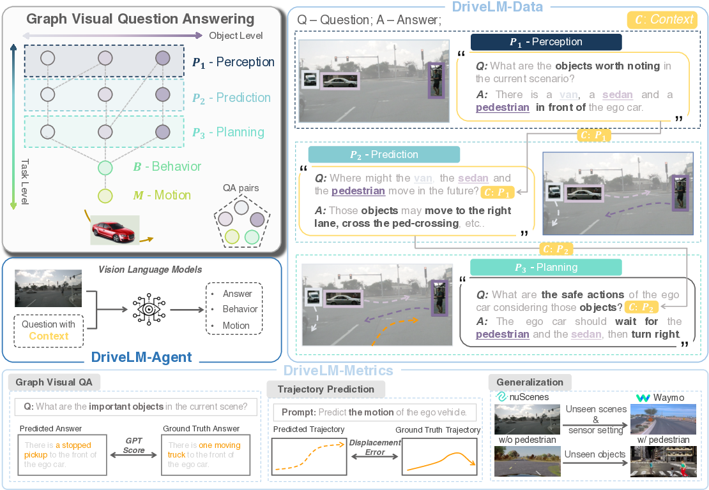

---
title: "DriveLM: Advancing Autonomous Driving with Graph Visual Question Answering"
date: 2024-10-15T11:30:03+00:00
# weight: 1
# aliases: ["/first"]
tags: ['autonomous driving', 'vision-language models', 'graph visual question answering', 'end-to-end driving', 'generalization', 'DriveLM', 'GVQA']
author: "Me"
# author: ["Me", "You"] # multiple authors
showToc: true
TocOpen: true
draft: false
hidemeta: false
comments: false
description: ""
canonicalURL: "https://canonical.url/to/page"
disableHLJS: true # to disable highlightjs
disableShare: false
disableHLJS: false
hideSummary: false
searchHidden: false
ShowReadingTime: true
ShowBreadCrumbs: true
ShowPostNavLinks: true
ShowWordCount: true
ShowRssButtonInSectionTermList: true
UseHugoToc: true
cover:
    image: "<image path/url>" # image path/url
    alt: "<alt text>" # alt text
    caption: "<text>" # display caption under cover
    relative: false # when using page bundles set this to true
    hidden: true # only hide on current single page
editPost:
    URL: "https://github.com/<path_to_repo>/content"
    Text: "Suggest Changes" # edit text
    appendFilePath: true # to append file path to Edit link
---

# DriveLM: Driving with Graph Visual Question Answering

*Figure 1: Overview of DriveLM - A new task, dataset, metrics, and baseline for end-to-end autonomous driving using Graph Visual Question Answering (GVQA)*

## TLDR

- DriveLM introduces Graph Visual Question Answering (GVQA) for end-to-end autonomous driving
- Proposes DriveLM-Data: new datasets built on nuScenes and CARLA with graph-structured QA pairs
- Presents DriveLM-Agent: a baseline approach using vision-language models for GVQA and driving
- Demonstrates improved generalization to unseen sensor configurations and objects
- Provides new metrics and evaluation framework for driving with language models

## Introduction

Autonomous driving has made significant strides in recent years, but current systems still face crucial challenges in generalization and human interaction. Meanwhile, vision-language models (VLMs) have shown impressive capabilities in understanding and reasoning about visual scenes. In this blog post, we'll dive deep into DriveLM, a new framework that bridges these two domains to create more robust and interactive autonomous driving systems.

DriveLM introduces a novel task called Graph Visual Question Answering (GVQA) for end-to-end autonomous driving. Unlike previous approaches that use single-round VQA or scene-level descriptions, GVQA models the multi-step reasoning process that human drivers use. This process involves perception, prediction, and planning stages, all interconnected through logical dependencies at both the object and task levels.

Let's explore the key components of DriveLM and how they contribute to advancing the field of autonomous driving.

## Graph Visual Question Answering (GVQA)

At the heart of DriveLM is the GVQA task. This task formulates the driving decision-making process as a series of interconnected question-answer pairs organized in a directed graph structure. The graph captures the logical dependencies between different stages of reasoning, mirroring how humans process information while driving.

### Graph Structure

The GVQA graph $G = (V, E)$ consists of:

- Vertices $V$: Each vertex represents a QA pair $v = (q, a)$ associated with one or more key objects in the scene.
- Edges $E \subseteq V \times V$: Directed edges $e = (v_p, v_c)$ connect parent QAs to child QAs, representing logical dependencies.

The edges in the graph capture two types of relationships:

1. Object-level: Representing interactions between different objects in the scene.
2. Task-level: Capturing the logical chain of reasoning stages (Perception → Prediction → Planning → Behavior → Motion).

### Reasoning Stages

The GVQA task breaks down the driving process into five main stages:

1. **Perception ($P_1$)**: Identification, description, and localization of key objects in the current scene.
2. **Prediction ($P_2$)**: Estimation of possible actions/interactions of key objects based on perception results.
3. **Planning ($P_3$)**: Possible safe actions for the ego vehicle.
4. **Behavior ($B$)**: Classification of driving decisions.
5. **Motion ($M$)**: Waypoints of the ego vehicle's future trajectory.

The first three stages ($P_{1-3}$) form the core of the graph structure, while Behavior and Motion represent the final outputs of the system.

### Motion and Behavior Representation

To bridge the gap between high-level reasoning and low-level control, DriveLM introduces specific representations for motion and behavior:

**Motion ($M$)** is defined as a set of $N$ points representing the ego vehicle's future trajectory:

$$M = \{(x_0, y_0), (x_1, y_1), ..., (x_N, y_N)\}$$

Each point represents the offset between the future position and the current position at fixed time intervals.

**Behavior ($B$)** serves as an interface between $P_{1-3}$ and $M$. It's derived from the motion trajectory by mapping the mean distances in $x$ and $y$ directions to predefined bins for speed and steering:

$$B = (B_{sp}, B_{st})$$

Where:
- $B_{sp} \in \{\texttt{fast}_2, \texttt{fast}_1, \texttt{moderate}, \texttt{slow}_1, \texttt{slow}_2\}$
- $B_{st} \in \{\texttt{left}_2, \texttt{left}_1, \texttt{straight}, \texttt{right}_1, \texttt{right}_2\}$

This discretization allows for a more interpretable representation of the driving decision.

## DriveLM-Data: New Datasets for GVQA

To support the GVQA task, the authors introduce two new datasets: DriveLM-nuScenes and DriveLM-CARLA. These datasets provide comprehensive annotations for training and evaluating GVQA models.

### DriveLM-nuScenes

Built upon the nuScenes dataset, DriveLM-nuScenes offers:

- A training set of 4072 frames and a validation set of 799 frames
- Scene-level descriptions and frame-level QA pairs
- Annotations for perception, prediction, and planning stages
- 2D bounding boxes for key objects

The annotation process involves:

1. Selecting key frames from video clips
2. Choosing key objects within these frames
3. Annotating frame-level QAs for the selected objects

To ensure high-quality annotations, the process includes multiple rounds of quality checks and post-processing steps.

### DriveLM-CARLA

Based on the CARLA simulator, DriveLM-CARLA provides:

- Automatically generated frame-level QA pairs with graph structure
- Questions about road layout, stop signs, traffic lights, and vehicles
- Support for various sensor outputs (e.g., semantic segmentation, depth maps, LiDAR)
- Consistent object IDs for temporal reasoning

A key component of DriveLM-CARLA is the PDM-Lite expert algorithm, which can handle all 38 scenarios in CARLA Leaderboard 2.0. This expert is used to generate the dataset and provides a strong baseline for comparison.

## DriveLM-Metrics: Evaluating GVQA Performance

To assess the performance of GVQA models, DriveLM introduces a set of metrics covering different aspects of the task:

1. **$P_{1-3}$ VQA Metrics**:
   - SPICE: Measures structural similarity between predicted and ground truth answers
   - GPT Score: Uses ChatGPT to evaluate semantic alignment of answers

2. **Behavior Task Metrics**:
   - Classification Accuracy: Overall accuracy of behavior prediction
   - Speed and Steering Accuracy: Breakdown of behavior accuracy into components

3. **Motion Task Metrics**:
   - ADE (Average Displacement Error): Average L2 distance between predicted and ground truth trajectories
   - FDE (Final Displacement Error): Euclidean distance between predicted and true endpoints
   - Collision Rate: Ratio of test frames where the predicted trajectory collides with objects

These metrics provide a comprehensive evaluation of a model's performance across all stages of the GVQA task.

## DriveLM-Agent: A Baseline Approach

To demonstrate the potential of GVQA for autonomous driving, the authors present DriveLM-Agent, a baseline approach built on top of a general vision-language model (VLM). The key components of DriveLM-Agent are:

### 1. Graph Prompting with Context

DriveLM-Agent uses a novel prompting scheme to model the logical dependencies in the GVQA graph. For each edge $e = (v_p, v_c) \in E$, the QA from the parent node $v_p$ is appended to the question of the current node $v_c$ with a prefix "Context: ". This allows the model to pass forward relevant information based on the graph structure.

During training, the model uses ground truth context following a teacher-forcing approach. During inference, the model is applied interactively in multiple rounds to generate the required context predictions for each child question.

### 2. Trajectory Tokenization for Motion

To enable the VLM to output fine-grained numerical trajectories, DriveLM-Agent adopts a trajectory tokenization scheme inspired by RT-2 [Zitkovich et al., 2023]. The process involves:

1. Analyzing the distribution of future trajectories in the dataset
2. Partitioning each coordinate axis into 256 discrete intervals
3. Mapping each interval to a unique token in the VLM's vocabulary
4. Introducing special start-of-trajectory (SOT) and end-of-trajectory (EOT) tokens

This tokenization allows the model to generate predicted future trajectory sequences as a series of tokens, which can then be translated back into the coordinate space.

### Model Architecture

DriveLM-Agent is built upon the BLIP-2 [Li et al., 2023] vision-language model, chosen for its simplicity and flexibility in fine-tuning. The overall pipeline consists of:

1. $P_{1-3}$ stages for scene understanding and reasoning
2. Behavior stage for aggregating crucial information into a language description of the desired driving action
3. Motion stage for translating the behavior into an executable driving trajectory

## Experimental Results

The authors conducted extensive experiments to evaluate the performance of DriveLM-Agent and demonstrate the benefits of the GVQA approach. Here are some key findings:

### 1. End-to-End Driving Performance

On the DriveLM-nuScenes dataset, DriveLM-Agent achieved competitive results compared to state-of-the-art driving-specific models:

| Method | Behavior Accuracy | ADE | Collision Rate |
|--------|-------------------|-----|----------------|
| UniAD-Single | - | 1.80 | 2.62 |
| DriveLM-Agent | 61.45 | 1.39 | 1.67 |

These results show that with appropriate prompting, VLMs can be surprisingly effective for end-to-end driving tasks.

### 2. Generalization Across Sensor Configurations

To test generalization capabilities, the authors evaluated models trained on DriveLM-nuScenes on the Waymo dataset without further training:

| Method | Behavior Accuracy | ADE | Collision Rate |
|--------|-------------------|-----|----------------|
| UniAD-Single | - | 4.16 | 9.31 |
| DriveLM-Agent | 39.73 | 2.63 | 6.17 |

DriveLM-Agent demonstrated superior generalization to the new sensor configuration, outperforming UniAD-Single significantly.

### 3. Generalization to Unseen Objects

Using DriveLM-CARLA, the authors tested generalization to unseen objects (pedestrians) not present in the training data:

| Method | Behavior Accuracy (CARLA) | Behavior Accuracy (CARLA-ped) |
|--------|---------------------------|-------------------------------|
| TransFuser++ | 70.19 | 8.72 |
| DriveLM-Agent | 59.63 | 4.59 |
| DriveLM-Agent + Pedestrian QA | 52.17 | 27.04 |

By adding a pedestrian-specific question to the GVQA graph, DriveLM-Agent showed significant improvement in handling the unseen object class.

### 4. GVQA Performance

The authors evaluated the performance of DriveLM-Agent on the GVQA task itself, comparing it to off-the-shelf BLIP-2:

| Method | SPICE | GPT Score |
|--------|-------|-----------|
| BLIP-2 (off-the-shelf) | 7.71 | 45.21 |
| DriveLM-Agent | 49.54 | 72.51 |

These results demonstrate the effectiveness of fine-tuning on the DriveLM datasets for improving GVQA performance.

## Conclusion and Future Directions

DriveLM introduces a promising new direction for end-to-end autonomous driving by leveraging the power of vision-language models and graph-structured reasoning. The GVQA task provides a framework for modeling the complex decision-making process involved in driving, while the DriveLM datasets and metrics offer valuable resources for developing and evaluating new approaches.

Some potential areas for future research include:

1. Exploring more advanced VLM architectures and pre-training strategies for driving-specific tasks
2. Investigating closed-loop planning and control using the GVQA framework
3. Extending the DriveLM datasets to cover a wider range of driving scenarios and object classes
4. Developing more efficient inference techniques to enable real-time performance for practical applications

As the field of autonomous driving continues to evolve, approaches like DriveLM that combine the strengths of vision-language models with domain-specific knowledge and reasoning structures are likely to play an increasingly important role in creating safer, more robust, and more interpretable autonomous driving systems.

## References

1. Chen, L., Wu, P., Chitta, K., Jaeger, B., Geiger, A., Li, H. (2023). End-to-end autonomous driving: Challenges and frontiers. arXiv preprint arXiv:2306.16927.

2. Li, J., Li, D., Savarese, S., Hoi, S. (2023). BLIP-2: Bootstrapping language-image pre-training with frozen image encoders and large language models. In ICML.

3. Zitkovich, B., Yu, T., Xu, S., Xu, P., Xiao, T., Xia, F., Wu, J., Wohlhart, P., Welker, S., et al. (2023). RT-2: Vision-language-action models transfer web knowledge to robotic control. In CoRL.

4. Caesar, H., Bankiti, V., Lang, A.H., Vora, S., Liong, V.E., Xu, Q., Krishnan, A., Pan, Y., Baldan, G., Beijbom, O. (2020). nuScenes: A multimodal dataset for autonomous driving. In CVPR.

5. Dosovitskiy, A., Ros, G., Codevilla, F., Lopez, A., Koltun, V. (2017). CARLA: An open urban driving simulator. In CoRL.

6. Hu, Y., Yang, J., Chen, L., Li, K., Sima, C., Zhu, X., Chai, S., Du, S., Lin, T., et al. (2023). Planning-oriented autonomous driving. In CVPR.

7. Jaeger, B., Chitta, K., Geiger, A. (2023). Hidden biases of end-to-end driving models. In ICCV.

For the full list of references and to explore the code and datasets, visit the [DriveLM GitHub repository](https://github.com/OpenDriveLab/DriveLM).

