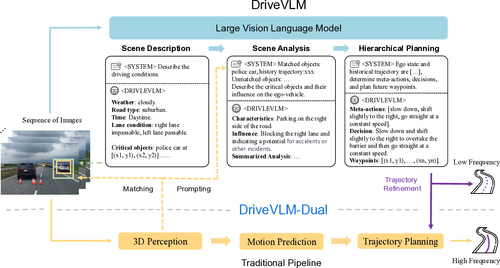
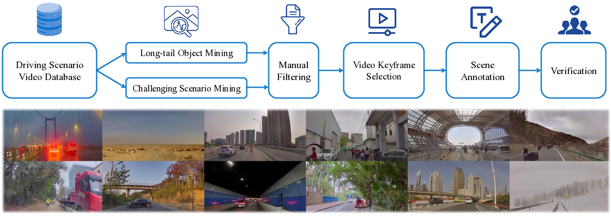
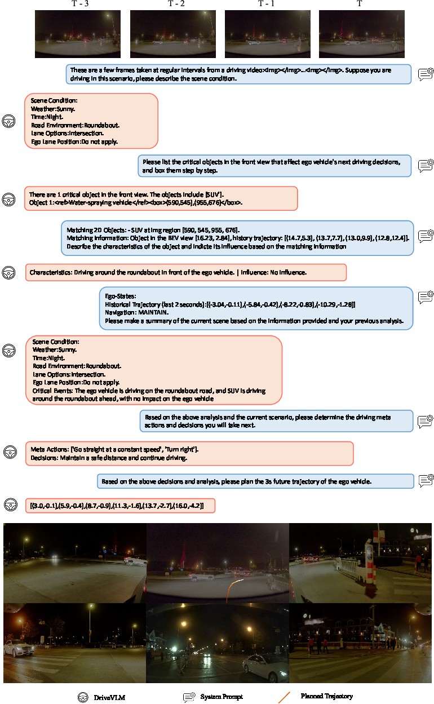

# DriveVLM: Harnessing Vision-Language Models for Advanced Autonomous Driving

*Figure 1: Overview of DriveVLM and DriveVLM-Dual model pipelines*

## TL;DR
- DriveVLM leverages vision-language models (VLMs) to enhance scene understanding and planning for autonomous driving
- A novel Chain-of-Thought process with scene description, analysis, and hierarchical planning modules
- DriveVLM-Dual combines DriveVLM with traditional autonomous driving components for improved spatial reasoning and real-time planning
- New Scene Understanding for Planning (SUP) task and SUP-AD dataset introduced for evaluating complex driving scenarios
- State-of-the-art performance achieved on nuScenes and SUP-AD datasets, with successful real-world vehicle deployment

## Introduction

Autonomous driving has been a hot research topic for decades, promising to revolutionize transportation. However, a major challenge remains: understanding and navigating complex, unpredictable scenarios in urban environments. These can include adverse weather conditions, intricate road layouts, and unexpected human behaviors.

Traditional autonomous driving systems, which typically consist of 3D perception, motion prediction, and planning modules, often struggle with these complex scene understanding challenges. 3D perception is usually limited to detecting familiar objects, motion prediction focuses on trajectory-level actions, and planning may not fully account for decision-level interactions between objects and vehicles.

In this blog post, we'll dive into DriveVLM, a novel autonomous driving system that aims to address these challenges by leveraging the power of Vision-Language Models (VLMs). We'll explore how DriveVLM and its dual system, DriveVLM-Dual, work to enhance scene understanding and planning capabilities. We'll also look at the new Scene Understanding for Planning (SUP) task and dataset introduced by the authors, and examine the impressive results achieved on both public and proprietary benchmarks.

## DriveVLM: Leveraging Vision-Language Models for Autonomous Driving

DriveVLM is designed to capitalize on the recent advancements in Vision-Language Models, which have shown remarkable capabilities in visual comprehension and reasoning. The system employs a Chain-of-Thought (CoT) process with three key modules:

1. Scene Description
2. Scene Analysis
3. Hierarchical Planning

Let's break down each of these modules to understand how they contribute to DriveVLM's capabilities.

### Scene Description Module

The scene description module serves two primary functions:

1. **Environment Description**: This component generates a linguistic description $E$ of the driving environment, including:
   - Weather conditions ($E_\text{weather}$)
   - Time of day ($E_\text{time}$)
   - Road conditions ($E_\text{road}$)
   - Lane conditions ($E_\text{lane}$)

2. **Critical Object Identification**: Unlike traditional perception systems that detect all objects within range, DriveVLM focuses on identifying critical objects that are most likely to influence the current scenario. Each critical object $O_c$ is represented by:
   - Object category $c$
   - Approximate bounding box coordinates $b(x1, y1, x2, y2)$ on the image

The critical object information is mapped to corresponding language tokens, allowing seamless integration with the subsequent modules.

### Scene Analysis Module

The scene analysis module goes beyond traditional trajectory prediction to provide a more comprehensive analysis of the current scene. It characterizes critical objects in three aspects:

1. **Static attributes** $C_s$: Inherent properties of objects (e.g., visual cues of a roadside billboard)
2. **Motion states** $C_m$: Object dynamics over time (position, direction, action)
3. **Particular behaviors** $C_b$: Special actions or gestures that could directly influence driving decisions

After analyzing these characteristics, DriveVLM predicts the potential influence $I$ of each critical object on the ego vehicle.

### Hierarchical Planning Module

The hierarchical planning module generates driving plans in three progressive stages:

1. **Meta-actions** $\boldsymbol{A}$: A sequence of short-term decisions representing the driving strategy. These fall into 17 categories, including acceleration, deceleration, turning, lane changes, and more.

2. **Decision Description** $\boldsymbol{D}$: A more detailed articulation of the driving strategy, containing:
   - Action $\mathcal{A}$: The specific meta-action (e.g., turn, wait, accelerate)
   - Subject $\mathcal{S}$: The interacting object (e.g., pedestrian, traffic signal, specific lane)
   - Duration $\mathcal{D}$: The temporal aspect of the action

3. **Trajectory Waypoints** $\boldsymbol{W}$: A series of waypoints $W = \{w_1, w_2, ..., w_n\}$, where $w_i=(x_i, y_i)$, depicting the vehicle's path over a future period with predetermined intervals $\Delta t$.

## DriveVLM-Dual: Combining VLMs with Traditional Autonomous Driving

While VLMs excel in visual understanding, they have limitations in spatial grounding and reasoning, and their computational intensity can pose challenges for onboard inference speed. To address these issues, the authors propose DriveVLM-Dual, a hybrid system that combines DriveVLM with traditional autonomous driving components.

DriveVLM-Dual incorporates two key strategies:

1. **Integrating 3D Perception**: This strategy involves matching 3D object detections with the critical objects identified by DriveVLM. The process can be summarized as follows:

   - 3D objects are represented as $O_\text{3D} = \{ c_\text{3D}^i, b_\text{3D}^i \}$, where $b_\text{3D}^i$ is the 3D bounding box and $c_\text{3D}^i$ is the category.
   - 3D bounding boxes are projected onto 2D images to derive 2D bounding boxes $b_\text{2D}^i$.
   - IoU matching is performed between $b_\text{2D}^i$ and the bounding boxes $b_{c}^j$ of previously identified critical objects $O_\text{critical} = \{ c_{c}^j, b_{c}^j \}$.
   - Matched critical objects $O_{c}^\text{matched}$ are defined as:

     $$O_{c}^\text{matched} = \{ c_{c}^j, b_{c}^j \}, \quad \text{if } c_{c}^j = c_\text{2D}^i \text{ and } \text{aIoU}(b_{c}^j, b_\text{2D}^i) > \tau$$

     where $\text{aIoU}(b_c^j, b_\text{2D}^i) = \frac{S_{b_c^j \cap b_\text{2D}^i}}{S_{b_\text{2D}^i}}$

   - For matched objects, 3D information is used to assist in object analysis, while unmatched objects rely solely on image-derived language tokens.

2. **High-frequency Trajectory Refinement**: This strategy combines DriveVLM's advanced capabilities with the efficiency of traditional planning methods:

   - DriveVLM generates a low-frequency trajectory $W_\text{slow}$.
   - A classical planner uses $W_\text{slow}$ as a reference for high-frequency trajectory refinement.
   - For optimization-based planners, $W_\text{slow}$ serves as the initial solution.
   - For neural network-based planners, $W_\text{slow}$ is combined with additional input features $f$ to produce a refined trajectory $W_\text{fast}$:

     $$W_{\text{fast}} = \text{Planner}([W_\text{slow}, f])$$

This dual system design allows for efficient adaptation to varying complexity in driving scenarios, similar to the human brain's slow and fast thinking processes.

## Scene Understanding for Planning (SUP) Task and Dataset

To fully exploit the potential of DriveVLM and DriveVLM-Dual in handling complex and long-tail driving scenarios, the authors introduce a new task called Scene Understanding for Planning (SUP). They also propose a set of evaluation metrics and a data mining and annotation protocol to curate a scene understanding and planning dataset (SUP-AD).

### Task Definition

The SUP task is defined as follows:

**Input**: 
- Multi-view videos $\mathcal{V}$ from surrounding cameras
- (Optional) 3D perception results $\mathcal{P}$ from a perception module

**Output**:
1. Scene Description $E$: Weather condition, time, road condition, and lane conditions
2. Scene Analysis $S$: Object-level analysis and scene-level summary
3. Meta Actions $A$: A sequence of actions representing task-level maneuvers
4. Decision Description $D$: A detailed account of driving decisions
5. Trajectory Waypoints $W$: Waypoints outlining the planned trajectory of the ego vehicle

### Evaluation Metrics

The evaluation of DriveVLM focuses on two main aspects:

1. **Scene Description/Analysis Evaluation**: Due to the subjective nature of scene descriptions, the authors employ a pre-trained LLM (GPT-4) to compare generated descriptions with human-annotated ground truth. The LLM extracts and scores individual pieces of information, considering matches, partial matches, and hallucinations.

2. **Meta-action Evaluation**: This process uses dynamic programming to compare model-generated sequences with manually annotated ground truth. The evaluation considers:
   - The quantity and sequential arrangement of matched meta-actions
   - Unequal weighting of different meta-actions (e.g., "conservative actions" like "Slow Down" or "Wait" incur reduced penalties)
   - Potential semantic equality among different meta-action sequences (GPT-4 is used to generate variant sequences with comparable meanings)

The final score for meta-action evaluation is calculated as:

$$Score_{\,\text{action}} = \frac{S^{\,r,\,c}}{N_{r}}$$

where $S^{\,r,\,c}$ is the optimal total score from the dynamic programming matrix, and $N_{r}$ is the length of the selected reference meta-action sequence.

### Dataset Construction

The authors propose a comprehensive data mining and annotation pipeline to construct the SUP-AD dataset. The process involves:

1. **Long-tail Object Mining**: Using a CLIP-based search engine to mine driving data for predefined long-tail object categories.
2. **Challenging Scenario Mining**: Identifying challenging driving scenarios based on the variance of recorded driving maneuvers.
3. **Keyframe Selection**: Choosing a representative frame for annotation, typically 0.5s to 1s before a significant change in speed or direction.
4. **Scene Annotation**: Employing annotators to perform scene description, scene analysis, and planning annotation, with each annotation verified by three annotators for accuracy and consistency.

*Figure 2: The proposed data mining and annotation pipeline for constructing the SUP-AD dataset*

## Experiments and Results

The authors conducted extensive experiments on both the nuScenes dataset and their proposed SUP-AD dataset to evaluate the performance of DriveVLM and DriveVLM-Dual.

### SUP-AD Dataset Results

On the SUP-AD dataset, DriveVLM (using Qwen-VL as its backbone) achieved the best performance compared to other large vision-language models and GPT-4V:

| Method | Scene Description | Meta-actions |
|--------|-------------------|--------------|
| Fine-tuning w/ Lynx | 0.46 | 0.15 |
| Fine-tuning w/ CogVLM | 0.49 | 0.22 |
| GPT-4V | 0.38 | 0.19 |
| DriveVLM w/ Qwen | **0.71** | **0.37** |

### nuScenes Dataset Results

On the nuScenes validation dataset, DriveVLM-Dual achieved state-of-the-art performance when cooperating with VAD:

| Method | L2 (m) ↓ | Collision (%) ↓ |
|--------|----------|-----------------|
| UniAD | 1.03 | 0.31 |
| VAD-Base | 0.37 | 0.14 |
| DriveVLM | 0.40 | 0.27 |
| **DriveVLM-Dual** | **0.31** | **0.10** |

These results demonstrate that DriveVLM and DriveVLM-Dual not only excel in understanding complex scenes but also perform well in ordinary scenarios.

## Ablation Studies and Qualitative Results

The authors conducted ablation studies to understand the significance of different components in DriveVLM:

1. **Model Design**: The inclusion of critical object analysis and 3D perception data significantly improved the model's performance.
2. **Traditional AD Pipeline**: DriveVLM-Dual showed good adaptability to different traditional autonomous driving pipelines, highlighting the efficacy and robustness of the dual system design.

Qualitative results demonstrate DriveVLM's ability to:
- Recognize slowly moving vehicles and plan overtaking maneuvers
- Identify unconventional vehicles and obstacles (e.g., fallen trees)
- Interpret traffic police hand gestures
- Navigate complex road environments like roundabouts

*Figure 3: DriveVLM successfully recognizes a roundabout and generates a curved trajectory plan*

## Onboard Deployment and Testing

The authors successfully deployed DriveVLM-Dual on an autonomous vehicle equipped with two OrinX processors. They achieved an average inference speed of 410 ms on OrinX, making real-time operation feasible. The deployment involved several optimizations:

1. **Base LLM Selection**: The Qwen series models (with fewer than 4 billion parameters) were chosen for their superior performance on the Orin architecture.
2. **Visual Encoder**: SigLIP-L-384 with Position Embedding interpolation was selected for high-resolution input processing.
3. **Visual Token Compression**: LDPNetv2 was implemented to reduce the number of image tokens by 75% without compromising performance.
4. **Video Input**: A short-term memory-bank strategy was employed to handle temporal context.
5. **Speculative Sampling**: The Eagle method achieved a 2.7x speedup in decode latency compared to Medusa's 2.17x, enabling real-time vehicle deployment.

## Conclusion and Future Directions

DriveVLM and DriveVLM-Dual represent significant advancements in autonomous driving technology, particularly in interpreting complex driving environments. By leveraging the power of Vision-Language Models and combining them with traditional autonomous driving approaches, these systems offer improved scene understanding, planning capabilities, and real-time performance.

The introduction of the Scene Understanding for Planning (SUP) task and the SUP-AD dataset provides valuable resources for evaluating and advancing autonomous driving systems in complex scenarios. The successful onboard deployment and testing of DriveVLM-Dual demonstrate its potential for real-world applications.

Future research directions could include:
1. Further optimization of the VLM components for even faster inference on edge devices
2. Expansion of the SUP-AD dataset to cover an even wider range of driving scenarios
3. Integration of DriveVLM with other emerging technologies in autonomous driving, such as sensor fusion or reinforcement learning approaches

As autonomous driving technology continues to evolve, systems like DriveVLM that can effectively handle complex and unpredictable scenarios will play a crucial role in making self-driving vehicles safer and more reliable in real-world conditions.

## References

[1] Zeng, Y., Zhang, H., Zheng, J., Xia, J., Wei, G., Wei, Y., Zhang, Y., and Kong, T. (2023). What matters in training a gpt4-style language model with multimodal inputs? arXiv preprint arXiv:2307.02469.

[2] Xu, Z., Zhang, Y., Xie, E., Zhao, Z., Guo, Y., Wong, K. K., Li, Z., and Zhao, H. (2023). Drivegpt4: Interpretable end-to-end autonomous driving via large language model. arXiv preprint arXiv:2310.01412.

[3] Zhu, D., Chen, J., Shen, X., Li, X., and Elhoseiny, M. (2023). Minigpt-4: Enhancing vision-language understanding with advanced large language models. arXiv preprint arXiv:2304.10592.

[4] Liu, H., Li, C., Wu, Q., and Lee, Y. J. (2023). Visual instruction tuning. arXiv preprint arXiv:2304.08485.

[5] Bai, J., Bai, S., Yang, S., Wang, S., Tan, S., Wang, P., Lin, J., Zhou, C., and Zhou, J. (2023). Qwen-vl: A versatile vision-language model for understanding, localization, text reading, and beyond. arXiv preprint arXiv:2308.12966.

[6] Caesar, H., Bankiti, V., Lang, A. H., Vora, S., Liong, V. E., Xu, Q., Krishnan, A., Pan, Y., Baldan, G., and Beijbom, O. (2020). nuscenes: A multimodal dataset for autonomous driving. In Proceedings of the IEEE/CVF conference on computer vision and pattern recognition, pages 11621-11631.

[7] Jiang, B., Chen, S., Xu, Q., Liao, B., Chen, J., Zhou, H., Zhang, Q., Liu, W., Huang, C., and Wang, X. (2023). Vad: Vectorized scene representation for efficient autonomous driving. arXiv preprint arXiv:2303.12077.

[8] Wei, J., Wang, X., Schuurmans, D., Bosma, M., Xia, F., Chi, E., Le, Q. V., Zhou, D., et al. (2022). Chain-of-thought prompting elicits reasoning in large language models. Advances in Neural Information Processing Systems, 35:24824-24837.

[9] Dosovitskiy, A., Beyer, L., Kolesnikov, A., Weissenborn, D., Zhai, X., Unterthiner, T., Dehghani, M., Minderer, M., Heigold, G., Gelly, S., et al. (2020). An image is worth 16x16 words: Transformers for image recognition at scale. arXiv preprint arXiv:2010.11929.

[10] OpenAI. (2023). GPT-4 Technical Report.

