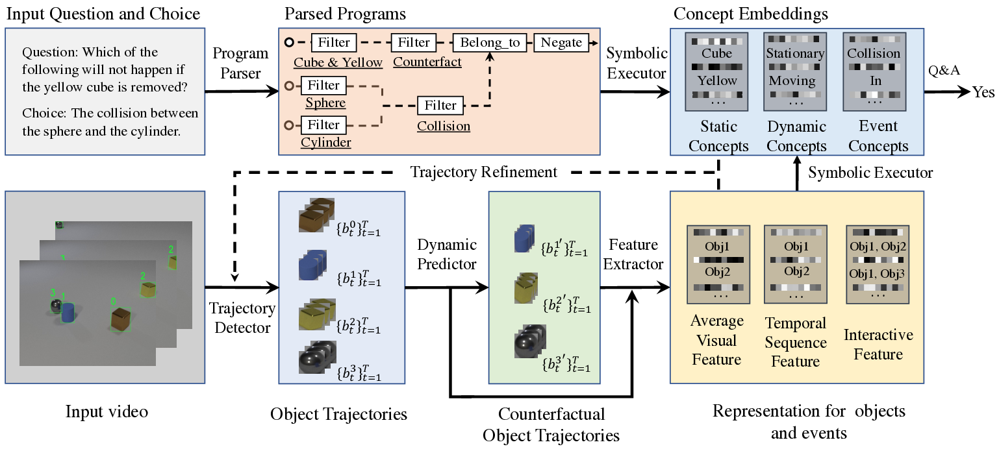
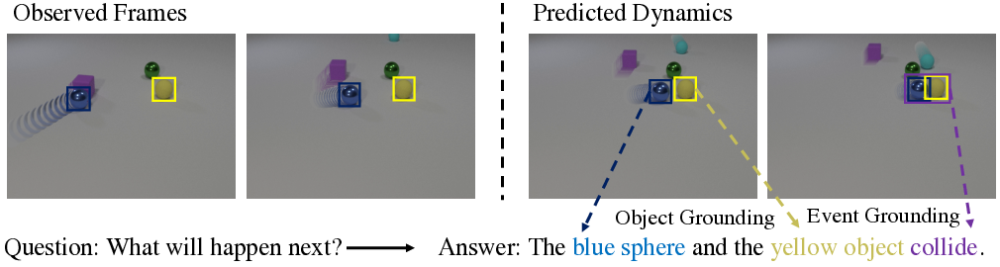

---
title: "Grounding Physical Concepts Through Dynamic Visual Reasoning: A Deep Dive into the Dynamic Concept Learner"
date: 2024-11-05T11:03:56.994338
# weight: 1
# aliases: ["/first"]
tags: ['dynamic visual reasoning', 'neural-symbolic AI', 'physical concept grounding', 'video understanding', 'causal reasoning', 'CLEVRER benchmark', 'object tracking', 'dynamics prediction', 'program execution']
author: "Me"
# author: ["Me", "You"] # multiple authors
showToc: true
TocOpen: true
draft: false
hidemeta: false
comments: false
description: ""
canonicalURL: "https://canonical.url/to/page"
disableHLJS: true # to disable highlightjs
disableShare: false
disableHLJS: false
hideSummary: false
searchHidden: false
ShowReadingTime: true
ShowBreadCrumbs: true
ShowPostNavLinks: true
ShowWordCount: true
ShowRssButtonInSectionTermList: true
UseHugoToc: true
cover:
    image: "<image path/url>" # image path/url
    alt: "<alt text>" # alt text
    caption: "<text>" # display caption under cover
    relative: false # when using page bundles set this to true
    hidden: true # only hide on current single page
editPost:
    URL: "https://github.com/<path_to_repo>/content"
    Text: "Suggest Changes" # edit text
    appendFilePath: true # to append file path to Edit link
---

# Grounding Physical Concepts of Objects and Events Through Dynamic Visual Reasoning

*Figure 1: Overview of the Dynamic Concept Learner (DCL) architecture*

## TLDR

- The Dynamic Concept Learner (DCL) is a unified neural-symbolic framework for recognizing objects and events in videos and analyzing their temporal and causal structures.
- DCL learns to ground physical concepts and reason about dynamics purely from videos and question-answer pairs, without requiring explicit annotations.
- Key components: object trajectory detector, video feature extractor, dynamics predictor, language program parser, and neural symbolic executor.
- Achieves state-of-the-art performance on the CLEVRER video reasoning benchmark.
- Generalizes well to new tasks like video-text retrieval and spatio-temporal grounding.

## Introduction

Understanding the physical world around us requires not just recognizing objects and events, but also reasoning about their dynamics, causal relationships, and temporal structures. For example, to answer a question like "What will happen next?" based on a video clip, we need to:

1. Detect and track objects
2. Predict their future trajectories  
3. Analyze temporal relationships between events
4. Ground visual concepts to language

While deep learning has made great strides in visual recognition, reasoning about physics and causality remains a significant challenge for AI systems. In this blog post, I'll dive into an exciting new approach called the Dynamic Concept Learner (DCL) that aims to tackle this problem.

The DCL, proposed by Chen et al. in their paper ["Grounding Physical Concepts of Objects and Events Through Dynamic Visual Reasoning"](http://dcl.csail.mit.edu), is a unified neural-symbolic framework that can learn to recognize objects and events in videos, predict their dynamics, and reason about their causal relationships - all without requiring explicit annotations of object properties or physical events during training.

Let's explore how DCL works and why it represents an important step forward for AI systems that can understand the physical world.

## The Challenge of Dynamic Visual Reasoning

Before we dive into DCL, it's worth understanding why dynamic visual reasoning is such a difficult problem. Consider the example in Figure 1:

To answer the question "What will happen next?", an AI system needs to:

1. Detect and track the blue sphere and yellow object
2. Understand concepts like "sphere", "blue", "yellow", and "collide"
3. Predict the future trajectories of the objects
4. Reason about potential collisions

This requires a combination of:

- Object detection and tracking
- Concept grounding (mapping visual features to language)
- Physics simulation
- Causal reasoning

Previous approaches have often relied on dense supervision - explicitly labeling object properties, trajectories, and collision events in training data. But this is impractical for real-world applications. The key innovation of DCL is learning these concepts implicitly from videos paired with natural language questions and answers.

## The Dynamic Concept Learner Architecture

Now let's look at how DCL tackles this challenge. The architecture consists of five main components:

1. Object Trajectory Detector
2. Video Feature Extractor  
3. Dynamic Predictor
4. Language Program Parser
5. Neural Symbolic Executor

Here's how they work together:

### 1. Object Trajectory Detector

The first step is to detect objects in each video frame and associate them across frames to form trajectories. DCL uses a pre-trained region proposal network to generate object proposals, then links them across frames using a novel scoring function:

$$s_l(b_t^i, b_{t+1}^j) = s_c(b_t^i) + s_c(b_{t+1}^j) + \lambda_1 \cdot IoU(b_t^i, b_{t+1}^j) + \lambda_2 \cdot f_\text{appear}(\{b_m^i\}_{m=0}^t, b_{t+1}^j)$$

Where:
- $s_c(b)$ is the confidence score of a proposal
- $IoU$ is the intersection over union
- $f_\text{appear}$ measures attribute similarity

This allows DCL to maintain consistent object identities even when objects are moving quickly or occluded.

### 2. Video Feature Extractor

Next, DCL extracts three types of features:

1. Average visual features ($f^v \in \mathbb{R}^{N\times D_1}$) for static attributes
2. Temporal sequence features ($f^s \in \mathbb{R}^{N\times4T}$) for dynamic attributes and unary events
3. Interactive features ($f^c \in \mathbb{R}^{K \times N \times N \times D_2}$) for collision events

These features capture both the appearance and dynamics of objects in the video.

### 3. Dynamic Predictor

To reason about future states and counterfactuals, DCL uses a graph neural network-based dynamics predictor. It maintains a graph where nodes represent objects and edges represent their relationships. The predictor performs message passing to simulate object interactions and predict future states.

The dynamics are modeled as:

$$e_{n, k}^o = f_O^{enc}(||_{t=k-w}^k(b^n_t||p^n_t))$$
$$e_{n_1, n_2, k}^r = f_R^{enc}(||_{t=k-w}^k(b^{n_1}_t-b^{n_2}_t))$$

$$e_{n_1,n_2, k}^l = f_R(e_{n_1, n_2, k}^r, h_{n_1, k}^{l-1}, h_{n_2, k}^{l-1})$$
$$h_{n, k}^l = f_O(e_{n, k}^o, \sum_{n_1, n_2}e_{n_1, n_2, k}^l, h_{n,k}^{l-1})$$

$$\hat{b}_{k+1}^n = f_{O_1}^{pred}(e^o_{n, k}, h_{n, k}^L)$$
$$\hat{p}_{k+1}^n = f_{O_2}^{pred}(e^o_{n, k}, h_{n, k}^L)$$

Where:
- $b^n_t$ and $p^n_t$ are object coordinates and RGB patches
- $f_O^{enc}$ and $f_R^{enc}$ are encoders for objects and relations
- $f_R$ and $f_O$ are propagators for relations and objects
- $f_{O_1}^{pred}$ and $f_{O_2}^{pred}$ predict future coordinates and RGB patches

### 4. Language Program Parser

To handle complex questions, DCL parses natural language into executable programs. It uses a sequence-to-sequence model with attention to translate questions into a series of symbolic operations (e.g., filtering objects, querying attributes, counting).

### 5. Neural Symbolic Executor

Finally, the neural symbolic executor runs the parsed programs on the extracted features to answer questions. It grounds concepts by matching object and event representations to learned embeddings:

$$P^{cube}_n = \sum_{sa \in SA}(i_{sa}^{Cube} \frac{cos(s^{cube}, m^{sa}(f^v_n)) -\delta }{\lambda})$$

Where:
- $s^{cube}$ is the embedding for the "cube" concept
- $m^{sa}$ maps visual features to the concept space
- $\delta$ and $\lambda$ are scaling parameters

The executor is fully differentiable, allowing end-to-end training of the entire system.

## Training and Inference

DCL is trained in multiple stages:

1. Extract object trajectories and optimize the feature extractor and concept embeddings on descriptive and explanatory questions.
2. Quantize static attributes and refine object trajectories.
3. Train the dynamics predictor on refined trajectories.
4. Train the full model on all question types.

During inference, DCL:

1. Detects object trajectories
2. Predicts future and counterfactual dynamics
3. Extracts features for observed and predicted scenes
4. Parses questions into programs
5. Executes programs to answer questions

## Results and Insights

DCL achieves state-of-the-art performance on the CLEVRER benchmark, which tests descriptive, explanatory, predictive, and counterfactual reasoning about physical scenes. Importantly, it does this without requiring any explicit annotations of object properties or collision events during training.

Here are some key results:

*Table 1: Question-answering accuracy on CLEVRER*

We can see that DCL outperforms previous methods across all question types, with particularly large gains on predictive and counterfactual questions. This demonstrates its strong capability for temporal and causal reasoning.

What's especially impressive is that DCL learns to ground object and event concepts purely from question-answering, without explicit labels:

*Table 2: Evaluation of video concept learning*

The model achieves high accuracy in recognizing static attributes (color, shape, material), dynamic attributes (moving, stationary), and events (in, out, collision).

## Generalization to New Tasks

To further evaluate DCL's capabilities, the authors introduced two new benchmarks:

1. CLEVRER-Grounding: Localizing objects and events in space and time based on natural language descriptions.
2. CLEVRER-Retrieval: Finding semantically related videos for text queries and vice versa.

DCL generalizes remarkably well to these new tasks without any additional training:

*Table 3 & 4: Results on CLEVRER-Grounding and CLEVRER-Retrieval*

This demonstrates that DCL learns genuinely useful representations of objects, events, and their relationships that transfer to new contexts.

## Key Takeaways and Future Directions

The Dynamic Concept Learner represents a significant step forward in AI systems that can understand and reason about the physical world. Some key innovations and insights:

1. **Unified neural-symbolic architecture**: By combining neural networks for perception with symbolic reasoning, DCL can handle complex queries while maintaining interpretability.

2. **Learning from natural supervision**: DCL shows that it's possible to learn rich physical concepts without dense annotations, opening up possibilities for scaling to real-world data.

3. **Temporal and causal reasoning**: The dynamics predictor and program executor allow DCL to reason about future states and counterfactuals, crucial for understanding causality.

4. **Transferable representations**: The learned concepts generalize well to new tasks, suggesting DCL captures meaningful physical knowledge.

Some exciting directions for future work:

- Extending to more complex real-world videos and physical interactions
- Incorporating more advanced physics simulation for long-term prediction
- Exploring few-shot learning of new concepts
- Integrating with robotic systems for physical interaction and manipulation

## Conclusion

The Dynamic Concept Learner demonstrates how combining neural perception, symbolic reasoning, and physics-based simulation can lead to AI systems with a deeper understanding of the physical world. By learning from natural language supervision, it opens up exciting possibilities for scaling to real-world data and tasks.

As we continue to develop AI systems that can reason about physics and causality, we move closer to machines that can truly understand and interact with the world around us. The principles behind DCL - unified neural-symbolic architectures, learning from natural supervision, and explicit modeling of dynamics - are likely to play a crucial role in this journey.

What do you think about this approach? How might systems like DCL impact fields like robotics, autonomous vehicles, or scientific discovery? I'd love to hear your thoughts and discuss further in the comments!

## References

1. Chen, Z., Mao, J., Wu, J., Wong, K. Y. K., Tenenbaum, J. B., & Gan, C. (2021). Grounding Physical Concepts of Objects and Events Through Dynamic Visual Reasoning. [http://dcl.csail.mit.edu](http://dcl.csail.mit.edu)

2. Yi, K., Gan, C., Li, Y., Kohli, P., Wu, J., Torralba, A., & Tenenbaum, J. B. (2020). CLEVRER: Collision Events for Video Representation and Reasoning. In ICLR.

3. Johnson, J., Hariharan, B., van der Maaten, L., Fei-Fei, L., Lawrence Zitnick, C., & Girshick, R. (2017). CLEVR: A Diagnostic Dataset for Compositional Language and Elementary Visual Reasoning. In CVPR.

4. Mao, J., Gan, C., Kohli, P., Tenenbaum, J. B., & Wu, J. (2019). The Neuro-Symbolic Concept Learner: Interpreting Scenes, Words, and Sentences From Natural Supervision. In ICLR.

5. Li, Y., Wu, J., Zhu, J. Y., Tenenbaum, J. B., Torralba, A., & Tedrake, R. (2019). Propagation Networks for Model-Based Control Under Partial Observation. In ICRA.

