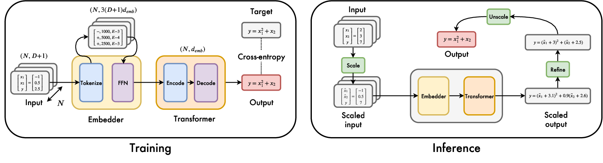
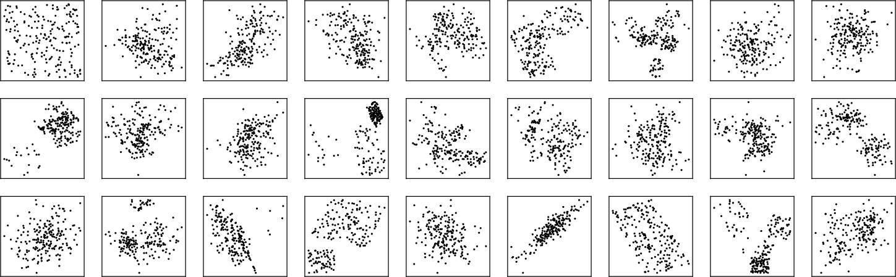
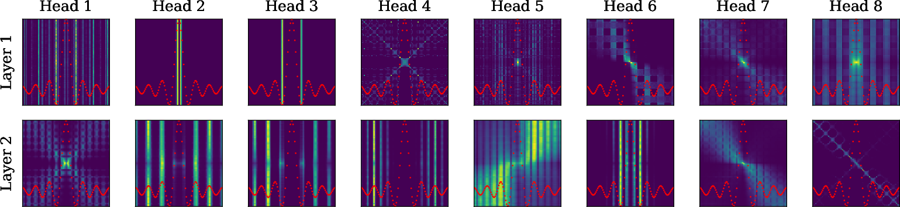
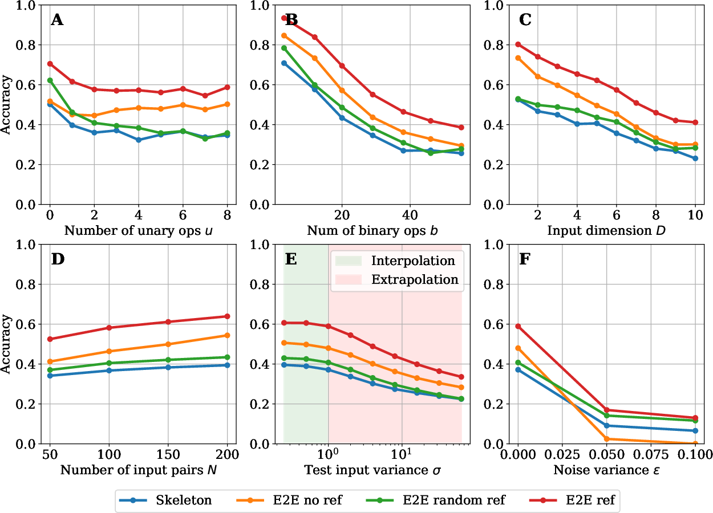
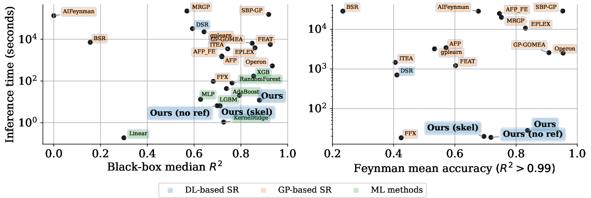
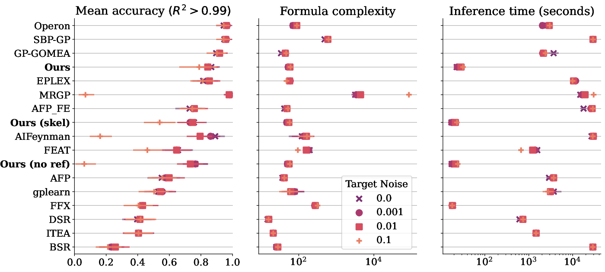

# End-to-End Symbolic Regression with Transformers

*Figure 1: Overview of the end-to-end symbolic regression model using Transformers*

## TL;DR

- This paper introduces an end-to-end approach for symbolic regression using Transformer models
- The model directly predicts full mathematical expressions including constants, rather than just equation skeletons
- It achieves competitive performance with state-of-the-art genetic programming methods while being orders of magnitude faster
- Key innovations include a hybrid symbolic-numeric vocabulary and inference techniques like bagging to scale to larger problems

## Introduction

Symbolic regression - the task of discovering mathematical expressions that describe relationships in data - has long been a challenging problem in machine learning and scientific discovery. Traditional approaches like genetic programming can be effective but are computationally expensive. Recent work has explored using neural networks, particularly Transformers, for this task. However, most neural approaches still rely on a two-step process of predicting an equation skeleton and then fitting constants separately.

In this paper, the authors propose a novel end-to-end approach using Transformers that directly predicts full mathematical expressions, including constants. This allows the model to leverage the power of neural networks for both structure and parameter prediction in a unified way. The authors demonstrate that this approach can achieve accuracy competitive with state-of-the-art genetic programming methods while being orders of magnitude faster at inference time.

Let's dive into the key components and innovations of this work.

## Data Generation

A critical aspect of training neural networks for symbolic regression is generating a diverse and representative dataset of mathematical expressions. The authors use a sophisticated procedure to sample random functions and corresponding input-output pairs.

### Function Generation

Functions are generated as random trees with mathematical operators as internal nodes and variables or constants as leaves. The key steps are:

1. Sample input dimension $\din \sim \mathcal{U}\{1, D_\text{max}\}$
2. Sample number of binary operators $b \sim \mathcal{U}\{ D-1,  D+b_\text{max}\}$
3. Build a binary tree with $b$ nodes using operators sampled from $\{+,-,\times\}$
4. Assign input variables to leaves
5. Insert unary operators (e.g. $\sin$, $\exp$) at random positions
6. Apply random affine transformations to variables and unary operators

This procedure allows generating a wide range of function complexities. The authors note that the large space of possible functions ensures the model cannot simply memorize the training set.

### Input Generation

For each generated function, the authors sample input points using a novel multimodal approach:

1. Sample number of clusters $k \sim \mathcal{U}\{1, k_{max}\}$
2. For each cluster, sample a centroid $\mu_i \sim \mathcal{N}(0,1)^\din$ and variance $\sigma_i\sim \mathcal{U}(0,1)^D$
3. Sample points from Gaussian or uniform distributions around each centroid
4. Apply a random rotation and whiten the data

This produces diverse input distributions, as illustrated in Figure 2:

*Figure 2: Diversity of input distributions generated by the multimodal approach*

### Tokenization

Mathematical expressions are tokenized using a hybrid symbolic-numeric vocabulary:

- Operators and variables are represented as single tokens
- Constants are encoded as 3 tokens: sign, mantissa, and exponent

For example, $\cos(2.4242x)$ is encoded as `[cos, mul, +, 2424, E-3, x]`.

This hybrid approach allows the model to predict both the structure and numerical values in a unified way.

## Model Architecture

The authors use a Transformer-based sequence-to-sequence architecture with some key modifications:

### Embedder

To handle long input sequences (e.g. 6600 tokens for $\din=10$ and $N=200$ points), an embedder maps each input point to a single embedding:

1. Pad inputs to $D_\text{max}$ dimensions
2. Feed through a 2-layer feedforward network
3. Project to embedding dimension $\demb$

### Transformer

The core model is an asymmetric Transformer with:

- 4 encoder layers and 16 decoder layers  
- 16 attention heads
- 512-dimensional embeddings

Notably, positional embeddings are removed from the encoder to preserve permutation invariance of input points.

The authors visualize attention maps to provide insight into how the model analyzes functions:

*Figure 3: Attention heads reveal intricate mathematical analysis*

We can see different heads focusing on periodicity, critical points, and other function characteristics.

### Training

The model is trained using:

- Cross-entropy loss
- Adam optimizer 
- Learning rate warmup and decay
- Batching of similar-length sequences

## Inference Techniques

The authors introduce several techniques to improve inference:

### Refinement

Rather than just predicting equation skeletons, the model predicts full expressions including constants. These constants can then be refined using nonlinear optimization (BFGS), initialized with the model's predictions.

This end-to-end approach outperforms skeleton prediction, as shown in Table 1:

| Model | $R^2$ | $\text{Acc}_{0.1}$ | $\text{Acc}_{0.01}$ | $\text{Acc}_{0.001}$ |
|-------|-------|---------------------|---------------------|----------------------|
| Skeleton + BFGS | 0.43 | 0.40 | 0.27 | 0.17 |
| E2E no BFGS | 0.62 | 0.51 | 0.27 | 0.09 |
| E2E + BFGS random init | 0.44 | 0.44 | 0.30 | 0.19 |
| E2E + BFGS model init | **0.68** | **0.61** | **0.44** | **0.29** |

### Scaling

To handle inputs with different scales, the authors introduce a scaling procedure:

1. Whiten inputs: $\tilde x = \frac{x- \mu}{ \sigma}$
2. Predict $\hat f(\tilde x)$
3. Unscale the prediction to recover $f(x)$

This allows the model to generalize to input ranges not seen during training.

### Bagging and Decoding

For large datasets ($N > 200$), the authors use bagging:

1. Split data into $\numbags$ bags of 200 points
2. Generate $\numbeam$ candidates per bag
3. Rank candidates and keep top $\numrefs$ for refinement

They find that random sampling outperforms beam search for generating diverse candidates.

## Results

The authors evaluate their model on the SRBench benchmark, comparing to 14 symbolic regression methods and 7 machine learning baselines.

### In-Domain Performance

They first assess performance on validation data generated similarly to the training set. Figure 4 shows ablations over various difficulty factors:

*Figure 4: Ablation studies on in-domain data*

Key findings include:

- Performance degrades with function complexity and input dimension
- More input points improve accuracy, especially for end-to-end models
- The model shows good extrapolation and noise robustness

### Out-of-Domain Performance

On the SRBench datasets, the model achieves competitive performance with state-of-the-art genetic programming methods while being much faster:

*Figure 5: Pareto plot comparing performance and inference time*

The model performs particularly well on Feynman physics equations:

*Figure 6: Performance on Feynman datasets*

It shows strong accuracy-speed-complexity tradeoffs, even with noisy targets.

## Discussion and Conclusion

This work introduces several key innovations for neural symbolic regression:

1. End-to-end prediction of full expressions including constants
2. A hybrid symbolic-numeric vocabulary 
3. Inference techniques like bagging to scale to larger problems

The resulting model achieves accuracy competitive with state-of-the-art genetic programming while being orders of magnitude faster. This opens up new possibilities for real-time symbolic regression in areas like reinforcement learning and physics simulations.

Some limitations and future directions include:

- Scaling to even higher input dimensions (currently $\din \leq 10$)
- Improving performance on time series data (e.g. ODE-Strogatz benchmark)
- Incorporating more advanced decoding strategies

Overall, this work represents a significant step forward in neural approaches to symbolic regression. The combination of Transformer architectures with carefully designed data generation and inference techniques enables powerful yet efficient symbolic modeling.

The authors have made their implementation available as a scikit-learn compatible regressor at: [https://github.com/facebookresearch/symbolicregression](https://github.com/facebookresearch/symbolicregression)

They also provide an online demo at: [https://bit.ly/3niE5FS](https://bit.ly/3niE5FS)

These resources should enable researchers and practitioners to easily apply and build upon this work for various symbolic regression tasks.

## References

[1] Udrescu, S. M., & Tegmark, M. (2020). AI Feynman: a Physics-Inspired Method for Symbolic Regression. arXiv preprint arXiv:1905.11481.

[2] Cranmer, M., Sanchez-Gonzalez, A., Battaglia, P. W., Xu, R., Cranmer, K., Spergel, D. N., & Ho, S. (2020). Discovering Symbolic Models from Deep Learning with Inductive Biases. ArXiv, abs/2006.11287.

[3] Garnelo, M., Arulkumaran, K., & Shanahan, M. (2016). Towards deep symbolic reinforcement learning. arXiv preprint arXiv:1609.05518.

[4] Landajuela, M., Petersen, B. K., Kim, S., Santiago, C. P., Glatt, R., Mundhenk, N., Pettit, J. F., & Faissol, D. (2021). Discovering symbolic policies with deep reinforcement learning. International Conference on Machine Learning, 5979-5989.

[5] Valipour, M., You, B., Panju, M., & Ghodsi, A. (2021). SymbolicGPT: A Generative Transformer Model for Symbolic Regression. arXiv preprint arXiv:2106.14131.

[6] Biggio, L., Bendinelli, T., Neitz, A., Lucchi, A., & Parascandolo, G. (2021). Neural Symbolic Regression that Scales. arXiv preprint arXiv:2106.06427.

[7] La Cava, W., Orzechowski, P., Burlacu, B., de Franca, F. O., Virgolin, M., Jin, Y., Kommenda, M., & Moore, J. H. (2021). Contemporary symbolic regression methods and their relative performance. arXiv preprint arXiv:2107.14351.

[8] Aréchiga, N., Chen, F., Chen, Y., Zhang, Y., Iliev, R., Toyoda, H., & Lyons, K. (2021). Accelerating Understanding of Scientific Experiments with End to End Symbolic Regression. ArXiv, abs/2112.04023.

[9] Udrescu, S., & Tegmark, M. (2021). Symbolic Pregression: Discovering Physical Laws from Raw Distorted Video. Physical review. E, 103 4-1, 043307.

[10] Butter, A., Plehn, T., Soybelman, N., & Brehmer, J. (2021). Back to the Formula -- LHC Edition.

[11] Schmidt, M., & Lipson, H. (2011). Age-fitness pareto optimization. Genetic programming theory and practice VIII, 129-146.

[12] Schmidt, M., & Lipson, H. (2009). Distilling free-form natural laws from experimental data. science, 324(5923), 81-85.

[13] La Cava, W., Singh, T. R., Taggart, J., Suri, S., & Moore, J. H. (2018). Learning concise representations for regression by evolving networks of trees. arXiv preprint arXiv:1807.00981.

[14] McConaghy, T. (2011). FFX: Fast, scalable, deterministic symbolic regression technology. Genetic Programming Theory and Practice IX, 235-260.

[15] Virgolin, M., Alderliesten, T., Witteveen, C., & Bosman, P. A. (2021). Improving model-based genetic programming for symbolic regression of small expressions. Evolutionary computation, 29(2), 211-237.

[16] de França, F. O., & Aldeia, G. S. I. (2021). Interaction--Transformation Evolutionary Algorithm for Symbolic Regression. Evolutionary computation, 29(3), 367-390.

[17] Arnaldo, I., Krawiec, K., & O'Reilly, U. M. (2014). Multiple regression genetic programming. Proceedings of the 2014 Annual Conference on Genetic and Evolutionary Computation, 879-886.

[18] Virgolin, M., Alderliesten, T., & Bosman, P. A. N. (2019). Linear Scaling with and within Semantic Backpropagation-Based Genetic Programming for Symbolic Regression. Proceedings of the Genetic and Evolutionary Computation Conference, 1084-1092.

[19] Kommenda, M., Burlacu, B., Kronberger, G., & Affenzeller, M. (2020). Parameter identification for symbolic regression using nonlinear least squares. Genetic Programming and Evolvable Machines, 21(3), 471-501.

[20] Petersen, B. K., Larma, M. L., Mundhenk, T. N., Santiago, C. P., Kim, S. K., & Kim, J. T. (2019). Deep symbolic regression: Recovering mathematical expressions from data via risk-seeking policy gradients. arXiv preprint arXiv:1912.04871.

[21] Martius, G., & Lampert, C. H. (2016). Extrapolation and learning equations. arXiv preprint arXiv:1610.02995.

[22] Sahoo, S., Lampert, C., & Martius, G. (2018). Learning equations for extrapolation and control. International Conference on Machine Learning, 4442-4450.

[23] Vaswani, A., Shazeer, N., Parmar, N., Uszkoreit, J., Jones, L., Gomez, A. N., Kaiser, Ł., & Polosukhin, I. (2017). Attention is all you need. Advances in neural information processing systems, 5998-6008.

[24] Lample, G., & Charton, F. (2019). Deep learning for symbolic mathematics. arXiv preprint arXiv:1912.01412.

[25] Charton, F., Hayat, A., & Lample, G. (2020). Learning advanced mathematical computations from examples. arXiv preprint arXiv:2006.06462.

[26] Charton, F. (2021). Linear algebra with transformers. arXiv preprint arXiv:2112.01898.

[27] Hahn, C., Schmitt, F., Kreber, J. U., Rabe, M. N., & Finkbeiner, B. (2020). Teaching temporal logics to neural networks. arXiv preprint arXiv:2003.04218.

[28] Polu, S., & Sutskever, I. (2020). Generative language modeling for automated theorem proving. arXiv preprint arXiv:2009.03393.

[29] d'Ascoli, S., Kamienny, P. A., Lample, G., & Charton, F. (2022). Deep Symbolic Regression for Recurrent Sequences. arXiv preprint arXiv:2201.04600.

[30] Guimerà, R., Reichardt, I., Aguilar-Mogas, A., Massucci, F. A., Miranda, M., Pallarès, J., & Sales-Pardo, M. (2020). A Bayesian machine scientist to aid in the solution of challenging scientific problems. Science advances, 6(5), eaav6971.

[31] Kidger, P. (2021). SympyTorch. GitHub repository. [https://github.com/patrick-kidger/sympytorch](https://github.com/patrick-kidger/sympytorch)

[32] Horace He, Richard Zou. (2021). functorch: JAX-like composable function transforms for PyTorch. [https://github.com/pytorch/functorch](https://github.com/pytorch/functorch)

[33] Wiseman, S., & Rush, A. M. (2016). Sequence-to-Sequence Learning as Beam-Search Optimization. arXiv preprint arXiv:1606.02960.

[34] Friedman, J. H. (2001). Greedy function approximation: a gradient boosting machine. Annals of statistics, 1189-1232.

[35] Strogatz, S. H. (2000). Nonlinear Dynamics and Chaos: With Applications to Physics, Biology, Chemistry and Engineering. Westview Press.

[36] Jin, Y., Fu, W., Kang, J., Guo, J., & Guo, J. (2020). Bayesian Symbolic Regression. arXiv preprint arXiv:1910.08892.

[37] Mundhenk, T. N., Landajuela, M., Glatt, R., Santiago, C. P., Faissol, D. M., & Petersen, B. K. (2021). Symbolic Regression via Neural-Guided Genetic Programming Population Seeding. arXiv preprint arXiv:2111.00053.

