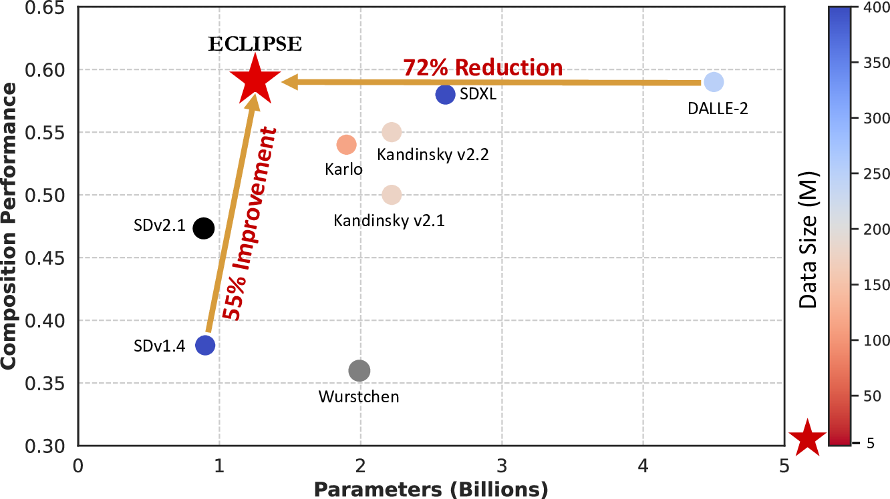
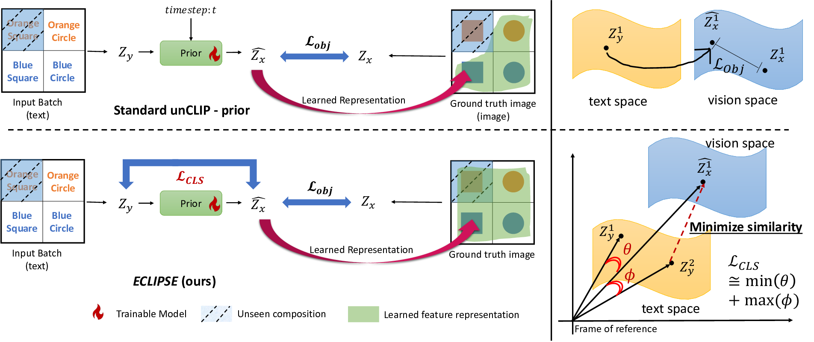
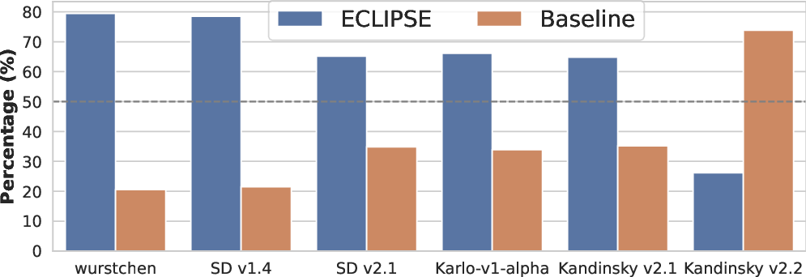
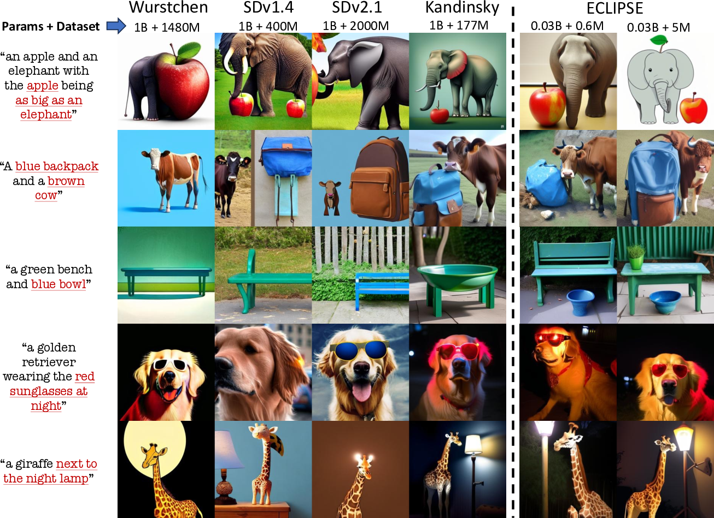

---
title: "ECLIPSE: A Resource-Efficient Text-to-Image Prior for Image Generation"
date: 2020-09-15T11:30:03+00:00
# weight: 1
# aliases: ["/first"]
tags: ['text-to-image generation', 'diffusion models', 'contrastive learning', 'resource efficiency', 'CLIP', 'unCLIP', 'DALL-E 2']
author: "Me"
# author: ["Me", "You"] # multiple authors
showToc: true
TocOpen: true
draft: false
hidemeta: false
comments: false
description: ""
canonicalURL: "https://canonical.url/to/page"
disableHLJS: true # to disable highlightjs
disableShare: false
disableHLJS: false
hideSummary: false
searchHidden: false
ShowReadingTime: true
ShowBreadCrumbs: true
ShowPostNavLinks: true
ShowWordCount: true
ShowRssButtonInSectionTermList: true
UseHugoToc: true
cover:
    image: "<image path/url>" # image path/url
    alt: "<alt text>" # alt text
    caption: "<text>" # display caption under cover
    relative: false # when using page bundles set this to true
    hidden: true # only hide on current single page
editPost:
    URL: "https://github.com/<path_to_repo>/content"
    Text: "Suggest Changes" # edit text
    appendFilePath: true # to append file path to Edit link
---

# ECLIPSE: A Resource-Efficient Text-to-Image Prior for Image Generation

*Figure 1: Comparison between SOTA text-to-image models with respect to their total number of parameters and average performance on composition tasks. ECLIPSE achieves better results with fewer parameters and less training data.*

## TL;DR
- ECLIPSE is a novel contrastive learning method for training text-to-image priors that is both parameter and data efficient
- It leverages pre-trained vision-language models like CLIP to distill knowledge into a small prior model
- ECLIPSE priors achieve comparable or better performance to state-of-the-art models while using only 3.3% of the parameters and 2.8% of the training data
- This approach significantly reduces computational requirements for text-to-image generation without sacrificing quality

## Introduction

Text-to-image (T2I) diffusion models have made remarkable progress in recent years, achieving state-of-the-art performance on various compositional image generation tasks. However, this comes at the cost of massive computational resources and large amounts of high-quality training data. In particular, unCLIP models like DALL-E 2 use a billion-parameter text-to-image prior in addition to the diffusion image decoder, significantly increasing model size compared to Latent Diffusion Models (LDMs).

In this work, we introduce ECLIPSE, a novel contrastive learning method for training resource-efficient text-to-image priors. ECLIPSE leverages pre-trained vision-language models like CLIP to distill knowledge into a much smaller prior model. We demonstrate that ECLIPSE priors can match or exceed the performance of much larger models while using only a fraction of the parameters and training data.

## Background

### unCLIP Models

unCLIP models like DALL-E 2 use a two-stage approach for text-to-image generation:

1. Text-to-Image Prior: Maps text embeddings to corresponding image embeddings
2. Diffusion Image Decoder: Generates the final image conditioned on the image embedding and text features

The prior is typically a large diffusion model trained to estimate the noiseless image embedding at any timestep:

$$\mathcal{L}_{prior} = \mathbb{E}_{t \sim [0, T], z_x^{(t)} \sim q(t, z_x)} [||z_x - g_{\phi}(z_x^{(t)},t,z_y)||_2^2]$$

Where $z_x$ is the target image embedding, $z_y$ is the text embedding, and $g_\phi$ is the prior model.

The diffusion decoder then generates the image using a standard diffusion process:

$$\mathcal{L}_{decoder} = \mathbb{E}_{\epsilon \sim \mathcal{N}(0, I), t \sim [0, T], (z_x, z_y)} [||\epsilon - h_{\theta}(x^{(t)},t,z_x,z_y)||_2^2]$$

Where $h_\theta$ is the decoder model.

While effective, this approach requires massive models (1B+ parameters for the prior alone) and large amounts of training data.

## ECLIPSE Methodology

ECLIPSE aims to train a much smaller, non-diffusion prior model that can still achieve competitive performance. The key ideas are:

1. Use a non-diffusion architecture to reduce parameters and training time
2. Leverage pre-trained vision-language models through contrastive learning
3. Maintain semantic alignment between text and generated image embeddings

*Fig.*: Standard T2I prior learning strategies (top) minimizes the mean squared error between the predicted vision embedding $\hat{z}_x$ w.r.t. the ground truth embedding $z_x$ with or without time-conditioning. This methodology cannot be generalized very well to the outside training distribution (such as Orange Square). The proposed \eclipse~training methodology (bottom) utilizes the semantic alignment property between $z_x$ and $z_y$ with the use of contrastive learning, which improves the text-to-image prior generalization.

### Base Prior Model

Instead of a diffusion model, ECLIPSE uses a simple non-diffusion architecture for the prior. This significantly reduces parameters and computational requirements.

### Projection Objective

To map text embeddings to the vision embedding space, we use a mean squared error objective:

$$\mathcal{L}_{proj} = \mathbb{E}_{\epsilon \sim \mathcal{N}(0,I), z_y, z_x} [|| z_x - g_\phi(\epsilon, z_y)||_2^2]$$

Where $g_\phi$ is the prior model, $z_y$ is the text embedding, and $z_x$ is the target image embedding.

### CLIP Contrastive Learning

To improve generalization, we incorporate a contrastive loss using CLIP:

$$\mathcal{L}_{CLS; y \rightarrow x} = -\frac{1}{N} \sum_{i=0}^{N} \log \frac{\exp(\langle \hat{z}^i_x, z^i_y \rangle/\tau)}{\sum_{j \in [N]} \exp(\langle \hat{z}^i_x, z^j_y\rangle/\tau)}$$

Where $\hat{z}_x$ is the predicted image embedding, $z_y$ is the text embedding, $\tau$ is a temperature parameter, and $N$ is the batch size.

This encourages semantic alignment between the generated image embeddings and input text.

### Final Objective

The final ECLIPSE objective combines the projection and contrastive losses:

$$\mathcal{L}_{ECLIPSE} = \mathcal{L}_{proj} + \lambda\mathcal{L}_{CLS; y \rightarrow x}$$

Where $\lambda$ balances the two terms.

## Experiments

We evaluated ECLIPSE priors using two pre-trained diffusion image decoders: Karlo and Kandinsky v2.2. The ECLIPSE priors use only 33-34 million parameters, compared to 1 billion for the original priors.

We trained on various datasets:
- MSCOCO (0.6M image-text pairs)
- CC3M (2.5M pairs)  
- CC12M (10M pairs)
- LAION-HighResolution subset (5M pairs)

This is a tiny fraction of the data used to train the original models (115-250M pairs).

### Quantitative Results

*Figure 2: PickScore preferences comparing ECLIPSE with state-of-the-art models*

As shown in Table 1 and Figure 2, ECLIPSE priors achieve competitive or superior performance compared to much larger models:

- Surpass baseline priors by large margins
- Comparable to DALL-E 2 on composition benchmarks
- Outperform Stable Diffusion and other models on many metrics
- Achieve this with only 3.3% of parameters and 2.8% of training data

### Qualitative Results

*Figure 3: Qualitative comparison of ECLIPSE with SOTA T2I models*

The qualitative examples in Figure 3 demonstrate that ECLIPSE can generate high-quality, well-composed images that closely match complex text prompts. It often outperforms larger models like Stable Diffusion in following intricate details.

## Analysis

We conducted several ablation studies and analyses:

### Impact of Diffusion Steps

We found that increasing the number of diffusion steps in the prior actually hurts performance. This supports our choice of a non-diffusion architecture.

### Importance of Data Selection  

While ECLIPSE performs well even with limited data, using higher quality datasets like CC12M or LAION-HighRes improves results further. This suggests the importance of curating training data.

### Hyperparameter Sensitivity

We analyzed the impact of the $\lambda$ parameter balancing the projection and contrastive losses. Values in the range of 0.2-0.4 worked best.

### Model Scaling

Increasing model size from 33M to 89M parameters yielded only modest gains, indicating ECLIPSE is quite efficient even at small scales.

## Conclusion

ECLIPSE demonstrates that it's possible to train highly effective text-to-image priors with dramatically reduced computational and data requirements. By leveraging pre-trained vision-language models through contrastive learning, we can distill their knowledge into compact priors that rival or exceed the performance of billion-parameter models.

This work opens up exciting directions for making high-quality text-to-image generation more accessible and efficient. Some potential areas for future work include:

- Applying similar techniques to compress the diffusion decoder
- Exploring even more efficient architectures and training strategies  
- Investigating how improvements to vision-language models like CLIP could further boost performance

The ECLIPSE approach shows that bigger isn't always better when it comes to generative AI. With the right training techniques, we can achieve remarkable results with modest resources.

## References

[1] Ramesh, A., et al. (2022). Hierarchical text-conditional image generation with clip latents. arXiv preprint arXiv:2204.06125.

[2] Rombach, R., et al. (2022). High-resolution image synthesis with latent diffusion models. In Proceedings of the IEEE/CVF Conference on Computer Vision and Pattern Recognition (pp. 10684-10695).

[3] Radford, A., et al. (2021). Learning transferable visual models from natural language supervision. In International Conference on Machine Learning (pp. 8748-8763). PMLR.

[4] Ho, J., et al. (2020). Denoising diffusion probabilistic models. Advances in Neural Information Processing Systems, 33, 6840-6851.

[5] Ho, J., & Salimans, T. (2022). Classifier-free diffusion guidance. arXiv preprint arXiv:2207.12598.

[6] Huang, T. W., et al. (2023). T2i-compbench: A comprehensive benchmark for open-ended text-to-image generation. arXiv preprint arXiv:2307.08056.

[7] Bakr, S., et al. (2023). HRS-Bench: Holistic, Reliable and Scalable Benchmark for Text-to-Image Models. arXiv preprint arXiv:2304.05390.

[8] Kirstain, Y., et al. (2023). PickScore: Text-to-image Generation Evaluation via Hard Negative Cancellation and Pairwise Comparison. arXiv preprint arXiv:2305.19915.

