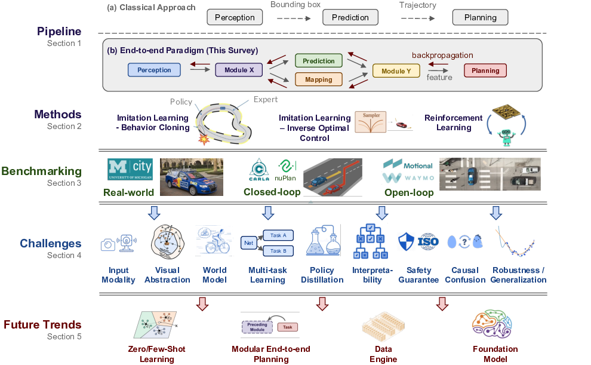

# End-to-end Autonomous Driving: Challenges and Frontiers

*Figure 1: Overview of end-to-end autonomous driving, including pipeline and methods, benchmarking, key challenges, and future trends.*

## TLDR

- This comprehensive survey examines end-to-end autonomous driving, covering motivations, methodologies, benchmarks, challenges, and future directions.
- Key challenges include multi-modality fusion, interpretability, causal confusion, robustness, and world modeling.
- The paper advocates for embracing large foundation models and data engines to advance the field.
- An active repository of literature and open-source projects is maintained at [https://github.com/OpenDriveLab/End-to-end-Autonomous-Driving](https://github.com/OpenDriveLab/End-to-end-Autonomous-Driving).

## Introduction

Autonomous driving has seen remarkable progress in recent years, with a growing trend towards end-to-end approaches that directly map raw sensor inputs to driving actions. This paradigm shift promises to overcome limitations of traditional modular pipelines by jointly optimizing perception and planning. However, it also introduces new challenges and opportunities that warrant careful examination.

In this blog post, we'll dive deep into a comprehensive survey of end-to-end autonomous driving, covering its motivations, key methodologies, evaluation benchmarks, critical challenges, and promising future directions. This work, authored by Li Chen, Penghao Wu, Kashyap Chitta, Bernhard Jaeger, Andreas Geiger, and Hongyang Li, provides a thorough analysis of over 270 papers in the field.

## Motivation for End-to-end Systems

Traditional autonomous driving systems employ a modular design, with separate components for perception, prediction, and planning. While this approach offers interpretability and ease of debugging, it has several drawbacks:

1. Misaligned optimization objectives across modules
2. Potential compounding of errors
3. Information loss between components
4. Increased computational burden

End-to-end systems aim to address these issues by:

1. Simplifying the pipeline through joint training
2. Optimizing the entire system towards the ultimate driving task
3. Increasing computational efficiency through shared backbones
4. Enabling improvements through data-driven optimization

It's important to note that end-to-end systems don't necessarily imply a black box approach. Many state-of-the-art systems incorporate modular designs while optimizing all components together for superior performance.

## Roadmap of End-to-end Autonomous Driving

*Figure 2: Key milestones in the development of end-to-end autonomous driving.*

The field of end-to-end autonomous driving has evolved significantly since its inception. Some key milestones include:

1. ALVINN (1988): The first attempt at using neural networks for autonomous steering
2. NVIDIA's CNN prototype (2016): Revived interest in end-to-end approaches
3. Conditional Imitation Learning (2018): Introduced the concept of conditional commands
4. Learning by Cheating (2020): Proposed policy distillation for improved performance
5. TransFuser (2021): Leveraged multi-modal fusion and Transformer architectures
6. KING (2022): Focused on generating safety-critical scenarios

Recent trends include:

- Generating safety-critical data
- Pre-training foundation models for policy learning
- Advocating for modular end-to-end planning philosophies

## Methods

End-to-end autonomous driving methods can be broadly categorized into two main approaches: Imitation Learning (IL) and Reinforcement Learning (RL).

### Imitation Learning

Imitation Learning aims to learn a driving policy by mimicking expert demonstrations. The two primary subcategories are:

1. Behavior Cloning (BC)
2. Inverse Optimal Control (IOC)

#### Behavior Cloning

Behavior Cloning treats the problem as supervised learning, minimizing the planning loss:

$$ \mathop{\mathbb{E}}_{(s,a)} \ell(\pi_\theta(s), a) $$

Where $\pi_\theta(s)$ is the learned policy, $s$ is the state, $a$ is the expert action, and $\ell$ is a loss function measuring the distance between predicted and expert actions.

Early BC approaches used simple neural networks to generate control signals from camera inputs. Recent advancements include:

- Multi-sensor inputs
- Auxiliary tasks
- Improved expert design

While BC is simple and efficient, it suffers from issues like covariate shift and causal confusion.

#### Inverse Optimal Control

IOC methods learn an unknown reward function $R(s, a)$ from expert demonstrations. In the context of autonomous driving, cost learning approaches have gained popularity. These methods learn a cost function $c(\cdot)$ and use trajectory samplers to select the optimal trajectory $\tau^*$:

$$ \tau^* = \argmin_{\tau} c(\tau) $$

Cost representations can include:

- Learned cost volumes in bird's-eye-view (BEV)
- Joint energy calculated from other agents' future motion
- Probabilistic semantic occupancy or freespace layers

While these methods enhance safety and interpretability, they often require complex multi-modal, multi-task frameworks.

### Reinforcement Learning

Reinforcement Learning (RL) approaches learn driving policies through trial and error. Most RL methods for autonomous driving are based on extensions of Deep Q-Networks (DQN). The Q-network predicts the discounted return of an action given the current state:

$$ Q(s, a) = \mathbb{E}[\sum_{t=0}^{\infty} \gamma^t r_t | s_0 = s, a_0 = a] $$

Where $\gamma$ is the discount factor and $r_t$ is the reward at time $t$.

RL faces several challenges in autonomous driving:

1. Need for safe exploration in the real world
2. High sample complexity
3. Difficulty in training deep perception architectures

To address these issues, some approaches combine RL with supervised learning:

- Pre-training CNN encoders with tasks like semantic segmentation
- Finetuning IL-trained networks with RL

## Benchmarking

Evaluating end-to-end autonomous driving systems requires comprehensive benchmarks. The survey discusses three main approaches:

1. Real-world evaluation
2. Online/closed-loop simulation
3. Offline/open-loop evaluation

### Online/Closed-loop Simulation

Closed-loop evaluation involves deploying the driving system in a simulated environment that closely mimics real-world conditions. Key aspects of simulation include:

1. Parameter initialization
2. Traffic simulation
3. Sensor simulation
4. Vehicle dynamics simulation

#### Parameter Initialization

Two main approaches for initializing simulation parameters:

1. Procedural generation: Using algorithms to create diverse road networks, traffic patterns, and environmental conditions.
2. Data-driven: Learning parameters from real-world driving logs or using generative models.

#### Traffic Simulation

Traffic simulation involves generating realistic motion for virtual entities. Approaches include:

1. Rule-based: Using pre-defined models like the Intelligent Driver Model (IDM).
2. Data-driven: Learning complex behaviors from real-world data.

#### Sensor Simulation

Sensor simulation generates realistic raw sensor data. Two main approaches:

1. Graphics-based: Using 3D models and physical rendering processes.
2. Data-driven: Leveraging real-world sensor data and techniques like Neural Radiance Fields (NeRF).

### Benchmarks

Popular benchmarks for end-to-end autonomous driving include:

1. CARLA: Various scenarios and leaderboards
2. nuPlan: Closed-loop evaluation with data-driven initialization

## Challenges

The survey identifies several critical challenges facing end-to-end autonomous driving:

### Multi-sensor Fusion

Effectively combining inputs from various sensors (cameras, LiDAR, radar) remains a challenge. Approaches include:

1. Early fusion: Combining raw sensor inputs
2. Late fusion: Combining results from multiple modalities
3. Middle fusion: Fusing at the feature level, often using attention mechanisms

### Language as Input

Incorporating natural language instructions and knowledge into driving systems is an emerging area of research. Challenges include:

1. Grounding language in the complex, dynamic driving environment
2. Balancing the strengths of large language models (LLMs) with the need for accurate, real-time control

### Visual Abstraction

Learning effective visual representations for driving is crucial. Challenges include:

1. Designing intermediate representations that capture relevant information
2. Balancing the trade-off between abstraction and preserving important details

### World Modeling

Learning accurate world models for model-based reinforcement learning is challenging due to the complexity of the driving environment. Open questions include:

1. What aspects of the world need to be modeled?
2. How to handle uncertainty in predictions?

### Multi-task Learning

Balancing multiple auxiliary tasks (e.g., semantic segmentation, depth estimation) with the primary driving objective is non-trivial. Challenges include:

1. Selecting appropriate auxiliary tasks
2. Weighting task losses for optimal performance

### Policy Distillation

Transferring knowledge from privileged experts to sensorimotor agents faces challenges:

1. Inefficient distillation of small but critical objects (e.g., traffic lights)
2. Large performance gaps between privileged and sensorimotor agents

### Interpretability

Enhancing the interpretability of end-to-end driving models is crucial for debugging, safety guarantees, and public acceptance. Approaches include:

1. Attention visualization
2. Interpretable auxiliary tasks
3. Cost learning
4. Linguistic explainability
5. Uncertainty modeling

### Safety Guarantees

Ensuring safety in learning-based systems is challenging. Potential approaches include:

1. Integrating rule-based safety constraints
2. Developing post-processing safety checks

### Causal Confusion

End-to-end models can learn spurious correlations, leading to failures during deployment. Addressing this requires:

1. Careful data collection and augmentation
2. Novel architectures that mitigate reliance on spurious features

### Robustness

Improving the generalization and robustness of end-to-end driving systems is critical. Challenges include:

1. Handling long-tailed distributions of driving scenarios
2. Addressing covariate shift between training and deployment
3. Adapting to new domains (e.g., different weather conditions, geographic locations)

## Future Trends

The survey identifies several promising directions for future research:

1. Zero-shot and few-shot learning for adapting to unseen scenarios
2. Modular end-to-end planning, combining interpretability with joint optimization
3. Data engines for automatic labeling and scenario generation
4. Foundation models pre-trained on large-scale driving data

## Conclusion

End-to-end autonomous driving represents a paradigm shift in the field, offering the potential for more efficient and performant systems. However, it also introduces new challenges that require innovative solutions. By addressing issues of multi-modality, interpretability, robustness, and safety, researchers can push the boundaries of what's possible in autonomous driving.

As the field continues to evolve, embracing large-scale data, foundation models, and modular end-to-end architectures will likely play a crucial role in advancing the state of the art. The maintained repository at [https://github.com/OpenDriveLab/End-to-end-Autonomous-Driving](https://github.com/OpenDriveLab/End-to-end-Autonomous-Driving) serves as an invaluable resource for staying up-to-date with the latest developments in this exciting area of research.

## References

[1] A. Dosovitskiy, G. Ros, F. Codevilla, A. Lopez, and V. Koltun, "CARLA: An open urban driving simulator," in CoRL, 2017.

[2] K. Chitta, A. Prakash, B. Jaeger, Z. Yu, K. Renz, and A. Geiger, "Transfuser: Imitation with transformer-based sensor fusion for autonomous driving," PAMI, 2022.

[3] D. Chen, B. Zhou, V. Koltun, and P. Krähenbühl, "Learning by cheating," in CoRL, 2020.

[4] N. Hanselmann, K. Renz, K. Chitta, A. Bhattacharyya, and A. Geiger, "King: Generating safety-critical driving scenarios for robust imitation via kinematics gradients," in ECCV, 2022.

[5] M. Bojarski, D. Del Testa, D. Dworakowski, B. Firner, B. Flepp, P. Goyal, L. D. Jackel, M. Monfort, U. Muller, J. Zhang, et al., "End to end learning for self-driving cars," arXiv.org, vol. 1604.07316, 2016.

[6] S. Casas, A. Sadat, and R. Urtasun, "Mp3: A unified model to map, perceive, predict and plan," in CVPR, 2021.

[7] Y. Hu, J. Yang, L. Chen, K. Li, C. Sima, X. Zhu, S. Chai, S. Du, T. Lin, W. Wang, L. Lu, X. Jia, Q. Liu, J. Dai, Y. Qiao, and H. Li, "Planning-oriented autonomous driving," in CVPR, 2023.

[8] H. Caesar, J. Kabzan, K. S. Tan, W. K. Fong, E. Wolff, A. Lang, L. Fletcher, O. Beijbom, and S. Omari, "Nuplan: A closed-loop ml-based planning benchmark for autonomous vehicles," in CVPR Workshops, 2021.

[9] A. Vaswani, N. Shazeer, N. Parmar, J. Uszkoreit, L. Jones, A. N. Gomez, Ł. Kaiser, and I. Polosukhin, "Attention is all you need," in NeurIPS, 2017.

[10] B. Mildenhall, P. P. Srinivasan, M. Tancik, J. T. Barron, R. Ramamoorthi, and R. Ng, "Nerf: Representing scenes as neural radiance fields for view synthesis," in ECCV, 2020.

