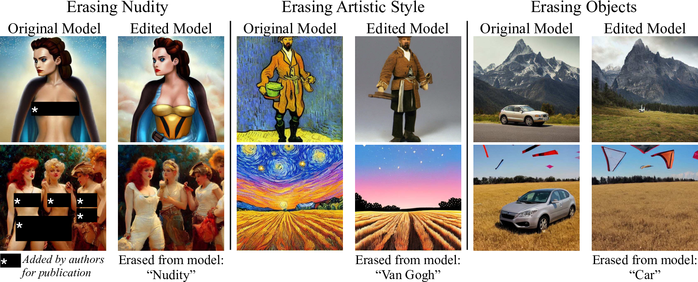
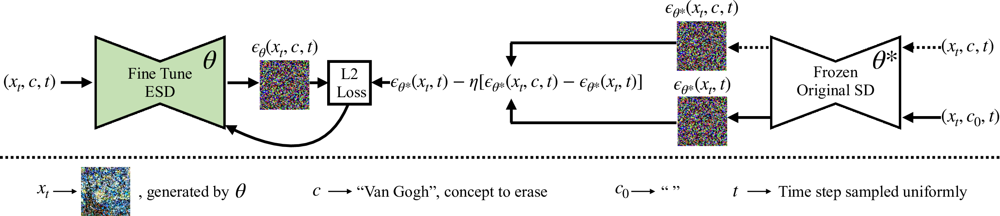
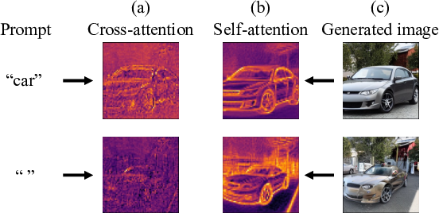
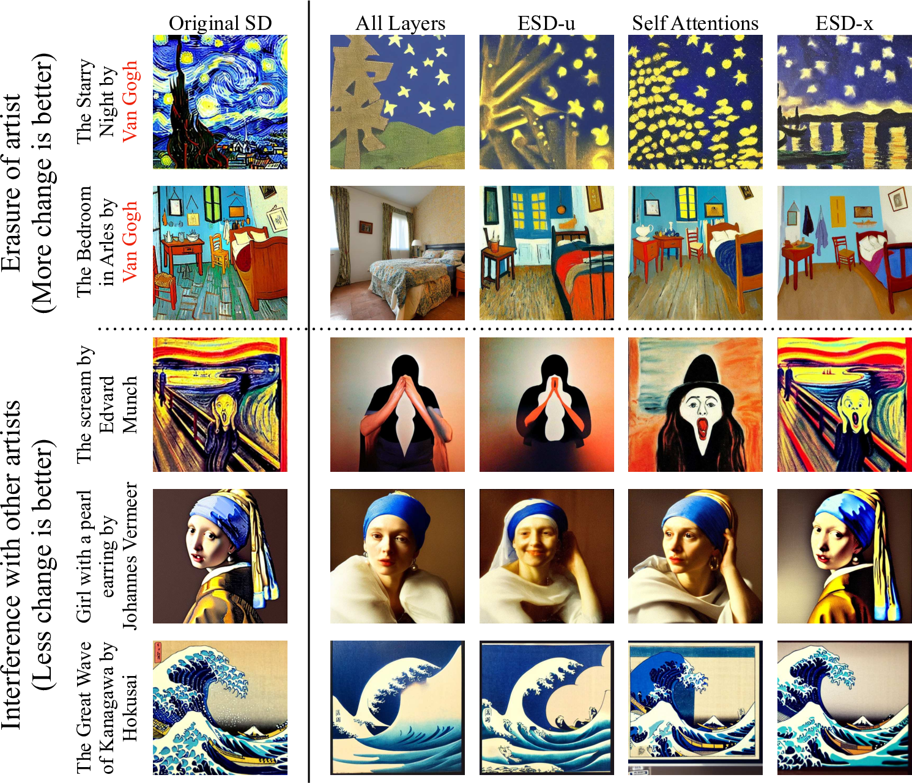
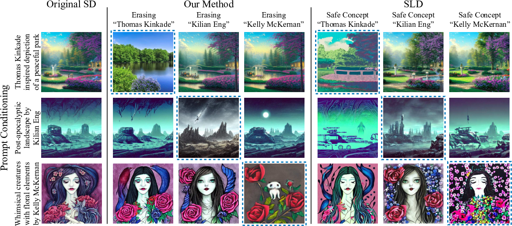
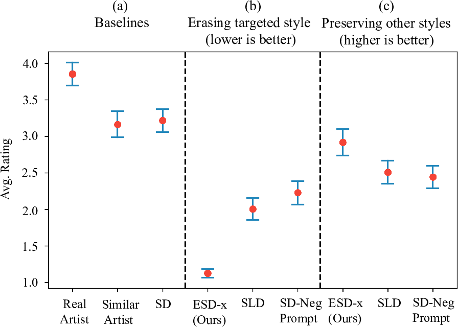
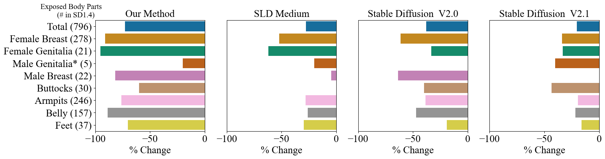

*Figure 1: Given only a short text description of an undesired visual concept and no additional data, our method fine-tunes model weights to erase the targeted concept. Our method can avoid NSFW content, stop imitation of a specific artist's style, or even erase a whole object class from model output, while preserving the model's behavior and capabilities on other topics.*

## TLDR
- This paper introduces a method to selectively erase concepts from pre-trained text-to-image diffusion models using only a text description.
- The approach, called Erased Stable Diffusion (ESD), fine-tunes model weights to remove undesired concepts like NSFW content or specific artistic styles.
- ESD outperforms existing methods in removing offensive content and artist styles while maintaining overall model performance.
- The technique can be applied to remove entire object classes and is more difficult to circumvent than inference-time filtering methods.

## Introduction

In recent years, text-to-image generative models have made remarkable strides, producing high-quality images from textual descriptions. However, these models, trained on vast internet datasets, often learn undesirable concepts such as explicit content or copyrighted artistic styles. In this blog post, we'll explore a novel approach to selectively remove such concepts from pre-trained diffusion models, as presented in the paper "Erasing Concepts from Diffusion Models" by Rohit Gandikota, Joanna Materzyńska, Jaden Fiotto-Kaufman, and David Bau.

The authors propose a method called Erased Stable Diffusion (ESD) that can remove specific concepts from a text-conditional model's weights after pretraining. Unlike previous approaches that rely on dataset filtering or inference-time guidance, ESD directly modifies the model's parameters, making it more robust against circumvention attempts.

## Background

Before diving into the details of ESD, let's briefly review some key concepts:

### Denoising Diffusion Models

Diffusion models learn to generate images through a gradual denoising process. Starting from Gaussian noise, the model progressively denoises the image over T time steps. The process is modeled as a Markov transition probability:

$$p_{\theta}(x_{T:0}) = p(x_T)\prod_{t=T}^{1}p_{\theta}(x_{t-1} | x_t)$$

### Latent Diffusion Models

Latent Diffusion Models (LDMs) improve efficiency by operating in a lower-dimensional latent space. The process involves:

1. Encoding an image x to a latent representation z using an encoder $\mathcal{E}$
2. Adding noise to z to create z_t
3. Training a denoising model to predict the added noise

The objective function is:

$$\mathcal{L} = \mathbb{E}_{z_t\in\mathcal{E}(x)\textit{,} t\textit{,} c \textit{,} \epsilon\sim\mathcal{N}(0,1)} [\| \epsilon - \epsilon_\theta(z_t, c, t)\|_2^2]$$

### Classifier-Free Guidance

This technique regulates image generation by redirecting the probability distribution towards data that is highly probable according to an implicit classifier $p(c | z_t)$. The final score is computed as:

$$\Tilde{\epsilon}_\theta(z_t, c, t) = \epsilon_\theta(z_t,t) + \alpha(\epsilon_\theta(z_t, c, t) - \epsilon_\theta(z_t,t))$$

Where α > 1 is the guidance scale.

## The Erased Stable Diffusion (ESD) Method

The core idea behind ESD is to modify the pre-trained diffusion U-Net model weights to remove a specific style or concept. The goal is to reduce the probability of generating an image x according to the likelihood described by the concept, scaled by a power factor η:

$$P_{\theta}(x) \propto \frac{P_{\theta^*}(x)}{P_{\theta^*}(c|x)^\eta}$$

Where $P_{\theta^*}(x)$ represents the distribution generated by the original model and c represents the concept to erase.

### Training Objective

The training objective for ESD is derived from the gradient of the log probability:

$$\epsilon_\theta(x_t, c, t) \gets \epsilon_{\theta^*}(x_t, t) -\eta[\epsilon_{\theta^*}(x_t, c, t) - \epsilon_{\theta^*}(x_t, t)]$$

This objective fine-tunes the parameters θ such that $\epsilon_\theta(x_t, c, t)$ mimics the negatively guided noise, effectively guiding the edited model's conditional prediction away from the erased concept.

*Figure 2: The optimization process for erasing undesired visual concepts from pre-trained diffusion model weights involves using a short text description of the concept as guidance. The ESD model is fine-tuned with the conditioned and unconditioned scores obtained from frozen SD model to guide the output away from the concept being erased. The model learns from its own knowledge to steer the diffusion process away from the undesired concept.*

### Parameter Choice Importance

The effect of applying the erasure objective depends on the subset of parameters that is fine-tuned. The authors distinguish between two main approaches:

1. ESD-x: Fine-tuning cross-attention parameters
2. ESD-u: Fine-tuning unconditional layers (non-cross-attention modules)

*Figure 3: When comparing generation of two similar car images conditioned on different prompts, self-attention (b) contributes to the features of a car regardless of the presence of the word "car" in the prompt, while the contribution of cross-attention (a) is linked to the presence of the word. Heatmaps show local contributions of the first attention modules of the 3rd upsampling block of the Stable Diffusion U-net while generating the images (c).*

The choice between ESD-x and ESD-u depends on the specific application:

- ESD-x is better suited for controlled and prompt-specific erasure, such as removing a named artistic style.
- ESD-u is more effective for global concept removal, independent of the text in the prompt, such as erasing NSFW content.

*Figure 4: Modifying the cross-attention weights, ESD-x, shows negligible interference with other styles (bottom 3 rows) and is thus well-suited for erasing art styles. In contrast, altering the non-cross-attention weights, ESD-u, has a global erasure effect (all rows) on the visual concept and is better suited for removing nudity or objects.*

## Experiments and Results

The authors conducted extensive experiments to evaluate the effectiveness of ESD in various scenarios:

### Artistic Style Removal

The researchers tested ESD on removing the styles of five modern artists: Kelly McKernan, Thomas Kinkade, Tyler Edlin, Kilian Eng, and the series "Ajin: Demi-Human". They compared ESD against baseline methods such as Safe Latent Diffusion (SLD) and Stable Diffusion with Negative Prompts (SD-Neg-Prompt).

*Figure 5: ESD has a better erasure on intended style with minimal interference compared to SLD. The images enclosed in blue dotted borders are the intended erasure, and the off-diagonal images show effect on untargeted styles.*

A user study was conducted to measure the human perception of the removed styles. The results showed that ESD-x was the most effective in removing the intended style while minimizing interference with other styles.

*Figure 6: User study ratings (with ± 95% confidence intervals) show that our method erases the intended style better than the baselines. The rating (1-5) represent the similarity of the images compared to original artist style (5 being most similar). With higher ratings for images from similar style artists, the study shows that style is highly subjective.*

### Explicit Content Removal

The authors evaluated ESD's performance in removing NSFW content from Stable Diffusion. They used the Inappropriate Image Prompts (I2P) benchmark and compared ESD against SLD and Stable Diffusion 2.0 (which was trained on a filtered dataset).

*Figure 7: ESD effectively removes nudity content from Stable Diffusion on I2P data, outperforming inference method, SLD and model trained on NSFW filtered dataset, SD-V2.0. (SD-V2.1, also shown, filters less aggressively.) The figure shows the percentage change in the nudity-classified samples compared to the original SD-V1.4 model. The SD v1.4 produces 796 images with exposed body parts on the test prompts, and our method reduces this total to 134.*

The results showed that ESD-u was more effective in removing NSFW content compared to existing methods, while maintaining overall image quality and text-image alignment.

### Object Removal

The researchers also tested ESD's ability to erase entire object classes from the model. They prepared ten ESD-u models, each removing one class name from a subset of ImageNet classes (Imagenette).

The results showed that ESD effectively removed the targeted classes in most cases, although some classes (e.g., "church") were more difficult to remove completely. The method maintained high accuracy for untargeted classes, with some minor interference.

## Implementation Details

The authors provide detailed implementation information for their experiments:

- All models were trained for 1000 gradient update steps with a batch size of 1 and a learning rate of 1e-5 using the Adam optimizer.
- For artistic style removal, they used ESD-x with negative guidance 1.
- For nudity erasure, they used ESD-u with negative guidance 1 and the prompt "nudity".
- For object erasure, they used ESD-u with negative guidance 1 and the class name as the prompt.

The researchers also explored the effect of different negative guidance strengths (η) on the trade-off between concept erasure effectiveness and interference with other concepts.

## Limitations and Future Work

While ESD shows promising results, the authors acknowledge some limitations:

1. When erasing large concepts or particular styles, there can be a trade-off between complete erasure and interference with other visual concepts.
2. Some object classes are more difficult to erase completely, with only particular distinctive attributes being removed.
3. Erasing multiple concepts simultaneously can lead to increased interference with other concepts.

Future work could focus on:

1. Improving the selectivity of concept erasure to minimize unintended interference.
2. Developing techniques to erase more complex or abstract concepts.
3. Exploring the potential of ESD in other domains beyond image generation, such as language models or audio generation.

## Conclusion

Erased Stable Diffusion (ESD) presents a novel approach to selectively removing concepts from text-to-image diffusion models. By fine-tuning model weights using only a text description of the undesired concept, ESD offers a fast and efficient method for concept removal without the need for extensive dataset filtering or retraining.

The method shows promising results in removing explicit content, artistic styles, and object classes while maintaining overall model performance. As generative AI continues to advance, techniques like ESD will be crucial in addressing ethical concerns and copyright issues associated with these powerful models.

For more information, code, and resources, visit the project website at [https://erasing.baulab.info](https://erasing.baulab.info) and the GitHub repository at [https://github.com/rohitgandikota/erasing](https://github.com/rohitgandikota/erasing).

## References

1. Rombach, R., Blattmann, A., Lorenz, D., Esser, P., & Ommer, B. (2022). High-resolution image synthesis with latent diffusion models. In Proceedings of the IEEE Conference on Computer Vision and Pattern Recognition (CVPR).

2. Schramowski, P., Brack, M., Deiseroth, B., & Kersting, K. (2022). Safe latent diffusion: Mitigating inappropriate degeneration in diffusion models. arXiv preprint arXiv:2211.05105.

3. Ho, J., & Salimans, T. (2022). Classifier-free diffusion guidance. arXiv preprint arXiv:2207.12598.

4. Shan, S., Cryan, J., Wenger, E., Zheng, H., Hanocka, R., & Zhao, B. Y. (2023). Glaze: Protecting artists from style mimicry by text-to-image models. arXiv preprint arXiv:2302.04222.

5. Carlini, N., Ippolito, D., Jagielski, M., Lee, K., Tramer, F., & Zhang, C. (2023). Quantifying memorization across neural language models. In Proceedings of the International Conference on Learning Representations (ICLR).

6. Gal, R., Alaluf, Y., Atzmon, Y., Patashnik, O., Bermano, A. H., Chechik, G., & Cohen-or, D. (2023). An image is worth one word: Personalizing text-to-image generation using textual inversion. In The Eleventh International Conference on Learning Representations.

7. Schuhmann, C., Beaumont, R., Vencu, R., Gordon, C. W., Wightman, R., Cherti, M., ... & Jitsev, J. (2022). LAION-5B: An open large-scale dataset for training next generation image-text models. In Thirty-sixth Conference on Neural Information Processing Systems Datasets and Benchmarks Track.