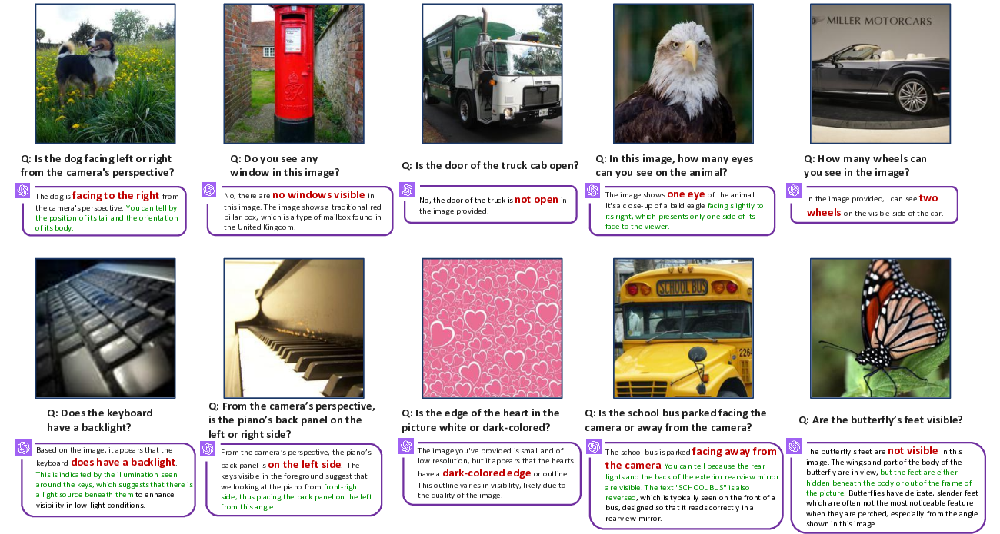
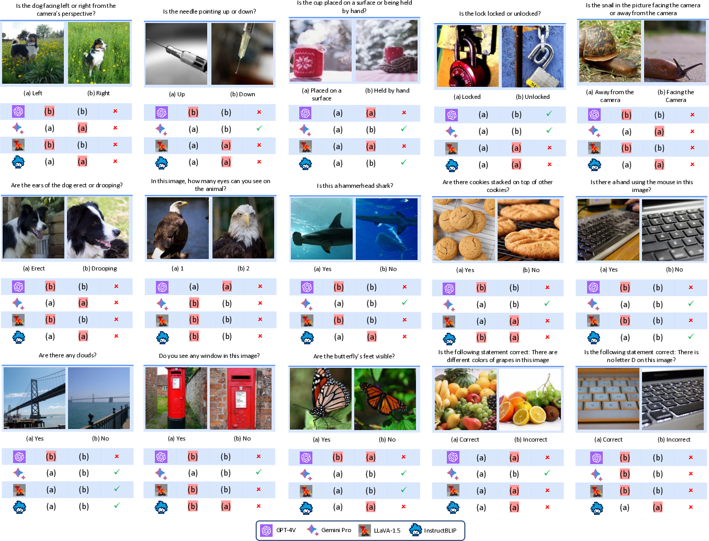
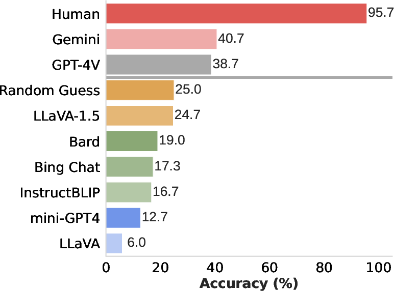
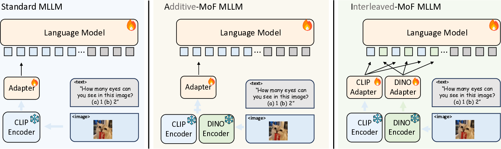

*Shengbang Tong, Zhuang Liu, Yuexiang Zhai, Yi Ma, Yann LeCun, Saining Xie*

## TLDR

- Multimodal Large Language Models (MLLMs) struggle with basic visual tasks due to limitations in their visual encoders.
- The paper introduces the Multimodal Visual Patterns (MVP) benchmark to expose these shortcomings.
- CLIP-based vision encoders systematically fail on certain visual patterns, affecting downstream MLLM performance.
- A proposed Mixture-of-Features (MoF) approach integrating vision self-supervised learning features can enhance visual grounding in MLLMs.

## Introduction

In recent years, we've witnessed remarkable progress in the field of Multimodal Large Language Models (MLLMs). These models, which integrate visual and textual information, have shown impressive capabilities in tasks like image understanding and visual question answering. However, as we delve deeper into their performance, we uncover some surprising limitations. In this blog post, we'll explore the fascinating research presented in the paper "Eyes Wide Shut? Exploring the Visual Shortcomings of Multimodal LLMs" by Tong et al.

The authors of this paper set out to investigate a critical question: Is vision good enough for language in these multimodal systems? Their findings reveal that even state-of-the-art MLLMs, including GPT-4V, struggle with seemingly simple visual tasks. Let's dive into the details of their research and understand the implications for the future of multimodal AI.

## The MVP Benchmark: Unveiling MLLM Shortcomings

### CLIP-Blind Pairs

The researchers introduce a novel concept called "CLIP-blind pairs" to identify weaknesses in the visual component of MLLMs. These are pairs of images that CLIP (Contrastive Language-Image Pre-training) models perceive as similar, despite having clear visual differences. To find these pairs, they use the following approach:

1. Compute CLIP embeddings using the CLIP-ViT-L-14 model.
2. Compute DINOv2 embeddings using the DINOv2-ViT-L-14 model (a vision-only self-supervised learning model).
3. Identify image pairs with high cosine similarity (>0.95) in CLIP embeddings but low similarity (<0.6) in DINOv2 embeddings.

This method allows them to pinpoint instances where CLIP fails to capture important visual distinctions that a vision-specific model can identify.

### The MVP Benchmark

Using these CLIP-blind pairs, the authors construct the Multimodal Visual Patterns (MVP) benchmark. This benchmark consists of 150 image pairs with 300 carefully designed questions that probe the visual details overlooked by CLIP. The questions are intentionally straightforward, focusing on basic visual attributes that humans can easily discern.



*Figure 1: Examples of questions in the MVP benchmark. Incorrect answers are highlighted in red. Both leading closed-source models (GPT-4V, Gemini) and open-source models (LLaVA-1.5, InstructBLIP) fail these simple visual questions.*

### Benchmark Results

The researchers evaluated several state-of-the-art MLLMs on the MVP benchmark, including:

- Open-source models: LLaVA-1.5, InstructBLIP, Mini-GPT4
- Closed-source models: GPT-4V, Gemini, Bard

They also conducted a human study to establish a baseline for performance. The results were striking:



*Figure 2: Benchmark results of current SOTA MLLM models and humans.*

Key observations:

1. Human participants achieved an average accuracy of 95.7%, confirming the simplicity of the questions.
2. Most MLLMs, except GPT-4V and Gemini, scored below random guess level (25%).
3. Even the most advanced models, GPT-4V and Gemini, showed significant gaps compared to human performance.

These results suggest that regardless of model size or training data, MLLMs struggle with fundamental visual details.

## Systematic Failures in CLIP

To understand the root cause of these shortcomings, the researchers delved deeper into the CLIP-blind pairs and identified systematic visual patterns that CLIP consistently misinterprets.

### Visual Patterns

The authors identified nine prevalent visual patterns that pose challenges for CLIP-based models:

1. 🧭 Orientation and Direction
2. 🔍 Presence of Specific Features
3. 🔄 State and Condition
4. 🔢 Quantity and Count
5. 📍 Positional and Relational Context
6. 🎨 Color and Appearance
7. ⚙️ Structural and Physical Characteristics
8. 🔤 Text
9. 📷 Viewpoint and Perspective

### The MVP-VLM Benchmark

To assess whether these visual patterns remain challenging for more recent and larger CLIP models, the researchers introduced the MVP-VLM benchmark. This benchmark distills a subset of questions from MVP into simpler language descriptions and categorizes them into the identified visual patterns.

The results, summarized in Table 1, reveal that:

1. Increasing network size and training data only helps with two visual patterns: "color and appearance" and "state and condition."
2. The remaining visual patterns continue to challenge all CLIP-based models, regardless of scale.
3. ImageNet-1k zero-shot accuracy is not a reliable indicator of a model's performance on these visual patterns.

<table>
  <caption>Table 1: Performance of various CLIP based models on different visual patterns in MVP-VLM benchmark.</caption>
  <thead>
    <tr>
      <th>Model</th>
      <th>Image Size</th>
      <th>Params (M)</th>
      <th>IN-1k ZeroShot</th>
      <th>🧭</th>
      <th>🔍</th>
      <th>🔄</th>
      <th>🔢</th>
      <th>📍</th>
      <th>🎨</th>
      <th>⚙️</th>
      <th>🔤</th>
      <th>📷</th>
      <th>MVP Average</th>
    </tr>
  </thead>
  <tbody>
    <tr>
      <td>OpenAI ViT-L-14</td>
      <td>224²</td>
      <td>427.6</td>
      <td>75.5</td>
      <td>13.3</td>
      <td>13.3</td>
      <td>20.0</td>
      <td>20.0</td>
      <td>13.3</td>
      <td>53.3</td>
      <td>20.0</td>
      <td>6.7</td>
      <td>13.3</td>
      <td>19.3</td>
    </tr>
    <tr>
      <td>SigLIP ViT-SO-14</td>
      <td>384²</td>
      <td>878.0</td>
      <td>83.1</td>
      <td>20.0</td>
      <td>26.7</td>
      <td>60.0</td>
      <td>33.3</td>
      <td>13.3</td>
      <td>66.7</td>
      <td>33.3</td>
      <td>26.7</td>
      <td>53.3</td>
      <td>37.0</td>
    </tr>
    <tr>
      <td>EVA02 ViT-bigE-14+</td>
      <td>224²</td>
      <td>5044.9</td>
      <td>82.0</td>
      <td>13.3</td>
      <td>20.0</td>
      <td>66.7</td>
      <td>26.7</td>
      <td>26.7</td>
      <td>66.7</td>
      <td>26.7</td>
      <td>20.0</td>
      <td>33.3</td>
      <td>33.3</td>
    </tr>
  </tbody>
</table>

### Correlation Between CLIP and MLLM Errors

The researchers found a strong correlation between the visual patterns that challenge CLIP models and the performance of MLLMs. They calculated the Pearson Correlation Coefficient between CLIP model performance and MLLM performance on each visual pattern. The results showed:

- Open-source models like LLaVA 1.5 and InstructBLIP had correlation coefficients greater than 0.7.
- Even some closed-source models like Bard showed high correlations.

This suggests that the visual shortcomings of CLIP propagate to the MLLMs that rely on them as visual encoders.

## Mixture-of-Features (MoF) for MLLM

To address the limitations of CLIP-based visual encoders, the researchers proposed a novel approach called Mixture-of-Features (MoF). This method aims to integrate vision-centric representations from self-supervised learning models into MLLMs.

### Additive MoF

The first approach, Additive MoF (A-MoF), linearly mixes CLIP features with those from a vision-only self-supervised learning model (DINOv2 in this case). The researchers experimented with different mixing ratios, controlled by a coefficient α:

```
mixed_features = α * CLIP_features + (1 - α) * DINOv2_features
```

The results revealed an interesting trade-off:

1. As the proportion of DINOv2 features increased, the model's visual grounding capability improved.
2. However, this came at the cost of diminished instruction-following ability, especially when the DINOv2 proportion exceeded 0.75.

### Interleaved MoF

To overcome the limitations of A-MoF, the researchers introduced Interleaved MoF (I-MoF). This approach:

1. Processes an image through both CLIP and DINOv2 encoders.
2. Applies adapters to the resulting embeddings individually.
3. Interleaves the processed features from both models while maintaining their original spatial order.
4. Feeds the interleaved features to the language model.



*Figure 3: Different Mixture-of-Feature (MoF) Strategies in MLLM.*

The results of I-MoF were promising:

<table>
  <caption>Table 2: Empirical Results of Interleaved MoF.</caption>
  <thead>
    <tr>
      <th>Method</th>
      <th>Resolution</th>
      <th>#tokens</th>
      <th>MVP</th>
      <th>LLaVA</th>
      <th>POPE</th>
    </tr>
  </thead>
  <tbody>
    <tr>
      <td>LLaVA</td>
      <td>336²</td>
      <td>576</td>
      <td>6.0</td>
      <td>81.4</td>
      <td>50.1</td>
    </tr>
    <tr>
      <td>LLaVA + I-MoF</td>
      <td>224²</td>
      <td>512</td>
      <td>16.7 (+10.7)</td>
      <td>82.8</td>
      <td>51.0</td>
    </tr>
    <tr>
      <td>LLaVA¹·⁵</td>
      <td>336²</td>
      <td>576</td>
      <td>24.7</td>
      <td>84.7</td>
      <td>85.9</td>
    </tr>
    <tr>
      <td>LLaVA¹·⁵ + I-MoF</td>
      <td>224²</td>
      <td>512</td>
      <td>28.0 (+3.3)</td>
      <td>82.7</td>
      <td>86.3</td>
    </tr>
  </tbody>
</table>

Key findings:

1. I-MoF significantly improved visual grounding (as measured by MVP) without compromising instruction-following ability.
2. The improvements were consistent across different model versions and image resolutions.
3. I-MoF also showed improvements on other benchmarks like POPE, which tests for hallucination in visual grounding.

## Discussion and Future Directions

The research presented in this paper raises important questions about the current state of vision in multimodal AI systems. Here are some key takeaways and areas for future exploration:

1. **Vision as a bottleneck**: The study reveals that vision models might be becoming a bottleneck in multimodal systems. This suggests a need for renewed focus on improving visual representation learning.

2. **Limitations of scaling**: Contrary to popular belief, simply scaling up data and model size does not address the inherent deficiencies in CLIP-based models. This calls for novel approaches to visual representation learning.

3. **Complementary strengths**: The research shows that vision-and-language models and vision-only self-supervised learning models excel in different aspects. This insight could guide the development of more robust multimodal architectures.

4. **New evaluation metrics**: The MVP benchmark demonstrates the need for more diverse and targeted evaluation metrics in visual representation learning. Future research could focus on developing benchmarks that better align with the requirements of multimodal systems.

5. **Improved visual grounding**: The success of the Mixture-of-Features approach suggests that integrating different types of visual representations can lead to better visual grounding in MLLMs. Further exploration of hybrid architectures could yield even more powerful multimodal models.

6. **Ethical considerations**: As we work to improve the visual capabilities of AI systems, it's crucial to consider the ethical implications of more accurate visual understanding, particularly in areas like privacy and surveillance.

In conclusion, this research sheds light on an often-overlooked aspect of multimodal AI systems – the quality of their visual representations. By exposing the limitations of current approaches and proposing novel solutions, the authors have opened up exciting new avenues for research in this field. As we continue to push the boundaries of AI, addressing these visual shortcomings will be crucial in developing truly robust and capable multimodal systems.

## References

1. Radford, A., Kim, J. W., Hallacy, C., Ramesh, A., Goh, G., Agarwal, S., ... & Sutskever, I. (2021). Learning transferable visual models from natural language supervision. In International conference on machine learning (pp. 8748-8763). PMLR.

2. Oquab, M., Darcet, T., Moutakanni, T., Vo, H. V., Szafraniec, M., Khalidov, V., ... & Bojanowski, P. (2023). Dinov2: Learning robust visual features without supervision. arXiv preprint arXiv:2304.07193.

3. Liu, H., Li, C., Wu, Q., & Lee, Y. J. (2023). Visual instruction tuning. arXiv preprint arXiv:2304.08485.

4. OpenAI. (2023). GPT-4 Technical Report. arXiv preprint arXiv:2303.08774.

5. Sun, C., Yang, J., Huang, S., Yuan, Z., Cao, Y., Zhang, C., & He, K. (2023). Eva: Exploring the limits of masked visual representation learning at scale. In Proceedings of the IEEE/CVF Conference on Computer Vision and Pattern Recognition (pp. 4438-4448).

6. Fang, Y., Wang, X., Tao, Y., Sheng, C., Ren, Z., Cao, L., ... & Luo, P. (2023). Scaling language-image learning in 100 languages. arXiv preprint arXiv:2306.13861.

7. Zhai, X., Mustafa, B., Kolesnikov, A., & Beyer, L. (2023). Sigmoid loss for language image pre-training. arXiv preprint arXiv:2303.15343.

8. Xu, J., Tao, Y., Gong, C., Gao, N., Shen, J., & Luo, P. (2023). Demystifying clip data. arXiv preprint arXiv:2309.16671.

9. Li, J., Li, D., Savarese, S., & Hoi, S. (2023). Blip-2: Bootstrapping language-image pre-training with frozen image encoders and large language models. arXiv preprint arXiv:2301.12597.

10. Zhu, Y., Du, Y., Garbacea, C., Wang, Z., Shi, C., Drori, I., & Shen, Y. (2023). Minigpt-4: Enhancing vision-language understanding with advanced large language models. arXiv preprint arXiv:2304.10592.

11. Bard: Google's conversational AI service. https://bard.google.com/

12. Zheng, L., Gao, Z., Guo, Y., Jiang, Y., Zheng, Z., Zheng, C., ... & Zhai, C. (2023). Judging llm-as-a-judge with mt-bench and chatbot arena. arXiv preprint arXiv:2306.05685.

13. He, K., Chen, X., Xie, S., Li, Y., Dollár, P., & Girshick, R. (2022). Masked autoencoders are scalable vision learners. In Proceedings of the IEEE/CVF conference on computer vision and pattern recognition (pp. 16000-16009).

14. Chen, X., Xie, S., & He, K. (2021). An empirical study of training self-supervised vision transformers. In Proceedings of the IEEE/CVF international conference on computer vision (pp. 9640-9649).

15. Li, A., Huang, J., Chen, Y., & Jin, Z. (2023). Pope: Evaluating human-ai collaboration for task planning using large language models. arXiv preprint arXiv:2306.04522.