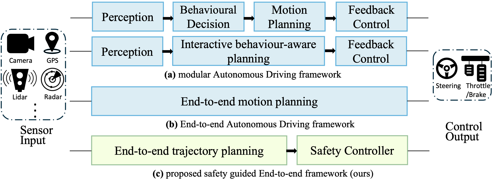

---
title: "FusionAssurance: Enhancing End-to-End Autonomous Driving with Physics-Informed Safety Controllers"
date: 2024-11-05T11:07:54.803214
# weight: 1
# aliases: ["/first"]
tags: ['autonomous driving', 'end-to-end learning', 'safety controllers', 'model predictive control', 'potential fields', 'deep learning', 'computer vision', 'CARLA benchmark']
author: "Me"
# author: ["Me", "You"] # multiple authors
showToc: true
TocOpen: true
draft: false
hidemeta: false
comments: false
description: ""
canonicalURL: "https://canonical.url/to/page"
disableHLJS: true # to disable highlightjs
disableShare: false
disableHLJS: false
hideSummary: false
searchHidden: false
ShowReadingTime: true
ShowBreadCrumbs: true
ShowPostNavLinks: true
ShowWordCount: true
ShowRssButtonInSectionTermList: true
UseHugoToc: true
cover:
    image: "<image path/url>" # image path/url
    alt: "<alt text>" # alt text
    caption: "<text>" # display caption under cover
    relative: false # when using page bundles set this to true
    hidden: true # only hide on current single page
editPost:
    URL: "https://github.com/<path_to_repo>/content"
    Text: "Suggest Changes" # edit text
    appendFilePath: true # to append file path to Edit link
---

# Enhancing End-to-End Autonomous Driving with Physics-Informed Safety Controllers

*Figure 1: Popular frameworks for autonomous driving. The green shaded area shows the proposed FusionAssurance framework pipeline.*

## TLDR

- FusionAssurance is a novel end-to-end autonomous driving framework that combines deep learning for perception and planning with a physics-informed safety controller.
- The safety controller uses Model Predictive Control (MPC) and Potential Field (PF) methods to ensure safe trajectories, even when the neural network planner fails.
- This approach outperforms state-of-the-art methods on the CARLA benchmark, achieving a 99.966% route completion rate and 90.683 driving score.
- FusionAssurance can handle complex scenarios and corner cases where previous methods struggle, demonstrating improved safety and adaptability.

## Introduction

Autonomous driving technology has made significant strides in recent years, with deep neural networks (DNNs) playing an increasingly important role in various aspects of the autonomous driving pipeline. While DNNs have shown remarkable performance in perception, prediction, and planning tasks, they still face challenges in terms of reliability, safety, and optimality. This is particularly true when dealing with out-of-distribution scenarios or situations not well-represented in the training data.

In this blog post, we'll dive deep into a novel approach called FusionAssurance, proposed by Zhou et al. in their paper "Enhance Planning with Physics-informed Safety Controller for End-to-end Autonomous Driving". This method aims to address the limitations of purely learning-based approaches by combining the power of deep learning with physics-informed safety controllers.

## The Challenge of End-to-End Autonomous Driving

Before we delve into the details of FusionAssurance, let's first understand the context and challenges of end-to-end autonomous driving.

Traditional autonomous driving systems often use a modular approach, as shown in Figure 1(a). This architecture separates the driving task into distinct modules for perception, prediction, planning, and control. While this approach is explainable and easier to deploy, it can suffer from error propagation and inconsistency issues between modules.

End-to-end autonomous driving, illustrated in Figure 1(b), aims to learn the entire driving task in a single neural network. This approach has several potential advantages:

1. Learning complex behaviors that are difficult to capture with hand-crafted rules
2. Reducing computational cost and latency
3. Avoiding error propagation between modules

However, end-to-end approaches also face significant challenges:

1. Ensuring reliability and safety
2. Handling out-of-distribution scenarios
3. Generalizing to unseen situations

This is where FusionAssurance comes in, proposing a novel framework that combines the benefits of end-to-end learning with physics-informed safety controllers.

## FusionAssurance: A Novel Approach

FusionAssurance is a mapless trajectory-based end-to-end driving framework that integrates deep learning for perception and planning with Model Predictive Control (MPC) and Potential Field (PF) methods for safety assurance. Let's break down the key components of this approach.

### Network Model

The neural network component of FusionAssurance is based on a transformer architecture, inspired by DETR (DEtection TRansformer) [1]. It takes inputs from multiple sensors, including three RGB cameras (front, left, and right) and a LiDAR sensor. The network architecture can be summarized as follows:

1. **Feature Extraction**:
   - RGB images: Processed using a pretrained ResNet [2] backbone
   - LiDAR data: Processed using PointPillars [3] for 3D point cloud feature extraction

2. **Feature Fusion**:
   - Features from different modalities are linearized and combined with modal-type embeddings
   - A transformer encoder with self-attention layers fuses the multi-modal features

3. **Decoder**:
   - Generates bird's-eye view (BEV) features
   - Predicts traffic signals and waypoints using specialized modules

The network outputs include:
- Predicted waypoints
- BEV obstacle map
- Traffic light state
- Junction probability

### Physics-Informed Safety Controller

The safety controller is the key innovation of FusionAssurance. It combines Model Predictive Control (MPC) with Potential Field (PF) methods to ensure safe trajectories. Let's examine the components of this controller in detail.

#### Vehicle Dynamics

The MPC uses a bicycle model for vehicle dynamics, which provides a good balance between simplicity and accuracy. The state vector is defined as:

$$\mathbf{x} = [p_x, p_y, \varphi, v_x, v_y, \omega]^T$$

where $(p_x, p_y)$ is the vehicle position, $(v_x, v_y)$ is the velocity, $\varphi$ is the orientation, and $\omega$ is the yaw rate.

The control input is:

$$\mathbf{u} = [a, \delta]^T$$

where $a$ is acceleration and $\delta$ is steering angle.

The vehicle dynamics are described by the following equation:

$$
\mathbf{x}_{k+1} = f(\mathbf{x}_k, \mathbf{u}_k) = 
\begin{bmatrix}
p_x(k) + (v_x(k) \cos \varphi(k) - v_y(k) \sin \varphi(k))\Delta t \\
p_y(k) + (v_y(k) \cos \varphi(k) + v_x(k) \sin \varphi(k))\Delta t \\
\varphi(k) + \omega(k)\Delta t \\
v_x(k) + a(k)\Delta t \\
\frac{m v_x(k) v_y(k) + l \omega(k)\Delta t - k_f \delta(k) v_x(k)\Delta t - m v_x(k)^2 \omega(k)\Delta t}{m v_x(k) - (k_f + k_r)\Delta t} \\
\frac{I_z v_x(k) \omega(t) + l v_y(k)\Delta t - l_f k_f \delta(k) v_x(k)\Delta t}{I_z v_x(k) - (l_f^2 k_f + l_r^2 k_r)\Delta t}
\end{bmatrix}
$$

This model captures the essential dynamics of the vehicle while remaining computationally efficient for real-time control.

#### Potential Field Functions

The safety controller uses potential field functions to represent obstacles and guide the vehicle's behavior. The main potential field function for obstacles is defined as:

$$
F_O = \sum_{i=0}^n \frac{K_o}{\frac{(p_{x_{rot}} - p_{i,x})^2}{a^2} + \frac{(p_{y_{rot}} - p_{i,y})^2}{b^2}}
$$

where:
- $K_o$ is the intensity of the obstacle repulsive force
- $(a, b)$ define the shape of the ellipse representing the obstacle
- $(p_{i,x}, p_{i,y})$ is the position of the $i$-th obstacle
- $(p_{x_{rot}}, p_{y_{rot}})$ is the rotated position of the ego vehicle aligned with the obstacle

An additional potential function is used for adaptive cruise control:

$$
F_C = \frac{K_c \cdot u_{k[0]} \cdot x_{k[2]}}{D_{safety} + 0.001}
$$

where $K_c$ is the gain, $u_{k[0]}$ is the throttle control, $x_{k[2]}$ is the current speed, and $D_{safety}$ is the distance to the front obstacle.

#### Model Predictive Control Formulation

The MPC optimizes a cost function that balances trajectory following, velocity control, and driving comfort:

$$
\begin{aligned}
J(\mathbf{x}, \mathbf{u}, \mathbf{r}_{net}) &= \sum_{k=0}^N \| \mathbf{x}_{\text{ref},k} - \mathbf{x}_k \|^2 + \sum_{k=1}^N \|\mathbf{u}_{k} - \mathbf{u}_{k-1}\|^2 \\
&+ \sum_{k=0}^N \|\mathbf{u}_{k}\|^2 + F_O(\mathbf{r}_{net}, \mathbf{x}) + F_C(\mathbf{r}_{net}, \mathbf{x})
\end{aligned}
$$

subject to vehicle dynamics constraints and input/state bounds.

### Integration of Neural Network and Safety Controller

The FusionAssurance framework integrates the neural network outputs with the safety controller in several ways:

1. Coordinate transformation: Network outputs are transformed from the ego vehicle coordinate system to the global map coordinate system.

2. Traffic information: Probabilities of red lights, stop junctions, and being on-road are used to adjust the controller's behavior.

3. Adaptive gains: The obstacle potential field gain and trajectory tracking weights are adjusted based on the on-road probability:

   $$K_o = \frac{K}{P_{on\_road} + 0.5}$$
   $$w_{p_x, p_y, \varphi} = w \cdot (P_{on\_road} + 0.5)$$

This integration allows the safety controller to adapt its behavior based on the neural network's predictions while ensuring safe trajectories.

## Experimental Results

The authors evaluated FusionAssurance on the CARLA 42 routes benchmark, which includes a diverse set of driving scenarios across different towns and weather conditions. The main metrics used for evaluation are:

1. Route Completion (RC): The percentage of the route completed
2. Infraction Score (IS): A measure of traffic rule violations
3. Driving Score (DS): The product of RC and IS

### Comparison with State-of-the-Art

FusionAssurance outperforms previous state-of-the-art methods on the CARLA benchmark:

| Method | Route Completion (%) | Infraction Rate | Driving Score |
|--------|----------------------|-----------------|---------------|
| InterFuser (reproduced) | 93.827 | 0.865 | 81.084 |
| Latent Transfuser (pretrained) | 87.359 | 0.756 | 63.570 |
| Transfuser++ (pretrained) | 91.989 | **0.982** | 90.203 |
| TCP (pretrained) | 90.946 | 0.912 | 82.991 |
| FusionAssurance (ours) | **99.966** | 0.907 | **90.683** |

FusionAssurance achieves the highest route completion rate and driving score, demonstrating its effectiveness in handling complex scenarios and maintaining safety.

### Ablation Study

The authors conducted an ablation study to analyze the impact of different components:

| Method | Route Completion (%) | Infraction Rate | Driving Score |
|--------|----------------------|-----------------|---------------|
| FusionAssur(histogram) PID | 93.827 | 0.865 | 81.084 |
| FusionAssur(histogram) MPC+PF | 97.177 | 0.857 | 83.184 |
| FusionAssur(pointpillar) PID | 96.970 | 0.840 | 81.435 |
| FusionAssur(pointpillar) MPC | 97.839 | 0.844 | 82.576 |
| FusionAssur(pointpillar) MPC+PF | **99.966** | **0.907** | **90.683** |

This study shows that each component (PointPillars for LiDAR processing, MPC, and Potential Fields) contributes to the overall performance improvement.

## Case Studies

The authors present several case studies to demonstrate the effectiveness of FusionAssurance in handling challenging scenarios:

1. **Unfeasible trajectory generation**: FusionAssurance can handle cases where the neural network generates suboptimal trajectories by using the physics-informed safety controller to navigate safely.

2. **Deadlock situations**: In scenarios where vehicles might get stuck giving way to each other, FusionAssurance can perform intelligent overtaking maneuvers.

3. **Corner-cutting behavior**: The safety controller helps maintain a safe distance from oncoming vehicles, even when taking sharp turns.

These case studies highlight the robustness and adaptability of the FusionAssurance approach in real-world driving scenarios.

## Conclusion and Future Directions

FusionAssurance represents a significant step forward in end-to-end autonomous driving by combining the strengths of deep learning with physics-informed safety controllers. The approach demonstrates improved performance, safety, and adaptability compared to previous methods.

Some potential areas for future research include:

1. Incorporating lane detection into the neural network and using lane information as additional potential fields.
2. Developing static obstacle detection capabilities to further prevent infractions.
3. Exploring the integration of FusionAssurance with other end-to-end driving approaches, such as reinforcement learning methods.

As autonomous driving technology continues to evolve, approaches like FusionAssurance that combine data-driven learning with physics-based control are likely to play an increasingly important role in ensuring safe and reliable autonomous vehicles.

## References

[1] Carion, N., Massa, F., Synnaeve, G., Usunier, N., Kirillov, A., & Zagoruyko, S. (2020). End-to-end object detection with transformers. In European Conference on Computer Vision (ECCV) (pp. 213-229). Springer.

[2] He, K., Zhang, X., Ren, S., & Sun, J. (2016). Deep residual learning for image recognition. In Proceedings of the IEEE conference on Computer Vision and Pattern Recognition (CVPR) (pp. 770-778).

[3] Lang, A. H., Vora, S., Caesar, H., Zhou, L., Yang, J., & Beijbom, O. (2019). PointPillars: Fast encoders for object detection from point clouds. In Proceedings of the IEEE/CVF Conference on Computer Vision and Pattern Recognition (CVPR) (pp. 12697-12705).

[4] Dosovitskiy, A., Ros, G., Codevilla, F., Lopez, A., & Koltun, V. (2017). CARLA: An open urban driving simulator. In Proceedings of the 1st Annual Conference on Robot Learning (CoRL) (pp. 1-16).

[5] Chitta, K., Prakash, A., & Geiger, A. (2022). TransFuser: Imitation with transformer-based sensor fusion for autonomous driving. Pattern Analysis and Machine Intelligence (PAMI).

[6] Wu, P., Jia, X., Chen, L., Yan, J., Li, H., & Qiao, Y. (2022). Trajectory-guided control prediction for end-to-end autonomous driving: A simple yet strong baseline. In Advances in Neural Information Processing Systems (NeurIPS).

[7] Jaeger, B., Chitta, K., & Geiger, A. (2023). Hidden biases of end-to-end driving models. In Proceedings of the IEEE International Conference on Computer Vision (ICCV).

