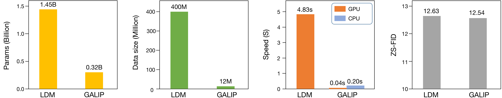
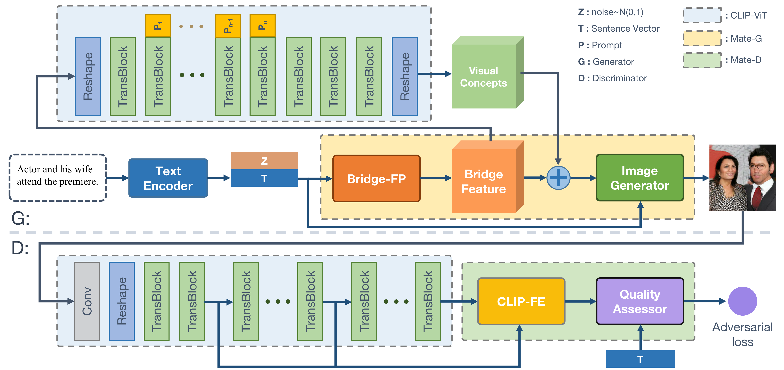
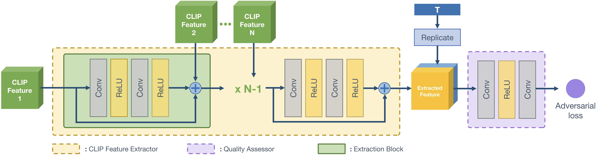
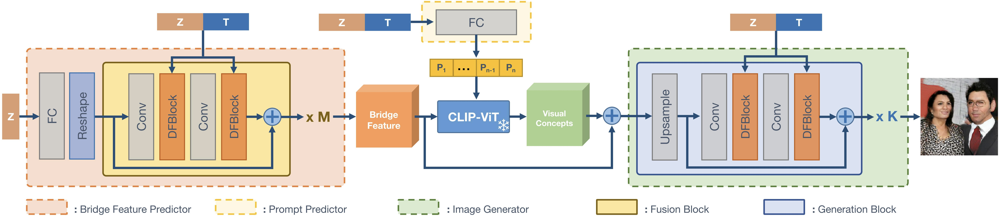
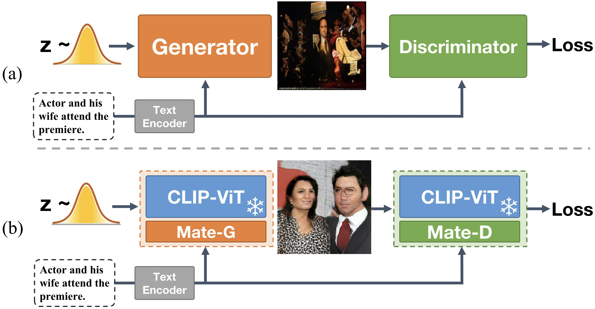

---
title: "GALIP: Efficient and Controllable Text-to-Image Synthesis with CLIP-Integrated GANs"
date: 2020-09-15T11:30:03+00:00
# weight: 1
# aliases: ["/first"]
tags: ['text-to-image synthesis', 'GALIP', 'CLIP', 'GAN', 'efficient generation', 'controllable synthesis', 'deep learning']
author: "Me"
# author: ["Me", "You"] # multiple authors
showToc: true
TocOpen: true
draft: false
hidemeta: false
comments: false
description: ""
canonicalURL: "https://canonical.url/to/page"
disableHLJS: true # to disable highlightjs
disableShare: false
disableHLJS: false
hideSummary: false
searchHidden: false
ShowReadingTime: true
ShowBreadCrumbs: true
ShowPostNavLinks: true
ShowWordCount: true
ShowRssButtonInSectionTermList: true
UseHugoToc: true
cover:
    image: "<image path/url>" # image path/url
    alt: "<alt text>" # alt text
    caption: "<text>" # display caption under cover
    relative: false # when using page bundles set this to true
    hidden: true # only hide on current single page
editPost:
    URL: "https://github.com/<path_to_repo>/content"
    Text: "Suggest Changes" # edit text
    appendFilePath: true # to append file path to Edit link
---

# GALIP: Generative Adversarial CLIPs for Text-to-Image Synthesis

## TLDR
- GALIP is a novel text-to-image synthesis model that integrates CLIP into both the generator and discriminator of a GAN architecture.
- It achieves comparable results to large pretrained models while using only ~3% of the training data and ~6% of the learnable parameters.
- GALIP is ~120x faster in image synthesis compared to diffusion models and provides a smooth latent space for controllable generation.

## Introduction

Text-to-image synthesis has become one of the most exciting applications of generative AI in recent years. The ability to create high-quality, complex images from natural language descriptions opens up countless possibilities for creative expression and content generation. However, current state-of-the-art models like DALL-E 2 and Stable Diffusion face challenges in terms of computational requirements, generation speed, and fine-grained control.

In this blog post, we'll dive into GALIP (Generative Adversarial CLIPs), a novel approach to text-to-image synthesis that addresses these limitations. Proposed by Ming Tao et al. in their paper "GALIP: Generative Adversarial CLIPs for Text-to-Image Synthesis", this method leverages the power of CLIP (Contrastive Language-Image Pre-training) in both the generator and discriminator of a GAN architecture.

Let's explore how GALIP works, its key innovations, and why it represents an important step forward in the field of text-to-image generation.

## Background: The Challenges of Text-to-Image Synthesis

Before we delve into GALIP, it's important to understand the current landscape of text-to-image models and their limitations:

1. **Computational Requirements**: Large pretrained models like DALL-E 2 and Stable Diffusion require enormous amounts of training data and parameters, making them inaccessible to many researchers and users.

2. **Generation Speed**: Autoregressive and diffusion models, while producing high-quality results, are slow in generating images due to their multi-step generation process.

3. **Controllability**: These models often lack an intuitive latent space, making it challenging to control specific attributes of the generated images without carefully crafted prompts.

GALIP aims to address these issues by combining the strengths of GANs (fast generation, smooth latent space) with the powerful visual-linguistic understanding of CLIP.

## The GALIP Architecture

GALIP's architecture consists of three main components:

1. CLIP Text Encoder
2. CLIP-based Discriminator
3. CLIP-empowered Generator

Let's break down each of these components and understand their roles in the GALIP framework.

### CLIP Text Encoder

The CLIP text encoder takes the input text description and produces a global sentence vector $\mathbf{T}$. This vector serves as a compact representation of the desired image content.

### CLIP-based Discriminator

The CLIP-based discriminator is a key innovation in GALIP. It consists of two parts:

1. A frozen CLIP Vision Transformer (CLIP-ViT)
2. A learnable Mate Discriminator (Mate-D)

The CLIP-ViT processes the input image through a series of transformer blocks, extracting rich visual features. The Mate-D then further processes these features to assess the quality and relevance of the generated image.

The Mate-D architecture includes:

- A CLIP Feature Extractor (CLIP-FE) that collects features from multiple layers of the CLIP-ViT
- A sequence of extraction blocks to process these features
- A quality assessor that combines the processed image features with the text embedding to produce an adversarial loss

This design allows the discriminator to leverage CLIP's deep understanding of visual concepts while adapting to the specific task of text-to-image synthesis.

### CLIP-empowered Generator

The CLIP-empowered generator is another crucial component of GALIP. It consists of:

1. A frozen CLIP-ViT
2. A learnable Mate Generator (Mate-G)

The Mate-G has three main modules:

1. **Bridge Feature Predictor (Bridge-FP)**: This module takes the sentence vector $\mathbf{T}$ and a noise vector $\mathbf{Z}$ as input. It generates a "bridge feature" that serves as an intermediate representation between the text and image domains.

2. **Prompt Predictor**: This module generates text-conditioned prompts that are added to the CLIP-ViT transformer blocks. These prompts help adapt the pretrained CLIP model to the text-to-image generation task.

3. **Image Generator**: This module takes the predicted visual concepts, bridge features, sentence vector, and noise vector to synthesize the final image.

The Bridge-FP and Prompt Predictor work together to induce meaningful visual concepts from the CLIP-ViT, effectively bridging the gap between text and image features.

## Training Objective

GALIP uses a combination of adversarial loss and CLIP similarity loss to train the model. The objective functions for the discriminator ($L_D$) and generator ($L_G$) are as follows:

$$
\begin{aligned}
L_D = &-\mathbb{E}_{x \sim \mathbb{P}_{r}}[\min(0,-1+D(C(x),e))]\\
      &-(1/2)\mathbb{E}_{G(z,e)\sim \mathbb{P}_{g}}[\min(0,-1-D(C(G(z,e)),e))]\\
      &-(1/2)\mathbb{E}_{x \sim \mathbb{P}_{mis}}[\min(0,-1-D(C(x),e))]\\
      &+k\mathbb{E}_{x \sim \mathbb{P}_{r}}[(\|\nabla_{C(x)}D(C(x),e)\|+\|\nabla_{e}D(C(x),e)\|)^{p}],\\
L_G = &-\mathbb{E}_{G(z,e)\sim \mathbb{P}_{g}}[{D(C(G(z,e)),e)}]\\
      &-\lambda\mathbb{E}_{G(z,e)\sim \mathbb{P}_{g}}[S(G(z,e),e)], \\
\end{aligned}
$$

Where:
- $x$ is the real image
- $z$ is the noise vector
- $e$ is the sentence vector
- $G$ is the generator
- $D$ is the discriminator
- $C$ is the CLIP-ViT
- $S$ is the CLIP similarity function
- $k$, $p$, and $\lambda$ are hyperparameters

This objective combines a hinge loss for adversarial training with a CLIP similarity loss to ensure semantic consistency between the generated images and input text.

## Results and Comparisons

GALIP demonstrates impressive performance across various datasets and metrics. Let's look at some key results:

### Quantitative Evaluation

Compared to the Latent Diffusion Model (LDM), GALIP achieves:
- Comparable Zero-shot Fréchet Inception Distance (ZS-FID) scores
- Uses only 320M parameters (0.08B trainable + 0.24B frozen CLIP parameters)
- Requires only 12M training images
- Generates images ~120x faster (0.04s per image on an NVIDIA 3090 GPU)

### Qualitative Evaluation

The images generated by GALIP show significant improvements in terms of:
- Object shape and structure
- Fine-grained details
- Semantic consistency with the input text

Compared to models like LAFITE and VQ-Diffusion, GALIP generates more realistic and accurate images, especially for complex scenes with multiple objects.

### Zero-shot Performance

GALIP also demonstrates strong zero-shot text-to-image synthesis capabilities. When trained on the CC12M dataset, it achieves a ZS-FID of 12.54 on the COCO dataset, which is competitive with much larger models trained on much more data.

## Key Innovations and Advantages

1. **Efficient Use of Pretrained Knowledge**: By integrating CLIP into both the generator and discriminator, GALIP leverages powerful pretrained visual-linguistic knowledge without the need for extensive pretraining.

2. **Fast Generation**: The GAN-based architecture allows for rapid image synthesis, making it suitable for real-time applications.

3. **Controllable Generation**: GALIP inherits the smooth latent space of GANs, enabling fine-grained control over generated images. This is demonstrated through interpolation experiments (Figure 7 in the paper).

4. **Scalability**: GALIP achieves competitive results with significantly fewer parameters and training data, making it more accessible to researchers and practitioners with limited computational resources.

## Limitations and Future Work

While GALIP shows promising results, there are some limitations and areas for future improvement:

1. **Text Encoder**: The authors suggest that using a more advanced language model like T5 instead of CLIP's text encoder could further improve performance.

2. **Scaling**: While GALIP performs well with limited data and parameters, exploring its performance with larger model sizes and datasets could yield even better results.

3. **Imaginary Concepts**: The current model sometimes struggles with generating highly imaginative or abstract concepts. Further research could focus on improving this aspect.

## Conclusion

GALIP represents a significant step forward in text-to-image synthesis, offering a balance of high-quality generation, computational efficiency, and controllability. By cleverly integrating CLIP into a GAN framework, the authors have created a model that addresses many of the limitations of current state-of-the-art approaches.

As the field of text-to-image synthesis continues to evolve rapidly, GALIP provides valuable insights into how we can leverage pretrained models and efficient architectures to create more accessible and powerful generative systems. It opens up exciting possibilities for future research, including exploring hybrid architectures that combine the strengths of different model types.

The code for GALIP is available at [https://github.com/tobran/GALIP](https://github.com/tobran/GALIP), allowing researchers and practitioners to build upon this work and further advance the state of text-to-image synthesis.

## References

1. Ramesh, A., et al. (2021). Zero-shot text-to-image generation. In ICML.
2. Rombach, R., et al. (2022). High-resolution image synthesis with latent diffusion models. In CVPR.
3. Radford, A., et al. (2021). Learning transferable visual models from natural language supervision. In ICML.
4. Tao, M., et al. (2022). DF-GAN: A simple and effective baseline for text-to-image synthesis. In CVPR.
5. Zhou, Y., et al. (2022). Towards language-free training for text-to-image generation. In CVPR.
6. Gu, S., et al. (2022). Vector quantized diffusion model for text-to-image synthesis. In CVPR.

