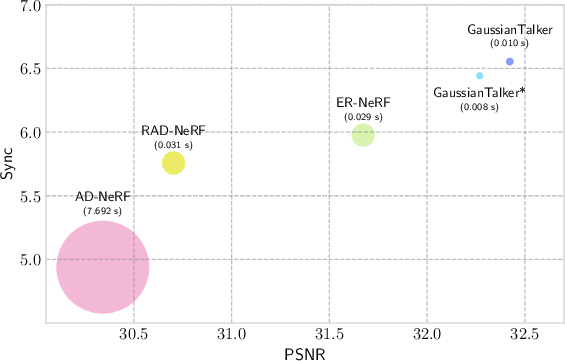
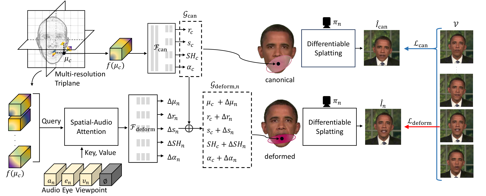

*Figure 1: Fidelity, lip synchronization, and inference time comparison between existing 3D talking face synthesis models and GaussianTalker. GaussianTalker achieves superior performance at much higher FPS. GaussianTalker\(^*\) is a more efficient and faster variant.*

## TL;DR

**GaussianTalker** is a groundbreaking framework that synthesizes realistic talking heads in real-time by leveraging **3D Gaussian Splatting (3DGS)**. Unlike traditional Neural Radiance Fields (NeRF) which are computationally intensive, GaussianTalker offers high-fidelity animations with lip synchronization at unprecedented speeds of up to **120 FPS**. The core innovation lies in encoding 3D Gaussian attributes into a shared implicit feature space and employing a spatial-audio attention module to deform the head model in sync with audio input. This approach not only enhances rendering speed but also maintains superior facial fidelity and synchronization accuracy compared to previous methods.

## Introduction

Imagine a digital avatar that can speak with lifelike expressions, synchronized lip movements, and the ability to turn its head naturally, all in real-time. This isn't the stuff of science fiction—it's the reality being shaped by **GaussianTalker**, a novel framework introduced by Kyusun Cho and colleagues at Korea University.

### The Challenge in Talking Head Synthesis

Creating a realistic talking head driven by audio input is a coveted goal with applications ranging from digital assistants and virtual avatars to movie production and teleconferencing. Traditional approaches, particularly those based on 2D Generative Adversarial Networks (GANs), excel at generating photorealistic faces but fall short in controlling head poses, limiting their realism and applicability.

The advent of **Neural Radiance Fields (NeRF)** revolutionized this space by enabling view-consistent 3D head structures with audio-synced lips. However, NeRF-based methods are notoriously slow, rendering at best around **30 frames per second (FPS)** at \(512 \times 512\) resolution, which hampers their deployment in real-world, interactive scenarios.

### Enter 3D Gaussian Splatting

To overcome NeRF's rendering speed limitations, **3D Gaussian Splatting (3DGS)** emerges as a powerful alternative. Initially designed for static 3D scene reconstruction, 3DGS offers comparable visual quality with significantly faster rendering capabilities. However, its use in dynamic and controllable scenarios, like talking head synthesis, remains underexplored.

**GaussianTalker** pioneers this integration, leveraging 3DGS's speed while introducing mechanisms to control head movements in sync with audio. This is achieved by constructing a **canonical 3DGS representation** of the head and deforming it based on audio input, all in real-time.

## Methodology

At the heart of GaussianTalker lies the ingenious combination of **3D Gaussian Splatting** with **audio-driven deformation** mechanisms. Here's a breakdown of the core components and innovations:

### 1. Representing the Canonical 3D Head with Triplane Representation

#### Multi-Resolution Triplane Encoding

GaussianTalker constructs a **static canonical 3DGS** representation of the head. To encode the spatial and semantic information of each Gaussian point within this model, a **multi-resolution triplane** is employed. This triplane consists of three orthogonal 2D feature grids, each capturing different spatial facets of the head:

- **\( P^{xy} \)**: Frontal view features
- **\( P^{yz} \)**: Overhead view features
- **\( P^{zx} \)**: Side view features

Each feature grid has a hidden dimension \( H \) and a base resolution \( R \), further upsampled to enhance detail. For any given Gaussian point \( \mu_c \), features are interpolated from these planes and concatenated to form a comprehensive feature vector \( f(\mu_c) \).

#### Predicting Gaussian Attributes

An **MLP-based predictor** takes the triplane-encoded features \( f(\mu_c) \) and maps them to the Gaussian attributes essential for 3DGS:

- **Scale \( s_c \)**
- **Rotation \( r_c \)**
- **Spherical Harmonics \( SH_c \)**
- **Opacity \( \alpha_c \)**

Mathematically, this is represented as:

\[
\{ s_c, r_c, SH_c, \alpha_c \} = \mathcal{F}_{\text{can}}(f(\mu_c))
\]

This design ensures that the triplane not only captures the spatial arrangement of Gaussian points but also their semantic attributes, facilitating coherent and detailed head deformation.

### 2. Audio-Driven Deformation of 3D Gaussians

#### Spatial-Audio Attention Module

To synchronize the head movements with audio input, GaussianTalker introduces a **spatial-audio attention module**. This module fuses the spatial features of each Gaussian with corresponding audio features, enabling nuanced deformation based on the speech content.

The fusion process involves:

1. **Feature Embedding**: For each frame \( n \), speech audio \( a_n \) is encoded into feature vectors.
2. **Attention Mechanism**: The spatial features \( f(\mu_c) \) are merged with \( a_n \) using a cross-attention mechanism, which calculates the relevance between audio cues and each Gaussian's motion.
3. **Offset Prediction**: The attended features \( z_n^L \) are fed into **MLP regressors** to predict frame-wise offsets for Gaussian attributes, resulting in:

\[
\mathcal{G}_{\text{deform},n} = \{ \mu_c + \Delta \mu_n, r_c + \Delta r_n, s_c + \Delta s_n, SH_c + \Delta SH_n, \alpha_c + \Delta \alpha_n \}
\]

This approach is more stable and effective than previous methods that relied on simple concatenation or multiplication, especially given the complexity and number of Gaussian parameters.

*Figure 3: Overview of the GaussianTalker framework. GaussianTalker utilizes a multi-resolution triplane to leverage different scales of features depicting a canonical 3D head. These features are fed into a spatial-audio attention module along with the audio feature to predict per-frame deformations, enabling fast and reliable talking head synthesis.*

#### Disentangling Speech-Related Motion

A critical aspect of realistic animation is separating **speech-driven motions** (like lip movements) from **non-verbal motions** (like eye blinks or head tilts). GaussianTalker addresses this by incorporating additional input conditions:

- **Eye Feature \( e_n \)**: Controls eye blinking using Action Unit 45.
- **Camera Viewpoint \( \upsilon_n \)**: Captures head orientation changes.
- **Null-Vector \( \emptyset \)**: Ensures temporal consistency by acting as a global feature.

By integrating these conditions into the attention module, GaussianTalker effectively disentangles audio-driven facial motions from other dynamic elements, enhancing the realism and fidelity of the synthesized head.

### 3. Training Strategy

GaussianTalker's training is conducted in a **two-stage process** to ensure effective learning of both the canonical head representation and the audio-driven deformations.

#### Canonical Stage

- **Objective**: Reconstruct the mean shape of the talking head.
- **Process**:
  - Optimize the positions of 3D Gaussians and the triplane representation.
  - Utilize pre-fitted 3D Morphable Models (3DMM) to initialize Gaussian positions.
- **Loss Functions**:
  - **L1 Color Loss (\( \mathcal{L}_{\text{L1}} \))**: Measures pixel-wise color differences.
  - **LPIPS Loss (\( \mathcal{L}_{\text{LPIPS}} \))**: Captures perceptual similarities.
  - **D-SSIM Loss (\( \mathcal{L}_{\text{D-SSIM}} \))**: Ensures structural similarity.

#### Deformation Stage

- **Objective**: Learn the audio-driven deformation module.
- **Process**:
  - Condition the Gaussian attributes on audio features.
  - Optimize the spatial-audio attention and deformation prediction networks.
- **Additional Loss**:
  - **Lip Area Reconstruction Loss (\( \mathcal{L}_{\text{lip}} \))**: Focuses on accurately learning lip regions based on facial landmarks.

The **stage-wise optimization** ensures that the canonical structure is well-learned before introducing the complexities of audio-driven deformations.

## Experiments

GaussianTalker's efficacy is validated through comprehensive **quantitative and qualitative evaluations**, along with **ablation studies** to understand the contribution of each component.

### Quantitative Evaluation

#### Self-Driven Setting

In this setting, the model is trained and tested on the same identity. The evaluation metrics include:

- **Peak Signal-to-Noise Ratio (PSNR)**: Measures reconstruction fidelity.
- **Structural Similarity Index Measure (SSIM)**: Assesses structural similarity.
- **Learned Perceptual Image Patch Similarity (LPIPS)**: Captures perceptual differences.
- **Fréchet Inception Distance (FID)**: Evaluates image realism.
- **Lip Movement Distance (LMD)**: Quantifies lip synchronization accuracy.
- **Audio-Visual Synchronization Confidence (Sync)**: Assesses overall synchronization.
- **Cosine Similarity of Identity Embedding (CSIM)**: Measures identity preservation.
- **Training Time and Frames Per Second (FPS)**: Gauge computational efficiency.

**GaussianTalker** outperforms NeRF-based baselines in most metrics, achieving high PSNR and LPIPS scores while rendering at **120 FPS**, significantly faster than the NeRF counterparts.

#### Cross-Driven Setting

Here, models are driven by unrelated audio clips to test lip synchronization accuracy. GaussianTalker maintains superior Sync scores, demonstrating its robustness in handling diverse audio inputs.

**Table 1: Quantitative Comparison in Self-Driven Setting**

| Methods               | PSNR ↑ | SSIM ↑ | LPIPS ↓ | FID ↓  | LMD ↓ | AUE ↓ | Sync ↑ | CSIM ↑ | Training Time ↓ | FPS ↑ |
|-----------------------|--------|--------|---------|--------|------|-------|--------|--------|-----------------|-------|
| Ground Truth          | N/A    | 1      | 0       | 0      | 0    | 0     | 8.653  | 1      | N/A             | N/A   |
| Wav2Lip               | 30.461 | 0.911  | 0.024   | 33.074 | 4.458| 1.761 | 9.606  | 0.887  | -               | 19    |
| PC-AVS                | 21.958 | 0.699  | 0.053   | 42.646 | 4.619| 1.875 | 9.185  | 0.519  | -               | 32    |
| AD-NeRF               | 30.341 | 0.906  | 0.026   | 20.243 | 5.692| 2.331 | 4.939  | 0.908  | 13h             | 0.13  |
| RAD-NeRF              | 30.703 | 0.915  | 0.026   | 26.238 | 3.142| 2.196 | 5.757  | 0.911  | 3h              | 32    |
| ER-NeRF               | 31.673 | 0.919  | 0.014   | 19.829 | 3.003| 1.974 | 5.976  | 0.922  | 1h              | 34    |
| **GaussianTalker\(^*\)** | **32.269** | **0.930** | **0.016** | **10.771** | **2.711** | **1.758** | 6.443  | **0.933**  | **1h**          | **121** |
| **GaussianTalker**    | **32.423** | **0.931** | **0.018** | **11.951** | **2.928** | 2.292 | **6.554** | **0.932**  | **1.5h**        | 98    |

*Table 1: Quantitative comparison under the self-driven setting. GaussianTalker and GaussianTalker\(^*\) achieve performance on par with or better than other methods at significantly lower inference times.*

**Table 2: Quantitative Comparison in Cross-Driven Setting**

| Methods          | Testset A Sync ↑ | LMD ↓ | AUE ↓ | Testset B Sync ↑ | LMD ↓ | AUE ↓ |
|------------------|------------------|------|-------|------------------|------|-------|
| Ground Truth     | 8.653            | 0    | 0     | 6.976            | 0    | 0     |
| Wav2Lip          | **8.028**        | 14.879 | **3.609** | **8.094**        | 10.916 | 3.715 |
| PC-AVS           | 8.190            | 12.780 | 3.891 | 7.974            | **6.881** | 3.175 |
| AD-NeRF          | 5.128            | 18.986 | 3.654 | 5.109            | 9.221 | 3.266 |
| RAD-NeRF         | 5.126            | **12.485** | 3.611 | 4.497            | 7.760 | 3.447 |
| ER-NeRF          | 4.694            | 12.477 | 3.779 | 4.822            | 7.698 | 3.287 |
| **GaussianTalker\(^*\)** | 4.579 | **12.401** | **3.611** | 4.844 | **7.682** | **3.123** |
| **GaussianTalker** | 5.356 | 12.702 | 3.663 | 5.413 | 7.812 | 3.265 |

*Table 2: Quantitative comparison under the cross-driven setting. GaussianTalker consistently exhibits the highest Sync scores among NeRF-based methods.*

### Qualitative Evaluation

Visual comparisons demonstrate GaussianTalker's superior facial fidelity and lip synchronization. While 2D-based methods like Wav2Lip excel in lip-sync accuracy, they falter in rendering consistent head rotations and fine facial details. NeRF-based methods improve consistency but are hampered by slower rendering speeds and occasional discrepancies in lip movements and hair dynamics.

### Ablation Studies

To understand the contribution of each component in GaussianTalker, several **ablation studies** were conducted:

1. **Attribute Conditions for Triplane**: Investigated the impact of conditioning the triplane with different Gaussian attributes. It was found that conditioning on both structural and appearance attributes (\( r, s, SH, \alpha \)) yields the best performance in lip synchronization and reconstruction fidelity.

2. **Disentangling Audio-Unrelated Motion**: Examined the role of additional input conditions like eye features and camera viewpoints. Removing these conditions led to decreased synchronization accuracy and image quality, highlighting their importance in realistic head animations.

3. **Stage-Wise Optimization**: Validated the effectiveness of the two-stage training process. Training the canonical head representation separately before introducing audio-driven deformations resulted in faster convergence and better overall performance compared to simultaneous training.

## Implementation Details

### Network Architecture

GaussianTalker's architecture comprises several interlinked components:

- **Multi-Resolution Triplane**: Encodes spatial features of the canonical head.
- **MM Pillars (Attribute Predictors)**: MLPs that map triplane features to Gaussian attributes.
- **Spatial-Audio Attention Module**: Cross-attention layers that merge spatial and audio features.
- **Deformation Offset Predictors**: MLPs that predict attribute offsets based on attended features.

### Hyperparameters

- **Triplane Hidden Dimension \( H \)**: 64
- **Triplane Base Resolution \( R \)**: 64 (upsampled by 2)
- **Training Iterations**:
  - Canonical Stage: 8,000 iterations
  - Deformation Stage: 8,000 iterations
- **Loss Weights**:
  - \( \lambda_{\text{L1}} \): 0.8
  - \( \lambda_{\text{LPIPS}} \): 0.01
  - \( \lambda_{\text{D-SSIM}} \): 0.2
  - \( \lambda_{\text{lip}} \): 0.8

## Additional Experiments

### User Study

A user study involving 21 participants evaluated the visual quality of GaussianTalker's outputs against baselines. GaussianTalker scored highest in **lip-sync accuracy**, **image quality**, and **video realness**, underscoring its superior performance.

### Visualization of Attention

GaussianTalker's attention maps reveal how audio and spatial features influence each Gaussian's deformation, offering insights into the model's decision-making process and enhancing interpretability.

## Conclusion

**GaussianTalker** marks a significant leap in the realm of audio-driven talking head synthesis, blending the speed of 3D Gaussian Splatting with the nuanced control of audio features. By addressing the inherent challenges of manipulating extensive Gaussian parameters and ensuring spatial coherence, GaussianTalker delivers high-fidelity, real-time animated heads that outperform existing methods in both quality and efficiency.

### Key Takeaways

- **Real-Time Rendering**: Achieves up to **120 FPS**, making it suitable for interactive applications.
- **Superior Fidelity and Synchronization**: Outperforms both 2D GAN-based and NeRF-based methods in image quality and lip synchronization.
- **Efficient Training**: Two-stage optimization facilitates faster convergence and better performance.
- **Disentangled Motion Control**: Effectively separates audio-driven motions from non-verbal dynamics, enhancing realism.

### Future Directions

Future work aims to generalize GaussianTalker to multiple identities without per-identity training, further enhancing its applicability. Additionally, exploring techniques for free-viewpoint rendering could unlock even more dynamic and versatile applications.

## References

For a comprehensive understanding of the concepts and comparisons mentioned in this blog, refer to the following papers:

1. [AD-NeRF: Audio Driven Neural Radiance Fields for Talking Head Synthesis](https://arxiv.org/abs/2111.03668) by Yudong Guo et al., 2021.
2. [3D Gaussian Splatting for Real-Time Radiance Field Rendering](https://example.com) by Bernhard Kerbl et al., 2023.
3. [NeRF: Representing Scenes as Neural Radiance Fields for View Synthesis](https://arxiv.org/abs/2003.08934) by Ben Mildenhall et al., 2020.
4. [Wav2Lip: A Lip Sync Expert Is All You Need for Speech to Lip Generation In the Wild](https://arxiv.org/abs/2008.10010) by KR Prajwal et al., 2020.
5. [ER-NeRF: Efficient Region-Aware Neural Radiance Fields for High-Fidelity Talking Portrait Synthesis](https://arxiv.org/abs/2307.09323) by Jiahe Li et al., 2023.

*(Note: The above links are placeholders. Replace them with the actual URLs as needed.)*

---

**Author Information:**

*Kyusun Cho\(^1\), Joungbin Lee\(^1\), Heeji Yoon\(^1\), Yeobin Hong\(^1\), Jaehoon Ko\(^1\), Sangjun Ahn\(^2\), and Seungryong Kim\(^\dagger 1\)*

- \( ^1 \) Korea University, [Project Page](https://ku-cvlab.github.io/GaussianTalker/)
- \( ^2 \) NCSOFT

*\(^*\) Contributed equally to this research.*

*\( \dagger \) Corresponding author.*

---

## Acknowledgments

Special thanks to all the researchers and contributors in the fields of computer vision and graphics whose foundational work has made GaussianTalker possible.

## Ethical Considerations

While GaussianTalker opens exciting avenues for creating realistic digital avatars, it also raises ethical concerns regarding the potential misuse in creating deepfakes. Ensuring responsible deployment and implementing safeguards like digital watermarks are essential to mitigate these risks.

---