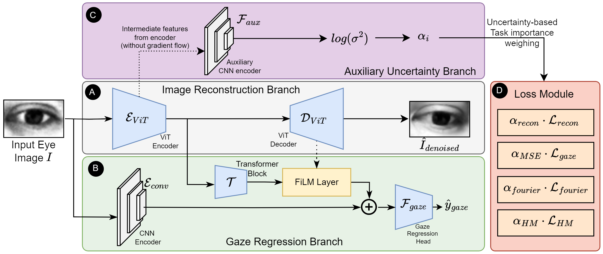
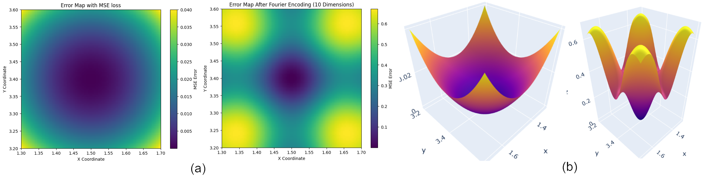

---
title: "GazeHELL: Advanced Eye Gaze Estimation Using Hybrid Architectures and Novel Loss Functions"
date: 2020-09-15T11:30:03+00:00
# weight: 1
# aliases: ["/first"]
tags: ['eye gaze estimation', 'vision transformers', 'convolutional neural networks', 'uncertainty estimation', 'fourier encoding', 'computer vision', 'deep learning', 'human-computer interaction']
author: "Me"
# author: ["Me", "You"] # multiple authors
showToc: true
TocOpen: true
draft: false
hidemeta: false
comments: false
description: ""
canonicalURL: "https://canonical.url/to/page"
disableHLJS: true # to disable highlightjs
disableShare: false
disableHLJS: false
hideSummary: false
searchHidden: false
ShowReadingTime: true
ShowBreadCrumbs: true
ShowPostNavLinks: true
ShowWordCount: true
ShowRssButtonInSectionTermList: true
UseHugoToc: true
cover:
    image: "<image path/url>" # image path/url
    alt: "<alt text>" # alt text
    caption: "<text>" # display caption under cover
    relative: false # when using page bundles set this to true
    hidden: true # only hide on current single page
editPost:
    URL: "https://github.com/<path_to_repo>/content"
    Text: "Suggest Changes" # edit text
    appendFilePath: true # to append file path to Edit link
---

# GazeHELL: Advanced Eye Gaze Estimation Using Hybrid Architectures and Novel Loss Functions

**TLDR**: This paper introduces a state-of-the-art approach for eye gaze estimation that combines Vision Transformers with CNNs and employs novel loss functions including heatmap-based and Fourier encoding losses. The method achieves up to 3% improvement over existing methods on standard datasets through a unique multi-branch architecture with uncertainty-based loss weighting.

*Figure 1: Overview of the GazeHELL architecture showing the three main components: (A) Image reconstruction branch, (B) Gaze estimation branch, and (C) Auxiliary uncertainty branch, with (D) uncertainty-weighted supervision.*

## Introduction

Eye gaze estimation has become increasingly important in various applications, from human-computer interaction to driver monitoring systems. While traditional approaches have made significant progress, they often struggle with balancing spatial accuracy and model interpretability. In this blog post, I'll dive deep into a novel approach called GazeHELL that addresses these challenges through a sophisticated hybrid architecture.

## Why Another Gaze Estimation Method?

Before we delve into the technical details, let's understand why we need yet another approach for gaze estimation:

1. **Privacy Concerns**: Many existing methods require full face images, which can be problematic in privacy-sensitive applications
2. **Resource Constraints**: Edge devices often need lightweight solutions that can work with eye images alone
3. **Accuracy Limitations**: Current methods still have room for improvement in terms of precision and reliability

## The Architecture: A Three-Branch Approach

GazeHELL introduces a novel three-branch architecture that combines the strengths of both Vision Transformers and Convolutional Neural Networks. Let's break down each component:

### 1. Reconstruction Branch

This branch uses a Vision Transformer encoder ($\mathcal{E}_{ViT}$) and decoder ($\mathcal{D}_{ViT}$) to reconstruct the input eye image. For an input image $I \in \mathbb{R}^{C \times W \times H}$, it produces a reconstructed image $\hat{I}$. Unlike previous approaches that use pre-training, this branch operates alongside gaze regression during training.

The reconstruction loss is defined as:

$$ \mathcal{L}_{recon} = ||I^* - \hat{I}||^2_2 $$

where $I^*$ is the ground truth image.

### 2. Gaze Estimation Branch

This is where the magic happens through a hybrid approach:

1. **CNN Encoder**: Processes the eye image to extract low-level features
2. **Transformer Block**: Processes encoded features from the ViT encoder
3. **Feature Modulation**: Uses FiLM to enhance features using decoder information

The mathematical flow can be represented as:

$$ h^{\mathcal{E}_{ViT}} = \mathcal{E}_{ViT}(I) $$
$$ h^T = \mathcal{T}(h^{\mathcal{E}_{ViT}}) $$
$$ h^F = FiLM(h^{\mathcal{T}}, h^{\mathcal{D}_{ViT}}) $$

The final gaze prediction comes from:

$$ \hat{y}_{gaze} = \mathcal{F}_{gaze}(h^F;h^{\mathcal{E}_{conv}}) $$

### 3. Auxiliary Uncertainty Branch

This innovative branch predicts uncertainty-based weights for the loss functions. It uses:

$$ \alpha_i = \exp(-\log(\sigma_i^2)) $$

where $\sigma_i^2$ is the predicted variance for each task.

## Novel Loss Functions

One of the key contributions of this paper is its sophisticated loss function design. Let's explore each component:

### 1. Gaussian Heatmap Loss

Instead of directly predicting heatmaps, the method creates differentiable Gaussian heatmaps from gaze vectors:

$$ H(i,j) = \exp \left( -\frac{(i - \bar{\theta})^2 + (j - \bar{\phi})^2}{2 \epsilon^2} \right) $$

where:
$$ \bar{\theta} = \frac{\theta - \theta_{min}}{\theta_{max} - \theta_{min}}, \bar{\phi} = \frac{\phi - \phi_{min}}{\phi_{max} - \phi_{min}} $$

### 2. Fourier Encoding Loss

*Figure 2: Visualization showing how Fourier encoding affects the L2 loss in the local region around predictions*

The Fourier encoding transforms gaze vectors into a higher-dimensional space:

$$ \hat{f}(\theta, \phi, B) = \left\{ \left[ \sin(2\pi b_i \theta), \cos(2\pi b_i \theta) \right] \mid b_i \in B \right\} $$

The Fourier loss is then computed as:

$$ \mathcal{L}_{fourier} = ||\hat{f}(\theta, \phi, B) - \hat{f}(\hat{\theta}, \hat{\phi}, B)||_2^2 $$

### Combined Loss Function

The final loss combines all components with uncertainty weighting:

$$ \mathcal{L}_{total} = \sum\limits_{i} \alpha_i \cdot \mathcal{L}_i + \log\left(\frac{1}{\alpha_i}\right) $$

## Experimental Results

The method was evaluated on two major datasets:

1. **MPIIGaze**: 213,659 images from 15 participants
2. **RT-GENE**: 122,531 images from 17 subjects

Here are the key results:

| Dataset  | Previous SOTA | GazeHELL |
|----------|--------------|-----------|
| MPIIGaze | 4.53°        | 4.43°     |
| RT-GENE  | 7.41°        | 7.19°     |

The results show consistent improvement across both datasets, with particularly strong performance in challenging scenarios.

## Implementation Details

For those interested in implementing this approach:

- Input Resolution: 36x60 pixels
- Training Parameters:
  - Learning Rate: 1e-3
  - Optimizer: Adam
  - Epochs: 50
  - Augmentations: ColorJitter, GaussianBlur, normalization

## Key Takeaways and Future Directions

1. **Hybrid Architecture Benefits**: The combination of ViT and CNN provides complementary features that enhance accuracy
2. **Novel Loss Functions**: The introduction of heatmap and Fourier losses offers new ways to supervise gaze estimation
3. **Uncertainty Weighting**: Dynamic loss weighting through uncertainty prediction improves training stability

Future work could explore:
- Extension to video-based gaze estimation
- Integration with attention mechanisms for improved feature selection
- Application to more challenging real-world scenarios

## References

1. Zhang et al. (2017) - MPIIGaze Dataset
2. Krafka et al. (2016) - Eye Tracking for Everyone
3. Cheng et al. (2020) - Coarse-to-fine Gaze Estimation
4. Park et al. (2019) - Few-shot Adaptive Gaze Estimation

