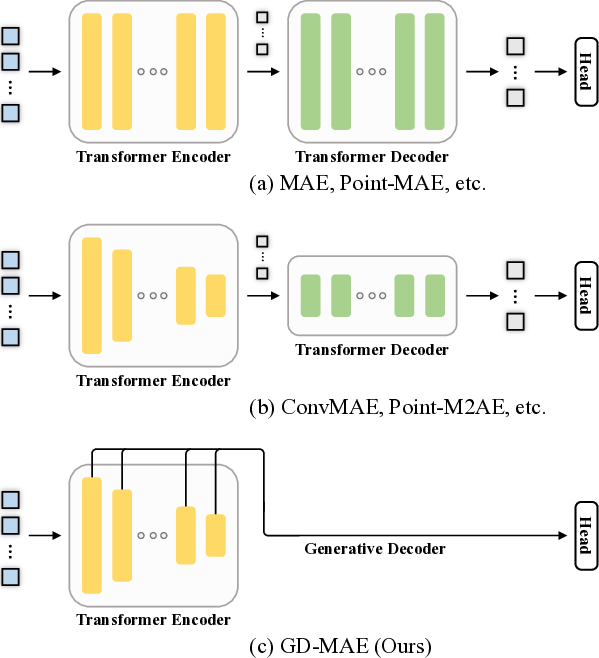

# GD-MAE: Generative Decoder for MAE Pre-training on LiDAR Point Clouds

## TL;DR

- GD-MAE introduces a simple yet effective generative decoder for masked autoencoder (MAE) pre-training on LiDAR point clouds
- The generative decoder automatically expands visible regions to masked areas, avoiding complex decoder designs and enabling flexible masking strategies
- GD-MAE achieves state-of-the-art results on large-scale 3D object detection benchmarks like Waymo, KITTI and ONCE
- With only 20% labeled data, GD-MAE achieves comparable accuracy to fully-supervised methods on Waymo

## Introduction

3D object detection from LiDAR point clouds is a critical task for autonomous driving and robotics applications. While supervised learning approaches have shown impressive performance, they rely on large amounts of carefully labeled 3D data, which is expensive and time-consuming to obtain. Self-supervised pre-training offers a promising direction to leverage massive unlabeled data and improve generalization.

Masked Autoencoders (MAE) have emerged as a powerful self-supervised learning paradigm for 2D vision tasks. However, extending MAE to 3D point clouds poses unique challenges due to the irregular and sparse nature of point cloud data. Previous approaches have relied on complex decoder designs or elaborate masking strategies to handle the hierarchical structure of 3D representations.

In this paper, we introduce GD-MAE - a much simpler yet effective framework for MAE pre-training on LiDAR point clouds. The key idea is to use a generative decoder that automatically expands visible regions to masked areas in a hierarchical fusion manner. This eliminates the need for complex decoder architectures and enables flexible masking strategies.

## Method Overview

The GD-MAE framework consists of three main components:

1. Sparse Pyramid Transformer (SPT) encoder
2. Flexible masking module  
3. Generative Decoder (GD)

Let's dive into each of these components in detail.

### Sparse Pyramid Transformer Encoder

The SPT encoder is designed to efficiently process sparse LiDAR point clouds and extract multi-scale features. It consists of the following steps:

1. **Pillar Feature Encoding**: The input point cloud $\mathcal{P}=\left\{p_i\right\}_{i=0}^{N-1}$ is first converted to a grid of 2D pillars. For each point $p_i$, its pillar index is calculated as:

   $$v_i = (\lfloor\frac{x_i}{V_x}\rfloor, \lfloor\frac{y_i}{V_y}\rfloor)$$

   where $(x_i, y_i)$ are the point coordinates and $(V_x, V_y)$ are the pillar sizes.

2. **PointNet Aggregation**: A PointNet layer aggregates features from points within each pillar to obtain pillar-wise features.

3. **Multi-scale Processing**: The pillar features are processed through three stages to generate feature maps at different scales. Each stage consists of:
   
   - Sparse Regional Attention (SRA) layers
   - Region Shift (RS) operation
   - Shortcut connection and submanifold convolution

The SRA layer performs self-attention within local regions:

$$\mathcal{F} = \text{SRA}(\text{SRA}(\mathcal{F}, \mathcal{C}), \text{RS}(\mathcal{C}))$$

where $\mathcal{F}$ are the token features and $\mathcal{C}$ are the token coordinates.

This multi-scale design allows the encoder to capture both fine-grained local geometry and long-range contextual information.

### Flexible Masking Module

GD-MAE supports three masking strategies with different granularities:

1. **Block-wise Masking**: Masks tokens from the final stage of the encoder. Requires backtracing to maintain consistency across scales.

2. **Patch-wise Masking**: Masks upsampled tokens at the input resolution. Naturally maintains consistency.

3. **Point-wise Masking**: Directly masks input points. Uses patch-wise decoding.

The patch-wise strategy provides a good balance, allowing fine-grained masking while avoiding overly difficult reconstruction tasks.

### Generative Decoder

The key innovation in GD-MAE is the simple yet effective generative decoder. It consists of:

1. **Multi-scale Feature Fusion**: Features from different encoder stages are unified to the same scale using transposed convolutions:

   $$D = \text{Conv}([F_1(S(E_1)), F_2(S(E_2)), F_3(S(E_3))])$$

   where $E_i$ are features from stage $i$, $S$ scatters sparse features, and $F_i$ are convolution/transposed convolution layers.

2. **Feature Expansion**: A 3x3 convolution expands the fused features to potentially masked regions.

3. **Masked Feature Indexing**: Features for masked tokens are obtained by indexing the expanded feature map:

   $$E = G(D)$$

   where $G$ is the indexing operation.

This design eliminates the need for learnable mask tokens or complex cross-attention mechanisms used in previous approaches. The generative nature allows automatic expansion of visible features to masked areas.

### Reconstruction Target

For each masked token, the model reconstructs the point cloud within its corresponding region. The reconstruction loss is computed using Chamfer Distance:

$$\mathcal{L}_\text{CD} = \text{ChamferDistance}(\hat{P}_\text{mask}, P_\text{mask})$$

where $\hat{P}_\text{mask}$ are the predicted points and $P_\text{mask}$ are the ground truth points.

## Experiments and Results

The authors conducted extensive experiments on three large-scale LiDAR datasets: Waymo Open Dataset, KITTI, and ONCE. Here are some of the key results:

### Waymo Open Dataset

GD-MAE achieves state-of-the-art performance among single-stage detectors on the Waymo validation set:

- 1.5 mAPH/L2 higher than the previous best single-stage model
- Outperforms the baseline (SST) by 5.42 and 7.12 APH/L2 for vehicle and pedestrian detection
- Surpasses two-stage methods like PV-RCNN++ by 0.98 mAPH/L2

Most impressively, GD-MAE achieves comparable accuracy to fully-supervised methods using only 20% of the labeled data.

### KITTI Dataset

On the KITTI test set, GD-MAE achieves competitive results compared to other state-of-the-art methods:

- 88.14 AP for the "Easy" car category
- 79.03 AP for the "Moderate" car category
- 73.55 AP for the "Hard" car category

### ONCE Dataset

GD-MAE significantly outperforms previous strong detectors on the ONCE validation split:

- 64.92 mAP overall, which is 5.85 and 4.87 higher than CenterPoint-Pillar and CenterPoint-Voxel respectively
- Consistent improvements across different object categories and distance ranges

## Ablation Studies

The authors conducted several ablation studies to analyze the impact of different components:

1. **Sparse Pyramid Transformer**: The hierarchical architecture consistently improves detection accuracy for all categories, with a larger impact on vehicle detection.

2. **Masked Autoencoder**: Pre-training with MAE provides consistent improvements across all object categories. The gains are more significant when using limited labeled data (e.g., 3.89 mAPH improvement with 5% labeled data).

3. **Masking Strategies**: Patch-wise masking performs the best, providing a good balance between task difficulty and feature learning.

4. **Generative Decoder**: The simple generative decoder outperforms transformer-based decoders while being much more efficient (3.2ms vs 27.1ms runtime).

5. **Pre-training Dataset**: Pre-training on a different dataset (ONCE) and fine-tuning on Waymo still provides consistent improvements, demonstrating good generalization.

## Conclusion and Future Work

GD-MAE introduces a simple yet effective approach for MAE pre-training on LiDAR point clouds. The key innovations are:

1. A multi-scale Sparse Pyramid Transformer encoder
2. A flexible masking module supporting different granularities
3. A generative decoder that simplifies the pre-training process

The proposed method achieves state-of-the-art results on multiple large-scale 3D object detection benchmarks, demonstrating its effectiveness and generalization capability.

Future directions for this work could include:

- Exploring the application of GD-MAE to other 3D vision tasks like semantic segmentation or instance segmentation
- Investigating multi-modal pre-training by incorporating image data alongside LiDAR
- Extending the framework to handle temporal sequences of point clouds for 4D perception

The simplicity and effectiveness of GD-MAE make it a promising approach for leveraging large amounts of unlabeled 3D data in autonomous driving and robotics applications.

## References

[1] He, K., Chen, X., Xie, S., Li, Y., Dollár, P., & Girshick, R. (2022). Masked autoencoders are scalable vision learners. In Proceedings of the IEEE Conference on Computer Vision and Pattern Recognition.

[2] Lang, A. H., Vora, S., Caesar, H., Zhou, L., Yang, J., & Beijbom, O. (2019). PointPillars: Fast encoders for object detection from point clouds. In Proceedings of the IEEE Conference on Computer Vision and Pattern Recognition.

[3] Shi, S., Guo, C., Jiang, L., Wang, Z., Shi, J., Wang, X., & Li, H. (2020). PV-RCNN: Point-voxel feature set abstraction for 3D object detection. In Proceedings of the IEEE Conference on Computer Vision and Pattern Recognition.

[4] Sun, P., Kretzschmar, H., Dotiwalla, X., Chouard, A., Patnaik, V., Tsui, P., ... & Anguelov, D. (2020). Scalability in perception for autonomous driving: Waymo open dataset. In Proceedings of the IEEE Conference on Computer Vision and Pattern Recognition.

[5] Yin, T., Zhou, X., & Krähenbühl, P. (2021). Center-based 3d object detection and tracking. In Proceedings of the IEEE Conference on Computer Vision and Pattern Recognition.

[6] Zhang, R., Guo, Z., Gao, P., Fang, R., Zhao, B., Wang, D., ... & Li, H. (2022). Point-M2AE: Multi-scale masked autoencoders for hierarchical point cloud pre-training. In Advances in Neural Information Processing Systems.

