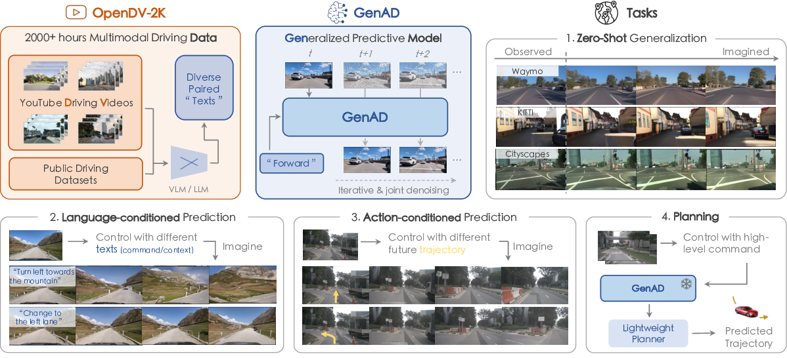
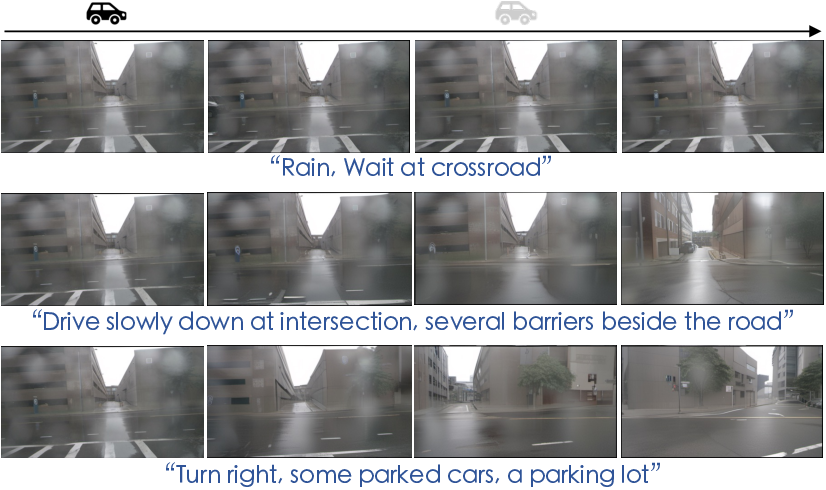

# Generalized Predictive Model for Autonomous Driving

*Figure 1: Overview of the GenAD paradigm. The approach establishes a generalized video prediction paradigm for autonomous driving by presenting the largest multimodal driving video dataset to date, OpenDV-2K, and a generative model that predicts the future given past visual and textual input, GenAD.*

## TLDR

- Introduces OpenDV-2K, the largest multimodal driving video dataset with over 2000 hours of footage
- Proposes GenAD, a generative model for video prediction in autonomous driving scenarios
- Achieves strong zero-shot generalization across diverse driving conditions and datasets
- Demonstrates applications in language-conditioned prediction, action-conditioned prediction, and motion planning

## Introduction

Autonomous driving has been a hot topic in both academia and industry for decades, yet its widespread deployment remains limited. One of the key challenges is the generalization ability of learned models in structured autonomous driving systems. Perception models struggle with diverse environments, while prediction and planning models fail to generalize to nondeterministic futures with rare scenarios and different driving intentions.

In this blog post, we'll dive into a groundbreaking paper that addresses these challenges by introducing a generalized video prediction paradigm for autonomous driving. The authors present OpenDV-2K, the largest multimodal driving video dataset to date, and GenAD, a powerful generative model for predicting future driving scenarios.

## The OpenDV-2K Dataset

One of the major contributions of this work is the creation of OpenDV-2K, a massive dataset containing over 2000 hours of driving videos paired with diverse text descriptions. Let's break down the key features of this dataset:

1. **Scale**: OpenDV-2K is 374 times larger than the widely used nuScenes dataset, providing an unprecedented amount of data for training and evaluation.

2. **Diversity**: The dataset covers a wide range of geographic locations, weather conditions, and traffic scenarios, ensuring broad representation of real-world driving situations.

3. **Data Sources**: 
   - YouTube driving videos (1747 hours)
   - Publicly licensed datasets (312 hours)

4. **Annotations**: 
   - Frame descriptions (contexts) generated using BLIP-2
   - Driver commands inferred using a trained video classifier

5. **Geographic Distribution**: Videos from over 40 countries and 244 cities worldwide

6. **Sensor Configurations**: Unrestricted camera setups, enhancing robustness to different sensor types

The creation of OpenDV-2K involved several key steps:

1. **Data Collection**: Carefully curated 2139 high-quality front-view driving videos from 43 YouTubers.
2. **Format Conversion**: Pre-processed videos into sets of consecutive frames at 10Hz.
3. **Data Cleaning**: Removed non-driving frames, black frames, and transition frames.
4. **Language Annotation**: Generated frame descriptions and driver commands using BLIP-2 and a trained video classifier.

## The GenAD Model

GenAD (Generative model for Autonomous Driving) is the core contribution of this work. It's a novel temporal generative model designed to capture the complex evolution of dynamic driving scenarios. Let's explore its key components and training process.

### Model Architecture

GenAD is built upon the SDXL model, a large-scale latent diffusion model for text-to-image generation. The authors adapt this model for video prediction through a two-stage learning process:

1. **Image Domain Transfer**: Fine-tune SDXL on driving images to adapt it to the autonomous driving domain.
2. **Video Prediction Pre-training**: Introduce temporal reasoning blocks and train the model to predict future frames given past observations and text conditions.

The model architecture includes several key components:

1. **Causal Temporal Attention**: Ensures proper temporal causality in predictions.
2. **Decoupled Spatial Attention**: Handles large motions and view shifts in driving scenes.
3. **Deep Interaction**: Interleaves temporal reasoning blocks with original Transformer blocks for enhanced spatiotemporal feature interaction.

### Training Process

The training of GenAD occurs in two stages:

#### Stage 1: Image Domain Transfer

In this stage, the model is fine-tuned on text-to-image generation using image-text pairs from OpenDV-2K. The objective function is:

$$ \mathcal{L}_\text{img} = \mathbb{E}_{\mathbf{x}, \boldsymbol{\epsilon} \sim \mathcal{N}(0, 1), \mathbf{c}, t}\left[ \| \boldsymbol{\epsilon} - \mathbf{f}_\theta(\mathbf{x}_{t};\mathbf{c},t) \|_{2}^{2}\right] $$

where:
- $\mathbf{x}$ and $\mathbf{x}_{t}$ are the clean and noisy latent, respectively
- $t$ denotes the timestep for different noise scales
- $\mathbf{c}$ is the text condition guiding the denoising process

#### Stage 2: Video Prediction Pre-training

In this stage, the model is trained to predict future frames given past observations and text conditions. The learning objective is:

$$ \mathcal{L}_\text{vid} = \mathbb{E}_{\mathbf{v}, \boldsymbol{\epsilon} \sim \mathcal{N}(0, 1), \mathbf{c}, t}\left[ \| \boldsymbol{\epsilon} - \mathbf{f}_{\theta, \phi}(\mathbf{v}^n_{t};\mathbf{v}^m, \mathbf{c},t) \|_{2}^{2}\right] $$

where:
- $\mathbf{v} = \{\mathbf{v}^m, \mathbf{v}^n\}$ represents a batch of latents for $T$ consecutive frames
- $\mathbf{v}^m$ are clean latents representing historical observations
- $\mathbf{v}^n$ are latents for future frames to be predicted
- $\theta$ denotes the inherited stage-one model parameters
- $\phi$ represents the newly inserted temporal reasoning blocks

### Model Extensions

The authors also explore two important extensions of GenAD:

1. **Action-conditioned Prediction**: Fine-tune the model with future trajectory as an additional condition to enable more precise control over future simulations.

2. **Planning**: Utilize the pre-trained GenAD as a feature extractor for downstream policy learning, demonstrating its potential for motion planning tasks.

## Experimental Results

The authors conducted extensive experiments to evaluate GenAD's performance across various tasks and datasets. Let's look at some of the key results:

### Zero-shot Video Prediction

GenAD demonstrates remarkable zero-shot generalization ability across unseen datasets, including YouTube, Waymo, KITTI, and Cityscapes. Figure 2 shows qualitative results comparing GenAD with other state-of-the-art models.

### Comparison with nuScenes Experts

The authors also compared GenAD with models specifically trained on the nuScenes dataset. Table 2 shows the quantitative results.

GenAD outperforms all previous methods in both image fidelity (FID) and video coherence (FVD), significantly reducing FVD by 44.5% compared to the next best model.

### Language-conditioned Prediction

GenAD can generate diverse future predictions based on different textual instructions. Figure 3 demonstrates this capability:

*Figure 3: Language-conditioned prediction results. Given two frames of a rainy scenario at an intersection and three high-level text conditions, GenAD simulates reasonable futures accordingly.*

### Action-conditioned Prediction

By fine-tuning GenAD with future trajectories as additional conditions, the model can simulate diverse futures following different ego intentions. Table 3 shows the quantitative results.

### Planning

The authors demonstrate that GenAD's learned representations can be effectively used for motion planning tasks. Table 4 shows the planning results on nuScenes.

## Discussion and Future Directions

While GenAD shows impressive results, there are still some limitations and areas for future research:

1. **Computational Complexity**: The increased model capacity poses challenges for real-time deployment. Future work could explore faster sampling methods and more efficient diffusion models.

2. **Caption Quality**: The automatically generated captions using BLIP-2 sometimes lack detail or fail to capture important aspects of the driving scene. Utilizing more advanced vision-language models could improve caption quality.

3. **Temporal Consistency**: In some cases, the model struggles to maintain smooth motion over longer time horizons. Improving long-term temporal consistency is an important direction for future work.

4. **Adaptation to Downstream Tasks**: While the authors demonstrate applications in action-conditioned prediction and planning, further exploration of how to best leverage GenAD's learned representations for a wider range of autonomous driving tasks is needed.

5. **Ethical Considerations**: As with any large-scale AI model, it's important to consider potential biases in the dataset and ensure responsible development and deployment of such technologies.

## Conclusion

The introduction of OpenDV-2K and GenAD represents a significant step forward in the field of autonomous driving. By leveraging large-scale, diverse data and advanced generative modeling techniques, this work demonstrates the potential for creating more generalizable and robust autonomous driving systems.

The strong zero-shot performance across various datasets and the model's ability to handle diverse driving conditions are particularly promising. As research in this area continues to advance, we can expect to see further improvements in the generalization and reliability of autonomous driving technologies.

For researchers and practitioners in the field, this work opens up exciting possibilities for exploring new approaches to perception, prediction, and planning in autonomous driving. The publicly available dataset and model provide valuable resources for further research and development in this critical area.

## References

1. Caesar, H., Bankiti, V., Lang, A. H., Vora, S., Liong, V. E., Xu, Q., ... & Beijbom, O. (2020). nuScenes: A multimodal dataset for autonomous driving. In Proceedings of the IEEE/CVF conference on computer vision and pattern recognition (pp. 11621-11631).

2. Podell2023SDXL: Podell, K., & Anand, A. (2023). SDXL: Improving Latent Diffusion Models for High-Resolution Image Synthesis. arXiv preprint arXiv:2307.01952.

3. Li, J., Li, D., Savarese, S., & Hoi, S. (2023). BLIP-2: Bootstrapping Language-Image Pre-training with Frozen Image Encoders and Large Language Models. arXiv preprint arXiv:2301.12597.

4. Radford, A., Kim, J. W., Hallacy, C., Ramesh, A., Goh, G., Agarwal, S., ... & Sutskever, I. (2021). Learning transferable visual models from natural language supervision. In International Conference on Machine Learning (pp. 8748-8763). PMLR.

5. Ho, J., Jain, A., & Abbeel, P. (2020). Denoising diffusion probabilistic models. Advances in Neural Information Processing Systems, 33, 6840-6851.

6. Rombach, R., Blattmann, A., Lorenz, D., Esser, P., & Ommer, B. (2022). High-resolution image synthesis with latent diffusion models. In Proceedings of the IEEE/CVF Conference on Computer Vision and Pattern Recognition (pp. 10684-10695).

7. Hu, A., Muller, M., Ouyang, X., Mordatch, I., Auli, M., & Adler, J. (2023). UniAD: Planning-oriented Autonomous Driving. arXiv preprint arXiv:2212.10156.

8. Sun, P., Kretzschmar, H., Dotiwalla, X., Chouard, A., Patnaik, V., Tsui, P., ... & Anguelov, D. (2020). Scalability in perception for autonomous driving: Waymo open dataset. In Proceedings of the IEEE/CVF Conference on Computer Vision and Pattern Recognition (pp. 2446-2454).

9. Geiger, A., Lenz, P., Stiller, C., & Urtasun, R. (2013). Vision meets robotics: The KITTI dataset. The International Journal of Robotics Research, 32(11), 1231-1237.

10. Cordts, M., Omran, M., Ramos, S., Rehfeld, T., Enzweiler, M., Benenson, R., ... & Schiele, B. (2016). The cityscapes dataset for semantic urban scene understanding. In Proceedings of the IEEE conference on computer vision and pattern recognition (pp. 3213-3223).

