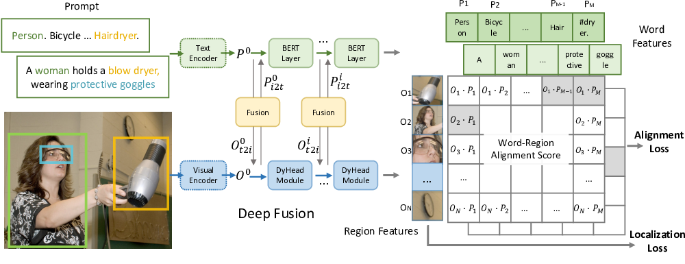

---
title: "Grounded Language-Image Pre-training: Unifying Vision and Language for Object Detection"
date: 2020-09-15T11:30:03+00:00
# weight: 1
# aliases: ["/first"]
tags: ['object detection', 'phrase grounding', 'vision-language pre-training', 'zero-shot learning', 'few-shot learning', 'transfer learning']
author: "Me"
# author: ["Me", "You"] # multiple authors
showToc: true
TocOpen: true
draft: false
hidemeta: false
comments: false
description: ""
canonicalURL: "https://canonical.url/to/page"
disableHLJS: true # to disable highlightjs
disableShare: false
disableHLJS: false
hideSummary: false
searchHidden: false
ShowReadingTime: true
ShowBreadCrumbs: true
ShowPostNavLinks: true
ShowWordCount: true
ShowRssButtonInSectionTermList: true
UseHugoToc: true
cover:
    image: "<image path/url>" # image path/url
    alt: "<alt text>" # alt text
    caption: "<text>" # display caption under cover
    relative: false # when using page bundles set this to true
    hidden: true # only hide on current single page
editPost:
    URL: "https://github.com/<path_to_repo>/content"
    Text: "Suggest Changes" # edit text
    appendFilePath: true # to append file path to Edit link
---


# Grounded Language-Image Pre-training: Unifying Vision and Language for Object Detection



*Figure 1: Overview of the GLIP architecture, unifying object detection and phrase grounding*

## TL;DR

- GLIP unifies object detection and phrase grounding into a single framework
- Uses grounding data to learn semantic-rich visual representations 
- Achieves strong zero-shot and few-shot performance on various object detection tasks
- Enables efficient transfer to new tasks via prompt engineering

## Introduction

Object detection is a fundamental computer vision task that aims to localize and classify objects in images. Traditional approaches rely on training models on fixed sets of object categories, which limits their ability to generalize to new concepts. Recent work like CLIP has shown the power of learning visual representations from large-scale image-text pairs, enabling impressive zero-shot transfer to image classification tasks.

In this paper, the authors propose Grounded Language-Image Pre-training (GLIP), a novel approach that unifies object detection and phrase grounding to learn object-level, language-aware, and semantic-rich visual representations. By leveraging both detection and grounding data during pre-training, GLIP can recognize a much broader set of visual concepts compared to standard object detectors.

## Key Ideas

### 1. Unifying Detection and Grounding

The core insight of GLIP is to reformulate object detection as a phrase grounding task. Instead of predicting fixed object classes, the model takes as input both an image and a text prompt describing the candidate categories. For example, the prompt for COCO object detection would be a string containing all 80 COCO class names.

This reformulation allows the model to be trained on both detection data (with fixed categories) and grounding data (with open-ended language descriptions). The unified loss function is:

```
L = L_cls + L_loc
```

Where `L_cls` is now a grounding loss aligning image regions to words in the prompt, and `L_loc` is the standard localization loss.

### 2. Language-Aware Deep Fusion

To enable effective grounding, GLIP introduces deep cross-modal fusion between the image and text encoders. This is implemented via cross-attention layers:

```
O^i_t2i, P^i_i2t = X-MHA(O^i, P^i)
O^{i+1} = DyHeadModule(O^i + O^i_t2i) 
P^{i+1} = BERTLayer(P^i + P^i_i2t)
```

Where `O` and `P` are visual and text features respectively, and `X-MHA` is cross-modal multi-head attention. This deep fusion makes the visual features language-aware, which is crucial for transferring to new tasks.

### 3. Scaling Up with Image-Text Data

To further expand the vocabulary of visual concepts, GLIP leverages large-scale image-text paired data. The authors use a teacher model trained on gold grounding data to automatically generate grounding boxes for web-crawled image-caption pairs. This allows scaling up to 27M grounding examples, with over 58M unique phrases.

## Model Architecture

The GLIP architecture (Figure 1) consists of:

1. An image encoder (e.g. Swin Transformer)
2. A text encoder (e.g. BERT) 
3. Cross-modal fusion layers
4. A detection head that aligns regions to words

During training, the model takes an image and text prompt as input, and is trained to predict bounding boxes and align them to the correct phrases in the prompt.

## Experiments

The authors evaluate GLIP on several benchmarks:

### Zero-shot Transfer to COCO

Without seeing any COCO images during training, GLIP-L achieves 49.8 AP on COCO val2017, outperforming many supervised baselines.

### Fine-tuning on COCO  

After fine-tuning, GLIP-L reaches 60.8 AP on COCO val2017 and 61.5 AP on test-dev, setting a new state-of-the-art.

### Zero-shot Transfer to LVIS

On the challenging LVIS dataset with over 1000 categories, zero-shot GLIP-L achieves 26.9 AP, surpassing supervised methods.

### Phrase Grounding on Flickr30K

GLIP-L obtains 87.1% Recall@1, improving the previous best result by 2.8 points.

### Object Detection in the Wild

The authors curate a benchmark of 13 diverse object detection datasets to evaluate transfer learning. Key findings:

- Zero-shot GLIP-T outperforms 5-shot DyHead baseline
- 1-shot GLIP-L matches fully supervised DyHead 
- Prompt tuning enables efficient adaptation to new tasks

## Key Takeaways

1. Unifying detection and grounding enables learning from diverse data sources
2. Language-aware visual representations improve zero/few-shot transfer
3. Scaling up with image-text data significantly expands the vocabulary of recognizable concepts
4. Prompt engineering allows efficient adaptation to new tasks

## Future Directions

- Exploring even larger-scale pre-training on image-text data
- Extending to other vision tasks like segmentation and visual reasoning
- Investigating multi-modal fusion techniques beyond cross-attention
- Developing better prompt engineering methods for vision-language models

## Conclusion

GLIP represents an important step towards more flexible and generalizable object detection models. By grounding visual representations in natural language, it enables impressive zero-shot transfer and efficient adaptation to new tasks. The unified detection-grounding framework opens up exciting possibilities for scaling up to even broader visual concept vocabularies and tackling more complex vision-language tasks.

## References

[1] Lin, T. Y., Maire, M., Belongie, S., Hays, J., Perona, P., Ramanan, D., ... & Zitnick, C. L. (2014). Microsoft coco: Common objects in context. In European conference on computer vision (pp. 740-755). Springer, Cham.

[2] Radford, A., Kim, J. W., Hallacy, C., Ramesh, A., Goh, G., Agarwal, S., ... & Sutskever, I. (2021). Learning transferable visual models from natural language supervision. In International Conference on Machine Learning (pp. 8748-8763). PMLR.

[3] Dai, X., Chen, Y., Xiao, B., Chen, D., Liu, M., Yuan, L., & Zhang, L. (2021). Dynamic head: Unifying object detection heads with attentions. In Proceedings of the IEEE/CVF Conference on Computer Vision and Pattern Recognition (pp. 7373-7382).

[4] Gupta, A., Dollar, P., & Girshick, R. (2019). LVIS: A dataset for large vocabulary instance segmentation. In Proceedings of the IEEE/CVF Conference on Computer Vision and Pattern Recognition (pp. 5356-5364).

[5] Plummer, B. A., Wang, L., Cervantes, C. M., Caicedo, J. C., Hockenmaier, J., & Lazebnik, S. (2015). Flickr30k entities: Collecting region-to-phrase correspondences for richer image-to-sentence models. In Proceedings of the IEEE international conference on computer vision (pp. 2641-2649).

[6] Liu, Z., Lin, Y., Cao, Y., Hu, H., Wei, Y., Zhang, Z., ... & Guo, B. (2021). Swin transformer: Hierarchical vision transformer using shifted windows. In Proceedings of the IEEE/CVF International Conference on Computer Vision (pp. 10012-10022).

[7] Devlin, J., Chang, M. W., Lee, K., & Toutanova, K. (2018). Bert: Pre-training of deep bidirectional transformers for language understanding. arXiv preprint arXiv:1810.04805.

