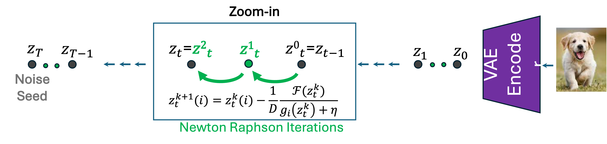
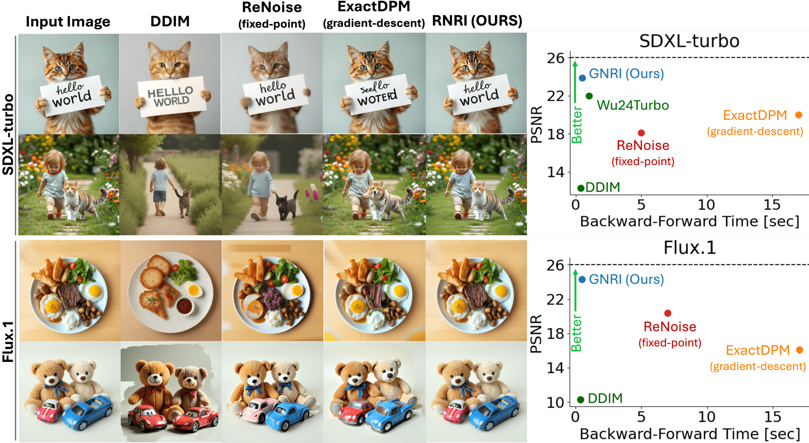

---
title: "Lightning-Fast Image Inversion and Editing for Text-to-Image Diffusion Models: A Deep Dive into GNRI"
date: 2020-09-15T11:30:03+00:00
# weight: 1
# aliases: ["/first"]
tags: ['diffusion models', 'image editing', 'Newton-Raphson method', 'real-time editing', 'image inversion', 'DDIM', 'guided optimization', 'deep learning']
author: "Me"
# author: ["Me", "You"] # multiple authors
showToc: true
TocOpen: true
draft: false
hidemeta: false
comments: false
description: ""
canonicalURL: "https://canonical.url/to/page"
disableHLJS: true # to disable highlightjs
disableShare: false
disableHLJS: false
hideSummary: false
searchHidden: false
ShowReadingTime: true
ShowBreadCrumbs: true
ShowPostNavLinks: true
ShowWordCount: true
ShowRssButtonInSectionTermList: true
UseHugoToc: true
cover:
    image: "<image path/url>" # image path/url
    alt: "<alt text>" # alt text
    caption: "<text>" # display caption under cover
    relative: false # when using page bundles set this to true
    hidden: true # only hide on current single page
editPost:
    URL: "https://github.com/<path_to_repo>/content"
    Text: "Suggest Changes" # edit text
    appendFilePath: true # to append file path to Edit link
---

# Lightning-Fast Image Inversion and Editing for Text-to-Image Diffusion Models

**Authors**: Dvir Samuel, Barak Meiri, Haggai Maron, Yoad Tewel, Nir Darshan, Shai Avidan, Gal Chechik, Rami Ben-Ari

## TLDR
- Introduces Guided Newton-Raphson Inversion (GNRI) for fast and accurate diffusion model image inversion
- Achieves real-time image editing (0.4 seconds) with high quality using few-step diffusion models
- Outperforms existing methods in reconstruction quality and editing capabilities
- No additional training or parameters required, compatible with all pre-trained diffusion models

*Consecutive real image inversions and editing using GNRI with Flux.1-schnell (0.4 sec on an A100 GPU).*

## Introduction

Text-to-image diffusion models have revolutionized image generation, but editing real images with these models requires a crucial step called "inversion" - finding the initial noise that would generate a given image. While existing methods like DDIM inversion are fast but inaccurate, or precise but slow, this paper introduces a novel approach that achieves both speed and accuracy.

## The Challenge of Diffusion Inversion

In diffusion models, the forward process gradually adds noise to an image, while the backward process (denoising) generates images from noise. Inversion aims to find the specific noise that would generate a given image. The standard DDIM inversion uses an approximation:

$$ z_t = f(z_t) = \sqrt{\frac{\alpha_t}{\alpha_{t-1}}}z_{t-1} + \sqrt{\alpha_{t}} \cdot \Delta \psi(\alpha_t) \cdot \epsilon_{\theta}(z_{t},t,p) $$

DDIM approximates this by replacing $z_t$ with $z_{t-1}$ in the noise prediction term:

$$ f(z_t)\approx \sqrt{\frac{\alpha_t}{\alpha_{t-1}}}z_{t-1} + \sqrt{\alpha_{t}} \cdot \Delta \psi(\alpha_t) \cdot\epsilon_{\theta}(z_{t-1},t,p) $$

This approximation introduces errors that accumulate across steps, leading to poor reconstruction and editing quality.

## The GNRI Solution

*GNRI iterates over an implicit function using Newton-Raphson scheme at every time-step in the inversion path.*

### 1. Efficient Root-Finding Formulation

The authors frame inversion as finding roots of a scalar function:

$$ \hat{r}(z_t) := ||z_t - f(z_t)||_1 $$

This formulation allows for efficient computation of the Jacobian, making the Newton-Raphson method practical for high-dimensional latents.

### 2. Guided Solution

To ensure the solution stays within the distribution of valid latents, GNRI incorporates a guidance term:

$$ G(z_t) = \begin{cases}
   \frac{1}{\beta_t}||z_t - \mu_t||  & \text{DDIM} \\
    ||z_t - \mu_t|| & \text{Euler}
\end{cases} $$

The final objective becomes:

$$ \F(z_t) := ||z_t - f(z_t)||_1  + \lambda G(z_t) $$

### 3. Iterative Solution

The Newton-Raphson iteration scheme is:

$$ z_t^0 = z_{t-1} $$
$$ z_t^{k+1}(i) = z_t^k(i) - \frac{1}{D}~\frac{{\F}(z_t^k)}{g_i(z_t^k)+\eta} $$

where $g_i$ is the partial derivative of $\F$ with respect to $z_t(i)$.

## Results and Evaluation

*Left: Reconstruction quality comparison. Right: Mean reconstruction quality (PSNR) vs runtime on COCO2017 validation set.*

The method was evaluated on three main tasks:

1. **Image Reconstruction**: GNRI achieves higher PSNR while being 2-40x faster than existing methods.

2. **Real-Time Editing**: In user studies, GNRI was preferred 71.6% of the time compared to competing methods.

3. **Rare Concept Generation**: GNRI improves accuracy for generating rare concepts, particularly beneficial for tail classes.

## Implementation Details

- Compatible with multiple models: SD2.1, SDXL-turbo, and Flux.1-schnell
- No additional training or parameters required
- Typically converges in 1-2 iterations per time step
- Implemented using PyTorch's automatic differentiation

## Future Directions

- Extension to other types of diffusion models
- Application to video editing and 3D generation
- Integration with real-time editing interfaces
- Investigation of theoretical convergence guarantees

## References

1. [DDIM: Denoising Diffusion Implicit Models](https://arxiv.org/abs/2010.02502)
2. [Stable Diffusion](https://arxiv.org/abs/2112.10752)
3. [Flux: Diffusion Models for Layered Image Generation](https://github.com/black-forest-labs/flux)
4. [SDXL-Turbo](https://arxiv.org/abs/2305.11487)

