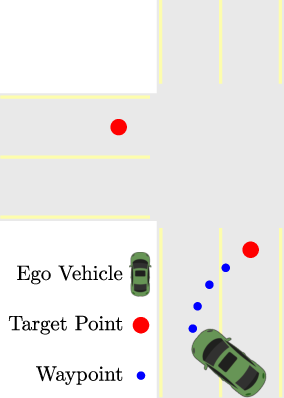
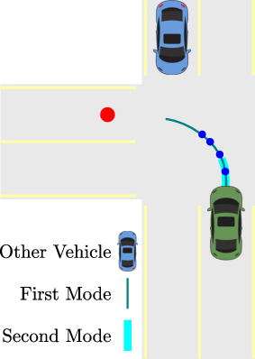
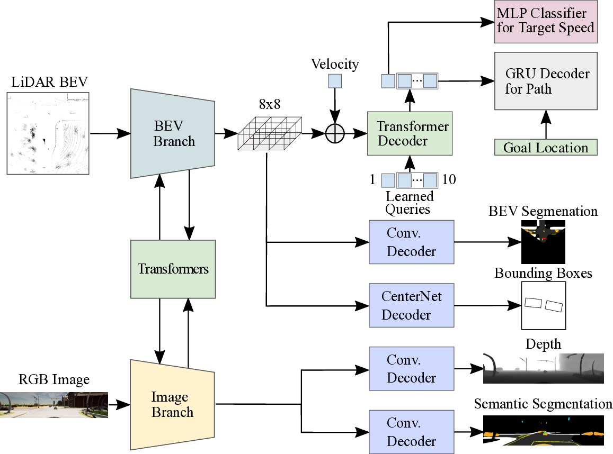

# Hidden Biases of End-to-End Driving Models

## TLDR

- End-to-end driving models have made rapid progress on the CARLA simulator benchmark
- Two key biases are identified in state-of-the-art methods:
  1. Lateral recovery via strong inductive bias towards target point following
  2. Longitudinal averaging of multimodal waypoint predictions for slowing down
- A new method called TransFuser++ (TF++) is proposed that addresses these biases
- TF++ achieves state-of-the-art performance on the Longest6 and LAV benchmarks

## Introduction

End-to-end driving approaches have seen remarkable progress in recent years, particularly on the CARLA simulator benchmark. In just two years, driving scores on the CARLA leaderboard have skyrocketed from under 20 to over 70. However, the reasons behind this rapid improvement are not fully understood. Different methods use varying architectures and training datasets, making it challenging to pinpoint the source of their success.

In this blog post, we'll dive deep into a recent paper titled "Hidden Biases of End-to-End Driving Models" by Bernhard Jaeger, Kashyap Chitta, and Andreas Geiger from the University of Tübingen and Tübingen AI Center. The authors identify two critical biases present in nearly all state-of-the-art methods and investigate their impact on performance. By addressing these biases, they develop a new method called TransFuser++ (TF++) that achieves top performance on key benchmarks.

Let's explore the key findings and insights from this paper.

## The Target Point Shortcut

One of the most intriguing discoveries in this paper is the "target point shortcut" that many end-to-end driving models learn to exploit. To understand this, we first need to know about target points (TPs).

Target points are map-based GNSS locations provided to the model, spaced about 30 meters apart on average, that describe the route the car should follow. They were introduced as an alternative to discrete navigation commands (like "turn right" or "follow lane") to convey driver intent.

The authors found that models conditioned on target points learn to use this geometric information to periodically reset steering errors. This is illustrated in Figure 1:

When the model accumulates enough steering error to be out of its training distribution, it tends to steer towards the nearest target point. This behavior helps the model recover and get back to the center of the lane. However, this shortcut can lead to catastrophic errors when the target point is far away, such as cutting across turns.

To demonstrate this behavior, the authors conducted experiments with various state-of-the-art architectures. They found that the shortcut problem is intrinsically related to the decoder architecture. Specifically, they show that replacing global average pooling with a transformer decoder can mitigate this issue.

## The Ambiguity of Waypoints

Another common aspect of current state-of-the-art models is the use of waypoints as output representations. Waypoints are future positions of an expert driver that the model is trained to predict. However, the authors point out a fundamental issue with this approach: the future velocity is multi-modal, yet the model commits to a point estimate.

This ambiguity is illustrated in Figure 2:

The continuous nature of waypoints allows the network to interpolate between modes. While this can sometimes be helpful, it leads to a lack of explicit uncertainty representation. The authors propose an alternative approach that explicitly predicts the uncertainty of the network via target speed classification.

## TransFuser++: Addressing the Biases

Building on these insights, the authors develop TransFuser++ (TF++), an improved version of the popular TransFuser baseline. Let's look at the key components of TF++:

1. **Transformer Decoder**: Instead of using global average pooling, TF++ employs a transformer decoder for feature pooling. This helps mitigate the target point shortcut problem.

2. **Disentangled Representation**: TF++ separates the prediction of the future path from the prediction of future velocities. This addresses the ambiguity in the waypoint representation.

3. **Target Speed Classification**: Instead of regressing waypoints, TF++ classifies target speeds and uses a confidence-weighted average for the final prediction.

4. **Data Augmentation**: The authors revisit the idea of shift and rotation augmentations to aid recovery, which were common in early imitation learning methods but less used in recent approaches.

5. **Two-stage Training**: TF++ uses a two-stage training process, first pre-training the encoder with only perception losses, then fine-tuning the entire model end-to-end.

The architecture of TransFuser++ is shown in Figure 3:

## Results and Performance

The authors evaluate TF++ on two key benchmarks:

1. **Longest6**: This benchmark consists of 36 routes in training towns with dense traffic and diverse scenarios.
2. **LAV**: This benchmark evaluates performance on validation towns, testing generalization to new environments.

On both benchmarks, TF++ achieves state-of-the-art performance. Here are some key results:

- On Longest6, TF++ achieves a driving score of 69, outperforming the previous best method by 11 points.
- On the LAV benchmark, TF++ achieves a driving score of 70, improving upon the prior state-of-the-art by 12 points.

The authors provide detailed ablation studies to show the impact of each component of TF++. For example, replacing global average pooling with a transformer decoder improves the driving score by 17 points on Longest6.

## Implementation Details and Training

The authors provide extensive implementation details in the paper and supplementary material. Some key points:

- TF++ uses a single high-resolution camera (256x1024) with a 110° horizontal field of view.
- A 360° LiDAR is used, mounted at (0.0, 0.0, 2.5) relative to the vehicle.
- The model is trained using AdamW optimizer with a learning rate of 0.0003, reduced by a factor of 10 after epoch 30.
- Data augmentation includes shift and rotation of the camera, as well as color augmentations.

The authors also discuss the importance of dataset scale, showing that increasing the dataset size from 185k to 555k frames improves performance significantly.

## Discussion and Future Directions

This paper provides valuable insights into the hidden biases of end-to-end driving models and proposes effective solutions. However, there are still open questions and areas for future research:

1. **Generalization**: While TF++ performs well on the validation towns, further investigation into generalization to completely unseen environments is needed.

2. **Real-world Transfer**: The study is conducted in the CARLA simulator. Exploring how these findings translate to real-world driving scenarios is an important next step.

3. **Multimodal Predictions**: While TF++ addresses the ambiguity in waypoint predictions, exploring more sophisticated multimodal prediction methods could be beneficial.

4. **Interpretability**: As end-to-end models become more complex, developing better tools for interpreting their decisions and behaviors remains crucial.

5. **Safety Guarantees**: Investigating how to provide formal safety guarantees for end-to-end driving models is an important area for future work.

## Conclusion

The paper "Hidden Biases of End-to-End Driving Models" provides valuable insights into the rapid progress of end-to-end driving approaches. By identifying and addressing key biases in current state-of-the-art methods, the authors develop TransFuser++, a simple yet effective approach that achieves top performance on important benchmarks.

This work highlights the importance of carefully analyzing the implicit behaviors learned by deep learning models, especially in safety-critical applications like autonomous driving. As the field continues to advance, understanding and addressing such hidden biases will be crucial for developing robust and reliable autonomous driving systems.

The code, data, and models for this work are available at [https://github.com/autonomousvision/carla_garage](https://github.com/autonomousvision/carla_garage), allowing other researchers to build upon and extend these findings.

## References

1. Leaderboard2020. Carla autonomous driving leaderboard. [https://leaderboard.carla.org/](https://leaderboard.carla.org/), 2020.

2. Chen, D., Koltun, V., & Krähenbühl, P. (2019). Learning to drive from a world on rails. In Proceedings of the IEEE/CVF International Conference on Computer Vision (ICCV).

3. Prakash, A., Behl, A., Ohn-Bar, E., Chitta, K., & Geiger, A. (2020). Exploring data aggregation in policy learning for vision-based urban autonomous driving. In Proceedings of the IEEE/CVF Conference on Computer Vision and Pattern Recognition (CVPR).

4. Chitta, K., Prakash, A., & Geiger, A. (2021). NEAT: Neural attention fields for end-to-end autonomous driving. In Proceedings of the IEEE/CVF International Conference on Computer Vision (ICCV).

5. Chitta, K., Prakash, A., Jaeger, B., Yu, Z., Renz, K., & Geiger, A. (2022). TransFuser: Imitation with transformer-based sensor fusion for autonomous driving. IEEE Transactions on Pattern Analysis and Machine Intelligence (PAMI).

6. Chen, D., & Krähenbühl, P. (2022). Learning from all vehicles. In Proceedings of the IEEE/CVF Conference on Computer Vision and Pattern Recognition (CVPR).

7. Wu, P., Jia, X., Chen, L., Yan, J., Li, H., & Qiao, Y. (2022). Trajectory-guided control prediction for end-to-end autonomous driving: A simple yet strong baseline. In Advances in Neural Information Processing Systems (NeurIPS).

8. Shao, H., Wang, L., Chen, R., Li, H., & Liu, Y. (2022). Safety-enhanced autonomous driving using interpretable sensor fusion transformer. In Proceedings of the Conference on Robot Learning (CoRL).

