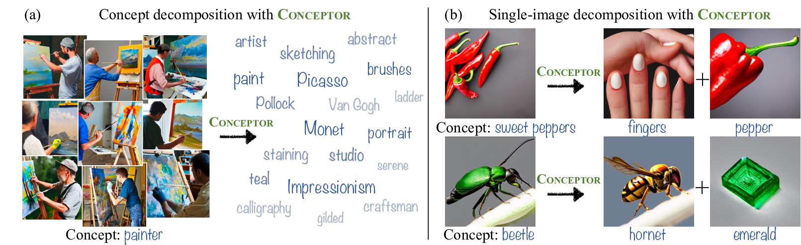

*Figure 1: Concept interpretation with Conceptor. (a) Given a set of representative concept images, Conceptor learns to decompose the concept into a weighted combination of interpretable elements (font sizes indicate weights). The decomposition exposes interesting behaviors such as reliance on prominent painters and renowned artistic styles (e.g., "Monet", "Impressionism"). (b) Given a specific generated image, Conceptor extracts its primary contributing elements, revealing surprising visual connections (e.g., "sweet peppers" are linked to "fingers" due to their common shape).*

## TL;DR

- Conceptor is a novel method for interpreting the internal representations of text-to-image diffusion models
- It decomposes textual concepts into interpretable elements, revealing non-trivial structures and connections
- The method provides meaningful, robust, and faithful decompositions for various types of concepts
- Conceptor uncovers surprising visual associations, reliance on exemplars, and potential biases in the model

## Introduction

Text-to-image diffusion models have revolutionized the field of AI-generated imagery, producing high-quality and diverse images from textual prompts. However, the internal representations learned by these models remain largely unexplored. In this blog post, we'll dive deep into the paper "The Hidden Language of Diffusion Models" by Hila Chefer et al., which introduces Conceptor, a novel method for interpreting the internal representations of text-to-image diffusion models.

As researchers and practitioners in the field of AI, understanding the inner workings of these powerful models is crucial. Not only does it help us improve their performance, but it also allows us to address potential biases and ethical concerns. Let's explore how Conceptor sheds light on the hidden language of diffusion models.

## The Challenge of Interpreting Diffusion Models

Before we delve into Conceptor, it's important to understand why interpreting diffusion models is challenging. Unlike traditional image classifiers, diffusion models:

1. Generate images rather than classify them
2. Use complex, multi-step denoising processes
3. Lack a straightforward way to measure concept importance

These factors make it difficult to apply existing concept-based interpretability methods directly to diffusion models. This is where Conceptor comes in, offering a novel approach tailored to the unique structure of text-to-image diffusion models.

## Conceptor: A Novel Interpretation Method

Conceptor is designed to interpret the internal representation of a textual concept in a text-to-image diffusion model. The key idea is to decompose a concept into a small set of human-interpretable textual elements. Let's break down how Conceptor works:

### 1. Pseudo-token Construction

Given a prompt $\mathcal{P}^c$ for a concept $c$, Conceptor learns a decomposition using the model's vocabulary $\mathcal{V}$. This decomposition is realized as a pseudo-token $w^*$ that is constructed as a weighted combination of a subset of tokens from $\mathcal{V}$:

$$w^* = \sum_{i=1}^n \alpha_i w_i \quad \text{s.t.} \quad w_i\in \mathcal{V}, \alpha_1, \dots, \alpha_n \geq 0$$

where $n << N$ is a hyperparameter that determines the number of tokens to use in the combination, and $N$ is the total number of tokens in the vocabulary.

### 2. Coefficient Learning

Conceptor assigns a coefficient $\alpha$ for each word embedding $w$ using a learned 2-layer MLP:

$$\forall w\in \mathcal{V}: \alpha = f(w) = \sigma(W_2(\sigma(W_1(w))))$$

where $\sigma$ is the ReLU non-linearity, and $W_1, W_2$ are linear mappings.

### 3. Optimization Objective

To learn a meaningful pseudo-token $w^*$, Conceptor optimizes the MLP to reconstruct the images generated from $\mathcal{P}^c$. The overall objective function is:

$$\mathcal{L} = \mathcal{L}_{rec} + \lambda_{sparsity} \mathcal{L}_{sparsity}$$

where $\mathcal{L}_{rec}$ is the reconstruction loss and $\mathcal{L}_{sparsity}$ is a regularization term to encourage sparsity in the decomposition.

### 4. Single-image Decomposition

Conceptor also provides a method for decomposing a single generated image into its primary contributing elements. This is done through an iterative process that removes tokens one by one and checks if the resulting image is semantically identical to the original.

## Key Findings and Insights

By applying Conceptor to the state-of-the-art Stable Diffusion model, the authors uncovered several fascinating insights:

### 1. Non-trivial Visual Connections

Conceptor revealed surprising visual connections between concepts that transcend their textual semantics. For example, "sweet peppers" were linked to "fingers" due to their common shape.

### 2. Reliance on Exemplars

Some concepts, such as "president" or "rapper," were represented mostly by exemplars (well-known instances). This suggests that the generated images are often interpolations of these instances.

### 3. Mixing of Multiple Meanings

For homograph concepts (words with multiple meanings), Conceptor discovered cases where these meanings are leveraged simultaneously, creating images that mix both meanings in a single object.

### 4. Bias Detection

Conceptor proved effective in detecting non-trivial biases that may not be easily observable visually. This capability is crucial for addressing ethical concerns in AI-generated content.

## Experimental Results

The authors conducted extensive experiments to evaluate Conceptor's performance. Here are some key results:

1. **Faithfulness**: Conceptor outperformed all baselines across all faithfulness metrics, including CLIP pairwise similarity, LPIPS, and FID scores.

2. **Meaningfulness**: A user study showed that 70% of respondents favored Conceptor's decompositions over alternatives, demonstrating its ability to provide interpretable results.

3. **Robustness**: Experiments showed that Conceptor's decompositions are consistent across different training sets and initializations, with 72-80% of the top-10 elements preserved across all choices.

## Implementation Details

For those interested in the technical details, here are some key implementation points:

- The method was implemented using a single A100 GPU with 40GB of memory.
- Training was conducted for a maximum of 500 steps with a batch size of 6 and a learning rate of 1e-3.
- The latest Stable Diffusion v2.1 model was used, employing the pre-trained text encoder from the OpenCLIP ViT-H model.
- The vocabulary was filtered to the top 5,000 tokens by their CLIP similarity to the mean training image.

## Limitations and Future Directions

While Conceptor provides valuable insights, it's important to acknowledge its limitations:

1. The visual impact of an element is not always completely aligned with its impact as a single token.
2. The method is limited to elements that are single tokens, which may not capture complex phrases.

Future work could focus on addressing these limitations and extending the method to other types of generative models.

## Conclusion

Conceptor represents a significant step forward in our ability to interpret and understand text-to-image diffusion models. By providing meaningful, robust, and faithful decompositions of textual concepts, it offers researchers and practitioners a powerful tool for analyzing these complex models.

As we continue to develop and deploy increasingly sophisticated AI systems, methods like Conceptor will be crucial for ensuring transparency, addressing biases, and unlocking new insights into the hidden language of machine learning models.

What are your thoughts on Conceptor? How do you think this method could be applied to improve or analyze other types of generative models? Let's continue the discussion in the comments below!

## References

[1] Chefer, H., Lang, O., Geva, M., Polosukhin, V., Shocher, A., Irani, M., Mosseri, I., & Wolf, L. (2023). The Hidden Language of Diffusion Models. [arXiv:2306.00966](https://arxiv.org/abs/2306.00966)

[2] Rombach, R., Blattmann, A., Lorenz, D., Esser, P., & Ommer, B. (2022). High-Resolution Image Synthesis with Latent Diffusion Models. In Proceedings of the IEEE/CVF Conference on Computer Vision and Pattern Recognition (pp. 10684-10695).

[3] Radford, A., Kim, J. W., Hallacy, C., Ramesh, A., Goh, G., Agarwal, S., ... & Sutskever, I. (2021). Learning transferable visual models from natural language supervision. In International Conference on Machine Learning (pp. 8748-8763). PMLR.

[4] Kim, B., Wattenberg, M., Gilmer, J., Cai, C., Wexler, J., Viegas, F., & Sayres, R. (2018). Interpretability Beyond Feature Attribution: Quantitative Testing with Concept Activation Vectors (TCAV). In International Conference on Machine Learning (pp. 2668-2677).

[5] Ghorbani, A., Wexler, J., Zou, J. Y., & Kim, B. (2019). Towards Automatic Concept-based Explanations. In Advances in Neural Information Processing Systems (pp. 9277-9286).

[6] Zhang, R., Isola, P., Efros, A. A., Shechtman, E., & Wang, O. (2018). The Unreasonable Effectiveness of Deep Features as a Perceptual Metric. In Proceedings of the IEEE Conference on Computer Vision and Pattern Recognition (pp. 586-595).

[7] Heusel, M., Ramsauer, H., Unterthiner, T., Nessler, B., & Hochreiter, S. (2017). GANs Trained by a Two Time-Scale Update Rule Converge to a Local Nash Equilibrium. In Advances in Neural Information Processing Systems (pp. 6626-6637).