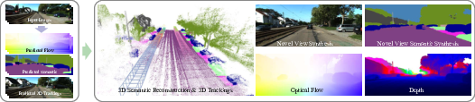
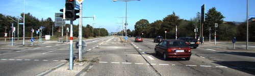

# HUGS: Holistic Urban 3D Scene Understanding via Gaussian Splatting

*Figure 1: Overview of HUGS. Given posed RGB images as input, the method lifts noisy 2D & 3D predictions to 3D space via decomposed 3D Gaussians, enabling holistic scene understanding in 2D and 3D space.*

## TL;DR

- HUGS is a novel approach for holistic 3D urban scene understanding from RGB images only
- Uses 3D Gaussian Splatting to jointly model geometry, appearance, semantics and motion 
- Decomposes scenes into static and dynamic components with physics-based constraints
- Achieves state-of-the-art performance on novel view synthesis, semantic segmentation, and 3D reconstruction
- Enables real-time rendering and various scene editing applications

## Introduction

Understanding complex urban environments in 3D is a critical challenge in computer vision with numerous applications in autonomous driving, robotics, and augmented reality. Ideally, we want to be able to reconstruct detailed 3D geometry, render photorealistic novel views, segment semantic classes, and track dynamic objects - all from just a set of RGB images. This is an extremely challenging problem that requires reasoning about geometry, appearance, semantics, and motion in a unified way.

Previous approaches have made progress on individual aspects of this problem, but struggle to provide a truly holistic solution:

- Methods for static scene reconstruction [1,2] can produce high-quality novel views but don't handle dynamic objects or semantics
- Dynamic scene methods [3,4] often require ground truth 3D bounding boxes as input
- Approaches that lift 2D semantics to 3D [5,6] may not accurately capture the underlying 3D geometry
- Many techniques are too computationally expensive for real-time rendering

In this paper, we introduce HUGS (Holistic Urban Gaussian Splatting), a novel approach that aims to address all of these challenges in a unified framework. The key idea is to leverage recent advances in 3D Gaussian Splatting [7] and extend them to jointly model geometry, appearance, semantics, and motion for both static and dynamic components of urban scenes.

## Method Overview

HUGS takes as input a set of posed RGB images of an urban scene. The core representation is based on 3D Gaussians, which have been shown to enable high-quality and efficient novel view synthesis [7]. The key extensions in HUGS are:

1. Decomposing the scene into static and dynamic components
2. Modeling dynamic object motion with physics-based constraints  
3. Incorporating semantic and optical flow information
4. Jointly optimizing all components end-to-end

Let's break down each of these components in more detail.

### Scene Decomposition

HUGS represents the scene as a combination of:

1. Static 3D Gaussians in world coordinates
2. N sets of dynamic 3D Gaussians, each in its own canonical object coordinate system
3. Per-frame rigid transformations for each dynamic object

This decomposition allows the model to cleanly separate static background elements from moving objects like vehicles.

### Dynamic Object Motion Modeling

A key challenge in reconstructing dynamic scenes is accurately modeling object motion over time. Previous methods often rely on ground truth 3D bounding boxes or struggle with noisy detections.

HUGS takes a novel approach by incorporating physics-based constraints on object motion. Specifically, it models each dynamic object using a unicycle model with state $(x_t, y_t, \theta_t)$ representing 2D position and orientation. The motion between frames is constrained by:

$$
\begin{align*}
x_{t+1} &= x_t + \frac{v_t}{\omega_t} (\sin \theta_{t+1} - \sin \theta_t) \\
y_{t+1} &= y_t - \frac{v_t}{\omega_t} (\cos \theta_{t+1} - \cos \theta_t) \\
\theta_{t+1} &= \theta_t + \omega_t
\end{align*}
$$

Where $v_t$ is forward velocity and $\omega_t$ is angular velocity. This simple physics model provides powerful regularization, allowing HUGS to recover smooth and plausible object trajectories even from noisy initial detections.

### Semantic and Flow Modeling

In addition to geometry and appearance, HUGS incorporates semantic and optical flow information into the 3D Gaussian representation. Each Gaussian stores:

- RGB color (as spherical harmonic coefficients)
- Semantic logits 
- 3D position and covariance

This allows for joint rendering of color images, semantic maps, and optical flow through a unified volume rendering process. For example, the semantic map is rendered as:

$$
\mathbf{S} = \sum_{i \in \mathcal{N}} \text{softmax}(\mathbf{s}_i) \alpha'_i \prod_{j=1}^{i-1}(1-\alpha'_j)
$$

Where $\mathbf{s}_i$ are the semantic logits for Gaussian $i$, and $\alpha'_i$ is its opacity after projection.

### Joint Optimization

All components of HUGS are jointly optimized end-to-end using a combination of losses:

- RGB reconstruction loss
- Semantic cross-entropy loss
- Optical flow L1 loss
- Unicycle model constraints
- 3D bounding box alignment

This allows the model to leverage multiple cues to improve overall scene understanding. For example, optical flow provides strong geometric constraints that help improve depth estimation.

## Implementation Details

HUGS is implemented efficiently using CUDA, allowing for real-time rendering of novel views. Some key implementation details:

- Initialization using COLMAP [8] sparse reconstruction
- Adaptive splitting and pruning of Gaussians during optimization
- Exposure compensation using per-frame affine transform
- Efficient sorting and splatting of Gaussians

The authors provide code at: [https://xdimlab.github.io/hugs_website](https://xdimlab.github.io/hugs_website)

## Experiments and Results

HUGS is evaluated on several urban driving datasets including KITTI [9], Virtual KITTI 2 [10], and KITTI-360 [11]. The key findings are:

### Novel View Synthesis

HUGS achieves state-of-the-art results on novel view synthesis for both static and dynamic scenes, outperforming previous methods like NSG [3] and MARS [4]. Importantly, HUGS can handle noisy 3D bounding box detections, while previous methods often relied on ground truth boxes.

Some quantitative results on dynamic scenes with noisy detections:

| Method | PSNR↑ | SSIM↑ | LPIPS↓ |
|--------|-------|-------|--------|
| NSG    | 23.00 | 0.664 | 0.373  |
| MARS   | 23.30 | 0.731 | 0.139  |
| HUGS   | 25.42 | 0.821 | 0.092  |

### Semantic Segmentation

On the KITTI-360 leaderboard, HUGS achieves competitive results for novel view semantic synthesis:

| Method    | mIoU_cls↑ | mIoU_cat↑ |
|-----------|-----------|-----------|
| mip-NeRF  | 48.25     | 67.47     |
| PNF       | 73.06     | 84.97     |
| HUGS      | 72.65     | 85.64     |

Importantly, HUGS can also extract accurate 3D semantic point clouds, which many previous methods struggle with.

### 3D Reconstruction

HUGS significantly outperforms previous methods like Semantic Nerfacto [12] on 3D semantic reconstruction quality:

| Method           | Accuracy↓ | Completeness↓ | mIoU_cls↑ |
|------------------|-----------|---------------|-----------|
| Semantic Nerfacto| 1.508     | 24.28         | 0.055     |
| HUGS             | 0.233     | 0.214         | 0.505     |

This demonstrates the power of the 3D Gaussian representation for capturing accurate geometry and semantics.

### Ablation Studies

The authors conduct extensive ablation studies to validate key design choices:

- Physics-based unicycle model significantly improves tracking accuracy
- 3D semantic softmax outperforms 2D softmax for reconstruction
- Optical flow and semantic losses improve underlying geometry

## Applications

The decomposed scene representation in HUGS enables several interesting applications:

- Real-time novel view synthesis (93 FPS on RTX 4090)
- Foreground/background separation
- Object removal and insertion
- Trajectory editing for dynamic objects

*Figure 2: HUGS enables various scene editing applications like replacing dynamic objects (top) or moving them to new locations (bottom).*

## Conclusion and Future Work

HUGS represents an important step towards holistic 3D scene understanding from RGB images alone. By unifying geometry, appearance, semantics, and motion modeling in a 3D Gaussian framework, it achieves state-of-the-art results across multiple tasks while enabling real-time rendering and editing.

Some promising directions for future work include:

- Incorporating category-level priors for better object reconstruction
- Extending to more degrees of freedom in editing (e.g. lighting)
- Handling a wider range of dynamic objects beyond vehicles
- Scaling to larger urban environments

The efficient 3D Gaussian representation opens up exciting possibilities for real-time 3D perception and rendering in complex dynamic environments.

## References

[1] Rematas, K., Liu, A., Srinivasan, P.P., Barron, J.T., Tagliasacchi, A., Funkhouser, T. and Ferrari, V., 2021. Urban radiance fields. arXiv preprint arXiv:2111.14643.

[2] Fu, Y., Zhao, S., Zhu, Y., Li, Y., Wang, Y. and Koltun, V., 2022. Panoptic NeRF: 3D-to-2D Label Transfer for Panoptic Urban Scene Segmentation. arXiv preprint arXiv:2203.15224.

[3] Ost, J., Mannan, F., Thuerey, N., Knodt, J. and Heide, F., 2021. Neural scene graphs for dynamic scenes. In Proceedings of the IEEE/CVF Conference on Computer Vision and Pattern Recognition (pp. 2856-2865).

[4] Wu, Z., Shen, X., Snavely, N., Gao, J., Ke, Q. and Cao, X., 2023. MARS: An Instance-aware, Modular and Realistic Simulator for Autonomous Driving. arXiv preprint arXiv:2307.15058.

[5] Zhi, S., Laidlow, T., Leutenegger, S. and Davison, A.J., 2021. In-place scene labelling and understanding with implicit scene representation. In Proceedings of the IEEE/CVF International Conference on Computer Vision (pp. 15838-15847).

[6] Kundu, A., Yin, X., Fathi, A., Ross, D., Brewington, B., Funkhouser, T. and Pantofaru, C., 2022. Panoptic neural fields: A semantic object-aware neural scene representation. In Proceedings of the IEEE/CVF Conference on Computer Vision and Pattern Recognition (pp. 12871-12881).

[7] Kerbl, B., Kopanas, G., Leimkühler, T., and Drettakis, G., 2023. 3D Gaussian Splatting for Real-Time Radiance Field Rendering. ACM Transactions on Graphics, 42(4).

[8] Schönberger, J.L. and Frahm, J.M., 2016. Structure-from-motion revisited. In Proceedings of the IEEE conference on computer vision and pattern recognition (pp. 4104-4113).

[9] Geiger, A., Lenz, P. and Urtasun, R., 2012. Are we ready for autonomous driving? the kitti vision benchmark suite. In 2012 IEEE conference on computer vision and pattern recognition (pp. 3354-3361). IEEE.

[10] Cabon, Y., Murray, N. and Humenberger, M., 2020. Virtual kitti 2. arXiv preprint arXiv:2001.10773.

[11] Liao, Y., Xie, J. and Geiger, A., 2022. KITTI-360: A novel dataset and benchmarks for urban scene understanding in 2D and 3D. IEEE transactions on pattern analysis and machine intelligence, 45(3), pp.3292-3308.

[12] Tancik, M., Casser, V., Yan, X., Pradhan, S., Mildenhall, B., Srinivasan, P.P., Barron, J.T. and Kretzschmar, H., 2023. Block-NeRF: Scalable Large Scene Neural View Synthesis. In Proceedings of the IEEE/CVF Conference on Computer Vision and Pattern Recognition (pp. 8248-8258).

