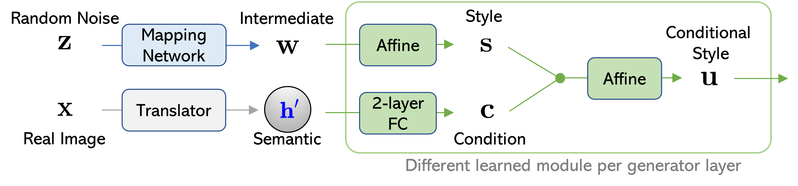
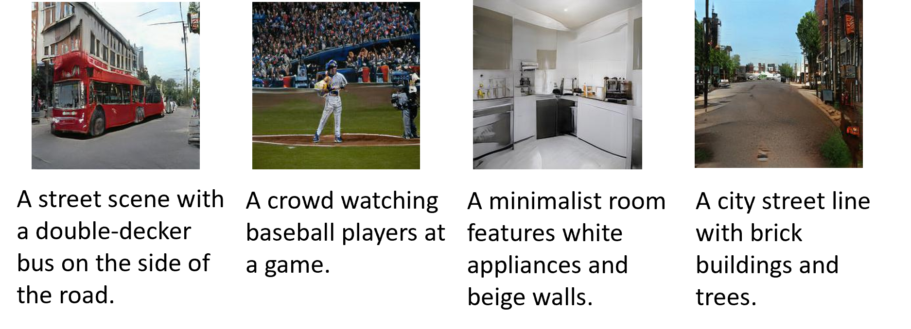
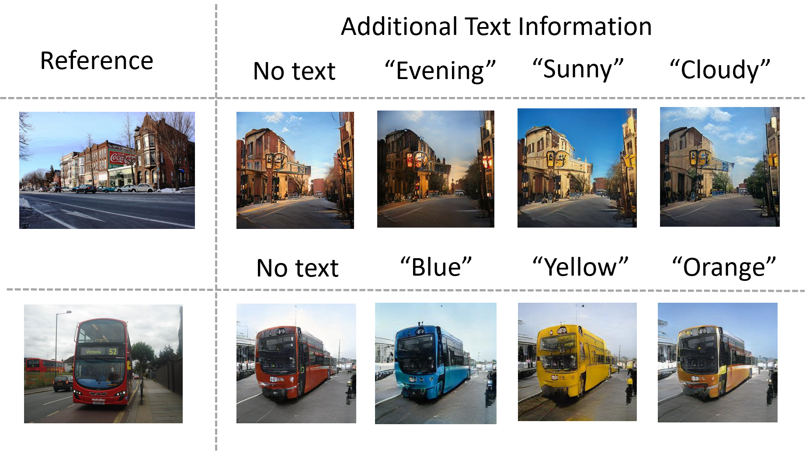

*Figure 1: The process of injecting text-conditional information into each layer of the generator, where FC denotes fully-connected layer. The green modules have their own trainable parameters per generator layer. We can view the original StyleGAN2 constructs its StyleSpace as the process from $z$ to $s$. We propose to inject the semantic conditional information and further build our  Conditional StyleSpace, whose elements $u$ will be used to modulate image generation. This figure illustrates the language-free setting, where real image is used to generate pseudo text feature $h^\prime$; For the fully supervised text-to-image generation setting, real text is used for the extraction of text feature  $h$.*

## TLDR

- Lafite is a novel approach for text-to-image generation that can be trained without paired text-image data
- It leverages the CLIP model's aligned multimodal feature space to generate pseudo text features from images
- Lafite outperforms existing methods in zero-shot and fully-supervised settings, with only 1% of parameters compared to models like DALL-E
- The method enables language-free fine-tuning of pre-trained models, significantly reducing training time and data requirements

## Introduction

Text-to-image generation has been a long-standing goal in artificial intelligence, with recent advances like DALL-E and CogView pushing the boundaries of what's possible. However, these models require massive amounts of paired text-image data and computational resources for training. In this blog post, we'll dive into Lafite (Language-Free Training for Text-to-Image Generation), a groundbreaking approach that addresses these limitations.

Developed by researchers from the State University of New York at Buffalo, Adobe Research, and Microsoft Research, Lafite introduces a paradigm shift in how we train text-to-image models. Let's explore the key ideas and innovations behind this exciting work.

## The Challenge of Text-to-Image Generation

Traditional text-to-image generation models face a significant hurdle: they require large datasets of high-quality image-text pairs. Creating such datasets is time-consuming and expensive, often involving manual captioning by humans. For example, the popular MS-COCO dataset required over 70,000 worker hours to gather and annotate captions.

This challenge becomes even more pronounced when trying to build models for specific domains or applications, where collecting domain-specific image-text pairs can be prohibitively costly.

## Lafite's Novel Approach

Lafite tackles this challenge head-on by introducing a language-free training paradigm. The key insight is to leverage the power of pre-trained vision-language models like CLIP (Contrastive Language-Image Pre-training) to generate pseudo text features directly from images.

### Pseudo Text-Feature Generation

The core of Lafite's innovation lies in its ability to generate pseudo text features from images. This is achieved by exploiting the well-aligned multimodal semantic space of the CLIP model. In this space, features of paired texts and images are close to each other on a high-dimensional hypersphere.

Lafite proposes two schemes for generating these pseudo text features:

1. **Fixed Perturbations**: This method perturbs the image feature with adaptive Gaussian noise:

   $$\mathbf{h}' = \tilde{\mathbf{h}} / \|\tilde{\mathbf{h}}\|_2, \quad \tilde{\mathbf{h}} = f_{\text{img}}(\mathbf{x}) + \xi \mathbf{\epsilon} \|f_{\text{img}}(\mathbf{x})\|_2 / \|\mathbf{\epsilon}\|_2$$

   where $\mathbf{\epsilon} \sim \mathcal{N}(\mathbf{0}, \mathbf{I})$ is Gaussian noise, and $\xi > 0$ is a hyperparameter.

2. **Trainable Perturbations**: This approach uses an inference model to learn more adaptive noise:

   $$\mathbf{h}' = \tilde{\mathbf{h}} / \|\tilde{\mathbf{h}}\|_2, \quad \tilde{\mathbf{h}} = f_{\text{img}}(\mathbf{x}) + r_1(f_{\text{img}}(\mathbf{x})) + \mathbf{\epsilon} \odot \exp(r_2(f_{\text{img}}(\mathbf{x})))$$

   where $r_1(\cdot)$ and $r_2(\cdot)$ are neural networks.

### Network Architecture

Lafite adapts the StyleGAN2 architecture for conditional generation. The key innovation is injecting text information directly into the StyleSpace of StyleGAN2. This is achieved through the following steps:

1. Random noise vectors are transformed into an intermediate latent space $\mathcal{W}$.
2. Each $\mathbf{w} \in \mathcal{W}$ is transformed into unconditional style codes $\mathbf{s}$.
3. Conditional vectors $\mathbf{h}'$ are transformed into condition codes $\mathbf{c}$.
4. Style and condition codes are concatenated and transformed into conditional style codes $\mathbf{u}$.

The generator $G$ synthesizes a fake image as:

$$\mathbf{x}' = G(\mathbf{h}', \mathbf{z})$$

The discriminator ensures both photo-realism and fidelity to the text condition by outputting:

$$D(\mathbf{x}, \mathbf{h}') = \underbrace{f_d(\mathbf{x})}_{\text{real or fake}} + \underbrace{\langle \mathbf{h}', f_s(\mathbf{x}) \rangle}_{\text{semantic alignment}}$$

### Training Objectives

Lafite employs a combination of adversarial and contrastive losses to train the model:

1. Standard conditional GAN loss:

   $$\mathcal{L}_G = -\sum_{i=1}^n \log \sigma(D(\mathbf{x}'_i, \mathbf{h}'_i))$$
   
   $$\mathcal{L}_D = -\sum_{i=1}^n \log \sigma(D(\mathbf{x}_i, \mathbf{h}'_i)) - \sum_{i=1}^n \log(1 - \sigma(D(\mathbf{x}'_i, \mathbf{h}'_i)))$$

2. Contrastive regularizer for the discriminator:

   $$\mathcal{L}_{\text{ConD}} = -\tau \sum_{i=1}^n \log \frac{\exp(\text{Sim}(f_s(\mathbf{x}_i), \mathbf{h}'_i)/\tau)}{\sum_{j=1}^n \exp(\text{Sim}(f_s(\mathbf{x}_j), \mathbf{h}'_i)/\tau)}$$

3. Contrastive loss for the generator:

   $$\mathcal{L}_{\text{ConG}} = -\tau \sum_{i=1}^n \log \frac{\exp(\text{Sim}(f_{\text{img}}(\mathbf{x}'_i), \mathbf{h}'_i)/\tau)}{\sum_{j=1}^n \exp(\text{Sim}(f_{\text{img}}(\mathbf{x}'_j), \mathbf{h}'_i)/\tau)}$$

The final training losses for the generator and discriminator are:

$$\mathcal{L}'_D = \mathcal{L}_D + \gamma \mathcal{L}_{\text{ConD}}$$
$$\mathcal{L}'_G = \mathcal{L}_G + \gamma \mathcal{L}_{\text{ConD}} + \lambda \mathcal{L}_{\text{ConG}}$$

## Experimental Results

Lafite was evaluated in various settings, including language-free, zero-shot, and fully-supervised text-to-image generation. Let's look at some key results:

### Language-Free Setting

In this setting, only images are provided during training, with no paired captions. Lafite significantly outperformed a baseline method using a state-of-the-art image captioning model (VinVL) to generate captions:

| Model | IS ↑ | FID-0 ↓ | FID-1 ↓ | FID-2 ↓ | FID-4 ↓ | FID-8 ↓ |
|-------|------|---------|---------|---------|---------|---------|
| Cap-Base | 15.83 | 56.36 | 54.99 | 51.84 | 44.81 | 37.28 |
| Cap-Large | 16.95 | 47.21 | 42.35 | 37.85 | 31.59 | 23.49 |
| Lafite_G | **27.20** | **18.04** | **17.80** | **17.68** | **16.16** | **14.52** |
| Lafite_NN | 22.23 | 26.56 | 26.48 | 25.82 | 23.90 | 19.27 |

### Zero-Shot Setting

Lafite was pre-trained on the CC3M dataset and evaluated on MS-COCO without fine-tuning. It outperformed DALL-E and CogView in most metrics:

| Model | IS ↑ | FID-0 ↓ | FID-1 ↓ | FID-2 ↓ | FID-4 ↓ | FID-8 ↓ | SOA-C ↑ | SOA-I ↑ |
|-------|------|---------|---------|---------|---------|---------|---------|---------|
| DALL-E | 17.90 | 27.50 | 28.00 | 45.50 | 83.50 | 85.00 | - | - |
| CogView | 18.20 | 27.10 | 19.40 | 13.90 | 19.40 | 23.60 | - | - |
| Lafite | **26.02** | **26.94** | 22.97 | 18.70 | **15.72** | **14.79** | 37.37 | 54.25 |

### Fully-Supervised Setting

Lafite also outperformed existing methods in the standard text-to-image generation task across multiple datasets:

| Model | IS ↑ | FID ↓ | SOA-C ↑ | SOA-I ↑ |
|-------|------|-------|---------|---------|
| AttnGAN | 23.61 | 33.10 | 25.88 | 39.01 |
| DM-GAN | 32.32 | 27.34 | 33.44 | 48.03 |
| XMC-GAN | 30.45 | 9.33 | 50.94 | 71.33 |
| Lafite | **32.34** | **8.12** | **61.09** | **74.78** |

## Key Advantages of Lafite

1. **Language-Free Training**: Lafite can be trained without paired text-image data, significantly reducing data collection costs.
2. **Efficient Fine-Tuning**: Pre-trained Lafite models can be fine-tuned quickly on new domains, reducing training time from days to hours.
3. **Sample Efficiency**: Lafite outperforms previous state-of-the-art models with less than half of the image-text pairs.
4. **Resource Efficiency**: Lafite achieves competitive results with only 1% of the model size and training data compared to models like DALL-E.

## Generated Examples

Let's take a look at some examples of images generated by Lafite under the language-free setting:

*Figure 1: Language-free text-to-image generation examples on MS-COCO validation set.*

Lafite can also generate images conditioned on both text and image inputs:

*Figure 2: Image generation with multi-modal conditions (conditioned on both image and text).*

## Conclusion and Future Directions

Lafite represents a significant advancement in text-to-image generation, offering a more efficient and accessible approach to training these models. By leveraging pre-trained vision-language models and introducing language-free training, Lafite opens up new possibilities for domain-specific image generation without the need for extensive paired datasets.

Future research directions could include:

1. Exploring the limits of language-free training in more diverse and complex domains
2. Investigating the potential of Lafite for other multimodal tasks, such as image editing or video generation
3. Developing techniques to further reduce the model size and computational requirements while maintaining performance

As we continue to push the boundaries of AI-generated content, approaches like Lafite will play a crucial role in making these technologies more accessible and adaptable to a wide range of applications.

## References

1. Radford, A., Kim, J. W., Hallacy, C., Ramesh, A., Goh, G., Agarwal, S., ... & Sutskever, I. (2021). Learning transferable visual models from natural language supervision. arXiv preprint arXiv:2103.00020.

2. Ramesh, A., Pavlov, M., Goh, G., Gray, S., Voss, C., Radford, A., ... & Sutskever, I. (2021). Zero-shot text-to-image generation. arXiv preprint arXiv:2102.12092.

3. Ding, M., Yang, Z., Hong, W., Zheng, W., Zhou, C., Yin, D., ... & Tang, J. (2021). CogView: Mastering text-to-image generation via transformers. arXiv preprint arXiv:2105.13290.

4. Xu, T., Zhang, P., Huang, Q., Zhang, H., Gan, Z., Huang, X., & He, X. (2018). AttnGAN: Fine-grained text to image generation with attentional generative adversarial networks. In Proceedings of the IEEE conference on computer vision and pattern recognition (pp. 1316-1324).

5. Zhu, M., Pan, P., Chen, W., & Yang, Y. (2019). DM-GAN: Dynamic memory generative adversarial networks for text-to-image synthesis. In Proceedings of the IEEE/CVF Conference on Computer Vision and Pattern Recognition (pp. 5802-5810).

6. Zhang, H., Koh, J. Y., Baldridge, J., Lee, H., & Yang, Y. (2021). Cross-modal contrastive learning for text-to-image generation. arXiv preprint arXiv:2101.04702.

7. Karras, T., Laine, S., Aittala, M., Hellsten, J., Lehtinen, J., & Aila, T. (2020). Analyzing and improving the image quality of StyleGAN. In Proceedings of the IEEE/CVF Conference on Computer Vision and Pattern Recognition (pp. 8110-8119).

8. Lin, T. Y., Maire, M., Belongie, S., Hays, J., Perona, P., Ramanan, D., ... & Zitnick, C. L. (2014). Microsoft COCO: Common objects in context. In European conference on computer vision (pp. 740-755). Springer, Cham.

9. Sharma, P., Ding, N., Goodman, S., & Soricut, R. (2018). Conceptual captions: A cleaned, hypernymed, image alt-text dataset for automatic image captioning. In Proceedings of the 56th Annual Meeting of the Association for Computational Linguistics (Volume 1: Long Papers) (pp. 2556-2565).

For the full list of references and to explore the code, please visit the [Lafite GitHub repository](https://github.com/drboog/Lafite).