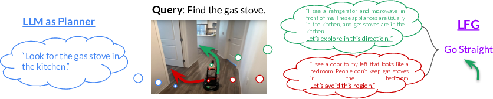
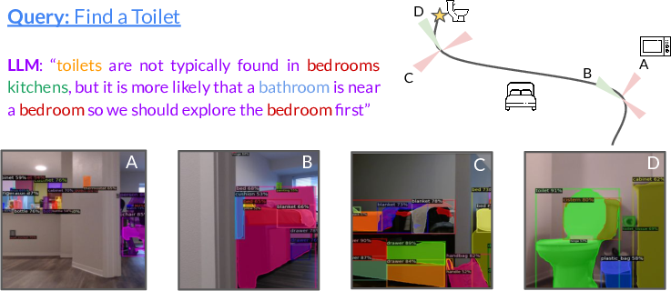

# Navigation with Large Language Models: Semantic Guesswork as a Heuristic for Planning



## TLDR

- Introduces Language Frontier Guide (LFG), a method that uses large language models (LLMs) to guide exploration in unfamiliar environments
- LFG uses LLMs to score potential subgoals, incorporating this as a heuristic in planning algorithms
- Outperforms other LLM-based approaches on challenging real-world navigation tasks and the Habitat ObjectNav benchmark
- Demonstrates how to effectively leverage semantic knowledge from LLMs while remaining grounded in real-world observations

## Introduction

Navigating unfamiliar environments is a fundamental challenge in robotics. While traditional approaches rely on mapping and planning techniques, they often require extensive exploration to build up a representation of the world. Humans, on the other hand, can quickly navigate new spaces by leveraging semantic knowledge - for example, knowing that a kitchen is likely to be adjacent to a living room, or that an exit sign indicates the way out.

Large language models (LLMs) have shown impressive capabilities in capturing and reasoning with such semantic knowledge. However, directly using LLMs to generate navigation instructions can be problematic, as they are not grounded in real-world observations and may produce arbitrarily incorrect guidance.

In this blog post, we'll dive into a novel approach called Language Frontier Guide (LFG), which aims to bridge this gap by using LLMs to provide a semantic "guesswork" heuristic for planning algorithms. By incorporating LLM-generated scores into traditional planning methods, LFG can leverage the rich semantic knowledge of language models while remaining robust to their potential errors.

## Problem Formulation

Before we delve into the details of LFG, let's formally define the problem we're trying to solve. We want to design a high-level planner that takes as input:

1. A natural language query $q$ (e.g., "find the bedside table")
2. An episodic memory of the environment $\mathcal{M}$, which can be either:
   - A 2D map with occupancy and semantic label information
   - A topological map where nodes contain images and object labels

The planner should explore the environment to find the queried object, commanding a low-level policy to control the robot.

One common approach to this task is Frontier-Based Exploration (FBE), where the robot maintains a set of unexplored frontiers and explores randomly to reach the goal. However, we want to do better by leveraging the semantic knowledge contained in LLMs.

## Language Frontier Guide (LFG)

The core idea behind LFG is to formulate the language-guided exploration task as a heuristic-based search problem. The robot proposes unvisited subgoals or waypoints, scores them using an LLM, and then uses a search algorithm (e.g., A*) to plan a path to the goal.

### Scoring Subgoals

The key challenge is to score these subgoal proposals effectively. Given a set $\mathcal{S}$ of $n$ textual subgoal proposals $s_1, s_2, \ldots, s_n$ (e.g., "a corner with a dishwasher and refrigerator", "a hallway with a door", etc.), we want to compute:

$$p(s_i, q, \mathcal{M})$$

This represents the probability that candidate $s_i \in \mathcal{S}$ will lead to the goal $q$, given the current state of the environment described by $\mathcal{M}$.

LFG uses a novel approach to extract these task-relevant likelihoods from LLMs:

1. **Polling**: Sample the most likely subgoal $n_s$ times, conditioned on a task-relevant prompt.
2. **Chain-of-Thought (CoT) Prompting**: Use CoT to improve the quality and interpretability of the scores.
3. **Positive and Negative Prompts**: Combine both positive ("which subgoal is most likely to reach the goal") and negative ("which subgoal is least likely to be relevant") prompts for more informative likelihood estimates.

Here's a high-level overview of the scoring algorithm:

```python
def score_subgoals(subgoal_descriptors):
    p_prompt = generate_positive_prompt(subgoal_descriptors)
    n_prompt = generate_negative_prompt(subgoal_descriptors)
    
    p_samples = [sample_llm(p_prompt) for _ in range(n_s)]
    n_samples = [sample_llm(n_prompt) for _ in range(n_s)]
    
    p_scores = sum(p_samples) / n_s
    n_scores = sum(n_samples) / n_s
    
    return p_scores, n_scores
```

This approach allows us to obtain reliable and interpretable scores for each subgoal, which can then be incorporated into the planning process.

## Incorporating LLM Scores into Planning

Now that we have a way to score subgoals using LLMs, how do we incorporate these scores into a navigation system? LFG uses these scores as a heuristic to guide the search process in a frontier-based exploration framework.

Here's a simplified version of the main algorithm:

```python
def lfg_explore(initial_observation, goal_query):
    subgoal = None
    while not done:
        observation = get_observation()
        episodic_memory = update_mapping(observation)
        
        if goal_query in episodic_memory:
            subgoal = get_location(episodic_memory, goal_query)
        else:
            if time_to_replan():
                location = get_current_location()
                frontier = get_frontier(episodic_memory)
                object_clusters = get_semantic_labels(episodic_memory, frontier)
                llm_pos, llm_neg = score_subgoals(object_clusters)
                
                scores = []
                for point in frontier:
                    distance = dist_to(location, point)
                    closest_cluster = get_closest_cluster(object_clusters, point)
                    i = cluster_id(closest_cluster)
                    
                    if dist(closest_cluster, point) < delta:
                        score = w_p * llm_pos[i] - w_n * llm_neg[i] - distance
                    else:
                        score = -distance
                    
                    scores.append(score)
                
                subgoal = argmax(scores)
        
        go_to(subgoal)
```

This algorithm combines traditional frontier-based exploration with LLM-generated scores to guide the search process. The key components are:

1. Maintaining an episodic memory (map) of the environment
2. Generating frontier points for exploration
3. Scoring these frontier points using LLM-generated heuristics
4. Selecting the best subgoal based on a combination of LLM scores and distance

By incorporating LLM scores as a heuristic, LFG can benefit from the semantic knowledge of language models when it's helpful, while still falling back on traditional exploration strategies when needed.

## Experimental Results

The authors evaluated LFG in both simulated and real-world environments to demonstrate its effectiveness. Let's look at some of the key results.

### Habitat ObjectNav Benchmark

LFG was tested on the Habitat ObjectNav Challenge, where an agent must find a specified object in a simulated environment. The results are impressive:

| Method | Success Rate | SPL |
|--------|--------------|-----|
| FBE | 61.1 | 34.0 |
| Greedy LLM | 54.4 | 26.9 |
| L3MVN | 62.4 | - |
| LFG (Ours) | **68.9** | **36.0** |

LFG significantly outperforms both traditional frontier-based exploration and other LLM-based methods. It's worth noting that LFG achieves this performance without any pre-training, unlike some learning-based approaches that require millions of frames of experience.

### Real-World Navigation

To demonstrate the versatility of LFG, the authors also tested it in challenging real-world environments, including a cluttered cafeteria and an apartment building. In these tests, LFG achieved a 16% improvement over other LLM-based baselines.



This image shows an example of LFG guiding a robot to find a toilet in a real apartment. The system reasons about the likely layout of the apartment and guides the robot towards areas where a bathroom is more likely to be found.

## Key Components and Ablations

To understand the importance of different components in LFG, the authors conducted several ablation studies. Here are some key findings:

1. **Chain-of-Thought Prompting**: Using CoT improved performance by 6.6%.
2. **Positive and Negative Prompts**: Using only positive prompts reduced performance by 4.7%.
3. **Polling vs. Other Scoring Methods**: Scoring via polling outperformed other methods like using log probabilities or asking the LLM directly.

These results highlight the importance of carefully designing the interaction with the LLM to extract useful semantic information.

## Discussion and Future Directions

LFG demonstrates a promising approach to leveraging the semantic knowledge in large language models for robotic navigation tasks. By using LLMs to provide a heuristic for planning algorithms, rather than directly generating plans, LFG can benefit from their semantic understanding while remaining robust to potential errors.

Some potential areas for future work include:

1. Exploring the applicability of LFG in different domains, such as outdoor navigation or more complex environments.
2. Investigating ways to reduce the computational overhead of querying LLMs, possibly through distillation or edge deployment of smaller models.
3. Combining LFG with learning-based approaches to potentially achieve even better performance.

4. Extending the method to handle more flexible goal specifications, leveraging advances in vision-language models.

## Conclusion

Language Frontier Guide (LFG) represents an exciting step forward in combining the semantic reasoning capabilities of large language models with traditional robotics planning algorithms. By using LLMs to provide a "semantic guesswork" heuristic, LFG can guide exploration in unfamiliar environments more effectively than previous methods.

The key takeaways from this work are:

1. LLMs can provide valuable semantic knowledge for navigation tasks, but should be used carefully due to their lack of grounding in real-world observations.
2. Incorporating LLM-generated scores as a heuristic in planning algorithms allows for effective use of semantic knowledge while remaining robust to potential errors.
3. Careful design of the LLM interaction, including chain-of-thought prompting and the use of both positive and negative queries, is crucial for extracting useful information.

As language models continue to advance and robotics systems become more sophisticated, approaches like LFG that bridge the gap between high-level semantic reasoning and low-level planning are likely to play an increasingly important role in enabling more capable and adaptable robotic systems.

## References

[1] Anderson, P., Wu, Q., Teney, D., Bruce, J., Johnson, M., Sünderhauf, N., Reid, I., Gould, S., and van den Hengel, A. (2018). Vision-and-language navigation: Interpreting visually-grounded navigation instructions in real environments. In IEEE Conference on Computer Vision and Pattern Recognition, pages 3674-3683.

[2] Chaplot, D. S., Jiang, H., Gupta, S., and Gupta, A. (2020). Semantic curiosity for active visual learning. In ECCV.

[3] Gervet, T., Chintala, S., Batra, D., Malik, J., and Chaplot, D. S. (2023). Navigating to objects in the real world. Science Robotics.

[4] Shah, D., Sridhar, A., Bhorkar, A., Hirose, N., and Levine, S. (2022). GNM: A General Navigation Model to Drive Any Robot. In arXiV.

[5] Wei, J., Wang, X., Schuurmans, D., Bosma, M., Ichter, B., Xia, F., Chi, E. H., Le, Q. V., and Zhou, D. (2022). Chain of thought prompting elicits reasoning in large language models. In Neural Information Processing Systems (NeurIPS).

[6] Wijmans, E., Kadian, A., Morcos, A., Lee, S., Essa, I., Parikh, D., Savva, M., and Batra, D. (2020). DD-PPO: Learning Near-Perfect PointGoal Navigators from 2.5 Billion Frames. In International Conference on Learning Representations (ICLR).

[7] Yu, B., Kasaei, H., and Cao, M. (2023). L3mvn: Leveraging large language models for visual target navigation.

[8] Zhou, X., Girdhar, R., Joulin, A., Krähenbühl, P., and Misra, I. (2022). Detecting twenty-thousand classes using image-level supervision. In 17th European Conference on Computer Vision (ECCV).

