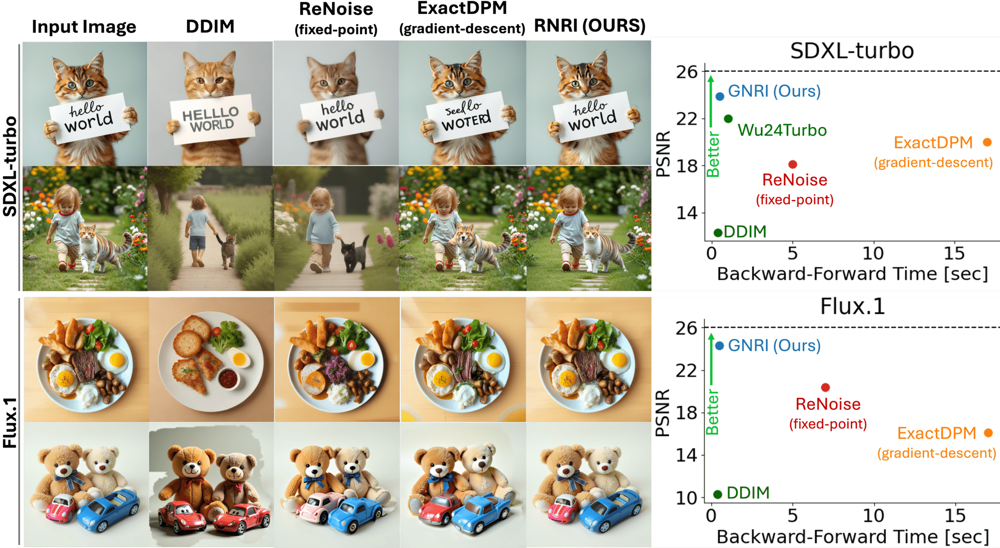
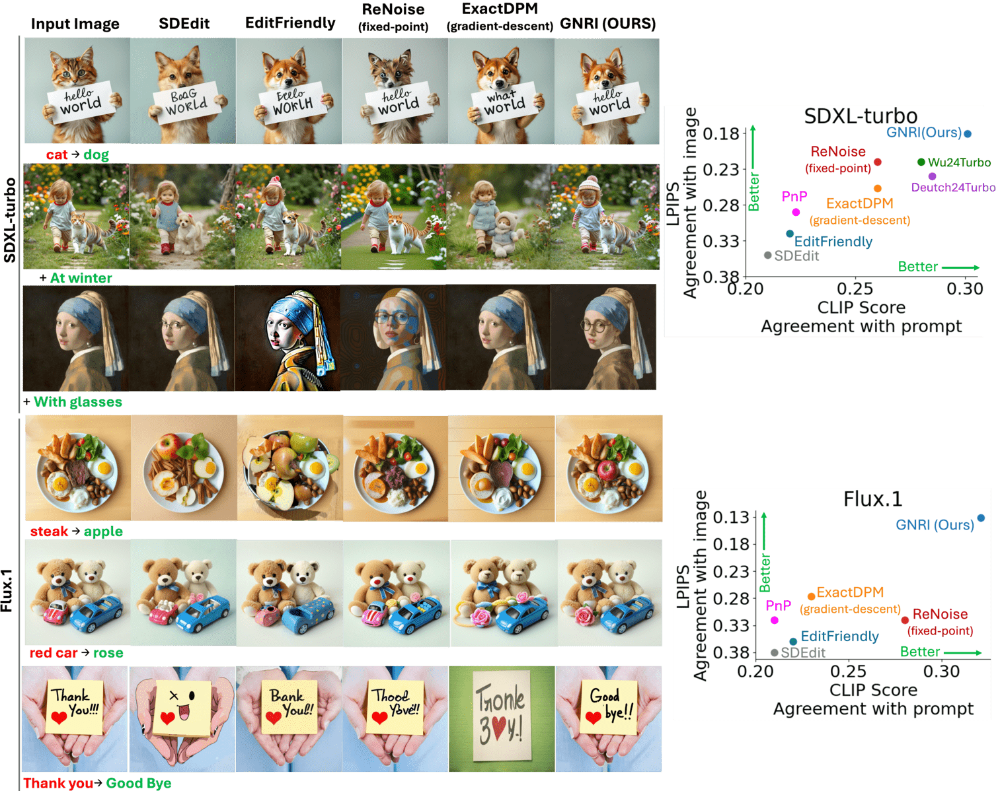

---
title: "Lightning-Fast Image Inversion and Editing for Text-to-Image Diffusion Models: A Deep Dive into GNRI"
date: 2020-09-15T11:30:03+00:00
# weight: 1
# aliases: ["/first"]
tags: ['diffusion models', 'image editing', 'Newton-Raphson method', 'image inversion', 'real-time editing', 'DDIM', 'text-to-image models', 'guided optimization']
author: "Me"
# author: ["Me", "You"] # multiple authors
showToc: true
TocOpen: true
draft: false
hidemeta: false
comments: false
description: ""
canonicalURL: "https://canonical.url/to/page"
disableHLJS: true # to disable highlightjs
disableShare: false
disableHLJS: false
hideSummary: false
searchHidden: false
ShowReadingTime: true
ShowBreadCrumbs: true
ShowPostNavLinks: true
ShowWordCount: true
ShowRssButtonInSectionTermList: true
UseHugoToc: true
cover:
    image: "<image path/url>" # image path/url
    alt: "<alt text>" # alt text
    caption: "<text>" # display caption under cover
    relative: false # when using page bundles set this to true
    hidden: true # only hide on current single page
editPost:
    URL: "https://github.com/<path_to_repo>/content"
    Text: "Suggest Changes" # edit text
    appendFilePath: true # to append file path to Edit link
---

# Lightning-Fast Image Inversion and Editing for Text-to-Image Diffusion Models

**Authors**: Dvir Samuel, Barak Meiri, Haggai Maron, Yoad Tewel, Nir Darshan, Shai Avidan, Gal Chechik, Rami Ben-Ari

## TLDR
- Introduces Guided Newton-Raphson Inversion (GNRI) for fast and accurate image inversion in diffusion models
- Achieves real-time image editing (0.4 seconds) with high quality using few-step diffusion models
- Outperforms existing methods in reconstruction quality and editing capabilities
- No additional training or parameters required, compatible with all pre-trained diffusion models

*Consecutive real image inversions and editing using GNRI with Flux.1-schnell (0.4 sec on an A100 GPU).*

## Introduction

Text-to-image diffusion models have revolutionized image generation, but editing real images using these models requires a crucial step called "inversion" - finding the initial noise that would generate the exact input image. While existing methods like DDIM inversion are fast but inaccurate, or precise but slow like gradient-based approaches, there's been a need for a method that balances speed and accuracy.

In this blog post, I'll dive deep into GNRI, a novel approach that achieves lightning-fast image inversion while maintaining high quality. The method is particularly exciting because it enables real-time image editing with just a few diffusion steps.

## Technical Background

### Diffusion Models and Deterministic Scheduling

Diffusion models work by gradually adding noise to an image until it becomes pure Gaussian noise, then learning to reverse this process. The forward process follows a Markov chain:

$$ q(z_1,z_2,\ldots,z_T | z_0)=\prod^{T}_{t=1}{q(z_{t} | z_{t-1})} $$

where each step follows a Gaussian transition:

$$ q(z_{t}|z_{t-1}) := \mathcal{N}(z_{t};\mu_t=\gamma_tz_{t-1},\Sigma_t=\beta_t I) $$

Two popular deterministic schedulers are:

1. **DDIM**: Uses the update rule:
$$ z_{t-1}=\sqrt{\frac{\alpha_{t-1}}{\alpha_{t}}}z_{t} - \sqrt{\alpha_{t-1}} \cdot \Delta \psi(\alpha_{t})\cdot \epsilon_{\theta}(z_{t},t,p) $$

2. **Euler**: Follows:
$$ z_{t-1}=z_{t} + ( \sigma_{t-1} - \sigma_t) v_{\theta}(z_{t},t,p) $$

## The GNRI Method

*GNRI iterates over an implicit function using Newton-Raphson scheme at every time-step in the inversion path.*

### Key Innovations

1. **Scalar Root-Finding**: Instead of dealing with high-dimensional Jacobians, GNRI reformulates the problem as finding roots of a scalar function:

$$ \hat{r}(z_t) := ||z_t - f(z_t)||_1 $$

2. **Guided Solution**: To ensure the solution stays within the distribution of latents, GNRI introduces a guidance term:

$$ G(z_t) = \begin{cases}
   \frac{1}{\beta_t}||z_t - \mu_t||  & \text{DDIM} \\
    ||z_t - \mu_t|| & \text{Euler}
\end{cases} $$

The final objective becomes:

$$ \mathcal{F}(z_t) := ||z_t - f(z_t)||_1  + \lambda G(z_t) $$

### Newton-Raphson Iteration Scheme

The iteration scheme is:

$$ z_t^0 = z_{t-1} $$
$$ z_t^{k+1}(i) = z_t^k(i) - \frac{1}{D}~\frac{\mathcal{F}(z_t^k)}{g_i(z_t^k)+\eta} $$

where $g_i$ is the partial derivative with respect to component $i$.

## Results and Evaluation

### Image Reconstruction Quality

*Left: Reconstruction quality comparison. Right: PSNR vs runtime comparison on COCO2017 validation set.*

GNRI achieves:
- 2x to 40x speedup compared to existing methods
- Higher PSNR (Peak Signal-to-Noise Ratio)
- Better preservation of fine details

### Real-Time Image Editing

*Left: Qualitative results of image editing. Right: Evaluation of editing performance using CLIP and LPIPS scores.*

The method excels in:
- Natural and coherent edits
- Structure preservation
- Fast execution (0.4 seconds per edit)
- Superior CLIP and LPIPS scores

### Rare Concept Generation

GNRI also improves the generation of rare concepts by providing better seed initialization. On ImageNet1k classes in LAION2B:
- Head classes: 98.6% accuracy
- Medium classes: 97.9% accuracy
- Tail classes: 89.1% accuracy

## Implementation Details

The method has been tested with:
- SD2.1 (Stable Diffusion)
- SDXL-turbo
- Flux.1-schnell

Key parameters:
- Sampling steps: 50 for SD2.1, 4 for SDXL-turbo and Flux.1
- Hardware: Single A100 GPU
- Guidance weight λ = 0.1 (optimal value)

## Conclusion

GNRI represents a significant advancement in diffusion model inversion, enabling real-time image editing while maintaining high quality. Its key strengths are:
- No additional training required
- Compatible with all pre-trained diffusion models
- Significantly faster than existing methods
- Superior reconstruction and editing quality

The method opens up new possibilities for interactive image editing applications and improved rare concept generation.

## References

[Full list of references available in the paper]

