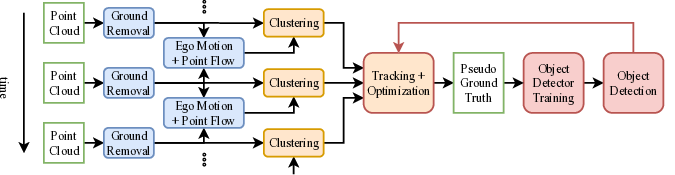
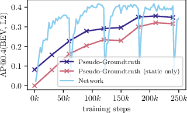

# LISO: Lidar-only Self-Supervised 3D Object Detection

## TL;DR

- LISO is a novel self-supervised method for training state-of-the-art LiDAR object detection networks using only unlabeled sequences of LiDAR point clouds.
- It leverages self-supervised scene flow estimation to generate, track, and iteratively refine pseudo ground truth labels.
- LISO outperforms existing self-supervised methods across multiple datasets and network architectures, bridging the gap between unsupervised and supervised approaches.
- The method generalizes well from detecting moving objects to all movable objects, without requiring cameras, high-precision GPS, or manual annotations.

## Introduction

3D object detection is a crucial component in autonomous driving systems. However, current state-of-the-art LiDAR object detectors rely heavily on expensive and time-consuming manual annotations of 3D bounding boxes. This dependency creates significant challenges, especially when dealing with new sensor types or mounting positions, as existing annotations become quickly outdated.

In this blog post, we'll dive deep into LISO (LIdar-only Self-supervised Object detection), a novel approach introduced by Stefan Andreas Baur, Frank Moosmann, and Andreas Geiger. LISO aims to bridge the gap between human perception capabilities and current AI systems by leveraging motion cues observed in self-supervised LiDAR scene flow to train state-of-the-art single-frame LiDAR object detectors.

## The LISO Approach

LISO's core idea is to distill motion cues from self-supervised LiDAR scene flow into state-of-the-art single-frame LiDAR object detectors. This approach is elegantly simple and easy to use, requiring only LiDAR point cloud sequences as input. Let's break down the key components of the LISO pipeline:

*Figure 2: Overview of the LISO method*

### 1. Preprocessing

The preprocessing stage consists of three main steps:

a) **Ground Removal**: LISO uses the JCP algorithm [1] to remove distracting ground points from each point cloud. This step helps focus the detection on relevant objects.

b) **Ego Motion Estimation**: The method employs KISS-ICP [2] to compute ego-motion between neighboring frame pairs. This results in a cm-level accurate transformation $\mathbf{T}_{\text{ego}}^{t\rightarrow t+1} \in \mathbb{R}^{4\times4}$, describing the ego vehicle position at time $t+1$ represented in the ego frame from time $t$.

c) **LiDAR Scene Flow Estimation**: LISO uses SLIM [3] to compute LiDAR scene flow between neighboring frame pairs. This produces a flow vector $\mathbf{f}_i = (dx, dy, dz)$ for every point $i$ in the first point cloud $\mathcal{P}^{t}$.

### 2. Initial Pseudo Ground Truth Generation

The goal of this stage is to mine pseudo ground truth (PGT) for training a 3D LiDAR object detector. For a single point cloud $\mathcal{P}^{t}$, the ground truth is a set of 3D bounding boxes $\mathcal{B}$ with confidences:

$$\mathcal{B}^{t} =\{\text{B}^{t}_{j}, j \in \mathbb{N}\} = \{(x, y, z, l, w, h, \theta, c)_j\}$$

where $(x, y, z)$ define the center position, $(l, w, h)$ the length, width and height, $\theta$ the heading, and $c$ the confidence for a single box.

The process involves several steps:

a) **Flow Clustering**: Points are clustered based on geometry and motion using DBSCAN [4]. The residual flow $\mathbf{f}_{i,\text{dyn}} = \mathbf{f}_{i} - \mathbf{f}_{i,\text{sta}}$ is used to identify moving objects.

b) **Tracking**: A simple flow-based tracker is implemented to track boxes across frames. Tracks are filtered based on length and confidence.

c) **Track Optimization**: To reduce positional noise, LISO minimizes translational jerk on all tracks longer than 3m:

$$L = \sum_{i=1}^{T} \left\Vert  \frac{d^4\mathbf{x}_{i,\text{smooth}}}{dt^4} \right\Vert_2 ^2 + \beta  \left\Vert \mathbf{x}_{i,\text{smooth}} - \mathbf{x}_{i,\text{obs}}\right\Vert_2 ^2$$

### 3. Trajectory-Regularized Self-Training

The final stage of LISO involves iterative trajectory-regularized self-training:

a) **Training**: The target object detection network is trained using the current PGT in a supervised setup. Standard augmentation techniques are applied during training.

b) **Pseudo Ground Truth Regeneration**: After a certain number of training steps, the trained object detector is used to recreate new, improved PGT. This process involves running the detector over all sequences and regularizing detections using the flow-based tracker and track smoothing.

## Key Insights and Results

LISO demonstrates several important characteristics that contribute to its success:

1. **High-precision initial PGT**: By focusing on high precision (potentially at the cost of lower recall) in the initial set of bounding boxes, LISO avoids introducing "wrong" objects that could negatively influence the object detector.

2. **Generalization from moving to movable objects**: The method allows the detector to generalize from initially mined moving objects to all movable objects in the scene.

3. **Robustness across datasets and architectures**: LISO performs consistently well across multiple datasets (Waymo Open Dataset, KITTI, Argoverse 2, and nuScenes) and different network architectures (CenterPoint and Transfusion-L).

Let's look at some quantitative results:

*Figure 3: Effect of self-supervised self-learning on the Waymo Open Dataset*

As we can see in Figure 3, LISO's performance improves with each iteration of self-training, both for the PGT and the network predictions. The method successfully generalizes from moving objects to static (but movable) objects over time.

Here's a comparison of LISO with other methods on the Waymo Open Dataset:

| Method | Movable AP@0.4 (BEV) | Movable AP@0.4 (3D) |
|--------|----------------------|---------------------|
| DBSCAN | 0.027 | 0.008 |
| RSF | 0.030 | 0.020 |
| Oyster-CP | 0.217 | 0.084 |
| LISO-CP | **0.380** | **0.308** |
| Supervised CP | 0.765 | 0.684 |

As we can see, LISO significantly outperforms other self-supervised methods, bridging the gap towards supervised approaches.

## Implementation Details and Ablation Studies

LISO is implemented using PyTorch and can work with different object detection networks. In the paper, the authors demonstrate results with CenterPoint [5] and Transfusion-L [6]. The method uses a 100m x 100m bird's-eye-view grid around the ego vehicle for detection.

Some key implementation details include:

- Non-maximum suppression with a threshold of 0.1 (2D BEV IoU) for detections
- DBSCAN parameters: ε = 1.0, minPts = 5
- Track optimization using Adam optimizer with learning rate 0.1 for 2000 steps

The authors conducted extensive ablation studies to understand the contribution of different components:

1. **Motion Cues as Clustering Input**: Adding motion cues to box clustering significantly improves detection performance.
2. **Motion Cues for Tracking**: The LiDAR scene flow-based tracker is the biggest contributing factor to LISO's success.
3. **Effect of Self-Training**: Self-training provides benefits even without using a tracker, but the combination of strict tracking and self-training amplifies the positive effects.
4. **Track Optimization**: Track optimization provides consistent benefits, independent of self-training.

## Limitations and Future Work

While LISO demonstrates impressive results, there are some limitations and areas for future work:

1. **Class Distinction**: The current method is not able to distinguish between different object classes. Future work could focus on generating PGT for class labels based on motion or size characteristics.

2. **Performance Gap**: There is still a noticeable gap in evaluation results between supervised and unsupervised methods, especially in sparse and distant regions.

3. **Sensor Limitations**: The method's performance varies across different LiDAR sensors, with sparser sensors (e.g., 32-layer LiDAR in nuScenes) presenting more challenges.

## Conclusion

LISO represents a significant step forward in self-supervised 3D object detection for autonomous driving. By leveraging motion cues from self-supervised LiDAR scene flow, it enables training state-of-the-art object detectors without the need for expensive manual annotations. The method's ability to generalize from moving to movable objects and its consistent performance across different datasets and architectures make it a promising approach for future autonomous driving systems.

As we continue to push the boundaries of self-supervised learning in computer vision, methods like LISO pave the way for more efficient and adaptable perception systems. The code for LISO will be released, allowing researchers and practitioners to build upon this work and further advance the field of 3D object detection.

## References

[1] Shen, Z., Liang, H., Lin, L., Wang, Z., Huang, W., Yu, J.: Fast ground segmentation for 3d lidar point cloud based on jump-convolution-process. Remote. Sens. 13(16), 3239 (2021).

[2] Vizzo, I., Guadagnino, T., Mersch, B., Wiesmann, L., Behley, J., Stachniss, C.: KISS-ICP: in defense of point-to-point ICP - simple, accurate, and robust registration if done the right way. IEEE Robotics Autom. Lett. 8(2), 1029-1036 (2023).

[3] Baur, S.A., Emmerichs, D.J., Moosmann, F., Pinggera, P., Ommer, B., Geiger, A.: SLIM: self-supervised lidar scene flow and motion segmentation. In: 2021 IEEE/CVF International Conference on Computer Vision, ICCV 2021, Montreal, QC, Canada, October 10-17, 2021. pp. 13106-13116. IEEE (2021).

[4] Ester, M., Kriegel, H., Sander, J., Xu, X.: A density-based algorithm for discovering clusters in large spatial databases with noise. In: Proceedings of the Second International Conference on Knowledge Discovery and Data Mining (KDD-96), Portland, Oregon, USA. pp. 226-231. AAAI Press (1996).

[5] Yin, T., Zhou, X., Krähenbühl, P.: Center-based 3d object detection and tracking. In: IEEE Conference on Computer Vision and Pattern Recognition, CVPR 2021, virtual, June 19-25, 2021. pp. 11784-11793. Computer Vision Foundation / IEEE (2021).

[6] Bai, X., Hu, Z., Zhu, X., Huang, Q., Chen, Y., Fu, H., Tai, C.: Transfusion: Robust lidar-camera fusion for 3d object detection with transformers. In: IEEE/CVF Conference on Computer Vision and Pattern Recognition, CVPR 2022, New Orleans, LA, USA, June 18-24, 2022. pp. 1080-1089. IEEE (2022).

