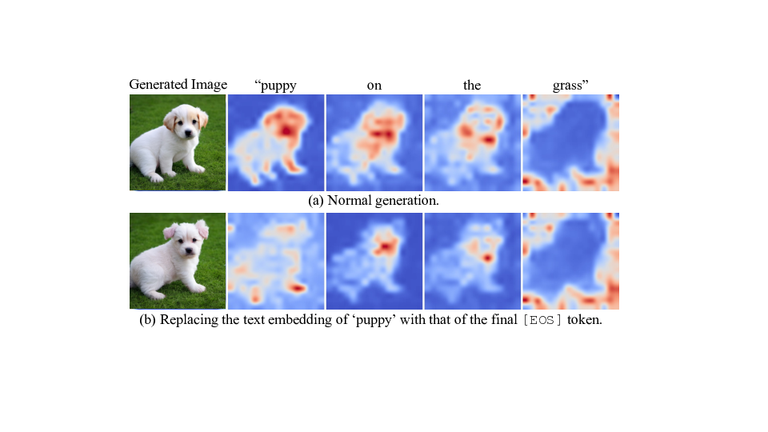
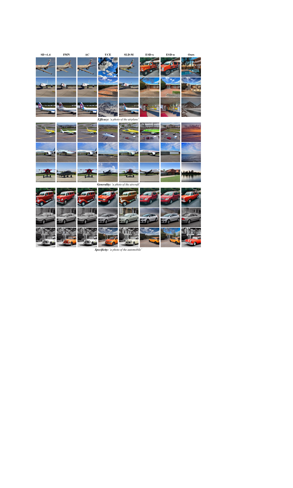
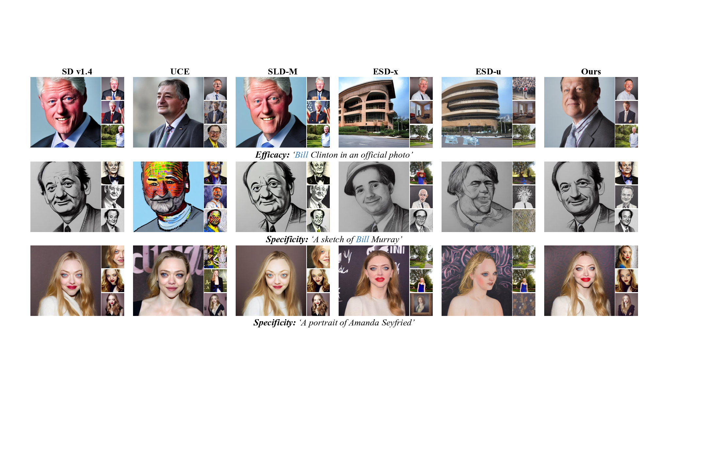

*Figure 1: Overview of MACE framework*

## TLDR

- MACE is a novel framework for erasing multiple concepts from text-to-image diffusion models
- It achieves superior balance between generality and specificity compared to existing methods
- MACE can effectively erase up to 100 concepts simultaneously without compromising model performance
- The approach combines closed-form cross-attention refinement and concept-specific LoRA modules
- MACE outperforms state-of-the-art methods across various concept erasure tasks

## Introduction

Text-to-image diffusion models have revolutionized the field of AI-generated art and content creation. However, their ability to generate almost any concept based on text prompts has raised concerns about potential misuse, copyright infringement, and the creation of harmful or explicit content. To address these issues, researchers have been exploring ways to selectively remove or "erase" specific concepts from these models.

In this blog post, we'll dive into a cutting-edge approach called MACE (MAss Concept Erasure) proposed by Shilin Lu et al. in their paper "MACE: Mass Concept Erasure in Diffusion Models" [1]. This work introduces a powerful framework for erasing multiple concepts from text-to-image diffusion models while maintaining a delicate balance between generality and specificity.

## The Challenge of Concept Erasure

Before we delve into the details of MACE, let's understand the key challenges in concept erasure:

1. **Efficacy**: The model should not generate images related to the erased concept when prompted.
2. **Generality**: The erasure should extend to synonyms and related terms of the target concept.
3. **Specificity**: Unrelated concepts should remain intact and generate as expected.

Previous methods have struggled to achieve all three of these goals simultaneously, especially when dealing with multiple concepts. MACE addresses these challenges through a novel combination of techniques.

## The MACE Framework

MACE consists of three main components:

1. Closed-Form Cross-Attention Refinement
2. Target Concept Erasure with LoRA
3. Fusion of Multi-LoRA Modules

Let's explore each of these components in detail.

### 1. Closed-Form Cross-Attention Refinement

The first step in MACE is to refine the cross-attention layers of the pretrained model. This is crucial because the information of a concept is not only contained within its own tokens but also embedded in co-existing words through the attention mechanism.

*Figure 2: A concept can be generated solely via residual information*

To address this, MACE uses a closed-form solution to update the projection matrices $\mathbf{W}_k$ and $\mathbf{W}_v$ in the cross-attention layers. The objective is to discourage the model from embedding residual information of the target phrase into other words.

The optimization problem is formulated as:

$$
\min_{\mathbf{W}^{\prime}_k} \sum_{i=1}^n \| \mathbf{W}_k^{\prime} \cdot \mathbf{e}^f_i - \mathbf{W}_k \cdot \mathbf{e}_i^g  \|_2^2 + \lambda_1 \sum_{i=n+1}^{n+m} \| \mathbf{W}_k^{\prime} \cdot \mathbf{e}^p_i - \mathbf{W}_k \cdot \mathbf{e}_i^p  \|_2^2
$$

Where:
- $\mathbf{W}_k^{\prime}$ is the refined projection matrix
- $\mathbf{e}^f_i$ is the embedding of a word co-existing with the target phrase
- $\mathbf{e}_i^g$ is the embedding of that word when the target phrase is replaced with its super-category or a generic concept
- $\mathbf{e}_i^p$ is the embedding for preserving prior knowledge
- $\lambda_1$ is a hyperparameter

The closed-form solution for this optimization problem is:

$$
\mathbf{W}_k^\prime = \left( \sum_{i=1}^n \mathbf{W}_k \cdot \mathbf{e}^g_i \cdot (\mathbf{e}_i^f)^T + \lambda_1 \sum_{i=n+1}^{n+m} \mathbf{W}_k \cdot \mathbf{e}^p_i \cdot (\mathbf{e}_i^p)^T \right) \cdot \left( \sum_{i=1}^n \mathbf{e}^f_i \cdot (\mathbf{e}^f_i)^T + \lambda_1 \sum_{i=n+1}^{n+m} \mathbf{e}^p_i \cdot (\mathbf{e}_i^p)^T \right)^{-1}
$$

This refinement step helps to remove the residual information of the target concept from co-existing words, improving the overall efficacy of the erasure process.

### 2. Target Concept Erasure with LoRA

After refining the cross-attention layers, MACE focuses on erasing the intrinsic information within the target phrase itself. This is achieved using Low-Rank Adaptation (LoRA) modules [2], which provide an efficient way to fine-tune the model for specific concepts.

The key idea is to suppress the activation in certain regions of the attention maps that correspond to the target phrase tokens. The loss function for this step is:

$$
\min \sum_{i \in S} \sum_{l}\| \mathbf{A}_{t,l}^i \odot \mathbf{M} \|^2_F
$$

Where:
- $S$ is the set of indices corresponding to the tokens of the target phrase
- $\mathbf{A}_{t,l}^i$ is the attention map of token $i$ at layer $l$ and timestep $t$
- $\mathbf{M}$ is the segmentation mask obtained using Grounded-SAM [3, 4]
- $\|\cdot\|_F$ is the Frobenius norm

To implement this, MACE uses LoRA to decompose the weight modulations into low-rank matrices:

$$
\hat{\mathbf{W}}_k = \mathbf{W}_k^{\prime} + \Delta \mathbf{W}_k = \mathbf{W}_k^{\prime} + \mathbf{B} \times \mathbf{D}
$$

Where $\mathbf{B} \in \mathbb{R}^{d_\text{in} \times r}$ and $\mathbf{D} \in \mathbb{R}^{r \times d_\text{out}}$, with $r \ll \min(d_\text{in}, d_\text{out})$ being the decomposition rank.

### 3. Fusion of Multi-LoRA Modules

The final step in MACE is to integrate multiple LoRA modules, each responsible for erasing a specific concept. Instead of using a simple weighted sum, which can lead to interference between modules, MACE introduces a novel fusion technique.

The objective function for this fusion is:

$$
\min_{\mathbf{W}_k^*} \sum_{i=1}^q \sum_{j=1}^p \|  \mathbf{W}_k^* \cdot \mathbf{e}_j^f  - (\mathbf{W}_{k}^\prime+ \Delta \mathbf{W}_{k,i}) \cdot \mathbf{e}^f_j \|_2^2 + \lambda_2 \sum_{j=p+1}^{p+m} \| \mathbf{W}_k^* \cdot \mathbf{e}_j^p - \mathbf{W}_k \cdot \mathbf{e}^p_j  \|_2^2
$$

Where:
- $q$ is the number of erased concepts
- $p$ is the number of embeddings for mapping
- $m$ is the number of embeddings for preserving prior knowledge
- $\lambda_2$ is a hyperparameter

This fusion technique allows MACE to integrate multiple LoRA modules without mutual interference, preventing catastrophic forgetting and providing more flexibility in erasing multiple concepts.

## Concept-Focal Importance Sampling

An important innovation in MACE is the introduction of Concept-Focal Importance Sampling (CFIS). This technique addresses the issue of maintaining specificity when erasing concepts that contain polysemous words or common names.

Instead of sampling timesteps uniformly during LoRA training, MACE uses a probability density function that assigns greater probability to smaller values of $t$:

$$
\xi(t) = \frac{1}{Z} \left( \sigma\left( \gamma(t-t_1) \right) - \sigma\left( \gamma(t-t_2) \right) \right)
$$

Where:
- $Z$ is a normalizer
- $\sigma(x)$ is the sigmoid function
- $t_1$ and $t_2$ are the bounds of a high probability sampling interval
- $\gamma$ is a temperature hyperparameter

This sampling strategy helps maintain specificity by focusing on the later stages of the diffusion process, where the specific mode of the concept is determined.

## Experimental Results

The authors conducted extensive experiments to evaluate MACE across four different tasks:

1. Object erasure
2. Celebrity erasure
3. Explicit content erasure
4. Artistic style erasure

Let's look at some of the key results:

### Object Erasure

MACE was tested on erasing the ten object classes from the CIFAR-10 dataset. The results show that MACE achieves the highest harmonic mean across nine out of ten object classes, demonstrating superior erasure capabilities while balancing specificity and generality.

*Figure 3: Qualitative comparison of airplane erasure*

### Celebrity Erasure

One of the most impressive aspects of MACE is its ability to erase multiple concepts simultaneously. In the celebrity erasure task, MACE was evaluated on erasing 1, 5, 10, and 100 celebrities.

*Figure 4: Qualitative comparison of erasing 100 celebrities*

The results show that MACE significantly outperforms existing methods, especially when erasing 100 concepts. It maintains a good balance between efficacy and specificity, even for challenging cases like preserving "Bill Murray" while erasing "Bill Clinton".

### Explicit Content Erasure

MACE was also evaluated on its ability to mitigate the generation of explicit content. The results show that MACE generates the least amount of explicit content when conditioned on 4,703 prompts from the Inappropriate Image Prompt (I2P) dataset.

### Artistic Style Erasure

In the task of erasing 100 artistic styles, MACE again demonstrates superior performance, achieving the highest overall erasing capability while maintaining good FID scores on regular content generation.

## Implementation Details

For those interested in implementing MACE, here are some key details:

- The authors used Stable Diffusion v1.4 as the base model
- Images were generated using the DDIM sampler over 50 steps
- Each LoRA module was trained for 50 gradient update steps
- The code is available at: [https://github.com/Shilin-LU/MACE](https://github.com/Shilin-LU/MACE)

## Conclusion and Future Directions

MACE represents a significant advancement in the field of concept erasure for text-to-image diffusion models. Its ability to erase multiple concepts while maintaining a balance between generality and specificity opens up new possibilities for creating safer and more controlled AI-generated content.

Some potential future directions for this work include:

1. Scaling up the erasure scope to handle thousands of concepts
2. Exploring ways to further improve the specificity for highly related concepts
3. Investigating the application of MACE to other types of generative models beyond text-to-image

As AI-generated content becomes increasingly prevalent, techniques like MACE will play a crucial role in ensuring that these powerful tools can be used responsibly and ethically.

---

## References

[1] Lu, S., Wang, Z., Li, L., Liu, Y., & Kong, A. W. (2024). MACE: Mass Concept Erasure in Diffusion Models. arXiv preprint.

[2] Hu, E. J., Shen, Y., Wallis, P., Allen-Zhu, Z., Li, Y., Wang, S., ... & Chen, W. (2021). LoRA: Low-Rank Adaptation of Large Language Models. arXiv preprint arXiv:2106.09685.

[3] Kirillov, A., Mintun, E., Ravi, N., Mao, H., Rolland, C., Gustafson, L., ... & Girshick, R. (2023). Segment Anything. arXiv preprint arXiv:2304.02643.

[4] Liu, Y., Jia, X., Tan, J., Zhang, S., Xin, J., & Zhang, L. (2023). Grounding DINO: Marrying DINO with Grounded Pre-Training for Open-Set Object Detection. arXiv preprint arXiv:2303.05499.

[5] Rombach, R., Blattmann, A., Lorenz, D., Esser, P., & Ommer, B. (2022). High-Resolution Image Synthesis with Latent Diffusion Models. In Proceedings of the IEEE/CVF Conference on Computer Vision and Pattern Recognition (pp. 10684-10695).

[6] Vaswani, A., Shazeer, N., Parmar, N., Uszkoreit, J., Jones, L., Gomez, A. N., ... & Polosukhin, I. (2017). Attention is All you Need. In Advances in Neural Information Processing Systems (pp. 5998-6008).

---