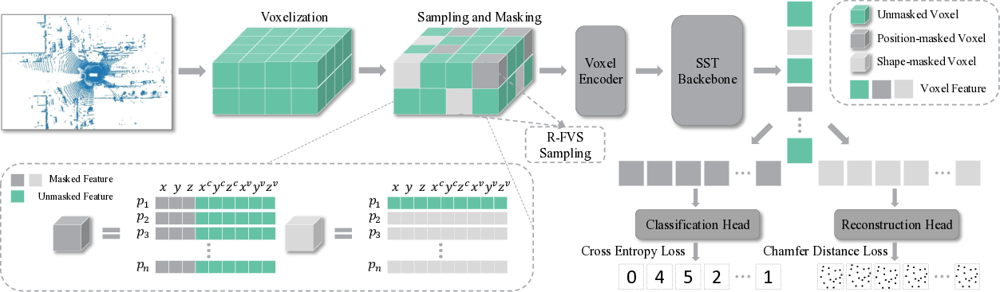
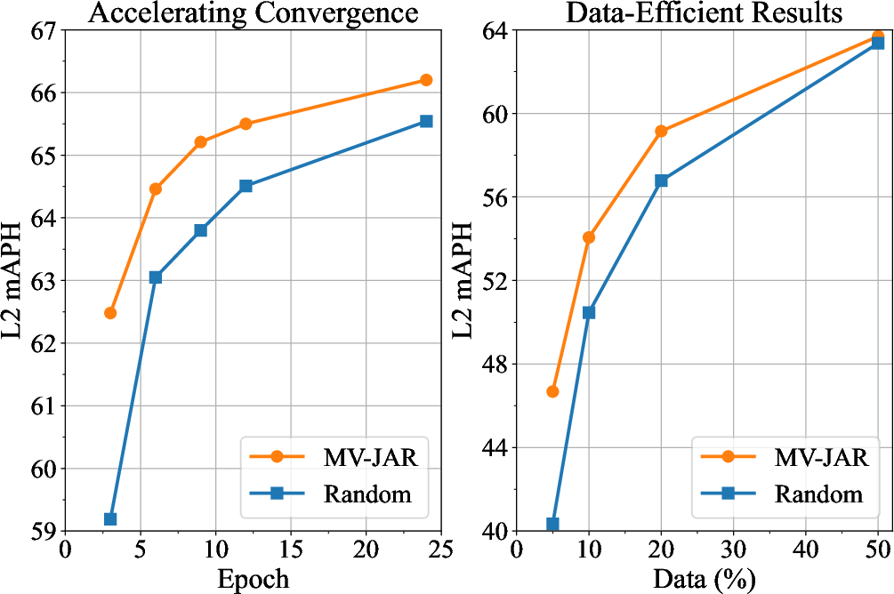

# MV-JAR: Advancing Self-Supervised Pre-Training for LiDAR-Based 3D Object Detection

*Figure 1: Overview of the Masked Voxel Jigsaw and Reconstruction (MV-JAR) method*

## TL;DR

- MV-JAR is a novel self-supervised pre-training method for LiDAR-based 3D object detection
- It uses masked voxel modeling to learn both point and voxel distributions in LiDAR point clouds
- A new data-efficient benchmark on Waymo is proposed to better evaluate pre-training strategies
- MV-JAR significantly improves detection performance, especially with limited fine-tuning data
- The method accelerates model convergence and transfers well to other datasets like KITTI

## Introduction

LiDAR sensors are crucial for 3D perception in autonomous driving, but annotating LiDAR point clouds is time-consuming and expensive. Self-supervised pre-training has shown great promise for learning representations without labels, but existing methods struggle with the sparse and irregular nature of LiDAR data.

In this blog post, I'll dive into a fascinating new paper titled "MV-JAR: Masked Voxel Jigsaw and Reconstruction for LiDAR-Based Self-Supervised Pre-Training" [1]. The authors propose an innovative approach called Masked Voxel Jigsaw and Reconstruction (MV-JAR) that addresses the unique challenges of LiDAR point clouds.

Let's explore how MV-JAR works, why it's effective, and the impact it could have on autonomous driving perception.

## Background: The LiDAR Pre-Training Challenge

Before we jump into MV-JAR, it's important to understand why pre-training for LiDAR data is so challenging:

1. **Sparsity**: Unlike dense images, LiDAR point clouds have large empty regions.
2. **Irregularity**: Points are unevenly distributed, with density decreasing at greater distances.
3. **Lack of color**: LiDAR data typically only contains 3D coordinates and intensity values.

Previous self-supervised methods like contrastive learning have struggled with these properties. Constructing effective positive and negative pairs is difficult when similar geometric structures may appear in different contexts.

## The MV-JAR Approach

MV-JAR takes inspiration from the success of masked modeling in natural language processing (e.g., BERT [2]) and computer vision (e.g., MAE [3]). However, it adapts these ideas specifically for the hierarchical nature of LiDAR data processing.

### Key Insight: The Scene-Voxel-Point Hierarchy

Most LiDAR-based 3D object detectors follow a similar pipeline:

1. Quantize the 3D space into voxels
2. Encode point features within each voxel
3. Process voxel features for detection

MV-JAR leverages this hierarchy by designing masking and reconstruction strategies that account for:

- Voxel distributions in the scene
- Local point distributions within voxels

Let's break down the main components of MV-JAR:

### 1. Reversed-Furthest-Voxel-Sampling (R-FVS)

To handle the uneven distribution of LiDAR points, MV-JAR introduces R-FVS:

1. Apply Furthest Point Sampling (FPS) to select a subset of voxels
2. Keep these sampled voxels (preserving sparse regions)
3. Mask the remaining unsampled voxels

This approach ensures that critical information in sparse areas is retained during pre-training.

### 2. Masked Voxel Jigsaw (MVJ)

MVJ focuses on learning voxel distributions:

1. Mask the absolute coordinates of points in selected voxels
2. Preserve the relative coordinates within each voxel
3. Train the model to predict the original voxel positions

Mathematically, for a masked voxel:

$$V_{\text{masked}} = \{p_j=[m_v, x^c_j, y^c_j, z^c_j, x^v_j, y^v_j, z^v_j]^T \in \mathbb{R}^{9} \}_{j=1...T}$$

Where $m_v \in \mathbb{R}^{3}$ is a learnable mask token replacing the absolute coordinates.

The loss function for MVJ is:

$$L_{MVJ} = \frac{1}{R_p}\sum_{i=1}^{R_p}\text{CrossEntropy}(\hat{v}_i, I_i)$$

Where $R_p$ is the number of position-masked voxels, $\hat{v}_i$ is the predicted classification vector, and $I_i$ is the true relative index.

### 3. Masked Voxel Reconstruction (MVR)

MVR complements MVJ by focusing on local point distributions:

1. Mask both absolute and relative coordinates of points in selected voxels
2. Preserve one point to provide voxel position information
3. Train the model to reconstruct the original point distribution

For a shape-masked voxel:

$$V_{\text{masked}} = \{[x_1, y_1, z_1, x^c_1, y^c_1, z^c_1, x^v_1, y^v_1, z^v_1]\} \cup \{p_j = m_p \}_{j=2...T}$$

Where $m_p \in \mathbb{R}^{9}$ is a learnable token replacing all point features except for one preserved point.

The loss function for MVR uses the Chamfer Distance:

$$L_{MVR} = \frac{1}{R_s}\sum_{i=1}^{R_s}{L_{CD}}(\hat{V}_i, V_i )$$

Where $R_s$ is the number of shape-masked voxels and $L_{CD}$ is the L2 Chamfer Distance:

$$
\begin{align*}
L_{CD} &= \frac{1}{\left|\hat{V}_i\right|} \sum_{\hat{p} \in \hat{V}_i} \min _{p \in V_i}\|\hat{p} - p\|_{2}^{2} \\
&+ \frac{1}{\left|V_i\right|} \sum_{p \in V_i} \min _{\hat{p} \in \hat{V}_i}\|p-\hat{p}\|_{2}^{2}
\end{align*}
$$

### Putting It All Together: Joint Pre-Training

MV-JAR combines MVJ and MVR for a comprehensive pre-training approach:

$$L = \alpha L_{MVJ} + \beta L_{MVR}$$

Where $\alpha$ and $\beta$ are balancing coefficients.

## A New Data-Efficient Benchmark

The authors identified limitations in existing data-efficient benchmarks for evaluating pre-training strategies:

1. **Incomplete model convergence**: Previous works used the same number of epochs for different data splits, leading to under-training on smaller splits.
2. **Similar data diversity**: Uniform sampling of frames from sequences resulted in similar scene diversity across splits.

To address these issues, they propose a new benchmark on the Waymo dataset [4]:

1. **Sequence-based sampling**: Sample entire scene sequences instead of individual frames.
2. **Varying data amounts**: Create splits with 5%, 10%, 20%, 50%, and 100% of the data.
3. **Adaptive training**: Train models until performance saturates for each split.

This benchmark provides a more accurate evaluation of how pre-training benefits downstream tasks with varying amounts and diversities of labeled data.

## Experimental Results

The authors conducted extensive experiments to evaluate MV-JAR. Let's look at some key findings:

### 1. Performance on Waymo

*Figure 2: 3D object detection results on the Waymo dataset*

MV-JAR consistently outperforms both training from scratch and other pre-training methods across all data regimes:

- With 5% fine-tuning data: 15.7% relative improvement (40.34% to 46.68% L2 mAPH)
- With 100% fine-tuning data: 0.66% improvement (65.54% to 66.20% L2 mAPH)

The gains are particularly significant when fine-tuning data is limited, demonstrating the effectiveness of the learned representations.

### 2. Accelerated Convergence

MV-JAR significantly speeds up model convergence:

- 3 epochs of fine-tuning achieve 62.48% L2 mAPH
- 12 epochs match the performance of 24 epochs from scratch

This acceleration can lead to substantial time and computational savings in practice.

### 3. Transfer Learning to KITTI

The authors also evaluated MV-JAR's transferability by pre-training on Waymo and fine-tuning on the KITTI dataset [5]:

- MV-JAR outperforms random initialization and other pre-training methods
- Demonstrates the generalization of the learned representations across datasets

### 4. Ablation Studies

Several ablation studies provide insights into MV-JAR's components:

- **R-FVS vs. Random Sampling**: R-FVS outperforms random sampling, validating its effectiveness in preserving critical information.
- **Masking Ratios**: A lower masking ratio (15% total) works best, likely due to the sparsity of LiDAR data.
- **MVJ vs. MVR**: Both components contribute, with MVJ showing slightly stronger performance individually.

## Implementation Details

For those interested in implementing MV-JAR, here are some key details:

- **Backbone**: SST (Single Stride Sparse Transformer) [6]
- **Point Cloud Range**: 149.76m × 149.76m × 6m (Waymo)
- **Voxel Size**: 0.32m × 0.32m × 6m
- **MVR**: Predict 15 points per voxel, masking ratio 0.05
- **MVJ**: Window size 12 × 12 × 1, masking ratio 0.1
- **Pre-training**: 6 epochs, initial learning rate 5e-6
- **Optimizer**: AdamW with cosine annealing learning rate scheduler

## Conclusion and Future Directions

MV-JAR represents a significant advancement in self-supervised pre-training for LiDAR-based 3D object detection. By leveraging the unique properties of LiDAR data and the hierarchical nature of detection pipelines, it achieves impressive performance gains and accelerated convergence.

Some potential areas for future research include:

1. Extending MV-JAR to multi-modal pre-training (e.g., LiDAR + camera)
2. Exploring its effectiveness for other LiDAR-based tasks (e.g., semantic segmentation)
3. Investigating adaptive masking strategies based on scene complexity

The code and benchmark for MV-JAR will be available at: [https://github.com/SmartBot-PJLab/MV-JAR](https://github.com/SmartBot-PJLab/MV-JAR)

As self-driving technology continues to advance, methods like MV-JAR that can effectively leverage large amounts of unlabeled data will play a crucial role in improving perception systems. What other applications or modifications of this approach can you envision? Let me know your thoughts in the comments!

## References

[1] Xu, R., Wang, T., Zhang, W., Chen, R., Cao, J., Pang, J., & Lin, D. (2023). MV-JAR: Masked Voxel Jigsaw and Reconstruction for LiDAR-Based Self-Supervised Pre-Training. In CVPR 2023.

[2] Devlin, J., Chang, M. W., Lee, K., & Toutanova, K. (2018). Bert: Pre-training of deep bidirectional transformers for language understanding. arXiv preprint arXiv:1810.04805.

[3] He, K., Chen, X., Xie, S., Li, Y., Dollár, P., & Girshick, R. (2022). Masked autoencoders are scalable vision learners. In CVPR 2022.

[4] Sun, P., Kretzschmar, H., Dotiwalla, X., Chouard, A., Patnaik, V., Tsui, P., ... & Anguelov, D. (2020). Scalability in perception for autonomous driving: Waymo open dataset. In CVPR 2020.

[5] Geiger, A., Lenz, P., & Urtasun, R. (2012). Are we ready for autonomous driving? The KITTI vision benchmark suite. In CVPR 2012.

[6] Fan, L., Pang, Z., Zhang, T., Wang, Y. X., Zhao, H., Wang, F., ... & Zhang, Z. (2022). Embracing single stride 3d object detector with sparse transformer. In CVPR 2022.

