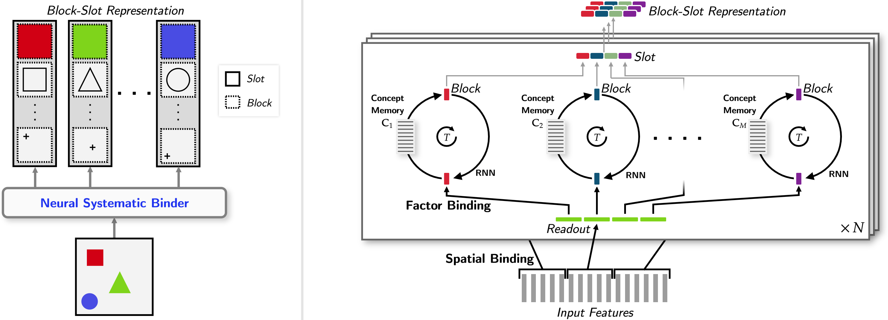
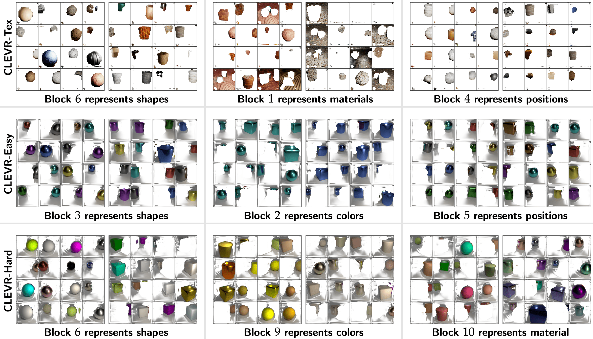
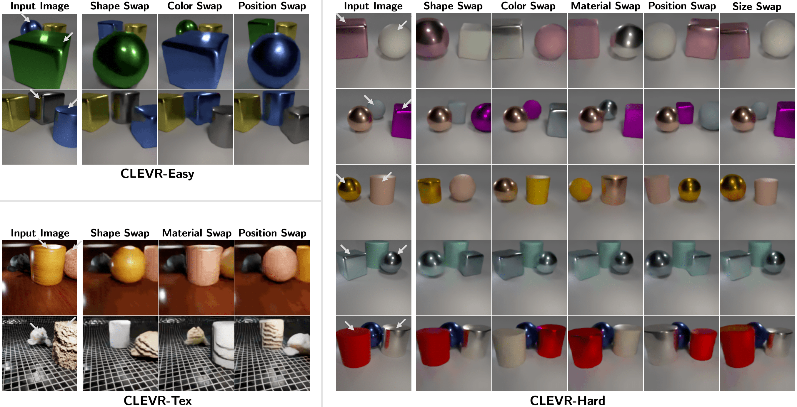

# Neural Systematic Binder: A Novel Approach to Object-Centric Representation Learning

*Figure 1: Overview of the Neural Systematic Binder (SysBinder) approach*

## TL;DR

- SysBinder introduces a novel "Block-Slot Representation" for object-centric learning
- Combines spatial binding and factor binding for improved disentanglement
- Achieves state-of-the-art performance in factor disentanglement, even on complex textured scenes
- Demonstrates factor-level systematicity in controlled scene generation

## Introduction

In the realm of artificial intelligence and machine learning, one of the most fascinating challenges is replicating the human ability to understand and manipulate the world in a systematic way. Humans excel at generalizing to new situations by composing pre-acquired knowledge pieces. This ability is fundamental to higher-level cognitive functions like planning, reasoning, and causal inference. However, achieving this level of systematic generalization in machines remains a significant challenge, especially for unstructured modalities like visual scenes.

In this blog post, we'll dive deep into a groundbreaking paper titled "Neural Systematic Binder" by Gautam Singh, Yeongbin Kim, and Sungjin Ahn. This work introduces a novel approach to object-centric representation learning that aims to bridge the gap between human-like systematic generalization and machine learning models.

## The Challenge of Systematic Generalization

Before we delve into the specifics of the Neural Systematic Binder (SysBinder), let's first understand the core challenge it addresses. In machine learning, we often struggle with getting models to generalize in a systematic way, especially when dealing with unstructured data like images.

For instance, consider a model trained on images of red squares and blue circles. A human can easily generalize to recognize a blue square or a red circle, even if they've never seen these specific combinations before. This is because humans can decompose objects into their constituent properties (color, shape) and recombine them flexibly. However, traditional machine learning models often struggle with this kind of compositional generalization.

The key to addressing this challenge lies in how we represent knowledge. In structured modalities like language, we can use word embeddings as modular knowledge pieces. But for unstructured modalities like images, we first need to figure out how to obtain such modular representations. This process is called "binding", and it's at the heart of the SysBinder approach.

## Limitations of Current Approaches

Current object-centric learning methods, like Slot Attention, use a spatial binding approach. They divide a scene spatially into smaller areas, each containing a meaningful entity like an object. The information in each area is then grouped to produce an object representation, or "slot".

While this approach has shown promise, it has a significant limitation: each slot is an entangled vector, not a composition of independent modular representations. This means that a novel object would map to an unfamiliar slot vector, rather than a modular combination of familiar factor tokens (like color, shape, and position).

## Introducing the Neural Systematic Binder

The Neural Systematic Binder, or SysBinder, addresses these limitations by introducing a novel structured representation called "Block-Slot Representation". Let's break down the key components and principles of this approach.

### Block-Slot Representation

In Block-Slot Representation, each object (represented by a slot) is constructed by concatenating a set of independent factor representations called "blocks". Formally, we can represent this as:

$$\mathbf{S} \in \mathbb{R}^{N \times Md}$$

Where:
- $N$ is the number of slots
- $M$ is the number of blocks per slot
- $d$ is the dimension of a block

Each slot $\mathbf{s}_n \in \mathbb{R}^{Md}$ is a concatenation of $M$ blocks, and we denote the $m$-th block of slot $n$ as $\mathbf{s}_{n,m} \in \mathbb{R}^d$.

This structure allows for a more flexible and interpretable representation of objects and their properties.

### Combining Spatial and Factor Binding

SysBinder combines two binding principles:

1. **Spatial Binding**: This provides spatial modularity across the full scene, similar to conventional object-centric methods.
2. **Factor Binding**: This provides factor modularity within an object, which is the key innovation of SysBinder.

Let's dive deeper into how these principles are implemented.

#### Spatial Binding

In the spatial binding step, slots compete with each other to find an input attention area per slot. This is similar to the approach used in Slot Attention. The process can be described mathematically as follows:

1. Compute attention weights:

   $$\mathbf{A} = \text{softmax}_N\left(\frac{q(\mathbf{S}) \cdot k(\mathbf{E})^T}{\sqrt{Md}}\right)$$

2. Normalize attention weights:

   $$\mathbf{A}_{n,l} = \frac{\mathbf{A}_{n,l}}{\sum_{l=1}^L \mathbf{A}_{n,l}}$$

3. Compute attention readout:

   $$\mathbf{U} = \mathbf{A} \cdot v(\mathbf{E})$$

Where $q$, $k$, and $v$ are linear projections, $\mathbf{E}$ is the input, and $\mathbf{U}$ is the attention readout.

#### Factor Binding

The factor binding step is where SysBinder really shines. It uses the readout information from spatial binding to update each block in a modular manner. This is achieved through two sub-steps:

1. **Modular Block Refinement**: Each block $\mathbf{s}_{n,m}$ is updated independently using a GRU and an MLP:

   $$\mathbf{s}_{n,m} = \text{GRU}_{\phi_m}(\mathbf{s}_{n,m}, \mathbf{u}_{n,m})$$
   $$\mathbf{s}_{n,m} += \text{MLP}_{\phi_m}(\text{LN}(\mathbf{s}_{n,m}))$$

2. **Block Bottleneck**: A soft information bottleneck is applied on each block by making it retrieve a representation from a concept memory:

   $$\mathbf{s}_{n,m} = \left[\text{softmax}_K\left(\frac{\mathbf{s}_{n,m} \cdot \mathbf{C}_m^T}{\sqrt{d}}\right)\right] \cdot \mathbf{C}_m$$

Where $\mathbf{C}_m \in \mathbb{R}^{K \times d}$ is a set of $K$ learnable prototype vectors associated with factor $m$.

### Training Process

SysBinder is trained in a fully unsupervised manner by reconstructing the input from the slots. The process involves the following steps:

1. Initialize slots randomly from a learned Gaussian distribution.
2. Refine slots by alternating between spatial binding and factor binding steps multiple times.
3. Use the final refined slots as input to a transformer decoder for image reconstruction.

## Experimental Results

The authors evaluated SysBinder on three datasets of increasing complexity: CLEVR-Easy, CLEVR-Hard, and CLEVR-Tex. They compared their model against state-of-the-art baselines like IODINE, Slot Attention, and SLATE.

### Quantitative Results

SysBinder significantly outperformed the baselines in terms of disentanglement, completeness, and informativeness scores. Notably, it nearly doubled the disentanglement and completeness scores in CLEVR-Easy and CLEVR-Hard datasets.

### Qualitative Results

One of the most impressive results is the emergence of semantically meaningful and abstract factor concepts in the learned representations. Figure 2 visualizes this for the CLEVR-Tex dataset:

*Figure 2: Visualization of object clusters obtained by applying k-means on specific blocks in CLEVR-Easy, CLEVR-Hard, and CLEVR-Tex*

As we can see, each block learns to specialize in a specific object factor (e.g., shape or color), abstracting away the remaining properties. This emergence of factor-level representations is particularly impressive in the visually complex CLEVR-Tex dataset.

### Factor-level Systematicity

The authors also demonstrated factor-level systematicity in controlled scene generation. By swapping specific blocks between slots, they were able to generate novel scenes with systematically varied object properties. Figure 3 illustrates this capability:

*Figure 3: Visualization of Factor-level Scene Manipulation*

This ability to manipulate specific factors without affecting other properties demonstrates the true power of the Block-Slot Representation.

## Discussion and Future Directions

The Neural Systematic Binder represents a significant step forward in object-centric representation learning. By combining spatial and factor binding, it achieves a level of disentanglement and systematicity that was previously unattainable, especially in complex visual scenes.

Some key takeaways and potential future directions include:

1. **Deterministic Disentanglement**: SysBinder achieves factor disentanglement within slots using a deterministic approach, challenging the conventional wisdom that probabilistic modeling is crucial for this task.

2. **Multi-dimensional Factor Representation**: Unlike previous approaches that represent factors as single dimensions, SysBinder uses multi-dimensional blocks, providing a richer and more flexible factor representation.

3. **Generalizability**: As a simple, deterministic, and general-purpose layer, SysBinder can potentially be applied as a drop-in module in various neural network architectures and across different modalities.

4. **Scaling to Natural Scenes**: While the current work focuses on synthetic datasets, extending SysBinder to work with more complex natural scenes is an exciting future direction.

5. **Multi-modal Learning**: Exploring the multi-modal aspect of SysBinder, particularly in combination with language, could lead to powerful new models for scene understanding and generation.

6. **Video Understanding**: Extending the Block-Slot Representation to temporal sequences could enable more sophisticated video understanding and generation models.

## Conclusion

The Neural Systematic Binder introduces a novel approach to object-centric representation learning that brings us closer to achieving human-like systematic generalization in machine learning models. By combining spatial and factor binding in a clever way, it achieves state-of-the-art performance in factor disentanglement and demonstrates impressive capabilities in controlled scene generation.

As we continue to push the boundaries of AI and machine learning, approaches like SysBinder that focus on structured, interpretable representations will likely play a crucial role in developing more robust and generalizable models. The ability to decompose complex scenes into modular, recombinable factors is a key step towards building AI systems that can reason about the world in a more human-like way.

While there's still much work to be done in scaling these approaches to more complex, real-world scenarios, the Neural Systematic Binder provides a solid foundation for future research in this exciting area. As we move forward, it will be fascinating to see how these ideas evolve and contribute to the development of more capable and interpretable AI systems.

## References

1. Singh, G., Kim, Y., & Ahn, S. (2023). Neural Systematic Binder. [https://sites.google.com/view/neural-systematic-binder](https://sites.google.com/view/neural-systematic-binder)

2. Locatello, F., Weissenborn, D., Unterthiner, T., Mahendran, A., Heigold, G., Uszkoreit, J., Dosovitskiy, A., & Kipf, T. (2020). Object-centric learning with slot attention.

3. Greff, K., Kaufmann, R. L., Kabra, R., Watters, N., Burgess, C., Zoran, D., Matthey, L., Botvinick, M., & Lerchner, A. (2019). Multi-object representation learning with iterative variational inference.

4. Singh, G., Deng, F., & Ahn, S. (2022). Illiterate DALL-E Learns to Compose.

5. Karazija, L., Laina, I., & Rupprecht, C. (2021). ClevrTex: A Texture-Rich Benchmark for Unsupervised Multi-Object Segmentation.

6. Lake, B. M., Ullman, T. D., Tenenbaum, J. B., & Gershman, S. J. (2017). Building machines that learn and think like people.

7. Eastwood, C., & Williams, C. K. I. (2018). A framework for the quantitative evaluation of disentangled representations.

