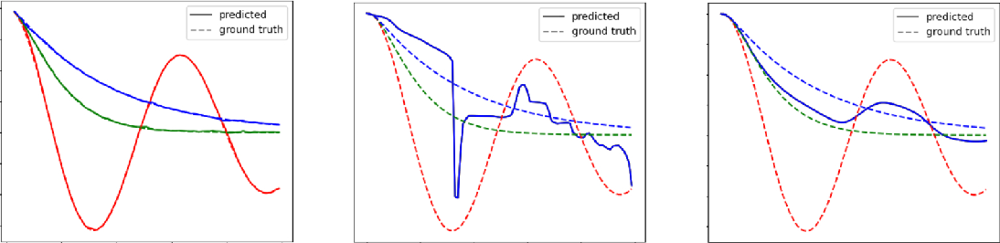

# Trajectory Flow Matching: A New Approach to Clinical Time Series Modeling

*Figure 1: Trajectory Flow Matching trains both an estimator of the next timepoint and an estimation of the uncertainty. Using the conditional flow matching framework, these can be used to predict the instantaneous velocity and future observations. Both flows are conditioned on past data and conditional variables.*

## TLDR

- Trajectory Flow Matching (TFM) is a novel simulation-free method for training neural stochastic differential equations (SDEs) on time series data
- TFM outperforms existing methods on clinical time series prediction tasks, reducing error by 15-83% on real-world datasets
- The approach enables better modeling of trajectory uncertainty and scales well with model size
- TFM shows promise for improving clinical decision-making through more accurate patient trajectory predictions

## Introduction

Modeling real-world time series data is a challenging task, especially in domains like healthcare where measurements are often irregularly sampled and noisy. Neural stochastic differential equations (Neural SDEs) have emerged as a powerful tool for modeling such data, but training these models has traditionally been computationally expensive and unstable due to the need for backpropagation through SDE dynamics.

In this blog post, we'll dive deep into a new method called Trajectory Flow Matching (TFM), introduced by Zhang et al. in their paper "Trajectory Flow Matching with Applications to Clinical Time Series Modeling". TFM offers a simulation-free approach to training Neural SDEs, bypassing the need for backpropagation through dynamics and enabling more efficient and stable training.

## Background: Neural SDEs and Flow Matching

Before we delve into TFM, let's briefly review the concepts of Neural SDEs and flow matching.

### Neural Stochastic Differential Equations

A stochastic differential equation (SDE) can be expressed as:

$$ dx_t = f(t, x_t)dt + g(t, x_t)dW_t $$

where $f$ is the drift term, $g$ is the diffusion term, and $W_t$ is a Wiener process. In a Neural SDE, these terms are parameterized by neural networks:

$$ dx_t = f_\theta(t, x_t)dt + g_\theta(t, x_t)dW_t $$

The goal is to find parameters $\theta$ that make the SDE generate samples similar to the true data distribution.

### Flow Matching

Flow matching is a simulation-free training technique that has shown great success in generative modeling. The key idea is to construct a factorization of the marginal density $p_t$ into conditional densities $p_t(x_t | z)$ such that:

$$ p_t = \mathbb{E}_{q(z)} [p_t(x_t | z)] $$

where $p_t(x_t | z)$ is generated by an SDE:

$$ dx_t = v_t(x_t | z)dt + \sigma_t(x_t | z)dW_t $$

The flow matching objective is then:

$$ \mathcal{L}_\text{match}(\theta) = \mathbb{E}_{t, q(z), p_t(x | z)} [\|f_\theta(t, x_t) - v_t(x_t | z)\|^2 + \lambda_t^2 \|g_\theta(t, x_t) - \sigma_t(x_t | z)\|^2] $$

This objective allows for training without simulating the full SDE trajectory.

## Trajectory Flow Matching

Now that we have the necessary background, let's explore how Trajectory Flow Matching extends these ideas to time series modeling.

### Key Innovations

1. **Coupling Preservation**: TFM ensures that the learned model preserves the coupling between consecutive time points in the trajectory.

2. **Target Prediction Reparameterization**: A numerical trick that improves training stability.

3. **Irregular Sampling Handling**: TFM can handle irregularly sampled time series through a time predictive loss.

4. **Uncertainty Prediction**: The method incorporates uncertainty estimation, crucial for clinical applications.

Let's dive into each of these innovations in detail.

### Coupling Preservation

In time series modeling, it's crucial to preserve the relationship between consecutive time points. TFM achieves this by conditioning the flow on a history of previous observations. The authors prove that under certain conditions, this approach preserves the coupling of the data distribution.

Specifically, they show that if:

$$ \mathbb{E}_{t\sim \mathcal{U}(0,T), z\sim q(z), c \sim q(c | z), x_t \sim p_t(x_t | z)} \|u_t(x_t | z, c) - u_t(x_t | c)\|_2^2 = 0 $$

then the learned coupling $\Pi(u)^\star$ equals the true data coupling $\Pi^\star(x_{1:T})$.

This condition is satisfied under assumptions like:

1. The existence of a unique mapping between initial and final states.
2. No two trajectories are identical for more than $h$ consecutive observations.
3. Trajectories are associated with unique conditional vectors.

### Target Prediction Reparameterization

Instead of directly predicting the flow, TFM uses a target prediction formulation:

$$ v_\theta(t, x) = \frac{\hat{x}^{\lceil t \rceil}_\theta(t, x_t) - x_t}{\lceil t \rceil - t} $$

This formulation is equivalent to the flow matching objective but offers improved numerical stability. The authors prove that there exists a scaling function $c(t)$ such that:

$$ \mathcal{L}_\text{target}(\theta) = c(t) \mathcal{L}_\text{match}(\theta) $$

### Handling Irregular Sampling

Real-world time series, especially in clinical settings, are often irregularly sampled. TFM addresses this by introducing a time predictive loss:

$$ \mathcal{L}_\text{tp}(\theta) = \sum_{t \in \mathcal{T}^i} \|h_\theta(t, x_t) - (t_\text{next} - t)\|_2^2 $$

where $h_\theta(t, x_t)$ predicts the time until the next observation. This not only helps in handling irregular sampling but also provides valuable information about measurement frequency, which can be clinically relevant.

### Uncertainty Prediction

TFM incorporates uncertainty prediction through a learned $\sigma_\theta(t, x_t)$ term:

$$ \mathcal{L}_\text{uncertainty}(\theta, x) = \sum_{t \in \mathcal{T}} \|\sigma_\theta(t, x_t) - \|\hat{x}_\theta(t, x_t) - x_\text{next}\|_2^2\|_2^2 $$

This loss trains the model to predict its own error, providing a measure of epistemic uncertainty.

## Experimental Results

The authors evaluated TFM on both synthetic and real-world clinical datasets. Let's look at some of the key findings.

### 1D Harmonic Oscillators

To demonstrate the importance of coupling preservation, the authors first tested TFM on a synthetic dataset of 1D harmonic oscillators with varying damping coefficients.

*Figure 2: Results on 1D harmonic oscillator dataset. Left: TFM-ODE with memory=3. Middle: TFM-ODE without memory. Right: Aligned FM.*

As shown in Figure 2, TFM with memory (conditioning on past observations) accurately captures the crossing trajectories, while methods without memory or traditional flow matching fail to distinguish between the trajectories.

### Clinical Time Series Prediction

The authors evaluated TFM on four clinical datasets:

1. ICU Sepsis
2. ICU Cardiac Arrest
3. ICU Gastrointestinal Bleeding (GIB)
4. Emergency Department (ED) GIB

They compared TFM and TFM-ODE (a deterministic variant) against several baselines, including Neural ODE, Neural SDE, and Latent ODE.

Here are the key results:

1. **Prediction Accuracy**: TFM and TFM-ODE outperformed baselines by 15% to 83% in terms of mean squared error (MSE) across datasets.

2. **Uncertainty Prediction**: TFM showed better uncertainty prediction compared to TFM-ODE, with lower variance in the predictions.

3. **Distribution Matching**: TFM better matched the variance in neighboring data points, as measured by the maximum mean discrepancy (MMD) metric.

4. **Scaling**: Unlike Neural DE based models, TFM and TFM-ODE showed improved performance with larger model sizes.

Let's look at some specific results:

**Table 1: Mean ± Std. deviation MSE (×10^-3) by models and datasets**

| Model | ICU Sepsis | ICU Cardiac Arrest | ICU GIB | ED GIB |
|-------|------------|---------------------|---------|--------|
| NeuralODE | 4.776 ± 0.000 | 6.153 ± 0.000 | 3.170 ± 0.000 | 10.859 ± 0.000 |
| TFM-ODE (ours) | **0.793 ± 0.017** | 2.762 ± 0.021 | 2.673 ± 0.069 | **8.245 ± 0.495** |
| NeuralSDE | 4.747 ± 0.000 | 3.250 ± 0.024 | 3.186 ± 0.000 | 10.850 ± 0.043 |
| TFM (ours) | 0.796 ± 0.026 | **2.755 ± 0.015** | **2.596 ± 0.079** | 8.613 ± 0.260 |

As we can see, TFM and TFM-ODE consistently outperform the baselines across all datasets.

*Figure 3: Three samples from predicted trajectory and uncertainty on ICU GIB test set. Top: Predicted (orange) and the ground truth (blue) mean arterial pressure (MAP). Bottom: The absolute value of the uncertainty predicted by TFM.*

Figure 3 shows example predictions from TFM on the ICU GIB dataset. Note how the model captures both the overall trajectory and the uncertainty, which increases during periods of higher variability in the ground truth data.

## Discussion and Future Directions

The results demonstrate that Trajectory Flow Matching is a powerful approach for modeling clinical time series data. Some key takeaways and potential future directions include:

1. **Improved Accuracy and Uncertainty Estimation**: TFM consistently outperforms existing methods in both prediction accuracy and uncertainty estimation. This could lead to more reliable clinical decision support systems.

2. **Scalability**: Unlike traditional Neural DE approaches, TFM scales well with model size. This suggests that further improvements may be possible with larger models or more data.

3. **Handling Irregular Sampling**: TFM's ability to handle irregularly sampled data is particularly valuable in clinical settings, where measurement frequency can vary widely.

4. **Interpretability**: While not directly addressed in this work, improving the interpretability of TFM models could be an important direction for future research, especially for clinical applications.

5. **Causal Inference**: Extending TFM to capture causal relationships in time series data could be a valuable next step, potentially enabling better understanding of treatment effects over time.

6. **Multivariate Extensions**: While the current work focuses on bivariate time series (heart rate and blood pressure), extending TFM to handle higher-dimensional data could broaden its applicability.

## Conclusion

Trajectory Flow Matching represents a significant advance in time series modeling, particularly for clinical applications. By enabling more accurate and efficient training of Neural SDEs, it opens up new possibilities for predicting patient trajectories and estimating uncertainty in these predictions.

As healthcare continues to move towards more personalized and data-driven approaches, methods like TFM that can handle the complexities of real-world clinical data will become increasingly valuable. While there's still work to be done in areas like interpretability and causal inference, TFM provides a solid foundation for future research in this critical area.

## References

1. Zhang, X., Pu, Y., Kawamura, Y., Loza, A., Bengio, Y., Shung, D. L., & Tong, A. (2024). Trajectory Flow Matching with Applications to Clinical Time Series Modeling. [arXiv preprint]

2. Chen, R. T. Q., Rubanova, Y., Bettencourt, J., & Duvenaud, D. K. (2018). Neural ordinary differential equations. Advances in Neural Information Processing Systems.

3. Kidger, P., Foster, J., Li, X. C., & Lyons, T. (2021). Efficient and accurate gradients for neural SDEs. Advances in Neural Information Processing Systems.

4. Lipman, Y., Chen, R. T. Q., Ben-Hamu, H., Nickel, M., & Le, M. (2023). Flow matching for generative modeling. The Eleventh International Conference on Learning Representations.

5. Rubanova, Y., Chen, R. T. Q., & Duvenaud, D. K. (2019). Latent ordinary differential equations for irregularly-sampled time series. Advances in Neural Information Processing Systems.

6. Johnson, A. E., Pollard, T. J., Shen, L., Lehman, L. H., Feng, M., Ghassemi, M., ... & Mark, R. G. (2016). MIMIC-III, a freely accessible critical care database. Scientific data, 3(1), 1-9.

7. Pollard, T., Johnson, A., Raffa, J., Celi, L. A., Badawi, O., & Mark, R. (2019). eICU Collaborative Research Database (version 2.0). PhysioNet.

[Code for this paper is available on GitHub](https://github.com/nZhangx/TrajectoryFlowMatching)

