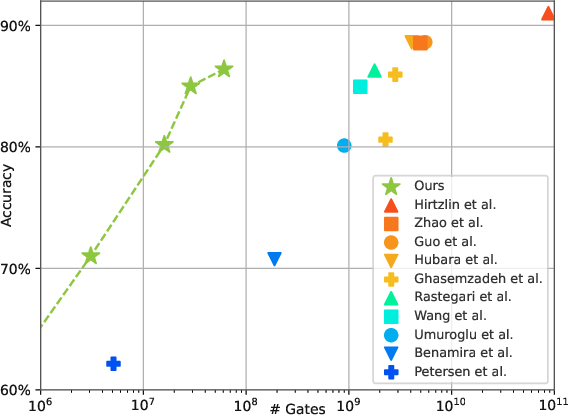
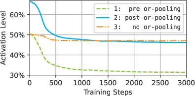
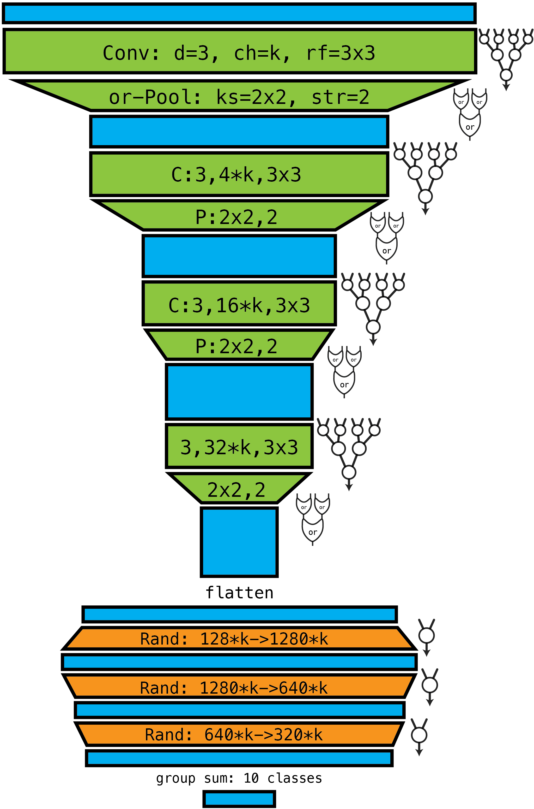
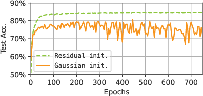

# Convolutional Differentiable Logic Gate Networks: Revolutionizing Efficient Machine Learning Inference

*Figure 1: Gate count vs. accuracy plot on the CIFAR-10 dataset. Our models (green stars) significantly outperform state-of-the-art baselines, achieving higher accuracy with fewer gates.*

## TL;DR

- Convolutional Differentiable Logic Gate Networks (LGNs) achieve state-of-the-art performance on CIFAR-10 with 29x fewer logic gates than previous methods.
- Novel techniques introduced: deep logic gate tree convolutions, logical OR pooling, and residual initializations.
- Significant improvements in inference speed and efficiency, making LGNs promising for embedded and real-time applications.

## Introduction

In the realm of machine learning, there's a constant push for more efficient inference methods, especially as models grow larger and more complex. A recent breakthrough in this field comes from the work of Petersen et al. in their paper "Convolutional Differentiable Logic Gate Networks." This research builds upon the concept of differentiable logic gate networks (LGNs) and extends it to the domain of convolutional neural networks, achieving remarkable efficiency gains without sacrificing accuracy.

As someone who's been following the developments in efficient deep learning, I find this work particularly exciting. It addresses a crucial challenge in the field: how to make neural networks faster and more energy-efficient without compromising their performance. Let's dive into the details of this innovative approach and explore its implications for the future of machine learning.

## Background: Differentiable Logic Gate Networks

Before we delve into the new contributions, it's essential to understand the foundation of this work: differentiable logic gate networks. LGNs are networks composed of binary logic gates (like AND, NAND, or XOR) that can be trained using gradient descent, thanks to a clever differentiable relaxation.

The key idea behind LGNs is to optimize the choice of logic gates directly, rather than working with abstract representations like matrix multiplications. This approach leads to extremely efficient inference on hardware that's built around logic gates (e.g., CPUs, GPUs, FPGAs, ASICs).

The structure of an LGN is as follows:

1. Layers of nodes, each representing a logic gate
2. Fixed, randomly selected connections between nodes
3. No weights or biases (unlike traditional neural networks)
4. Inherent non-linearity due to the nature of logic gates

The main challenge in training LGNs is their discrete nature. To overcome this, Petersen et al. introduced a differentiable relaxation that allows for gradient-based optimization. This relaxation involves two key components:

1. Relaxing discrete logic gates to real-valued logic using probabilistic logic
2. Introducing a probability distribution over possible logic gate choices

Mathematically, this relaxation can be expressed as:

$$
f_\mathbf{z}(a_1, a_2) = \mathbb{E}_{i\sim\mathcal{S}(\mathbf{z})\,,\,A_1\sim\mathcal{B}(a_1)\,,\,A_2\sim\mathcal{B}(a_2)}\Big[ g_i(A_1, A_2) \Big] = \sum_{i=0}^{15} \frac{\exp(z_i)}{\sum_j \exp(z_j)}\cdot g_i(a_1, a_2)
$$

Where $\mathbf{z}$ is a trainable parameter vector, $g_i$ are the possible logic gate operations, and $\mathcal{S}(\mathbf{z})$ is a softmax distribution over gate choices.

## Convolutional Logic Gate Networks: A Game-Changing Extension

The primary contribution of this paper is the extension of LGNs to the convolutional domain. This is a significant step forward, as it allows LGNs to capture spatial patterns in data, which is crucial for tasks like image classification.

### Deep Logic Gate Tree Convolutions

Instead of convolving with individual logic gates, the authors propose using deep logic gate trees as convolutional kernels. This approach offers greater expressivity while maintaining efficiency. Here's how it works:

1. Construct a complete binary tree of depth $d$ with logic gates as nodes
2. Randomly select inputs from the receptive field of size $s_h \times s_w$
3. Apply the tree to each placement in the input, sharing parameters across placements

For a logic kernel of depth 2, the operation can be expressed as:

$$
f_3(\,f_1(a_{1}, a_{2}), f_2(a_{3}, a_{4})\,)
$$

Where $f_1$, $f_2$, and $f_3$ are learnable logic gates, and $a_1$, $a_2$, $a_3$, and $a_4$ are input activations.

The full convolution operation for an input $\mathbf{A}$ of shape $m\times h\times w$ is given by:

$$
\begin{aligned}
\!\!\mathbf{A}'[k, i, j] =
& \,\,
      f^{k}_3\big(
      f^{k}_1\big(
      \mathbf{A}\big[\mathbf{C}_M[k,\! 1],
                     \mathbf{C}_H[k,\! 1]{+}i,
                     \mathbf{C}_W[k,\! 1]{+}j\big],
      \mathbf{A}\big[\mathbf{C}_M[k,\! 2],
                     \mathbf{C}_H[k,\! 2]{+}i,
                     \mathbf{C}_W[k,\! 2]{+}j\big]
      \big), \\
& \,\,\phantom{f^{k}_3\big(}
      f^{k}_2\big(
      \mathbf{A}\big[\mathbf{C}_M[k,\! 3],
                     \mathbf{C}_H[k,\! 3]{+}i,
                     \mathbf{C}_W[k,\! 3]{+}j\big],
      \mathbf{A}\big[\mathbf{C}_M[k,\! 4],
                     \mathbf{C}_H[k,\! 4]{+}i,
                     \mathbf{C}_W[k,\! 4]{+}j\big]
      \big)\big)
\end{aligned}
$$

Where $\mathbf{C}_M$, $\mathbf{C}_H$, and $\mathbf{C}_W$ are connection index tensors that determine which inputs are selected for each kernel application.

### Logical OR Pooling

To adapt pooling operations for LGNs, the authors introduce logical OR pooling. This is implemented using the maximum t-conorm relaxation of the logical OR:

$$
\bot_{\max}(a,b) = \max(a,b)
$$

This approach offers several advantages:

1. Faster computation compared to probabilistic relaxation
2. Reduced memory requirements (only need to store maximum activation and index)
3. Simplified backpropagation (only through maximum activations)

Interestingly, the authors found that using OR pooling doesn't lead to saturation of activations, as one might expect. Instead, the network learns to automatically reduce pre-pooling activations during training, maintaining a balanced distribution of activations.

*Figure 2: Density of activations for the second convolutional block of an OR-pooling based convolutional LGN. Training implicitly enforces that the outputs of the block have the activation level of a no-pooling network.*

### Residual Initializations

To address the problem of vanishing gradients in deeper networks, the authors introduce "residual initializations." This technique initializes each logic gate to primarily act as a feedforward gate (specifically, the 'A' gate). The initialization is done by setting:

- Probability for the 'A' gate choice to around 90%
- All other gates to 0.67%

This corresponds to setting the parameter $z_3 = 5$ and all other $z_i = 0$ for $i \neq 3$ in the gate choice equation.

Residual initializations offer several benefits:

1. Prevent loss of information through washed-out activations
2. Reduce vanishing gradients
3. Enable training of deeper LGNs (beyond 6 layers, which was the previous limit)
4. Provide a differentiable form of residual connections without requiring additional logic gates

## LogicTreeNet Architecture

The authors introduce a new architecture called LogicTreeNet, designed specifically for convolutional LGNs. Here's an overview of its structure:

*Figure 3: LogicTreeNet architecture. The logical architectures of the layers/blocks are illustrated on a per-neuron basis.*

The architecture consists of:

1. Convolutional blocks with tree depths of $d=3$
2. OR pooling layers
3. Randomly connected layers
4. A group sum classification head

The network has a total logical depth of 23 layers, including 4 convolutional blocks, 4 OR pooling layers, and 3 randomly connected layers. 15 of these layers are trainable, while the pooling layers remain fixed.

The architecture is defined in terms of a hyperparameter `k`, which controls the width of the network. The authors explore various sizes, from S (k=32) to G (k=2,048).

## Experimental Results

The authors conducted extensive experiments on the CIFAR-10 and MNIST datasets. Let's look at some of the key results:

### CIFAR-10 Results

| Method | Accuracy | # Gates |
|--------|----------|---------|
| LogicTreeNet-S | 60.38% | 0.40 M |
| LogicTreeNet-M | 71.01% | 3.08 M |
| LogicTreeNet-B | 80.17% | 16.0 M |
| LogicTreeNet-L | 84.99% | 28.9 M |
| LogicTreeNet-G | 86.29% | 61.0 M |

Compared to state-of-the-art methods, LogicTreeNet achieves similar or better accuracy with significantly fewer gates. For example:

- LogicTreeNet-G (86.29% accuracy, 61.0M gates) matches the performance of XNOR-Net (86.28% accuracy) while using 29x fewer gates.
- LogicTreeNet-L (84.99% accuracy, 28.9M gates) outperforms LUTNet (84.95% accuracy) while using 44.6x fewer gates.

### MNIST Results

| Method | Accuracy | # Gates | FPGA t. |
|--------|----------|---------|---------|
| LogicTreeNet-S | 98.46% | 147 K | 4 ns |
| LogicTreeNet-M | 99.23% | 566 K | 5 ns |
| LogicTreeNet-L | 99.35% | 1.27 M | --- |

On MNIST, LogicTreeNet achieves state-of-the-art results in both accuracy and efficiency:

- LogicTreeNet-M (99.23% accuracy) outperforms all binary neural networks in the literature.
- Compared to LowBitNN, LogicTreeNet-M reduces inference time by a factor of 30,000x while still improving accuracy.

## Ablation Studies and Insights

The authors conducted several ablation studies to understand the importance of different components in their architecture. Here are some key findings:

1. **Model Depth**: Increasing model depth generally improves performance, with the full 23-layer architecture performing best.
2. **OR Pooling**: Removing OR pooling leads to a 3.5% drop in accuracy, demonstrating its importance.
3. **Residual Initializations**: Without residual initializations, accuracy drops by almost 9%, and training becomes unstable.
4. **Input Channel Restrictions**: Limiting each tree to use only 2 input channels (instead of 8) improves accuracy by 1.4% and leads to better hardware routing.

*Figure 4: Residual initializations (green) drastically stabilize training of the LogicTreeNet compared to Gaussian initialization (orange).*

## Implementation and Computational Considerations

The authors developed efficient fully-fused low-level CUDA kernels for training convolutional LGNs, achieving speeds up to 200x faster per logic gate than existing randomly connected LGN implementations. They also introduced several optimizations for efficient training and inference:

1. Fusing entire trees and pooling operations into single CUDA kernel operations
2. Reducing memory accesses by keeping intermediate results in registers
3. Implementing efficient logic synthesis tools for post-training simplification

These optimizations lead to significant reductions in memory accesses (68% reduction) and memory footprint (90% reduction) during training.

## Conclusion and Future Directions

Convolutional Differentiable Logic Gate Networks represent a significant advancement in efficient machine learning inference. By combining the efficiency of logic gate networks with the power of convolutional architectures, this approach achieves state-of-the-art performance with dramatically reduced computational requirements.

Key takeaways from this research include:

1. The effectiveness of deep logic gate tree convolutions in capturing spatial patterns
2. The importance of logical OR pooling for maintaining balanced activations
3. The crucial role of residual initializations in enabling training of deeper networks

Future research directions could include:

1. Applying convolutional LGNs to more complex computer vision tasks, such as object localization or semantic segmentation
2. Exploring the potential of this approach in other domains, such as natural language processing or time series analysis
3. Investigating hardware-specific optimizations for even more efficient inference on FPGAs or ASICs

As we continue to push the boundaries of efficient machine learning, approaches like Convolutional Differentiable Logic Gate Networks will play a crucial role in enabling advanced AI capabilities on resource-constrained devices and in real-time applications.

## References

1. Petersen, F., Kuehne, H., Borgelt, C., Welzel, J., & Ermon, S. (2024). Convolutional Differentiable Logic Gate Networks.
2. Petersen, F., Borgelt, C., Kuehne, H., & Ermon, S. (2022). Differentiable Logic Gates: A Practical Approach to Learning Logic Gate Networks. [arXiv:2203.12871](https://arxiv.org/abs/2203.12871)
3. Krizhevsky, A. (2009). Learning multiple layers of features from tiny images. Technical report, University of Toronto.
4. LeCun, Y., Cortes, C., & Burges, C. (2010). MNIST handwritten digit database. ATT Labs [Online]. Available: http://yann.lecun.com/exdb/mnist.
5. Umuroglu, Y., Fraser, N. J., Gambardella, G., Blott, M., Leong, P., Jahre, M., & Vissers, K. (2017). FINN: A framework for fast, scalable binarized neural network inference. In Proceedings of the 2017 ACM/SIGDA International Symposium on Field-Programmable Gate Arrays (pp. 65-74).
6. Wang, E., Davis, J. J., Zhao, R., Ng, H. C., Niu, X., Luk, W., ... & Constantinides, G. A. (2019). Deep neural network approximation for custom hardware: Where we've been, where we're going. ACM Computing Surveys (CSUR), 52(2), 1-39.

